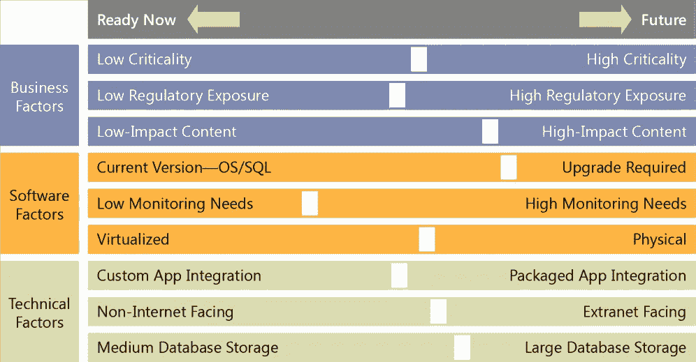
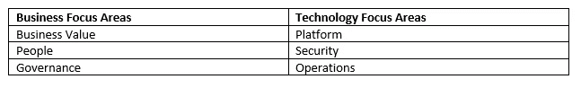
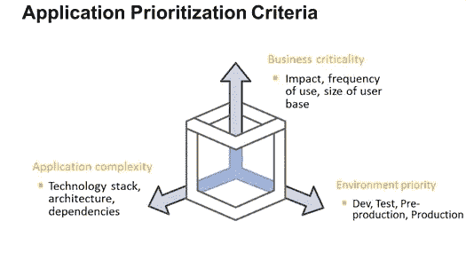
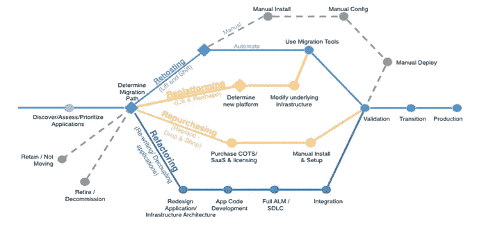
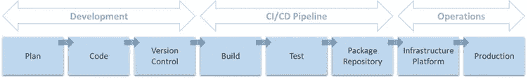
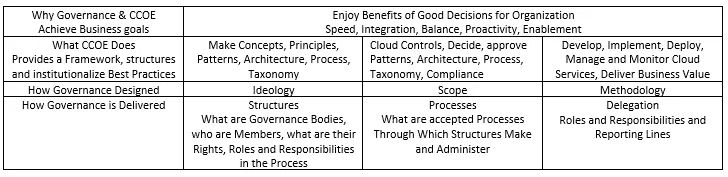
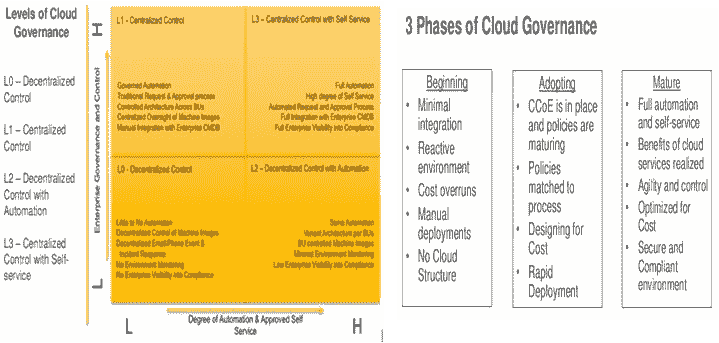
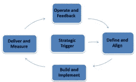
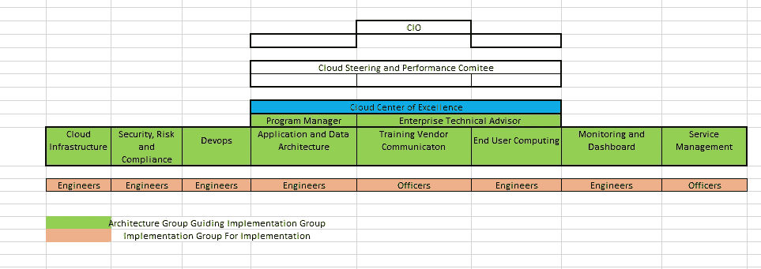
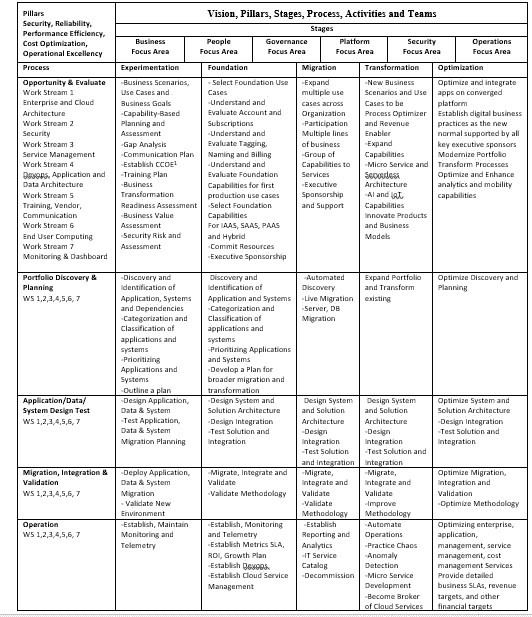

# 云采用之旅:路线图、迁移方法和流程

> 原文：<https://medium.datadriveninvestor.com/cloud-adoption-journey-roadmap-migration-methodology-and-process-bec452adb65e?source=collection_archive---------1----------------------->

除了日常运营挑战之外，组织还试图定义一条通往新部署模式(主机托管解决方案、软件定义的服务、私有云、混合云、公共云等)的有效途径。)，这将提高业务灵活性和 IT 效率，同时降低运营支出，优化成本。这构成了管理层的长期组织愿景和战略的一部分，以支持通过 IT 战略实现组织的战略方向。云可以成为革命性变革的催化剂。然而，这取决于企业提出创新的想法和战略，以发展他们如何吸引客户，赋予员工权力，优化运营和改造他们的产品。在这一点上，典型的业务驱动因素是业务敏捷性、成本优化、提高质量、IT 现代化和创新、提高安全性和提供共享服务、满足组织需求的容量规划。典型的目标是减少投资和相应的成本，提高可扩展性，提高安全性、可用性和可靠性，加强协调、创新和整合信通技术资源。典型的风险和挑战是现有的投资和应用程序、对变革的抵制、云提供商之间有限的可移植性、多区域监管和法律问题。

云转型是一段旅程；这需要时间和耐心，但是云采用有一个模式，并且有五个阶段。典型的旅程始于引人注目的事件或商业案例。这些阶段是:

1.实验

2.基础

3.移民

4.转换

5.最佳化

**实验**:在这个阶段，组织试图理解云是如何工作的。这里的关键是用专业技术展示成功。它正在以快速失败、快速学习的方式试验云为基础阶段提供的尽可能多的功能。为了从成功和失败中快速学习，实验是很重要的。从成功的方式和失败的原因中学习，为在基础阶段交付来自云的颠覆性创新和价值奠定了基础。这一阶段的原则是快速前进、突破界限、做出数据驱动的决策、简化和沟通以取得成功。选择这些能力，在基础阶段对它们进行测试和验证。主要活动包括云教育和培训、寻求案例研究进行实验、构建高级愿景战略、业务案例和路线图、高级架构、治理和运营模式、开始创建云卓越中心、执行试点项目和研讨会。

**基础:**在这个阶段，所有的工作都是为迁移阶段打下基础。在这个阶段，迁移工厂的基础已经建立。目标是为开发、测试、部署、监控和维护奠定基础。企业和 IT 部门设想可能的新解决方案来展示如何改善现状。他们都设想更新、扩展、敏捷和更好的应用程序或服务。治理、管理和订阅已建立。计算、存储、网络/CDN、数据库、管理、监控、安全性、CI/CD、应用程序迁移和分析功能的基础已经建立。典型活动包括分配推动转型所需的资源、建立治理和 CCOE、TCO 分析、定义安全性、合规性、策略和架构、详细的转型计划(人员、流程和技术)、应用迁移和评估计划、实施云技术基础。

**迁徙**:在这个阶段，发生大规模迁徙。在这一阶段，大部分 IT 投资组合从最容易的开始分批转移。在此阶段，系统/应用程序/数据按照其迁移难度进行优先排序和分组。那些简单且需要最少努力的将被分组迁移。这一阶段预示着大规模的移民。这个阶段是最具挑战性的部分，需要许多不同企业单位的合作和协作。(技术团队、运营人员、执行团队、业务发起人、安全专业人员、法规遵从性人员、法律、人力资源等。)此阶段的典型活动、具有应用程序组合评估的高效迁移策略、高效迁移流程、强大的治理和安全性、批量迁移。

**转型**:在这个阶段，大部分系统/应用程序/数据被迁移，功能被扩展以优化流程和实现收入。在此阶段，选定的应用程序经过重新设计，以最大限度地利用云。这是 It 转变自身和业务的阶段，通过真正利用无服务器、微服务、人工智能、机器学习、深度学习、大数据、分析和 IOT 功能等来扩展和支持他们的产品组合。

**优化:**将数字化商业实践确立为新的标准，并得到组织所有关键高管的支持。在这里，创新和 IT 带来了许多商机和积极的业务目标。这是不断改进服务的阶段。在优化和维护云足迹的这个阶段。典型的活动包括优化成本、优化服务管理和客户满意度、优化基础设施、优化企业和应用管理。

***建筑柱子***

在设计解决方案时，我们根据业务环境在支柱之间进行权衡，这些业务决策驱动工程优先级。例如在开发环境中以牺牲可靠性为代价来优化和降低成本，或者对于关键任务解决方案，我们可能会以增加的成本来优化可靠性。为了实现这一愿景，每个阶段都选择了以下支柱。

**安全性:**保护信息、系统和资产的能力，同时通过风险评估和缓解策略交付商业价值。

**可靠性:**系统从基础设施或服务故障中恢复的能力，动态获取计算资源以满足需求，并减轻诸如错误配置或短暂网络问题等中断。

**性能效率:**高效使用计算资源以满足系统需求并随着需求变化和技术发展保持该效率的能力。

**成本优化**:避免或消除不必要的成本或次优资源的能力。

**卓越运营:**运行和监控系统以交付商业价值并持续改进支持流程和程序的能力。

**重点领域**

云计算为技术的获取、使用和管理带来了重大转变。它还改变了组织对技术服务的预算和支付方式。云计算使组织受益，因为它能够用资本支出换取可变支出，从巨大的规模经济中获得优势，做出敏捷的容量决策，提高业务速度、敏捷性和全球化。

云的采用要求在整个组织中讨论和考虑根本性的变化，并且企业架构、信息安全和风险管理、数据分类、企业风险管理、财务、运营、人力资源、应用程序团队、业务部门(包括外部和内部)等利益相关方支持这些变化。因此，需要考虑以下重点领域。

**商业价值**:整合了 it 战略的商业模式，灵活且一致地支持业务成果，IT 可以随着业务需求或技术能力的变化而调整。

**人员:**人力资源和人员管理通过更新技能和组织流程以包括基于云的能力，为团队采用云做准备。

治理:集成了 IT 治理和组织治理。它为识别和实现 It 治理的最佳实践，以及用技术支持业务流程提供了指导。

**平台:**基于业务目标和目的，设计、实现和优化云技术和企业架构的架构。为设计、原则、工具和策略提供战略指导，包括目标状态环境的模式、在云上实施新的解决方案以及将内部工作负载迁移到云。

**安全性:**选择和实施满足组织需求的控制措施。

**运营:**您运行、使用、操作和恢复以满足业务需求的 IT 运营。IT 运营支持从规划和维持到变更和事件管理的业务运营。

**云迁移流程**

**机会、分析和评估:**该流程旨在寻找云能够为企业带来的机会，并对其进行评估。确定正确的目标和成本效益分析。开展必要的准备和启动活动，以满足新企业环境的业务指令。根据提议的环境，开发业务案例和要交付的功能和业务价值的高级愿景。确定迁移就绪性的当前状态，并确定具有强大功能的领域和需要进一步增强的领域，以便进行大规模迁移。在 TOGAF ADM 周期中，这是初步和架构愿景阶段。TOGAF 需求阶段包含每个云迁移过程。了解业务需求和新系统的好处，评估现有系统中的差距。了解安全性和合规性影响，并确保采取适当的控制措施。典型活动是通过以下方式寻找机会:遵循业务场景、使用案例和业务目标、基于能力的规划和评估以评估能力、这些能力中的差距分析、基于沟通框架的沟通计划、建立 CCOE、审查培训计划、业务转型准备情况评估、业务价值评估、安全风险和评估。

**发现和规划**:发现过程就是检查和发现环境(应用程序、数据、服务器、网络和存储)及其相互依赖关系。规划、分析、评估产品组合并确定其优先级，以及制定迁移主计划。在 TOGAF ADM 周期中，这是业务架构、is(应用和数据)架构、技术架构、机会&解决方案、迁移规划阶段。一旦发现阶段完成，我们就可以开始规划迁移。目标是为迁移计划做准备，迁移计划是概述迁移资源和成本以及由此带来的节约的分析。它包括针对每个应用程序的迁移策略，指定优先级、资源分配并确定有助于迁移的工具。根据架构和现有的许可协议，迁移现有应用程序的复杂性各不相同。概述测试、验证和应急计划。典型的活动包括发现和识别应用程序、系统及其依赖关系，对应用程序和系统进行分类，确定应用程序和系统的优先级，概述迁移计划

**设计、迁移、测试和验证:**

“迁移工厂”是迁移的重点从组合级别转移到单个应用程序级别的地方，每个应用程序都是根据 6 个应用程序迁移策略(重新宿主知道提升和转移、重新平台化、替换、重构、淘汰、保留)之一进行设计、迁移和验证的。从最不复杂的应用程序开始，以持续改进的方式向更复杂的应用程序迁移。在 TOGAF ADM 中，这是迁移规划和实现治理阶段。架构路线图、实施和迁移计划与企业的变革活动相集成。迁移工厂的重点是通过团队、工具和流程执行迁移计划，以简化工作负载向云的迁移。团队通过基于迁移模式的优先工作负载列表工作，应用已知的迁移和操作模式，并降低风险。最后，针对功能和性能测试、验证和淘汰旧系统制定业务战略。典型活动包括设计应用程序、数据和系统、设计系统和解决方案架构、测试应用程序、数据和系统、部署应用程序、数据、部署系统、解决方案、迁移规划、系统、解决方案、应用程序和数据的迁移、验证新环境

**操作**

最后，随着应用程序的迁移，在新的基础上迭代，关闭旧的系统，并不断迭代到一个现代的操作模型。我们可以把基础阶段和迁移阶段作为一个强制函数来采用 DevOps 文化和采用 CI/CD。

使用 CI/CD 管道，对于软件代码中的每一个变化，它都是自动构建和测试的。对其执行代码分析。如果它通过了质量控制和必要的测试，它将被自动部署。自动化验收测试是针对它执行的。这种质量控制和自动化的过程在以软件为中心的快节奏和云环境中是理想的，在这种环境中经常发布快速稳定的软件版本。

CI/CD 管道包括以下步骤:关于 CI/CD 的细节以及将使用的工具将来自 Devops 工作流

1.**提交**:当开发人员完成一个应用程序的变更时，他或她将它提交给一个中央源代码库。像 git lab 这样的工具。

2.**构建**:变更从存储库中被签出，软件被构建以便它可以被计算机运行。

3.**自动化测试和 Bug 跟踪**:从多个角度对变更进行测试，以确保它能够工作，并且不会破坏系统/软件中的任何东西。需要考虑像詹金斯、JIRA 这样的工具。

4.**部署**:构建好的版本以自动化的方式部署到生产中，配置项由配置管理系统如 ansible、chef、puppet 和 powershell dsc 管理

我们不需要试图解决我们可能遇到或可能不会遇到的每一种情况。理想情况下，需要开发基础专业知识。如果没有，使用最初的几个应用程序迁移来开发基础，操作模型将随着迁移“工厂”的加速而不断改进并变得更加复杂。在此阶段，遥测、监控、用户验收和其他测试、指标和 SLA 都已建立。

**云治理**

云治理被定义为在组织中设置、维护和有效传达策略和管理期望的过程。云治理是通过策略和角色管理的明确定义和实施来实现的。

战略触发是第一阶段。正是这一事件引发了使用云计算的需求。

定义和调整阶段是采用云服务或将现有环境转变为云的规划阶段。

构建和实施阶段涵盖与人员、流程和基础架构技术相关的问题

交付和衡量阶段确保实现的服务与计划的服务保持一致。

操作和反馈阶段是框架的最后阶段。对组织管理层的反馈变成了一个临时项目，只有在影响业务的故障或失败的情况下才被召回。

云卓越中心(CCOE)是一个由 IT 官员和高管组成的团队，负责领导云治理，使业务部门能够访问自助服务模式，并提供标准化的服务目录和模板，可供选择和自动调配。CCOE 利用技术能力为企业提供 IT 服务。CCOE 向云指导委员会提供性能和进度报告。项目经理和企业技术顾问审查、协调和批准流程、原则、概念、架构和政策。每一个工作流都在各自的领域与他们的同事一起工作，并与其他工作流合作。典型的 KPI 包括平均部署时间、平均恢复时间、IT FTE/服务器、每台服务器/年的成本、每台客户机/年的成本、QoS、流程复杂性的降低、中断百分比、可用性百分比和停机时间
云控制和性能委员会审查 CCOE 的性能。云指导委员会指导业务服务产品、功能和市场空间。确保正确的服务组合，以适当的投资水平满足所需的业务成果。引导业务服务渠道、业务服务目录和退役服务。了解、预测并影响客户对服务的需求和业务活动模式，管理预算、会计和收费，现有和潜在客户的需求，并确保开发适当的业务服务来满足这些需求。与客户保持积极的关系。典型的 KPI 包括
计划的新服务数量、计划外的新服务数量、战略计划数量、新客户数量、流失客户数量、遵守预算流程、成本/收益估算、实施后审查、遵守批准的预算、遵守项目资源、成本优化建议、降低运营支出、
云架构团队提供独立于供应商的架构构建模块。具体的解决方案架构将来自工作流。负责服务设计、过渡和服务改进。实施小组在体系结构小组的指导下实施解决方案体系结构。架构和实施小组将在实施期间一起工作。架构组为实施组提供 3 级支持，以确保平稳过渡到运营。
云实施小组是执行实际实施和运营的小组。
**工作流 1 云基础设施**:负责为内部和云的 IaaS 提供具体的规划和设计指南，并交付成果。
**工作流 2 安全**:负责为安全&风险合规架构和交付物提供具体的规划和设计指南。
**工作流 3 Devops** :负责为 CI/CD 架构、流程和可交付成果提供具体的规划和设计指南。
**工作流 4 应用/数据**:负责为应用和数据架构及交付物提供具体的规划和设计指南。
**工作流 5 培训、供应商、沟通**:负责提供具体的规划和设计指南培训、供应商、沟通计划和框架交付成果。
**工作流 6 最终用户计算**:负责提供具体的规划和设计指南最终用户计算交付成果。
**工作流 7 监控和仪表板**:负责提供具体的规划和设计指南监控、分析和仪表板交付成果。
**工作流 8 服务管理**:负责提供具体的规划设计指南服务管理框架和可交付成果。

*原载于 2018 年 4 月 27 日 https://*[*【www.linkedin.com】*](https://www.linkedin.com/pulse/cloud-adoption-roadmap-eray-altili)*。*

参考资料:企业云战略书籍 Eduardo Kassner、Stephen Orban 云采用和云迁移流程的阶段、AWS 云采用框架(重点领域)、AWS 架构良好的框架(架构支柱)