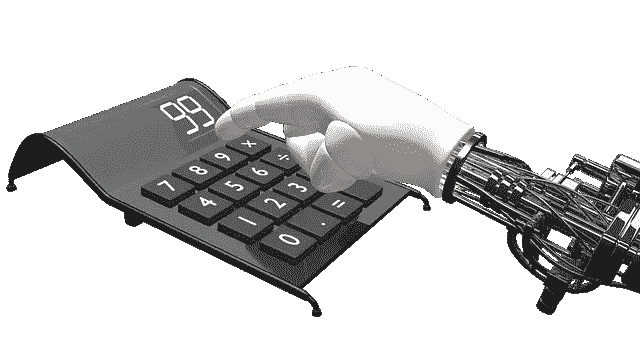
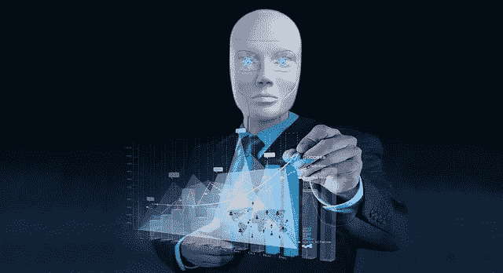
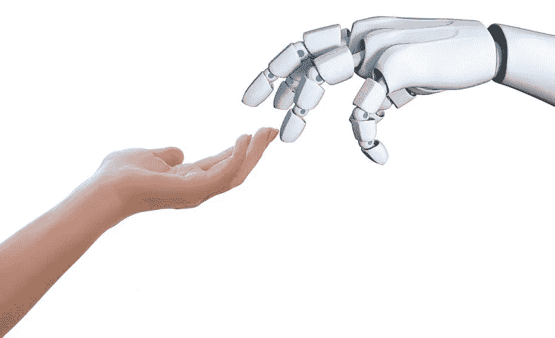
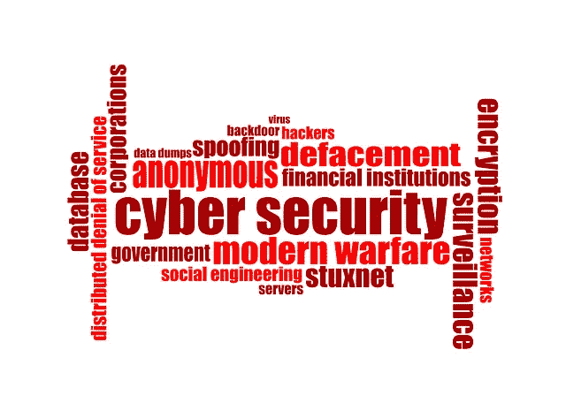
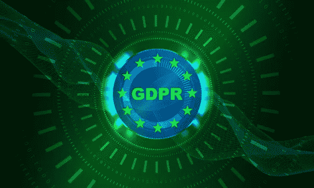
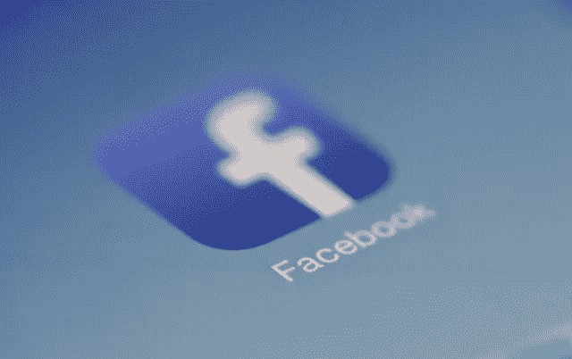
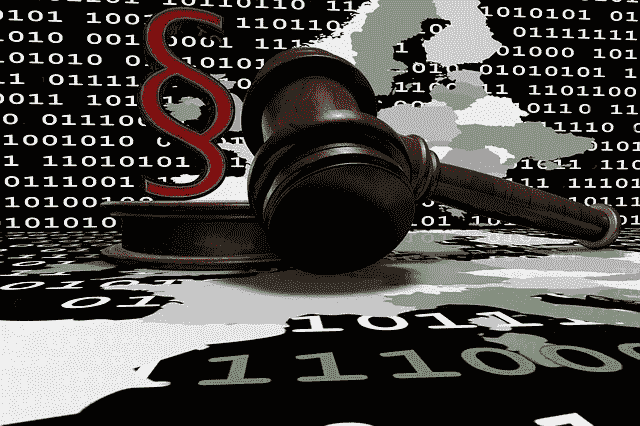

# 非营利和医疗保健行业的云人工智能

> 原文：<https://medium.datadriveninvestor.com/cloud-ai-in-the-non-profit-and-healthcare-industries-52f9abe62e33?source=collection_archive---------12----------------------->

Image: Calculator Hand Robot Count Machine. Image Source: 849356, Pixabay.com

不久前，技术还只是技术人员之间讨论的话题。事实上，直到最近，技术还是许多研究生院的选修课。今天，技术是我们日常生活的一部分，所以技术成为任何行业的一部分都不足为奇。看到技术的发展方向也就不足为奇了。它已经从一种相互交流和存储重要信息的方式，发展成为一种相互交流、表达自我和管理生活的方式。为了创造最新和最伟大的目标营销算法，将我们的个人信息货币化的驱动力为人工智能或 *AI* 铺平了道路。谷歌是这种人工智能的先驱和早期采用者，它根据我们的搜索收集关于我们兴趣的信息，并将我们可能使用的企业和产品配对。正是这种类型的人工智能像包办婚姻一样为企业带来客户。通过最初为商业解决方案创建的基于云的应用程序收集数据，慢慢演变为从银行到娱乐的一切消费便利。积累原始数据以创建日常活动的解决方案有助于加速人工智能的进程，从而促进人工智能的诞生。如果我们没有参与获取曾经只保存在桌面上的信息并将其放在云服务器上，人工智能可能不会演变成今天的日常生活。几年前，不情愿和缺乏对如何使用数字信息的理解使得许多不懂计算机的人无法加入这个社区。今天，由于脸书和亚马逊这样的公司，人们愿意与公司分享他们的信息，并基本相信这些信息只会用于预期的目的。这就是为什么，即使信息偶尔被泄露，我们也非常愿意加入像 Citizens app 和 Waze 这样的社区，它们使用众包来帮助每个参与者。众包应用程序可以将广告作为一种收入形式，尽管并非所有应用程序都这样做。

Image: Mac Freelancer Macintosh Macbook Laptop Computer. Image Source: 377053, Pixabay. Google logo is a registered trademark of Google LLC.

这种颇具侵略性但却是被动的商业模式强化了我们分享信息的内在需求，以便从他人分享的信息中获益。如果你为我做同样的事，我也为你做。在营销中，它可以从两个方面来看:一种有效的方式来接触潜在的客户，从而减少毯子营销对我们的航空公司造成的浪费性污染，或者是一种狡猾的方式，让企业操纵我们了解我们的冲动，并利用这种冲动达到金钱目的。有了心理学和人类行为的健康背景，我很想单独就这个问题进行长时间的讨论。我也意识到了自己的 ADD 倾向，所以我会避开这种冲动，把这个话题留到以后再说。不管这一切背后的道德观如何，云技术和人工智能是携手并进的，而且两者都将继续存在。如果需要是发明之母，那么营销就是云技术和人工智能今天与我们在一起的原因。

今天，云和人工智能技术正在催生一个被称为“物联网”或 *IoT* 的全新行业。物联网一词指的是机器为了达到预期结果而相互通信的能力。如果你拥有一台 Echo，并且熟悉 Alexa，那么你已经在使用 IoT 了。我们使用物联网来根据我们的当前位置调节我们的家庭恒温器，当我们的孩子超速驾驶时，我们使用物联网来通知我们。

> 如果不是因为我们对智能手机的热爱，云人工智能不会成为今天的主流。

**非营利性医疗保健和人类服务行业**

从历史上看，营利性组织或*fpo*总是非常愿意开发和测试最新和最具创新性的方法，以最大限度地提高效率和底线。口袋越大，项目就越大胆，以推动信封利用最新和最伟大的技术。剧本:首先建立它，想出如何营销它，并用它给自己定位。咨询法律团队和风险管理部门总是事后的想法。不过，让我们现实一点。如果你有新的东西，你几乎没有什么可以参考的，尤其是涉及到法律先例的时候。跟风者通常紧随其后，唯恐错失良机。这是《哈佛商业评论》的案例研究宝库。有赢家和输家，有取得市场份额优势的人，也有因此吃亏的人。

相比之下，非营利组织利润低，可自由支配的消费能力也较弱。非营利组织负担不起任何测试。日常决策会影响组织使命、服务对象、运营支出和收入之间的微妙平衡。再加上这种大规模且不断变化的监管、劳动力挑战、不稳定的收入流以及政府强制实行的预算中立所导致的低利润率，这足以让任何高层经理夜不能寐。非营利组织的商业模式与非营利组织的商业模式相反。从字面上看，非营利组织因其资金来源而缺乏效率。想一想，明年预算的大小取决于你今年花了多少钱。你花得越多，你越能为更高的支出辩护，你的资金来源增加你下一年预算的可能性就越大。它不是基于表现或对社会的积极影响。这并不是说没有非营利组织是效率驱动的，不能维持健康的利润。这实际上取决于捐赠者的限制，或者在政府资助的组织的情况下，资金限制。任何组织保留收益的能力都是其成功的关键。无论你经营的是 FPO 还是非营利组织，都是如此。事实上，没有规定说 501(c)(3)非营利组织不应该盈利。非营利组织将利润称为盈余。营利组织和非营利组织之间唯一的主要区别是使命。FPO 的使命是赚钱。FPO 提供的产品和服务是产生利润的工具。与此形成鲜明对比的是，非营利组织的使命是为了解决社区问题而达到预期的结果。为了这篇文章，我将把任务称为产品。金钱是实现产品的工具。完全颠倒了。

然而，我警告说，这种过于简单化的区别并不是唯一的区别。显然，非营利组织的公司结构在许多其他方面与 FPO 有着内在的不同。最重要的是，非营利组织没有股东。你不能出售非营利组织的股份，也不能将其转让给其他人。还有监管和税收方面的差异。尽管如此，无论是在获得银行融资、就业事务、财务报表的定期报告和审计，还是与供应商打交道方面，两者的运作方式都大同小异。这对非营利组织来说是一个不利因素，因为这些成本中心的需求通常与非营利组织相同。资金采购的反直觉性质、对利润的零关注以及劳动力、医疗保健、租金和与 FPO 共享的债务成本的上升，给非营利组织的运营带来了比 FPO 同行大得多的挑战。

随着利润持续下降，提高质量、合规性和竞争力变得更加困难。在非营利组织的世界里，效率是生存的必要条件，不像非营利组织那样通过提高效率来实现利润最大化。非营利组织面临的挑战是通过减少重复检查人员准确性的冗余流程来提高效率，同时降低与人为错误、劳动力、合规性、数据存储和检索以及决策相关的成本。进入 Cloud-AI。

Image: AI monitoring, desktop, business. Image Source: Sujins, Pixabay.com

**云人工智能的可承受性**

直到最近，云人工智能技术还只能为世界 500 强企业所用。现在，它变得越来越经济实惠，因此各种规模的企业都更容易获得。五年前，一家公司必须投入数百万美元进行研发，并维持大量的 IT 预算来开发定制软件以满足他们的需求。对更多数字存储、更大更稳定的网络能力和更强的网络安全的需求催生了云计算和存储。高管对实时数据的需求导致了仪表板的产生。然而，仪表板提供的信息仍然是历史的和当前的。预测未来的状况仍然是分析师的任务，他们大多是有统计学背景的专家。当这项曾经仅用于营销目的的技术被应用到日常业务中时，企业的游戏规则发生了改变。这种飞跃不是瞬间的，也不仅限于管理日常业务。这是一个渐进的过程，但是在技术进化时间线的背景下，它也可以被认为仅仅超过一纳秒。因为这些大公司中的技术人员看到了这种技术的潜在用途，许多人离开并开始了他们自己的创业公司。包装和销售基于历史趋势预测未来事件的编码软件并不是什么新鲜事。基于市场指标自动执行股票交易的算法已经存在一段时间了。除了营销和商业应用，将这项技术用于日常生活的革命隐藏在众目睽睽之下。我们值得信赖的小*，或者我应该说大*，智能手机。

Image: Cloud Finger Smartphone Phone Type Mobile Phone. Image Source: Geralt, Pixabay.com

> 非营利健康和人类组织在处理信息方面具有优势，因为它已经受到高度监管，但缺点是技术采用缓慢。

我们使用智能手机来计划我们的一天，安排约会，检查我们的电子邮件，听音乐，办理银行业务，拍摄和分享照片，以及与我们的朋友和家人联系。内置的全球定位系统让我们能够从一个地方到另一个地方。你明白了。我们的手机携带着大量的原始数据，它告诉我们很多关于我们行为的信息。如果不是因为我们对智能手机的热爱，云人工智能不会成为今天的主流。由于基于云的人工智能软件内置于我们今天手机上的许多应用程序中，我们的手机不仅可以预测我们何时去上班，还可以预测交通状况。将共享数据作为一种被动资源，可以让我们预测最佳的上班时间。物联网则更进一步。例如，我的手机可以使用地理围栏技术在我离家和回家时提醒我的家庭恒温器，并相应地设置我的家庭温度。这项技术不仅每个人都负担得起，而且当我们购买智能手机时，它实际上已经安装并准备好使用。这种协同作用使得今天大多数非营利组织都负担得起云人工智能。将云人工智能集成到运营中可显著提高生产率，减少错误，并消除确保质量不再需要的冗余。节省的成本超过了最初的实施成本。唯一的挑战是从纸质文档过渡到数字文档，以及从内部服务器过渡到基于云的服务。幸运的是，大多数云计算公司以各种形式提供某种形式的人工智能，包括基础设施即服务或 IaaS T1，平台即服务或 T2 PaaS T3，软件即服务或 T4 SaaS T5。SaaS 更多的是一种开箱即用的解决方案，通常满足特定的需求和行业。其局限性主要取决于其配置限制。PaaS 提供了构建软件的平台。IaaS 为组织提供了最大程度的控制，因为它提供了实际开发和部署 PaaS 和 SaaS 产品的资源。由于云计算作为一个行业的成本对于非营利组织来说已经变得更加实惠和容易获得，因此非营利组织有机会采用某种形式的云服务。

> 非营利组织、医疗保健和人力服务行业中基于云的人工智能技术的实际应用包括人力资源、会计、财务管理和记录管理，仅举几个领域为例，但其在这些领域的潜在功能几乎没有被挖掘出来。

这种技术的饱和使得价格如此之低，以至于非营利组织不利用它是愚蠢的。那么就来看看这篇文章的标题和你开始阅读的原因。令人惊讶的是，大型科技软件公司在基于目的的人工智能方面的投资滞后。Charles Towers-Clark 表示，一直是那些小型的、夫妻店式的科技公司在一小步一小步地接受人工智能的 B2B 和 B2C 应用。

**非营利组织和医疗保健行业的云人工智能**

大多数非营利组织已经在使用云计算服务，这些服务通常是由小型的小型软件公司提供的。非营利组织、医疗保健和人力服务行业中基于云的人工智能技术的实际应用包括人力资源、会计、财务管理和记录管理，仅举几个领域为例，但其在这些领域的潜在功能几乎没有被挖掘出来。最常见的用途是以 SaaS 产品的形式，执行工资单、会计、电子健康记录或 *EHR* ，以及收入周期管理或 *RCM* 任务。

像 Paycom 这样的创新公司为基于云的 b2b 服务铺平了道路。Paycom 在《财富》100 家发展最快的公司中排名第五，Paycom 通过将薪资服务与人力资本管理或 HCM 结合起来，巧妙地打包到一个基于云的系统中，从而在早期开拓了自己的市场。Paycom 很快利用了许多最新的技术成果来帮助提高其收到的信息以及为特定目的(例如，工作时间和出勤)接受的信息的准确性。使用已经安装在我们智能手机上的硬件和软件的地理围栏技术，员工可以在世界上几乎任何地方打卡上下班，管理层可以控制时间和位置等参数。这提高了员工的便利性，并为管理层提供了对这种便利性的控制。比如说，它还可以防止员工在家时打卡上班。当员工将要超过他们每周的工作时间时，它会向经理发出警告。这就减少了加班的发生，而加班成本很高，很多时候是可以避免的。

> 向特定部门患者护理记录保存的飞跃以及管理式护理组织对跟踪基于结果的绩效措施的需求推动了 360 度全面患者护理的发展。

类似地，基于云的会计软件激增，为 FPO 和非营利部门创造了大量选择。Blackbaud、Oracle 和 Sage 等公司旨在满足非营利组织对基于云的基金会计软件即服务或 SaaS 的需求。

Blackbaud 是作为一个学校软件而成立的。今天，它是非营利组织成员关系管理或 *CRM* (CRM 是指 FPO 世界的客户关系管理)的领导者。其旗舰项目 Raiser's Edge NXT 专注于管理捐助者跟踪和主动吸引捐助者。其应用程序编程接口允许集成 G-Suite 环境中的许多流行的第三方应用程序。

甲骨文公司的 Netsuite 将第一个人工智能工具引入其应用程序套件。[“到目前为止，客户会使用传统的报告或商业智能(BI)系统来分析历史数据。现在，人工智能工具可以获取这些数据，对其进行分析，并主动做出决策，或者只是主动推荐行动方案。”肖恩·米切尔，ITBrief.com.au。](https://itbrief.com.au/story/netsuites-big-artificial-intelligence-play-exposed)

Sage 的 Intacct 正在对人工智能进行有趣的转变。在 2017 年 10 月在拉斯维加斯举行的 Sage Intacct 会议期间，Aaron Harris，SVP 和 Sage Intacct 的工程和技术负责人，预览了 Sage Intacct 的数字助理 AI bot，[pacio Li AI](https://diginomica.com/2017/10/19/ai-news-review-sage-intacct-fleshes-out-plans-on-ai-and-machine-learning/)。尽管数字助理的使用案例会有所不同，但大多数支持者都认为金融领域的人工智能不会取代人类的直觉。然而，人工智能可以就财务决策的各个方面提出建议。Sage 的 Intacct 已经在使用人工智能通过多维方法创建会计代码。其他会计软件使用直线顺序编码来识别和分组账户，而 Intacct 仅从几个组中构建出一个复杂的 GL 代码系统，从而允许公司在没有公司发展不足的代码的挣扎和限制的情况下成长和扩展。

所有这些软件都实时跟踪支出，并提供自己独特的商业智能或商业智能，以获得身临其境的可定制仪表板体验。

EHR 系统，如 *Cerner Corporation、CureMD、Epic、ChartLogic、AthenaHealth、Meditech、Allscripts、eClinicalWorks、Kareo、Therap、eVero、Netsmart、Medisked、*和许多其他系统在提供基于云的患者记录方面处于领先地位。曾经只有医院和门诊网络才能获得的服务，现在在大多数提供健康相关服务的私人诊所和非营利机构中更加负担得起和可用。特定部门患者护理记录保存的飞跃以及管理式护理组织对跟踪基于结果的绩效措施的需求推动了全面 360 度患者护理的发展。由于需要在患者的医疗保健环境中共享 PHI，EHR 系统从电子病历发展而来。过去，软件用于记录患者和从业者之间的互动，现在，软件与患者、药房、其他从业者、倡导者和健康保险公司进行交流。不仅跟踪病史，还跟踪患者对系统提示的后续反馈的满意度。尽管人工智能仍处于起步阶段，但一家小公司已经是该行业的颠覆者。

Praxis EHR 公司全力以赴在人工智能的初级阶段加以利用。根据 SoftwareAdvice.com 的[的说法，到目前为止，这种接待是显著的，被 120 条评论评为 5/5 星。Praxis 是一个学习软件。它随着从业者输入信息而学习。软件不是教提供者如何使用软件，而是学习实践如何操作并围绕实践建立数据。它就像一块空白的画布，可以立即开始创作实践者想要记录的内容。它还使用实用的人工智能工具，包括语音和手写识别学习，以提高对输入信息的人的个人语音和手写模式的识别。到目前为止，随着越来越多的实践使用该软件，这项技术已经显示出了有希望的结果。](https://www.softwareadvice.com/medical/praxis-profile/)

> …[Aoun]希望成为“医生的苹果商店”

EHR 系统将很快能够预测、推荐甚至为有特殊治疗需求的人做出必要的调整。结合物联网技术，治疗计划将与家庭管理系统共生，调节从温度到照明的一切，并订购必要的药物和食品，使用智能 RFID 技术结合患者的药物治疗计划和营养计划。EHR 系统已经通过电子方式将我们的处方提交给我们选择的药房。很快，EHR 系统公司将能够为医疗预约协调和安排专门的运输服务。这一自动化系统将减少由于安排门诊预约的错误以及安排特殊交通的错误而导致的错过预约的相关费用。

尽管科学和机器技术共同提供了下一代医学，但它永远不会取代有经验的医生或护士的直觉。但是这种科学方法并不意味着取代人，而是增加医生和病人之间的联系。出于这个原因，一家新公司正在寻求创造人类和机器之间的协同作用。

34 岁的时候，阿德里安·奥恩在旧金山为他的新公司开设了第一家人工智能诊所。他很早就在技术领域发了财，当时他创办了 Wavii，一家开发语言处理软件的公司。2013 年，他以 3000 万美元的价格将公司卖给了谷歌，并在拉里·佩奇(Larry Page)的授意下为谷歌工作。出于对自身健康的担忧，有心脏病家族史的阿德里安决定采用现有的人工智能技术，并开始将其应用于医学考试。只要每月支付一笔固定费用，患者就可以接受全身扫描和健康检查，与医生会面，并从他们的 DNA 中获取家谱信息。该信息用于创建预防性保健计划。从智能手机应用程序获得的健康和健身信息可与 Go forward 应用程序和您的 Go forward 医生协同工作。你有无限的访问和几乎为零的等待时间。该系统使用你的医生最初出售给谷歌的相同语言识别技术来监听你和你的医生之间的对话，该技术类似于亚马逊使用的技术。医疗办公室的目的是在设计中使用高科技极简主义，用一个步入式的直立围栏来扫描你的生命体征。诊所被刻意设计成模拟你走进苹果商店时的感受，Aoun 在接受《纽约客》采访时表示，他希望自己成为*“医生的苹果商店”*

使用众包作为云人工智能的一种形式是许多公司现在在医药领域使用的。像 AncestryDNA 和 23andMe 这样的公司不仅提供你的健康信息，还提供你的遗产和家谱故事。注册和使用这些服务的人越多，全球可用的数据库就越大。这些信息不仅有助于确定你来自哪里，还有助于确定你可能与谁有关系，最重要的是，有助于了解你的健康和健康风险。许多这些公司提供完整的基因史，包括识别心脏病和某些癌症风险的基因标记。这是一个特别重要的信息，你可以在计划你的预防保健时与你的医生分享。

> 毫无疑问，机器人将在我们的生活中扮演一些角色。

**人工智能在医疗保健和人类服务领域的未来:辅助社交机器人**

使用机器人进行护理涉及到伦理问题，但要考虑这一点，我们不妨考虑一下我在本文中讨论的任何事情的伦理含义。对于大多数技术进步来说，总会有一些伦理问题随之而来。毫无疑问，机器人将在我们的生活中扮演一些角色。事实上，机器人已经是我们日常生活中的支柱。以用于 ABS 制动的智能机械、监控车道偏离的智能摄像传感器等为例。如果不是为了狗，汽车将是人类最好的朋友，至少对我们这些不仅仅依赖公共交通的人来说是这样。无人驾驶汽车应该是机器人技术用于个人日常生活的第一个真实案例，这是再合适不过的了。那么家里的狗或猫呢(不要忘了我们的猫主人)？养宠物的主要目的是为了陪伴，这是有争议的。如果我们的宠物和汽车构成了我们家庭的延伸，我们可以有把握地说，社会因素与功能因素同等重要。那么如果有一天机器人会运送我们，为什么不能为我们提供陪伴呢？

JIBO 在其 AI 家用机器人中押注于这种社交互动需求。可悲的是，JIBO 以史诗般的风格失败了，[耗费了近 7300 万美元的资金](https://www.therobotreport.com/jibo-social-robot-analyzing-what-went-wrong/)。不是因为产品不好。因为执行失败了。尽管该产品本身可以说是提供动画互动桌面机器人的首次成功尝试，但大幅提高的价格让潜在买家决定购买动画 JIBO，而不是非动画的谷歌或亚马逊互动助手。除此之外，发货延迟、订单取消，以及 JIBO 在中国正式公开发布前一年发布的仿冒品！众筹的问题在于，为了获得资金，你必须分享你的想法。JIBO 是众筹陷阱的受害者。JIBO 只是另一个提醒人们过去社交机器人失败的案例研究，现在可以加入到包括索尼、本田和丰田等行业巨头在内的名单中。即便如此，我们仍然看好机器人的社会用途。

> 我们想要信任、爱、体验和展示情感，我们想要在社会背景下属于一个社区。

超级科技巨头软银(Softbank)决定在其社交机器人 Pepper 之外执行一个规模较小、有针对性的角色。Pepper 是一个人工智能独立移动机器人，能够识别情绪和面部表情。软银暂时将 Pepper 仅限于日本消费者市场。它还作为客户助理在主要零售商店试用 Pepper 进行商业用途。尽管它有许多局限性(如果你是零售销售人员，不要担心)，但它为商店带来了更多的流量，这意味着它正在实现其作为社交机器人的目的。这证明了机器人可以为社会服务，这对我们来说和功能一样重要。我怀疑它会取代家庭宠物，但对更高层次的社交娱乐和互动的需求，即使是人工的，也是真实的。以 Siri、Alex 和 Google 的流行为例。

Image: Hand Human Robot Touch Gesture Communication. Image Source: TheDigitalArtist, Pixabay.com

应该考虑在医疗保健和人类服务领域使用辅助性社会机器人技术的影响。虽然[的大部分研究是在日本完成的](https://www.researchgate.net/publication/229058790_Assistive_social_robots_in_elderly_care_A_review)，但人们已经对这个主题进行了广泛的研究，日本大量采用了辅助社交机器人技术，因为它对情绪有积极的影响。

许多不同的研究报告了老年人对辅助社交机器人的积极反应。由于已经使用了各种各样的研究设计，并且这些研究中的许多表明陪伴型机器人对老年人有积极的影响，我们得出结论，有一些证据表明陪伴型机器人在老年人的健康护理方面至少在情绪、孤独感和与他人的社会联系方面有积极的影响。”— Broekens、Heerink 和 Rosendal，Gerontechnology，2009 年。老年人护理中的辅助社交机器人:综述。可从:[*https://www . researchgate . net/publication/229058790 _ Assistive _ social _ robots _ in _ animal _ care _ A _ review*](https://www.researchgate.net/publication/229058790_Assistive_social_robots_in_elderly_care_A_review)*【2018 年 11 月 28 日访问】。*

**使用人工智能作为社交适应工具的潜在影响**

使用深度学习在人类和机器之间创建一种相互依赖的关系存在伦理问题，最明显的是允许某人在情感上依附于人工智能。多年来，好莱坞一直在玩弄边界。1968 年的电影 *2001:太空漫游*中的 HAL 9000 可能是第一个试图理解人类本性的人工智能的真实描述。像《终结者》、《前玛奇纳》和《西部世界》这样的电影向观众传达了一个共同的信息:他们越聪明，你就越不应该相信他们。电影《她》潜入了大多数人期望实际遇到的灰色地带，情感依恋，尤其是爱情。电视连续剧《黑镜》为《阴阳魔界》注入了科技元素。它以一种恐怖的方式深入探讨了我们过度依赖技术的影响。在看了一集关于社交媒体标签的使用后，我拒绝打开我的 twitter 账户几个星期。所有这些电影和电视节目都有一个关于社会的共同信息。人类是脆弱的。我们想要信任、爱、体验和展示情感，我们想要在社会背景下属于一个社区。现在的技术跟好莱坞相差不远。如果我们确实考虑社交机器人和社交人工智能在帮助人们方面的积极用途，我们也应该考虑长期的负面影响，当我们为了更美好的生活而将更多的自己交给技术时，这些问题应该是我们脑海中的首要问题。

## **对云技术和人工智能进步的威胁:滥用信任**

即使我们在实现让我们的生活更美好、工作更轻松的技术方面取得了长足进步，也应该考虑将如此多的数据汇集到云中的长期影响。对如此多数据的依赖，更重要的是，对数据使用方式的依赖，有着危险的影响。数据丢失和被利用的威胁是真实存在的。暗网是人们在受监管的互联网之外运作的地方。我们每天使用的互联网只占互联网存储总内容的 4%。Deep Web 是 internet 的安全部分，只能通过安全访问进行访问。这包括银行、政府、教育机构和医疗机构。黑暗之网构成了其余部分。暗网也是许多政府认为大多数犯罪活动发生的地方。掩盖用户身份的特殊软件和网络配置使人们很容易进行非法活动，包括从事儿童色情、非法赌博、非法药物和身份盗窃的交流。黑客从安全漏洞中获取窃取的数据，然后在黑暗网络中出售这些数据。

Image: Hacker Cyber-Crime Intenet Security Cyber Crime. Image Source: TheDigitalArtist, Pixabay.com

随着数据继续在云中积累，我们的信息被泄露的风险也越来越大。信任是推动云计算和人工智能向前发展的唯一潜在因素。这种对信任的强调是许多公司在网络安全上投入大量资金的原因。公司努力消除恐惧，维护消费者的信任，这导致了网络安全的产生，这是一个近一亿美元的产业。保护我们的数据不落入“坏人”手中的“善战”是一场持续的斗争。就像雷达探测器现象一样，雷达枪制造了雷达探测器，从而助长了对更好技术的人为需求，网络安全也是如此。开发新技术来保护我们数据的开发人员与黑客来自同一个机构和社区。计算机程序员的困境是为谁工作。我是做一份朝九晚五的工作，为好人谋福利，还是利用我的技能向出价最高的人收费？值得庆幸的是，大多数电脑极客在竞争激烈的市场中为公司工作，然后继续创建自己的创业公司，希望在未来赚上百万。然而，你不需要成千上万甚至数百名无良黑客来搞垮一个系统。你只需要一个。

一些人会认为最大的威胁来自尼日利亚。他们可能是对的。然而，许多人认为大多数黑客都是独狼。最著名的不是为了钱。他们这样做是为了炫耀的权利。一名英国少年能够侵入美国国土安全部部长杰·约翰逊的家庭电视机。另一名[澳大利亚少年](https://nypost.com/2018/08/16/teen-hacks-apples-unhackable-servers-and-steals-files/)能够侵入苹果几乎无法破解的服务器。两个孩子都被逮捕、起诉并认罪。一人已被判刑，另一人仍在等待判决。

Image: Cyber-Security Cyber Security Network Internet. Image Source: TypographyImages, Pixabay.com

像这样的黑客是由流氓个人制造的，他们比其他任何东西都更想出名，但这不足以对我们技术的稳定性和可靠性产生怀疑、恐惧或不信任。正如美国总统选举受到俄罗斯干涉的操纵一样，流氓国家已经将网络攻击视为现代战争的未来。许多国家也在资助网络战项目。策略是攻击基础设施，扰乱整个经济，制造不信任和不稳定。这种方法的好处，除了明显的成本效益和没有生命损失，是匿名的。一次针对乌克兰的[网络攻击](https://www.wired.com/story/notpetya-cyberattack-ukraine-russia-code-crashed-the-world/)影响了远在哥本哈根的船运公司以及其他城市的其他公司。这是迄今为止损失超过 100 亿美元的最具破坏性的网络攻击，相比之下，之前的 WannaCry 网络攻击损失在 40-80 亿美元之间。尽管美国情报部门声称俄罗斯是这次被称为 *NotPetya、*的攻击的幕后黑手，该攻击是以遭受近 100 亿美元损失的公司命名的，但俄罗斯否认有任何参与。虽然这些攻击的目的是引起恐惧和不确定性，但对我们的政府和我们每天使用的公司的信任是维持我们数字世界平衡的最重要因素。违反这种信任将真正打破我们已经熟悉和使用的数字世界。信任是最重要的。这就是为什么最大的威胁来自我们最信任的公司和我们的政府。

我们信任技术以及使用技术的公司每天做出的关键决策。然而，对我们数据的最大威胁就发生在我们最信任的互联网网站上，这都是因为我们数据的隐私、安全和使用不受监管。事实上，我们为了访问和使用某项服务或应用程序而同意的许多服务条款和用户协议都包含条款，授予他们从我们这里收集的数据的许可权，在某些情况下，还授予他们这些数据的所有权。全世界有数百万人使用脸书。其用户协议允许脸书为特定目的分享从我们在脸书的活动中收集的数据。直到最近，脸书还免费分享数据，只要是为了学术和研究目的，而不是为了金钱利益。这种共享信息的做法，包括在他们的条款和条件中，对第三方应用程序是有用的，只要他们不使用这些信息来获取金钱利益。然而，事实证明，对脸书来说，对这一特征进行监管是一项艰巨的任务。2010 年，Emily Steel 在《华尔街日报》上写了一篇文章，首次揭露了脸书用户数据的侵犯性和有道德问题的使用。她的文章讨论了 RapLeaf 为竞选目的使用数据来识别政治派别。

现实是，创新形式的回报总是伴随着风险。做好准备是减轻数据泄露损失的关键。当我们没有准备好的时候，最严重的虐待就会发生。当政府甚至在威胁非常真实的情况下也未能采取行动，让企业对其保护隐私的责任负责时，就会造成最大的灾难。尽管流氓国家或黑客寻求从漏洞中获利的威胁一直存在，但最有可能的威胁是一个监管不力的行业。

Image: Businessman Private Privacy Man Presentation. Image Source: Geralt, Pixabay.com

这在很大程度上要归功于处理受保护健康信息的政府标准的发展。1996 年健康保险便携性和责任法案或 HIPAA 限制了受保护健康信息或 T2 PHI 的使用和分发； 2009 年健康信息技术促进经济和临床健康法案或*HITECH；*和 2013 年综合规则)，卫生与公众服务部门遵守隐私保护法。这延伸到卫生和人类服务提供商与依赖共享信息来执行合同工作的第三方供应商之间的关系。现在，每个在医疗保健和人类服务行业开展业务的供应商都需要在与医疗保健和人类服务组织开展业务之前签订业务合作协议或 *BAA* 。他们必须遵循同样严格的标准，否则他们将面临与签约的健康和人类服务组织同样的重罚。

然而，政府在私营部门引入严格的隐私法方面动作缓慢。非营利健康和人类服务组织在处理信息方面具有优势，因为它已经受到高度管制，但缺点是技术采用缓慢。[进入成本的高壁垒](https://www.socialsolutions.com/blog/experience-curve-overcoming-fears-new-technology-adoption/)只是采用缓慢的部分原因。在产品准备大规模使用之前，技术本身必须经过真实世界的 beta 测试。对于非营利部门来说，隐私问题是任何技术产品最重要的特征。这里的二分法在于这样一个事实，即尽管非政府组织有严格监管的隐私法，但这并不适用于一般的企业。由于对围绕隐私构建的软件没有普遍需求，因此选择有限且成本高昂。这导致非营利组织为满足需求而从特定行业的精品软件中支付更高的费用。

Image: GDRP Information Privacy Protection Regulation. Image Source: TheDigitalArtist, Pixabay.com

BAA 要求供应商承担与供应商签约的非营利组织相同的责任。你可能会认为上市公司存储、处理和使用私人信息的神圣性要高得多。然而事实并非如此，政府在实施政策方面行动迟缓。震惊 2016 年总统竞选和选举的广为人知的选民操纵丑闻围绕滥用私人信息展开。2014 年，[剑桥分析](https://www.nytimes.com/2018/03/19/technology/facebook-cambridge-analytica-explained.html)邀请剑桥大学教授亚历山大·克罗根博士开发一款调查脸书用户的脸书应用。特朗普竞选团队聘请的剑桥分析公司(Cambridge Analytica)主要由共和党竞选捐款人罗伯特·默瑟(Robert Mercer)和前总统顾问史蒂文·班农(Steven Bannon)资助，该公司使用了克罗根博士收集的信息，违反了脸书的服务条款。虽然 Cambridge Analytica 最初否认从 Krogan 博士那里获得任何信息，但他们后来改变了立场，并表示他们不知道 Krogan 博士违反了服务条款，他们已经销毁了 Krogan 博士获得的所有数据。

Image: Twitter Facebook Together Exchange-of-Information. Image Source: LoboStudioHamburg, Pixabay.com

脸书处理此事的方式继续面临公众监督，未能通知用户他们的信息是以违反服务条款的方式收集的。今天，科技股继续遭受重大损失，因为像脸书和处理我们个人信息的方式削弱了信心。这起丑闻发生后，保护隐私的新立法有望出台。尽管欧盟的[通用数据保护条例](https://www.npr.org/sections/alltechconsidered/2018/05/24/613983268/a-cheat-sheet-on-europe-s-sweeping-privacy-law)于今年早些时候生效，以保护在线数据的隐私，但美国在制定适当的法律方面进展缓慢。

Image: Dsvgo Privacy Policy Europe. Image Source: TPHeinz, Pixabay.com

人们希望，一旦政府制定普遍保护所有私人信息的新法律，与隐私特定驱动技术相关的成本将会下降，因为每个人都必须遵守。这将解除目前束缚非营利组织、医疗保健和人类服务提供者的束缚。更低的成本、更好的安全性和可靠性以及与采用相关的降低的风险将允许更多的组织以帮助他人而不是盈利为使命。时间会证明 GDPR 是否会改善欧洲的隐私问题。许多美国人将从这项新法律中受益，因为许多在欧洲做生意的公司也在这里做生意。因此，即使美国在制定新法律方面进展缓慢，我们也可能开始看到人们更加重视隐私保护，同时利用人工智能将为日常生活带来的潜在革命，而且价格低廉。问题仍然是缺乏政府政策和对我们的数据保护和使用方式的监督。不幸的是，我国政府在制定新政策、标准和监督方面并不积极，而是被动反应。就在本周，万豪发现并报告了自 2014 年以来一直在发生的数据泄露事件。据估计，超过 5 亿人的信息已经通过喜达屋酒店被泄露，喜达屋酒店两年前被万豪酒店收购。除了对消费者的成本负责之外，弗吉尼亚州参议员马克·沃纳(Mark Warner)正在*呼吁国会通过法律，要求在万豪酒店披露数据泄露事件后将数据最小化。…国会应该确保公司不会保留他们不再需要的敏感客户数据。”——*[*美联社和《华盛顿邮报》，2018 年 11 月 30 日。不幸的是，可能需要更多这样的事件来迫使国会采取行动，不仅要创造更好的安全和保证，还要限制公司能够收集多少信息，以及信息可以存储多长时间。威胁在于拥有如此多的数据，却无法保证这些数据的安全或正确使用。对政府来说，挑战将是建立监管机制，保护公共数据和数据所属人群的权利，同时又不扼杀一个充满希望和不断增长的云计算产业。*](https://www.washingtonpost.com/national/the-latest-marriott-data-breach-among-largest/2018/11/30/ee7e232e-f4e9-11e8-99c2-cfca6fcf610c_story.html?noredirect=on&utm_term=.eb9046c890dd)

云人工智能正在稳步推进非营利组织、医疗保健和人类服务行业的变革。随着云系统的成熟并成为我们生活中不可或缺的一部分，患者护理和管理、效率以及更好的隐私保护肯定会得到改善。云 AI 的未来大有可为。随着人工智能的进步，伦理困境将浮出水面。尽管过度依赖技术会带来许多负面因素，更不用说引入人工智能机器为老年人或有特殊需求的人提供情感支持的长期影响了。我们真的可以信任一台学习机器去做人的工作吗？我们能完全信任技术吗？我们当然可以。我们可以信任众包。我在这里把我内心最深处的想法打印在介质上，让任何人看到和审视。这就是这一切的美妙之处！我们思考，我们表达，我们分享！这都是建立在信任的基础上的。当遵循一致的道德商业惯例时，信任就建立了。信任存储和管理我们信息的实体必须与这些实体承诺尽一切努力保护我们的信息并在共享我们的信息时维护最高级别的完整性齐头并进。这要求实体将我们的最佳利益置于利润之上，并确保与他们共享我们信息的实体也共享相同的价值观。为什么不呢？非营利组织为了实现我们的最大利益而放弃利润。这不仅是他们的使命，也是他们的商业模式。