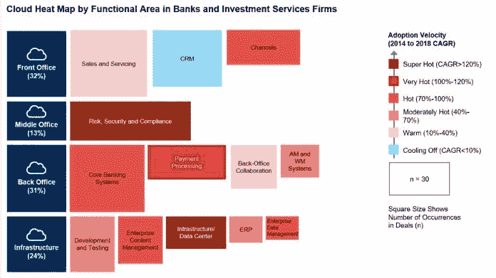

# 云计算和银行服务:非常有利可图的浪漫

> 原文：<https://medium.datadriveninvestor.com/cloud-banking-services-a-very-profitable-romance-8deb3476f5ad?source=collection_archive---------8----------------------->

American Psycho (2000)

看起来银行服务的技术颠覆就在眼前。由于客户服务和体验的改善，最近大规模采用云正在从基础上动摇整个行业。此外，正如我们所知，IT 相关服务的新闻功能，如[人工智能](https://www.datadriveninvestor.com/glossary/artificial-intelligence/)、[区块链](https://www.datadriveninvestor.com/glossary/blockchain/)、[物联网](https://www.datadriveninvestor.com/glossary/internet-of-things/)等，可以完全作为基于云原生的微服务来利用，但这包括从遗留系统迁移的可能性。因此，如果我们考虑到我们目前只是大规模采用云及其根据不同业务模式的变体的开始，这种非常好的关系可能会持续几十年。

根据 Gartner 在 2019 年 9 月发布的一份名为[“2019 年银行和投资服务云热图”](https://www.gartner.com/account/signin?method=initialize&TARGET=http%253A%252F%252Fwww.gartner.com%252Fdocument%252F3957012)的文件，从 2014 年到 2018 年，对银行和云提供商之间的约 195 笔交易进行了分析。分析显示了 IT 行业中与银行服务采用云相关的非常显著的趋势。

 [## 信息图:云之旅|数据驱动的投资者

### 聪明的企业领导者了解利用云的价值。随着数据存储需求的增长，他们已经…

www.datadriveninvestor.com](https://www.datadriveninvestor.com/2018/09/22/infographic-journey-to-the-clouds/) 

例如，银行服务中的前台办公室(这意味着销售和服务、CRM 和渠道的微服务)约占云采用的 32%，另一方面，中间办公室(风险、安全和合规)占 13%，而后台办公室(核心银行系统、[支付](https://www.datadriveninvestor.com/glossary/payment/)处理、后台办公室协作以及 AM 和 VW 系统)占 31%。最后，基础设施(开发和测试、企业内容管理、基础设施数据中心、ERP 和企业数据管理)的云采用率为 24%。

Source: Gartner (August 2019)

根据 Gartner 所做的相同分析，总结了近年来银行服务采用云计算的情况，并使用复合年增长率(CAGR ),五个主要功能领域的总增长率如下:

1.基础设施 211%，

2.风险、安全性和合规性 148%，

3.支付处理 126%，

4.核心银行系统 97%

5.渠道 93%。

大规模采用云计算对银行服务造成的破坏可能不会一蹴而就，但在我看来，这种转变将是温和而缓慢的。事实是，对最终消费者来说，新的基于云的银行服务将更智能、更透明、更高效，甚至更便宜，因此在短期和中期内，大多数银行(如果他们不想输掉这场比赛)将把他们的服务完全放在云中，以向他们的客户、企业和商业客户提供最高水平的服务。

此外，分析中发现的其他趋势表明，在与模型和业务发展相关的银行服务中采用云非常有趣。正如我在《排队》中提到的，私有云是银行采用最多的，其独特之处在于大多数时候都是由第三方托管在外部数据中心。此外，这种商业模式与中型银行密切相关。

尽管公共云已经解除了对安全性和隐私缺乏的一些担忧，但由于基于人工智能云的功能和易于管理的[托管](https://www.datadriveninvestor.com/glossary/hosting/)优势，公共云的采用也有所增加。

最后，混合云虽然在银行服务的分析和[机器学习](https://www.datadriveninvestor.com/glossary/machine-learning/)服务中仍然很受欢迎，但最近在采用方面表现出停滞不前。混合云实施的模式往往在“2019 年的财政和贸易融资业务部门”更受欢迎，而不是在银行服务本身。

可能一般公众，甚至最终消费者都没有意识到银行的大量采用以及他们对云服务的押注，但真实的情况是，市场正在经历银行和其他金融服务的质量和安全性的巨大改善。每天，银行环境中的大玩家都在努力在云上构建新的功能，以吸引希望购买新产品的客户，同时，这种采用将意味着在中期内减少与维护遗留系统相关的一些运营成本。最终，银行与 IT 和云提供商之间的浪漫将取决于消费者对最智能、最快速、最可靠和最安全的银行应用程序的偏好。