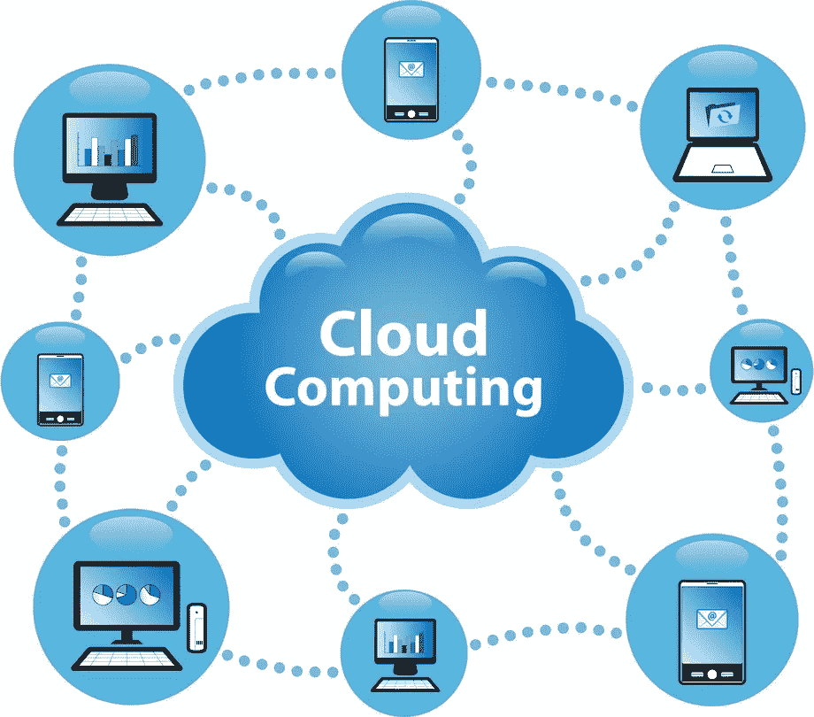

# 云计算–简介

> 原文：<https://medium.datadriveninvestor.com/cloud-computing-introduction-fad95af49544?source=collection_archive---------4----------------------->

云计算，从最近几年开始，每个人都在谈论它，但是很少有人知道它到底是什么。它正在成为 It 行业的流行语，因为我们许多人都对什么是云以及它是如何工作的很感兴趣，尽管我们许多人可能会在不知不觉中使用云，比如在 DropBox 或 Google Drive 上上传你的文档，你上传的所有项目都被保存在谷歌、微软等多家公司的云托管应用程序中。

什么是云计算？

云计算的一个基本概念是，任何用户都可以访问计算服务，如他们的网络、操作系统等，或通过互联网访问他们的存储，而不是在他们的计算机硬盘或他们公司的本地网络\基础设施上，服务的位置和许多细节，如运行服务的硬件或操作系统，在很大程度上与最终用户无关。这是因为云的隐喻是从旧的电信网络示意图中借用的，其中公共电话网络(以及后来的互联网)通常被表示为云，以表示底层技术是不相关的。从根本上说，云计算是一种通过互联网外包计算机程序的方式。

云计算是基于软件和硬件的计算资源的组合，作为网络服务交付，即用户能够从任何地方访问软件和应用程序；计算机程序由云上的外部方托管，最终用户不必担心基础架构或存储，他们只需享受最终结果，只需担心他们的应用程序工作或开发。

云计算的简单使用

“云计算的有趣之处在于，我们重新定义了云计算，将我们已经在做的一切都包含在内”——甲骨文公司董事长拉里·埃里森

无论我们是否意识到，云计算已经成为我们日常生活中不可或缺的一部分。从网上购物到我们的日常娱乐，我们正在以某种方式使用云服务。以下是云计算影响我们日常活动的几个例子:

导航:为了获得导航系统的实时更新，我们的应用程序需要使用来自 clod 的海量存储服务来存储导航信息。每当我们使用 GPS 工具，如谷歌地图，Waze 等，GPS 工具访问云存储，以获取信息，帮助您从 A 点到 b 点。使用云，我们可以随时获得导航信息，如路况，天气，交通等

社交媒体:我们在日常生活中至少使用一个社交媒体平台，如脸书、Pinterest、Twitter 等，想想当你发布图片、写推文等时，所有信息都保存在哪里。每当你使用任何社交媒体时，所有的信息都保存在云存储服务中，因此可以从云中访问这些信息

工作:想象一个场景，你需要在不同的地区主持一个会议，比如印度、美国等。GoToMeeting 是我们可以想到的一个选项，假设这是一个基于云的应用程序，它可以管理您不同地区的会议并存储相关信息。为了提供更好的工作生活平衡，公司更加注重创建云原生应用程序，如 Office365、Drobox、Google Apps 等，以便员工可以从互联网上的任何地方访问他们的信息。还有很多其他的例子，像 Salesforce、Zendesk 等等，我们现在正在使用的，都是托管在云或者基于云的应用。

休闲:网飞、Hulu 等类似的应用不需要向有互联网接入的普通用户介绍。这些应用为用户轻松提供实时流服务，利用云技术提供高收视率的视频。其他的例子包括索尼的 PlayStation Network 和微软的 Xbox Live，后者在一个单一的门户下连接了来自世界各地的远程游戏

基于网络的电子邮件中心:无论你使用 Gmail、Yahoo、Hotmail 还是其他电子邮件应用程序，你都依靠云来接收、发送和存储朋友、家人和同事之间的电子邮件通信。

还有更多…！！！！

云计算简史

早在 1950 年，当大型计算机出现时，云计算就出现了，在大型计算机中，几个用户可以通过虚拟终端访问他们的计算服务，这些终端的唯一任务是使用户能够访问大型计算机，但是这种大型计算机设备的过高成本使得小型组织或任何中层组织购买它们并招致维护开销在经济上不可行。那时，为了节约成本，公司想到了“分时”使用一台计算机的主意。云计算的术语“分时”前提

大约在 1961 年，John MacCharty 在麻省理工学院的一次演讲中提出，计算可以像公用事业一样出售，就像水或电一样。这是一个很棒的想法，但是像所有很棒的想法一样，它走在了时代的前面，在接下来的几十年里，尽管人们对这个模型很感兴趣，但是技术还没有准备好。但是该技术逐渐向更经济的解决方案发展，以便为组织的计算资源提供更经济、更容易获得的解决方案

20 世纪 70 年代，IBM 推出了名为虚拟机(VM)的新操作系统(OS)。这允许用户在单个大型机系统下容纳多个 OS 系统。客户操作系统可以在每台虚拟机上运行，拥有自己的内存和其他基础设施，从而可以共享这些资源。这使得计算中的虚拟化概念越来越受欢迎，因为它为基础架构提供了更强大的解决方案，并且用户不需要适应多个基础架构

20 世纪 90 年代，电信运营商开始提供虚拟化的专用网络连接，其服务质量与点对点(专用)服务一样好，但成本更低。这为电信公司向许多用户提供对单一物理基础设施的共享访问铺平了道路。

1999 年，Salesforce.com 设计了一个简单的云网站，可以轻松地向用户提供应用程序。这些应用程序通过互联网交付给企业，这样计算作为公用事业出售的梦想就实现了。

2002 年，亚马逊启动了亚马逊网络服务，提供存储、计算甚至人工智能等服务。然而，直到 2006 年推出弹性计算云(EC2 ),一项面向所有人的真正的商业服务才开始存在。EC2 允许小公司租用计算机，在上面运行他们自己的计算机应用程序

2009 年，Google Apps 也开始提供云计算企业应用。此外，微软将其云服务称为 Microsoft Azure，这反过来开启了云计算道路上的新革命