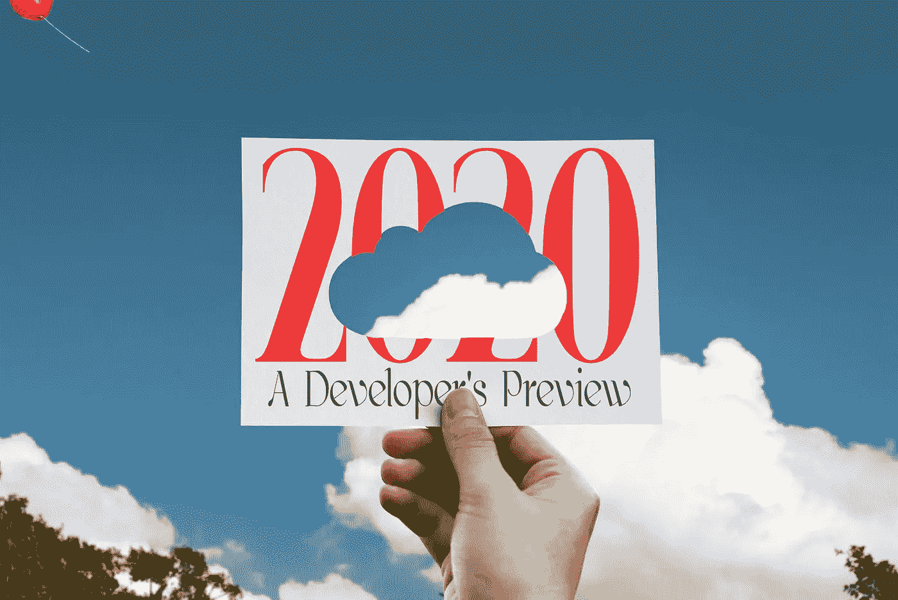

# 2020:一个开发者的预览

> 原文：<https://medium.datadriveninvestor.com/cloud-currents-2020-a3167554d42e?source=collection_archive---------7----------------------->

## 开发技术的有趣趋势

If you are not a dev: stop reading.

# 它很大

根据 Gartner，Inc .的数据，预计 2019 年全球公共云服务市场将增长 17.5%，总额达到 2143 亿美元，高于 2018 年的 1824 亿美元。

虽然 2143 亿美元是一个相当大的产业，但增长因素是引人注目的特征。

云增长预计将继续其扩张轨道，在 2020 年达到近 3000 亿美元的收入(Forrester)。

这对你我来说意味着一件大事:**机遇**。

## 但是到底是什么呢？

实际上有两种云软件:终端用户和开发者。SaaS 和 IaaS。

aaS 的缩写开始变得混乱。对于知道的你我来说，有 *devtech* ，然后就是其他一切。

问题是，你是在构建软件来向最终用户交付服务，还是在构建开发人员用于此目的的工具？

无论哪种情况，市场都在快速扩张。

Garner 分析师确定了云计算的四个主要领域:

*   IaaS:虚拟化基础设施
*   PaaS:像 Cloud Foundry 这样的运行时抽象
*   SaaS:大部分开发的最终产品:通过网络消费的服务
*   BPaaS:高阶 SaaS 的总括描述符，用于封装整个业务流程

也就是说，基本上:两种 devtech (IaaS 和 PaaS)，然后是所有终端用户 SaaS 的东西。

事实上，有大量的开发技术，我称之为开发工具。不是真正的 I/PaaS，但仍然致力于开发。(想想 github。)

无论如何，无论你如何看待，有一些主要趋势正在影响这些行业的发展。(我对潜力感到兴奋。)

 [## 创建折衷书架的程序员指南|数据驱动的投资者

### 每个开发者都应该有一个书架。他的内阁中可能的文本集合是无数的，但不是每一个集合…

www.datadriveninvestor.com](https://www.datadriveninvestor.com/2019/03/25/a-programmers-guide-to-creating-an-eclectic-bookshelf/) 

以下是我对正在发生的事情以及它将如何在 2020 年上演的看法。

# 艾冷静下来

你知道人工智能已经经历了几次繁荣和萧条周期吗？

他们称这段冷却期为“人工智能冬天”。

我们现在正在研究这个问题。

事情是这样的:

*   新的技术和专业知识建立起来，机器学习的更高级的用途出现了。
*   消息传开后，营销人员就开始跟进。
*   炒作开始了，人们开始期待真正的、翻天覆地的基于计算机的智能
*   随着机器学习的实际工作不断向前推进，宣传脱离了不真实的悬崖

机器学习有明显有效和强大的用例。然而，它们确实属于我们通常认为的软件可解决的问题。

是的，有意思的是，软件可以帮我开始我的客服互动。不，它没有超出我期望软件处理范围。

简而言之，机器学习是另一套解决软件问题的有用技术。

它不是即将孕育出可与人类媲美的创造力。

差远了。此外，它永远也不会引入人工意识，这是一个萦绕在整个讨论背景中的想法。

我们可能会开发出通过图灵测试的软件。但这种测试本身真的把责任推给了围绕人工智能的更深层次的问题。

当我们绕过它的哲学本质时，这场讨论的长和短是这样的:行业中围绕人工智能的炒作开始消退。

看来人类将不得不继续进行真正的思考。

是的。我知道我会因为这个被痛骂。大部分是通过机器人。

# IaaS 同质化，寻找新的战场

IaaS 在 2018 年增长到 324 亿美元，2019 年将继续这一趋势。网络应用已经是一个迅速扩大的问题，而云技术只是给它加了一把油。

像 AWS 的 EC2 这样的 IaaS 平台已经经历了一场革命，成为任何大型科技公司产品的关键部分，成为同质化的产品领域。

这一趋势将持续到 2020 年。这为行业的持续发展奠定了基础，因为这是云开发的基本竞争:*谁为开发者提供托管和工具*。

所有这些都意味着赛马正在结束，市场相当稳定。竞争开始集中在定价上。(谷歌云平台刚刚宣布 2019 年 12 月降价 33%)。像 Vultr 这样的产品正变得越来越有吸引力。

该字段并没有像担心的那样被厂商锁定，而是被厂商*模糊*标记。竞争者之间没有什么区别。

许多 IaaS 领域，如启动虚拟机实例并向其路由软网络，构建无服务器功能，部署监控解决方案，运行 PaaS 应用程序，数据存储托管，kubernates 和类似产品，这些在主要云提供商之间看起来非常相似。

事实上，不仅云服务，而且处理编码及其内部和流程与 IaaS 的交互的产品和方法都在激增。

最终结果是 ***而不是***dev 或 devOps 的简化。事实上，它是复杂性的一个复合分支。

开发人员面临着一系列复杂的选项和问题。更不用说回答一些简单的问题，比如:“我被指控了什么？”

# 新的开发工具

最大的问题是下一个战场在哪里？

答案是:在 devtools 中，可以消化和管理各种各样的产品；消化新技术和工具的快速引入；并使其高阶可控的开发者。

我将在“新开发工具”的标题下把这一切都压扁。

小心点。它的到来将改变发展的面貌。

未来发展的一个关键趋势是…

# 跨平台

也就是说:我们并不在乎使用哪家云提供商:我们只需要磁盘、内存和网络。现在运行它。

跨云平台方法能走多远？

我们能把基础设施抽象到什么程度？如果一家云提供商降价，哪些类型的工作负载可以有效地从另一家提供商那里转移出去？

自动化程度有多高？

如果我们不带任何感情色彩地将云视为一个由价格、质量等因素决定的服务市场，我们会看到一幅画面，但当你考虑到运行软件或持久数据具有经济惯性时，就会看到另一幅画面。

即使有先进的工具可以将应用和基础设施供应商视为简单的功能提供者，它们也有局限性。

但话虽如此，处理基础设施的新领域肯定是开放的，这些基础设施超越了云提供商的简单本质:竞争性服务。

这个问题又回到了云提供商如何脱颖而出的问题上。事实上，客户已经在使用一个平台是好事，但是工具越是改进来抽象云提供商的产品，这些客户就越容易被挖走。

# React 仍然是主要的前端框架

我被[粗鲁地唤醒](https://medium.com/swlh/vue-vs-react-vs-angular-4fce47857eda)，在那里我意识到我最喜欢的失败者 VueJs 并不是最好的框架。ReactJs 群岛。

随着时间的推移，这种感觉只会越来越强烈，我很想知道谷歌对 Angular 的支持是否是唯一能让它与 React 长期竞争的因素。

简而言之，React 主导了前端领域，并将继续如此，直到新的东西出现取代它的位置。它不是来自已经在比赛中的框架。

可能是 lit-html 之类的东西。

无论如何，在下一个新贵出现之前，React 仍将是 2020 年的冠军。

我能保证的一件事是*会有事情发生，并避免反应。*

这是你在软件领域唯一可以依赖的东西。改变。

2020 年新贵是否到来，我们拭目以待。我有点怀疑，但你永远不知道。

# 更多大公司的音乐椅

看着强大的科技巨头争相收购，以求在云革命中生存下来，这很有趣。这就像音乐椅，每个公司都担心自己没有足够大的空间来生存。

看起来当音乐最终停止时，最大的玩家仍将存在，然而，争夺将持续一段时间。

这又一次决定了你我的机会。为什么？

因为该行业的财大气粗仍在寻找通过购买技术获得的优势。

# 安全性

虚拟化资源本来就更容易受到攻击，微服务架构增加了安全复杂性。

再加上在大型组织中管理云资源使用的困难，安全性无疑仍然是一个持续的关键发展领域。

# 语言战争

我想知道是否会有新的语言真的爆发并进入 Java、JavaScript 和 PHP 的崇高领域？

看起来不像。我不认为 2020 年会发生。

听着，你和我一起开发软件。

我们喜欢建造它。

我们正处于一场绝对的潜在建设的卡利德式飓风之中。能够开辟新天地的事物。

那些你认为如果你不去做，就不会发生的事情。

不要问我们在云革命中处于什么位置。

不，要问我们在软件产业中处于什么位置。把我们目前的阶段看做是互联网突破后的下一次大浪潮。

五十年后，他们会看着这场狂野之旅，想知道它是什么样的。

太糟糕了。

[胸怀大志。](https://medium.com/datadriveninvestor/why-you-should-think-big-14d878a48f55?)