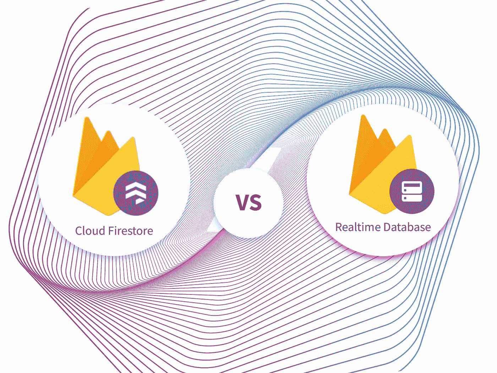

# 云 Firestore 与实时数据库——选择哪个以及何时选择

> 原文：<https://medium.datadriveninvestor.com/cloud-firestore-vs-realtime-database-which-when-to-choose-f5194787182c?source=collection_archive---------4----------------------->

irebase 是谷歌的一部分，它提供两个数据库:实时数据库和云火石。在本文中，我们将研究这两种数据库的优点，以便您可以决定哪一种适合您。

# 背景

在过去的几年里，我们已经看到了 Firebase 及其实时数据库的崛起。这是一个非常方便的工具，可以让开发人员快速启动和运行数据库的后端，并提供它。开发人员喜欢这个工具，因为它的入门门槛低，拥有成本少且便宜，查询更好。Firebase 希望通过谷歌 Firestone 吸引更广泛的受众。事实上，Firestone 几乎支持实时数据库所做的一切，但它也是一个完全不同的体系结构，侧重于不同的事情。

 [## 2019 年移动应用开发之路|数据驱动的投资者

### 任何在移动应用程序开发行业工作的人，无论他们是专注于在伦敦开发 iOS 应用程序还是…

www.datadriveninvestor.com](https://www.datadriveninvestor.com/2019/01/15/the-path-of-mobile-app-development-in-2019/) 

# 实时数据库

Firebase 数据库是基于云的，用 NoSQL 语言编写。它的软件开发工具包支持所有平台的开发。您可以轻松地将它与 Firebase 提供的其他服务集成在一起。所有数据都存储在 JSON 文档中，这意味着一切都将是一个键或一个值。所有的数据同步都是通过数据套接字进行的，这些数据套接字提供了闪电般的操作。即使设备离线，它也可以安装新的更新，一旦连接恢复，所有更改都将同步。

正如我们上面提到的，启动并运行数据库的后端是很容易的，但最棒的是没有让系统管理员和 CTO 做噩梦的顾虑。事实上，这个过程只需要几分钟，这意味着你可以专注于你的应用程序的独特功能，这简化了[移动应用程序开发](https://skywell.software/mobile-app-development/)。

该系统的大部分应用程序代码将在云端编写，这可能是一个加号或减号，取决于视角。因为您将在客户端处理大量的逻辑，所以您需要在所有平台上复制代码，除非您创建一个 Firebase Cloud 函数来处理所有的请求。然而，如果你决定使用这个选项，你将会失去实时软件开发工具包能给你的很多东西。

# 云火石

尽管 Firestone 较新，但它在关系模式层次结构方面更为传统。它也以 NoSQL 为基础，分为几个系列。这样的集合包含文档，而文档又拥有自己的集合(称为子集合)和各种数据字段。您可以将这两个实体视为关系数据库中的行和表，因为这是它的传统用法。

文档内部是包含各种类型的字段，如布尔值、字符串、数字等。这对致力于维护数据完整性和消除 bug 的开发人员来说是一件大事。现在我们已经熟悉了这两种类型的数据库，是时候对它们进行比较了。

# 云 Firestore 与 Firebase 实时数据库

首先，我们从这两者的共同点开始。它们都很容易集成到一个项目中，只需要有限的设置，而且它们与 Firebase 提供的其他任何东西都兼容。管理员将能够通过 Firebase 控制台查看数据，这两个控制台使用相同的方案。这意味着您可以搜索顶层的节点和集合，以找到您正在寻找的数据或信息。除此之外，他们不提供任何进一步的探索。如果您知道要寻找的密钥和对象，这将非常有用。现在让我们来看一下不同之处。

*   询问支持——Firestore 在这方面更有优势。查找与多个字段比较相匹配的记录。Firebase 使用简单的数据结构，这意味着您将只能运行搜索以您的查询开始的字段的查询。
*   导入和导出数据——这是 Firebase 提供的一个特性。当您正在迁移数据或者不是开发人员的团队成员要对数据进行一些更改时，它会很方便。
*   实时更新——Firebase 专注于实时更新，这对于处理使用社交媒体或协作应用程序的客户非常有用。它为开发人员提供了实时确定哪些客户是活跃用户所需的一切。
*   成本—随着您通过读/写操作发送更多数据，实时数据库的成本将会上升。Firestore 数据库的价格会随着每次 API 调用而增加。但是，在做任何决定之前，一定要查看整个成本明细。

我们希望所有这些信息对您有用，以便在开发您的移动应用程序时确定使用哪个数据库。这两个数据库各有优缺点，很多都取决于您团队的经验以及您使用它们的舒适程度。你承担的所有项目都需要大量的计划和对细节的关注。否则，你最终会有很多延误和资源浪费。有一点是肯定的:无论您最终选择哪个数据库，您都将获得一个伟大的产品。

*最初发布于*[*https://sky well . software*](https://skywell.software/blog/cloud-firestore-vs-realtime-database/)*。*