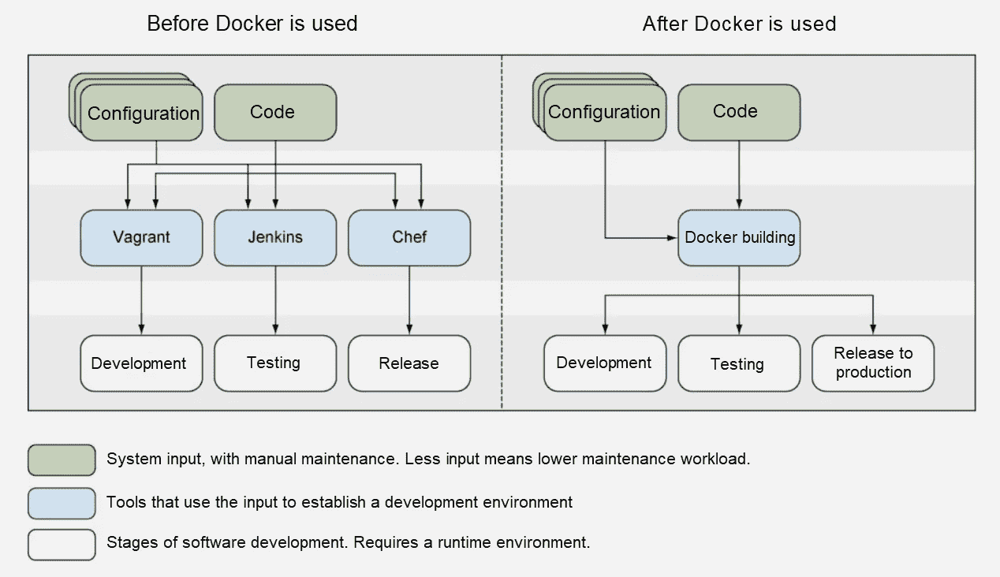
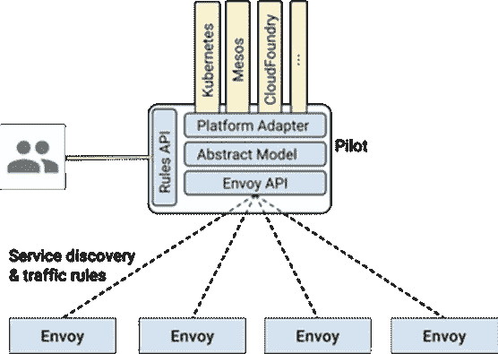

# 云原生:从 Docker 到 Kubernetes，再到服务网格

> 原文：<https://medium.datadriveninvestor.com/cloud-native-from-docker-to-kubernetes-and-to-service-meshes-a6105fdf23a?source=collection_archive---------6----------------------->

*作者吕仁祺。*

回到去年，当我在做一些关于[服务网格](https://www.nginx.com/blog/what-is-a-service-mesh/?spm=2c41.13786574.0.0)的研究时，我阅读了所有关于 Kubernetes 的资料，主要是通过网上的一些介绍。大约在同一时间，我还使用了一个 Kubernetes 应用平台 [OpenShift](https://www.openshift.com/?spm=2c41.13786574.0.0) 。之后，我写了两篇文章，讨论了我对 Service Mesh 和 Kubernetes 的体验和想法。

现在回头看看以前的文章，我认为我当时的理解有点局限和片面，就像你在网上找到的关于这些话题的大多数信息一样。既然我的团队正在考虑使用 [Dubbo](https://dubbo.apache.org/?spm=2c41.13786574.0.0) 作为[云原生](https://www.cloudbees.com/blog/cloud-native-what-it-and-why-its-important?spm=2c41.13786574.0.0)架构，我花了一些时间温习基础知识，阅读了一些 Docker 和 Kubernetes 的实用指南，希望能提供对所有相关技术更好、更全面的理解。

现在，为了开始讨论，我想考虑 Docker、Kubernetes 和 Service Mesh 到底是什么，以及它们做了什么来更好地理解云原生到底是什么和意味着什么。在博客的最后，我们还将探讨云原生的概念和含义，并尝试一下“云原生”到底是什么。

# 关于 Docker 的思考

在这一部分，我将在阅读 Docker 实用指南后提出我的想法。

Docker 是一个 Linux 容器工具集，它是为构建、发布和运行分布式应用程序而设计的。Docker 帮助完成[容器化](https://hackernoon.com/what-is-containerization-83ae53a709a6)的过程，确保应用隔离和可重用性，以及虚拟化，这是一种确保物理机器安全性的功能性方式。

 [## 雅虎财经 API |数据驱动投资者的 6 种替代方案

### 长期以来，雅虎金融 API 一直是许多数据驱动型投资者的可靠工具。许多人依赖于他们的…

www.datadriveninvestor.com](https://www.datadriveninvestor.com/2019/02/25/6-alternatives-to-the-yahoo-finance-api/) 

在许多方面，Docker 是成为云原生难题的第一批主流产品之一。

下图展示了如何使用 Docker 来简化工作:

# Docker 的核心是什么

以下几点总结了 Docker 到底是什么和它做什么。

*   Docker 可以被描述为一种连接应用程序整个生命周期的契约。它的核心优势是加快了应用程序的交付速度，提高了整体生产率。
*   Docker 与[虚拟机](https://www.techopedia.com/definition/4805/virtual-machine-vm)有着本质的不同。Docker，或者说容器化这个概念本身，并不是虚拟化。它不模拟机器的硬件。相反，Docker 是围绕应用程序构建的，它使用开放的 [dockerfile](https://docs.docker.com/engine/reference/builder/) 标准封装了一个应用程序，包括它的配置和依赖关系。虚拟机在操作系统层工作，重点是资源管理。
*   Docker 还可以和[主厨](https://www.chef.io/)和[詹金斯](https://jenkins.io/)紧密结合。
*   [Docker Hub](https://hub.docker.com/) 是容器图像管理的中心，最能体现 Docker 应用的特性。每个图像都可以命名和标记，并有一个唯一的 ID。

Docker 还很好地集成了应用程序生命周期的所有阶段:

*   开发:Docker 确保开发环境的一致性，因为流程是它的环境，并且可以与传统的配置工具一起工作，如 Make、Chef 和 [Puppet](https://puppet.com/products/how-puppet-works) 。它还具有较小的图像，是开发人员友好的。Dockerfiles 可用于实现从源到映像的自动化。
*   DevOps: Docker 支持从 [Git](https://git-scm.com/) 到 Docker Hub 再到 Jenkins 的自动化工作流。它采用了连续检入、连续集成、连续部署和连续交付的综合工作流。
*   生产环境:Docker 也是[平台即服务](https://searchcloudcomputing.techtarget.com/definition/Platform-as-a-Service-PaaS) (PaaS)产品如 [Swarm](https://docs.docker.com/engine/swarm/) 和 Kubernetes 大放异彩的地方。

码头工人负责以下事项:

1.  多主机容器的运行时状态和配置管理。
2.  多主机和多容器编排环境中的安全性、日志记录和故障排除管理。

# 关于库伯内特的思考

正如我之前暗示的，Kubernetes 是在容器化应用程序和 Docker 流行起来并开始被用作管理容器的平台之后出现的。在这一节中，和上一节一样，我将在阅读了 Kubernetes 实用指南之后，提出我对反思的想法。

# 为什么是 Kubernetes

Kubernetes 的流行与 Docker 密切相关。Docker 的广泛应用使得平台即服务(PaaS)成为可行的事情。Kubernetes 是一项伟大的成就，它来自于在[谷歌](https://cloud.google.com/)管理大规模数据中心的大量实践经验。当时容器化应用的爆炸也预示了这一点。谷歌的目标是建立一个新的行业标准，他们无疑做到了 Kubernetes 像现在一样广受欢迎。

Kubernetes 确实是云原生革命的一大块。

Google 在 2004 年开始使用容器，并在 2006 年发布了控制组(通常称为 cgroups)。同时，他们在其云和 IT 基础设施内部使用集群管理平台，如 [Borg](https://ai.google/research/pubs/pub43438) 和 [Omega](https://ai.google/research/pubs/pub41684) 。 [Kubernetes](https://kubernetes.io/) 受到博格的启发，吸取了包括欧米茄在内的集装箱管理公司的经验和教训。

你可以在这个博客上读到更多关于这段迷人历史的内容。

要考虑的一些事情是 Kubernetes 如何击败其他早期的竞争者，如 Compose、Docker Swarm，甚至是 Mesos？这个问题的答案，简而言之，就是 Kubernetes 优越的抽象模型。Kubernetes 原则上是不同的，在其设计的核心。为了理解 Kubernetes，我们需要回顾一下其底层架构中涉及的所有概念和术语。

# Kubernetes 的主要概念

以下是 Kubernetes 或多或少独有的一些概念。通过理解 Kubernetes 背后的概念，您可以更好地了解 Kubernetes 的工作原理:

*   Pod:Pod 是 Kubertnetes 应用程序的基本执行单元。一个 pod 是几个容器的组合，它们都运行在同一台主机上，使用相同的[网络名称空间](https://kubernetes.io/docs/concepts/overview/working-with-objects/namespaces/)，IP 地址和端口。这些容器使用本地主机相互通信和发现。此外，这些容器可以共享相同的存储容量。Pods，而不是容器，是 Kubernetes 中创建、调度和管理的最小单位。Pods 提供了更高级别的抽象和更灵活的部署和管理模型。
*   [控制器](https://kubernetes.io/docs/concepts/architecture/controller/):控制器是任务执行的逻辑单元，由控制器管理器管理，负责负载调度和执行。[replication controller](https://kubernetes.io/docs/concepts/workloads/controllers/replicationcontroller/)(RC)是一个控制器的具体实现之一，负责弹性伸缩和滚动升级。每个对象模型都有一个相应的控制器，比如节点、服务、端点、s a、PV、部署和作业。您也可以使用扩展来实现您的控制器。
*   [服务](https://kubernetes.io/docs/concepts/services-networking/service/):Kubernetes 中的服务是实际应用服务的抽象。它定义了访问 pod 的逻辑集和策略。服务充当 pod 的单点访问(或代理),无需了解后端 pod 的工作方式即可访问应用程序。这提供了一种简化的服务代理和发现机制，使得扩展和维护更加容易。除了 pod 之外，服务还可以充当任何后端的代理，比如 Kubernetes 集群外部的服务。在这种情况下，您不需要选择器，但是必须手动定义与服务同名的端点。
*   [标签](https://kubernetes.io/docs/concepts/overview/working-with-objects/labels/):标签是一个键/值对，附着在一个对象上，比如一个 pod。标签用于将 pod 与服务和复制控制器松散耦合。
*   [节点](https://kubernetes.io/docs/concepts/architecture/nodes/):Kubernetes 术语中的节点就是一个主机或机器。在 Kubernetes 中，定义为工作机的节点，可以是虚拟机或物理机。

如果你想了解更多，你可以从源代码本身获得，直接阅读官方文档，你可以在这里找到。

# Kubernetes 与主流 CI/CD 模型

持续集成和部署可以说是平台即服务(PaaS)模型和云原生的最显著特征，大多数云供应商都提供基于 Kubernetes 的 PaaS 模型。因此，一般用户体验和这些模型中使用的特定持续集成和持续交付(CI/CD)管道是区分不同服务的东西。一般来说，CI/CD 管道从项目创建时就开始了，并渗透到应用程序生命周期的每个阶段。这是 CI/CD 管道的核心优势。它们可以集成到开发工作流程的所有步骤中，并提供一体化的应用服务体验。

以下是一些可用于 Kubernetes 的主流 CI/CD 工具:

*   [Jenkins](https://jenkins.io/) : Jenkins 来自 Hudson，用 Java 实现。它可能是当今使用最广泛的 CI/CD 工具。
*   团队城市:团队城市有很多强大的功能，包括公共问题跟踪和论坛，100 个构建配置，以及其他一些功能。
*   CircleCI :如果你想以一种安全的方式大规模地自动化你的开发过程，CircleCI 是一个很好的选择。它的客户包括脸书、Kickstarter 和 Spotify。
*   [Travis CI](https://travis-ci.org/) : Travis CI 可以帮助您满怀信心地进行测试和部署。事实上，Apache 项目使用 Travis CI 进行集成测试。每个 PR 都有一个 TC 任务，它执行单元测试并确保代码符合规范。
*   [无人机 CI](https://drone.io/) :无人机是一个自助式的持续交付平台，方便忙碌的开发团队。他们的客户包括思科、Ebay、Gannett、VMWare 和 Capital One。

# 与 Kubernetes 连接的 API 对象和元数据

现在，关于 Kubernetes，需要考虑的最后一件重要事情是与 Kubernetes 相关的 API 对象和元数据:

*   [kuberctl](https://kubernetes.io/docs/reference/kubectl/overview/) : Kuberctl 是 Kubernetes 的命令行工具。
*   直接访问[Kubernetes API](https://kubernetes.io/docs/concepts/overview/kubernetes-api/):Kubernetes API 服务器是 Kubernetes 的接入点。它服务于 RESTful 操作，并集成了 Swagger 来定义和描述 API。你可以在这里阅读更多相关信息[。](https://kubernetes.io/docs/concepts/overview/kubernetes-api/#openapi-and-swagger-definitions)
*   [kube builder SDK](https://kubernetes.io/blog/2018/08/10/introducing-kubebuilder-an-sdk-for-building-kubernetes-apis-using-crds/):kube builder 是 Kubernetes 的主 SDK。

事实上，元数据真正做的只是定义 API 对象的基本信息。它由元数据字段表示，并具有以下属性:

*   名称空间:名称空间字段指定 API 对象的名称空间。名称空间可以定义为由 Kubernetes 支持的同一个物理集群支持的多个虚拟集群。除了其他策略之外，不同的项目、团队和用户可以使用不同的名称空间进行管理和定制访问控制。除了节点之外，所有 API 对象都属于一个名称空间。这由`metadata.namespace`定义。如果未定义该字段，则使用名为 default 的默认名称空间。
*   名称:名称字段指定 API 对象的名称。名称字段是一个重要的属性。它由`metadata.name`定义，除了节点之外的所有 API 对象都属于一个名称空间。在同一个名称空间中，这些对象由它们的名称来标识。因此，API 对象的名称在名称空间中必须是唯一的。节点和命名空间在系统中必须是唯一的。
*   标签:标签字段指定 API 对象的标签。标签是附加到 API 对象的键/值对。它们旨在用于指定对用户有意义且相关的对象的标识属性，但不直接暗示核心系统的语义。标签可用于组织和选择对象的子集。`ReplicationController`和`ReplicationService`使用标签与 pod 相关联。pod 也可以使用标签来选择节点。
*   注释:注释字段指定 API 对象的注释。注释字段用于将任意非标识元数据附加到对象，但不能用于选择对象。注释可以是结构化或非结构化的长数据，也可以是键/值对。

# 关于服务网格的思考

在这一节中，我将快速了解一下服务网格，这确实是继 Kubernetes 和 Docker 之后的下一件大事。对我来说，服务网格的核心优势是它的控制能力，这也是服务网格特别突出的地方。

事实上，我甚至可以说，如果 Istio 模型可以继续标准化和扩展，它可以很容易地成为面向容器化应用程序的事实上的 PaaS 产品。不过，我认为 Apache 的 [Dubbo](https://dubbo.apache.org/en-us/) 、 [Envoy](https://www.envoyproxy.io/) 、 [NGINX](https://www.nginx.com/) 、甚至 [Conduit](https://conduit.io/) 的服务网格也是可行的集成选择。

因为我认为 Istio 确实是一个不错的选择，所以让我们先关注它。

# Istio，这是怎么回事？

要理解服务网格，您确实需要理解服务网格的设计原则。我们来看看 Istio 背后的设计原理是什么。简而言之，在容器调度平台上实现之前，首先要有一个服务抽象模型。考虑下图。

如果你有兴趣了解 Istio 的所有细节，你可以在这里查看它的官方解释。

一般来说，Istio 服务模型涉及服务及其实例的抽象模型。Istio 独立于底层平台，具有特定于平台的适配器，这些适配器使用来自平台中的元数据的各种字段来填充模型对象。其中，服务是应用程序的一个单元，它具有其他服务引用的唯一名称，服务实例是实现服务的 pod、虚拟机和容器。一个服务可以有多个版本。

接下来是服务模型。每个服务都有一个[完全限定的域名](https://kb.iu.edu/d/aiuv)(或 FQDN)和一个或多个服务监听连接的端口。一个服务可以有一个负载平衡器和与之关联的虚拟 IP 地址。此外，与服务模型相关的还有实例。每个服务都有一个或多个实例，作为服务的实际表现形式。一个实例代表一个实体，如 pod，每个实体都有一个网络端点。

Istio 的设计中还涉及到服务版本，服务的每个版本都由与特定版本相关联的一组唯一的标签来区分。另一个概念是标签，它是分配给特定服务版本实例的简单键值对。同一版本的所有实例必须具有相同的标签。Istio 期望底层平台提供服务注册和服务发现机制。

# 关于云原生的更多信息

上面讨论了 Docker、Kubernetes 和 Istio 之类的服务网格，我忽略了一个主要内容，那就是“云原生”。那么，什么是“云原生”？对于“云原生”的含义或要求有不同的解释，但根据[云原生计算基金会](https://www.cncf.io/?spm=2c41.13786574.0.0) (CNCF)的说法，云原生可以理解为:

云原生技术和解决方案可以定义为允许您在云中构建和运行可扩展应用程序的技术。Cloud native 是随着容器技术的发展而出现的，就像我们在 Docker 和 Kubernetes 中看到的那样，通常具有无状态、持续交付和微服务的特征。

云原生技术和解决方案可以确保良好的容错能力和轻松的管理，当与 CI/CD 管道等强大的自动化系统相结合时，它们可以在没有太多麻烦的情况下产生强大的影响。

如今，云原生和“云原生”的概念甚至根据 CNCF 涉及使用 Kubernetes，但是 Kubernetes 不是唯一的难题，而是仅仅是开始。随着传统微服务解决方案 [Dubbo](https://dubbo.apache.org/en-us/?spm=2c41.13786574.0.0) 成为 CNCF 景观的一部分，越来越多的人被这些解决方案提供的独特特性和功能所吸引。

换句话说，在许多方面，在今天的云原生环境中，云原生环境可能从 Kubernetes 开始，但最终会采用 Istio 等服务网格解决方案。就像我们在这篇博客中看到的进展一样，首先是 Docker，然后是 Kubernetes，现在还有服务网格。

# 原始资料

 [## 云原生:从 Docker 到 Kubernetes，再到服务网格

### JeffLv 年 12 月 2 日 3463 年前，当我对服务网格进行一些研究时，我阅读了所有…

www.alibabacloud.com](https://www.alibabacloud.com/blog/cloud-native-from-docker-to-kubernetes-and-to-service-meshes_595604?spm=2c41.13786574.0.0)