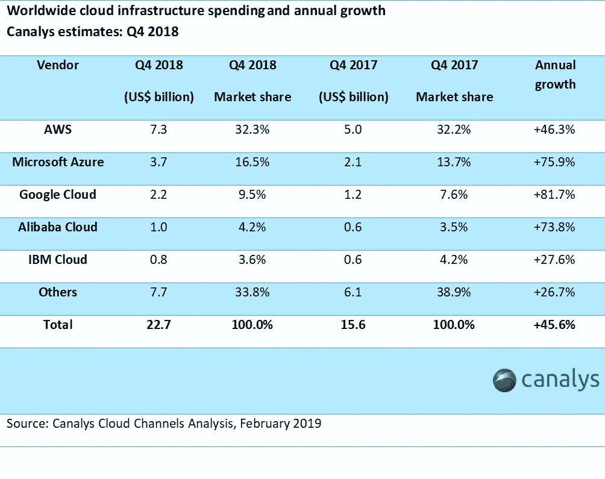
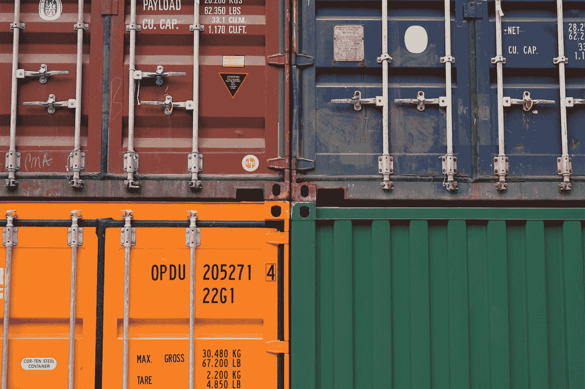
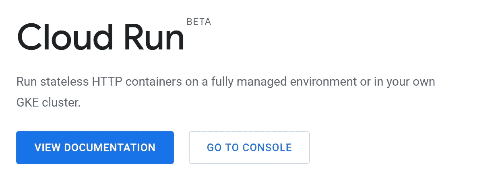
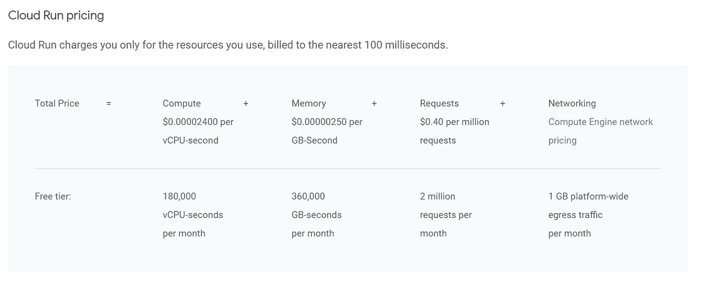

# 云计算——谷歌带给你的未来科技

> 原文：<https://medium.datadriveninvestor.com/cloud-run-future-tech-brought-to-you-by-google-fe2034da41a5?source=collection_archive---------5----------------------->

谷歌云平台是领先的云平台之一。这是目前发展最快的平台。与其他云平台相比，GCP 的一个主要特点是简单。作为一名开发人员或 DevOps 工程师，你所拥有的，是最不陡峭的学习曲线。你所要做的就是点击几下，然后你就可以开始了，你可以在以后进行复杂的配置。

Google Cloud has highest Annual Growth: [Article](https://www.canalys.com/newsroom/cloud-market-share-q4-2018-and-full-year-2018)

最近，谷歌举行了谷歌下一个 2019，他们宣布了他们的云平台的最新变化。有许多很棒的服务和产品可供尝试。我将关注他们发布的最酷的产品之一:云运行。

 [## 信息图:云之旅——数据驱动的投资者

### 聪明的企业领导者了解利用云的价值。随着数据存储需求的增长，他们已经…

www.datadriveninvestor.com](https://www.datadriveninvestor.com/2018/09/22/infographic-journey-to-the-clouds/) 

自从以 AWS Lambda 的形式出现以来，无服务器计算已经成为构建微服务的事实，这种服务只在你使用它们时才需要你的成本。与传统托管不同，在传统托管中，您必须管理始终运行的虚拟机，这些虚拟机可以扩展和缩减，但运行时会花费您 24/7 的成本，无服务器托管只在用户访问您的网站或调用您的 API 时才会花费您的成本。

Photo by [Thomas Jensen](https://unsplash.com/@thomasjsn?utm_source=medium&utm_medium=referral) on [Unsplash](https://unsplash.com?utm_source=medium&utm_medium=referral)

无服务器现在非常流行，但它有一些主要的警告。您必须遵循供应商的规则来配置您的项目结构。例如，AWS 说你必须以 ABC 的方式构建你的项目，这样它才能在 AWS Lambda 上运行。谷歌和其他平台也是如此。还有一个供应商锁定的问题，也就是说，如果你为 AWS Lambda 开发了你的应用程序，并且想搬到 GCP，祝你好运。另一个问题是语言和框架支持，这当然受到每个供应商的限制。

另一方面，容器也非常受那些希望将整个应用程序作为一个单独的包来发布的人的欢迎。这提供了配置您自己的项目结构以及框架和库的灵活性。开发人员喜欢容器，因为如果它能在我的电脑上运行，那么它肯定也能在其他人的电脑上运行:d。但是，他们的主要问题是，它们不能缩小到零，也就是说，你将永远有东西全天候运行。

Photo by [Erwan Hesry](https://unsplash.com/@erwanhesry?utm_source=medium&utm_medium=referral) on [Unsplash](https://unsplash.com?utm_source=medium&utm_medium=referral)

如果把无服务器和容器的优点结合起来会怎么样？云跑正是我找了很久的。让我像包装容器一样包装我的应用程序，但我也想只在用户使用我的容器时付费。所以基本上云运行是无服务器的容器平台。

如果您使用 Python 并使用 Flask 构建了一个 web 服务器，那么无论用户是否访问，您都必须将它托管在一个全天候运行的服务器上。我试图将我的 Flash 应用程序转移到 AWS Lambda，用 Chalice 代替 Flask 相当麻烦。

GCP: [Cloud Run](https://cloud.google.com/run/)

但是有了 Cloud Run，我所要做的就是把我的 Flask 应用程序打包成 docker 容器。它是无服务器运行的。

尽管 Cloud Run 对开发者来说是一项革命性的技术，但它仍然存在一些重大问题。我面临的一个主要限制是计算资源。就像其他无服务器平台一样，Cloud Run 的计算机资源非常有限。

云运行的另一个限制是，它是无状态的。即容器不能附带卷。你可以使用在 GKE 上运行的云，但那不是 100%无服务器的。

感谢阅读。在本文中，我只想强调新技术及其与旧技术的比较。你可以在这里阅读我写的关于如何实际使用 docker 打包你现有的应用程序并将其部署到 Cloud Run 的文章:

 [## 使用 Cloud Run 在 Google 云中部署机器学习模型

### 云运行让我们能够以无服务器的方式部署 Docker 容器。让我们在谷歌上部署机器学习容器…

medium.com](https://medium.com/datadriveninvestor/deploy-machine-learning-model-in-google-cloud-using-cloud-run-6ced8ba52aac)