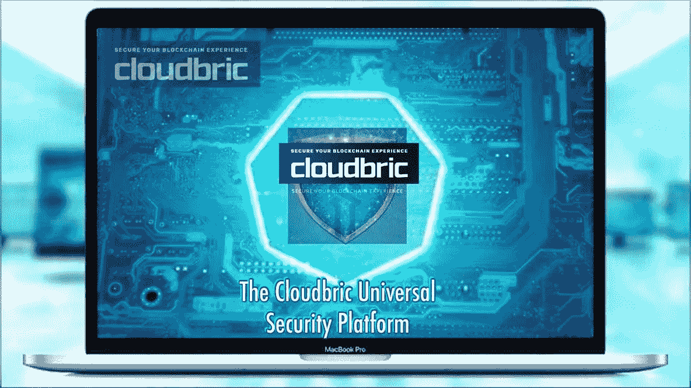

# 云计算和网络安全的未来。

> 原文：<https://medium.datadriveninvestor.com/cloudbric-the-future-of-cloud-computing-and-cyber-security-5033d0bf8e75?source=collection_archive---------12----------------------->

# 网络安全

网络安全涉及互联系统的安全，包括物理硬件组件，如服务器/数据库及其软件对应物，以及针对网络攻击的数据和信息。

> 网络安全是保护系统、网络和程序免受数字攻击的实践。
> 
> ——*据* [**思科系统**](https://www.cisco.com/c/en/us/products/security/what-is-cybersecurity.html) *，知名网络硬件公司。*

## 云计算的未来

共享计算服务(如存储、网络和处理能力)的概念几乎与互联网本身一样早就存在了，但“云计算”一词是在 19 世纪后的某个时候正式创造出来的。云计算是一个相互连接的服务器系统，可以通过互联网远程访问，以存储/检索、管理和处理数据。由于这些资源是敏感的，因此它的通信必须建立在一个可信的网络协议上，因为它可能会受到现代网络犯罪的攻击。云计算的主要类型包括:

## 私有云计算

这包括由需要云计算服务的公司建立和维护云计算服务和资源的实践。它处理一对一的关系，即只有一个组织专门在云服务器上运行。在某些情况下，组织可能会使用经验丰富的云计算专家(如 Microsoft Azure)的服务，将他们的服务器作为独立的云网络来处理。

## 公共云计算

这种云服务主要由云服务提供商运营，例如谷歌云、苹果云、亚马逊等等。这些第三方机构提供了所有与数据分发程序、所用存储设备和安全机制相关的必要信息。所有的用户必须做的是在网上注册，以访问服务，因为顾名思义“公共”，它是对一般公众开放。

## 混合云计算

混合云计算是最高效的，它可以提供广泛的服务，因为它允许从私有云和公共云分发数据和服务。它结合了云计算的两个主要模型，因此信息不仅仅依赖于单一的网络协议，从而保证了增强的部署能力、数据备份和恢复机制以及安全性，因为它涉及不同的供应商。

451 Research Institute (IAAS — Infrastructure As A Service, SAAS — Software As A Service, PAAS — Platform As A Service).

基本的云计算服务包括:

*   **基础设施即服务(IaaS)**

这包括云服务供应商向 it 客户租赁 IT 基础架构，如服务器和虚拟机(VM)、存储、网络和操作系统。客户端被授予按使用量付费的访问权限。

*   **平台即服务(PaaS)**

这种形式的云计算服务是通过提供用于开发、测试、交付和管理软件应用的实时软件开发环境来提供的。顾名思义，客户被授权访问一个平台，在那里他们可以绕过基础设施的设置，如果这些软件开发资源。

*   **软件即服务(SaaS)**

在这里，云服务提供商托管他们在互联网上管理的按需软件应用程序，用户只允许在订阅的基础上访问。

*   **无服务器计算**

还有一种非常规但高度可扩展的云计算服务，它与 PaaS 重叠，被称为无服务器计算。这里的大部分活动主要集中在开发应用程序功能上，而不是花时间实时管理这样做所需的服务器和基础架构。因为这种特定形式的云计算是事件驱动的，使得它仅在给定功能被触发时才被启动。

云计算正迅速成为大多数应用程序开发人员倾向于求助的最佳选择，因为服务的物理位置以及维护和其他元数据，例如支持该服务的服务器以及它所基于的硬件资源，对于任何利用这些服务来共享任何在线资源的人来说都变得微不足道。然而，云计算行业多年来经常遇到一个严重的挫折，因为它给订阅它的公司带来了一系列漏洞。

## 需要知道

尽管许多云服务提供商声称有各种各样的协议，但为了保护您的在线资源(数据和内部服务器都是如此)免受潜在恶意软件的威胁，他们留出了支持整个系统的整体安全性能的技术。根据 IDC 进行的一项研究，随着技术进步和计算工作负载越来越基于云，全球 IT 总支出的三分之一以上主要用于建立云计算基础设施，这导致各种资源(互连的服务器/电脑)之间产生巨大的流量。如何保护这些数据的重要性

## 为什么我们需要被保护？

强调了随着时间的推移我们的数据可能被窃取的几个漏洞。花点时间强调云计算的利与弊，有必要指出，网络攻击可以采取许多不同的形式和规模，从对个人集中式网络或共享网络的攻击。对于我们当中不在 it 公司工作但每天都使用数字和计算设备的不太懂技术的人来说，需要考虑的一件事是，这些黑客经常利用粗心的人闯入任何系统，即使这种未经授权的访问是远程发起的。因此，当我们都在利用不断增长的互联网时，我们都需要在某个时候获得基本的安全技术知识。

# Cloudbric 通用安全解决方案

cloud BRIC Universal Security Solutions 的理念最初是由 Penta Security Systems，Inc .作为 APAC(亚太地区)最重要的企业网络安全和数据加密公司培育出来的。该项目以基于云的安全即服务(SaaS)的形式发布了 alpha 版本，并凭借其在 SC Magazine Awards Europe 和 Cyber Defense Magazine 分别评选的“最佳中小企业安全解决方案”和“Web 应用防火墙热门公司”中的声誉，该项目决定通过提供一个融合了网络安全、人工智能和区块链技术等一流技术进步的生态系统，将其视野扩展到 it 领域。

作为一个全方位的安全解决方案套件，cloud BRIC Universal Security Platform 考虑了开发一个平台的需求，该平台包含了在完全启动可信通信网络之前需要建立的所有必要的安全协议。

**Cloudbric 网站:**

[https://www . cloud BRIC . io](https://www.cloudbric.io)

**电报通道:**

[*https://t.me/cloudbric*](https://t.me/cloudbric)

**Reddit:**

[*https://reddit.com/r/cloudbric*](https://reddit.com/r/cloudbric)

**白皮书:**

[*https://ico . cloud BRIC . io/upload/file/cloud BRIC _ white paper _ en . pdf*](https://ico.cloudbric.io/upload/file/Cloudbric_Whitepaper_EN.pdf)

**作者的 Bitcointalk:**

[*https://www.bitcointalk.org/index.php?action = profileu = 2187995*](https://www.bitcointalk.org/index.php?action=profile;u=2187995)

## 更多的细节，你可以参考这个中等职位；

[*https://medium.com/@cloudbric/*](https://medium.com/@cloudbric/)