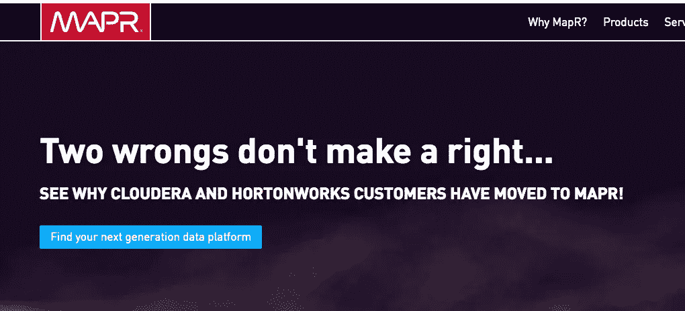

# Cloudera 和 Hortonworks 合并:技术、客户和竞争对手的视角！

> 原文：<https://medium.datadriveninvestor.com/cloudera-and-hortonworks-merge-a-technology-customer-and-competitor-perspective-7fb9664a927d?source=collection_archive---------5----------------------->

# 把你的爆米花拿出来！！！多么令人兴奋的消息！！！

我相信你已经听说了 Hortonworks 和 Cloudera 合并的消息。我可以花几分钟时间浪费你的时间在这次合并的经济上，比如合并的资产、客户、收入和机会，但是我不会。我想花点时间讨论一下我认为对这次合并最重要的事情。这些话题充斥着技术信仰及其对新组织的技术地位、客户和竞争对手环境的影响。技术宗教是这样一种信念:我的比特比你的好，我的知识产权比你的好，我解决复杂问题的方法比你的好。科技教条！看看这两家公司，就大数据产品而言，它们非常相似，但也仅此而已！在引擎盖下，他们是非常不同的。让我们从以下角度来看一下这次合并:技术、客户和竞争对手。

至于宣布的首席执行官和首席财务官，我不太关心谁来管理这个组织。现在看来，Cloudera 的首席执行官和首席财务官将负责这个新巨头的日常运营。在我看来，重要的是谁将从技术角度来管理这个组织。他们将使用什么发动机？他们会采用什么安全工具？什么样的数据格式将成为主流？会是蜂巢还是黑斑羚？会是游侠还是哨兵？会是 TEZ 还是库都？这些都是会被问到的问题，希望得到解答！或者他们会支持所有这些技术甚至更多？我当然希望不是！通过整合技术和组件，新的 Cloudera/Hortonworks 可以向他们迫切需要的东西开放:在他们的技术基础上构建解决方案的 ISV(独立软件供应商)。更少的技术支持意味着更丰富的 ISV 产品和服务，这只会帮助新的巨头！

客户会如何看待这次合并？我认为顾客主宰着一天。他们做出决定:我想使用这个供应商吗？这是否给新的 Cloudera /Hortonworks 带来了一系列全新的疑问或阴谋？现在下结论还为时过早，但猜测永远不会太早。我认为最初顾客会对合并感到高兴。然而，随着决定的做出，会有一些心痛和怀疑。对于一些即将到来的客户来说，会有一些改变，但是这有多痛苦，现在还不知道。这是一件大事！！如果我不得不从一个 SQL 引擎换到另一个，这会对我的堆栈的其他部分产生什么影响？如果我必须从一种处理引擎、文件格式或安全方法转换到另一种，这会给我带来多大的痛苦？在整合技术方法的同时减少这种过渡痛苦将是新 Cloudera Hortonworks 组织未来的关键。最终，客户将决定这一合并决定的命运！

如果我与 Cloudera 和 Hortonworks 竞争，这是否会为我打开一个新的世界？如果我和 MapR 在一起，我应该高兴吗？我不知道。我确实认为这为今年剩下的时间提供了一些有趣的营销素材。MapR 已经通过他们的“两个错误不等于一个正确…”活动利用了这一倡议！这既聪明又有趣！这是否让他们的产品成为新的笨拙的大怪物的一个很好的选择？还是说，它创造了一个新的竞争对手，与他们相比，这个竞争对手是如此庞大，以至于他们会被消费掉？让圣战开始吧！如果我是 MapR，那么与池塘中充满希望的合作巨人相比，我现在是一条更小的鱼？MapR 也有它的宗教。看事情如何发展应该很有趣！这次合并会让 EMR 和 HDInsights 受益吗？有可能。

总之，有些合并行得通，有些行不通，现在说会发生什么还为时过早。好消息是，我们终于可以结束可口可乐或百事可乐对 Hortonworks 或 Cloudera 的挑战了。让这两个堂兄弟在唱诗班的同一张乐谱上唱歌并不容易，但会产生一些有趣的博客！但是看看会发生什么会很有趣。将由消费者来决定。这是否为 MapR 打开了一个新的世界？也许吧！我期待着看到将要发生的事情，跑到商店买了我的爆米花！

我的问题是，这里到底发生了什么？我有自己的看法，但不会说出去。(目前)