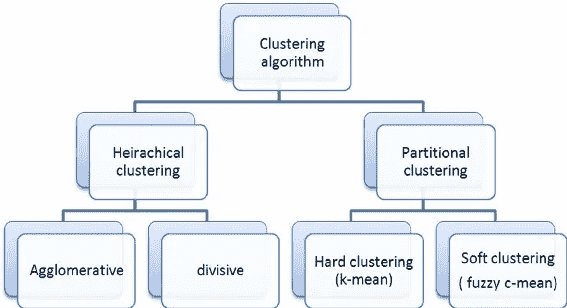
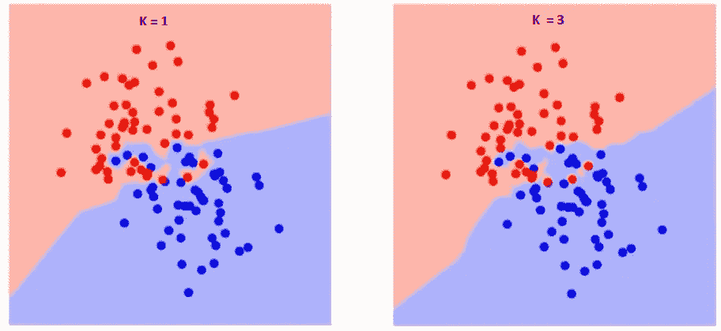
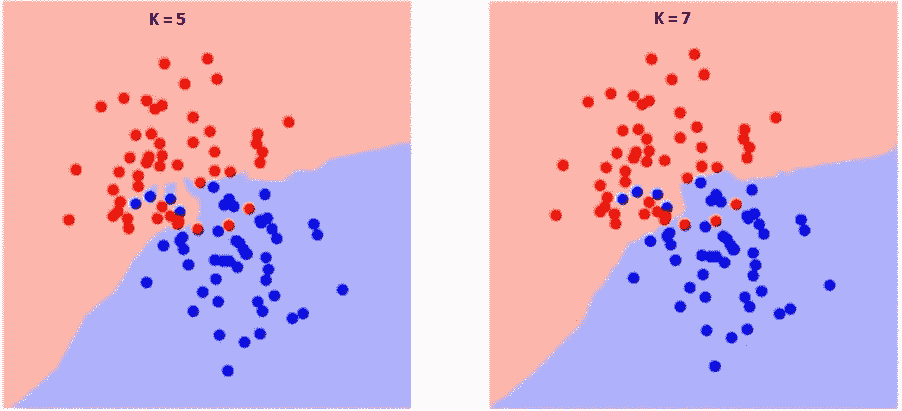

# 聚类算法

> 原文：<https://medium.datadriveninvestor.com/clustering-algorithms-9fd35f34caa3?source=collection_archive---------4----------------------->

[www.internity.in](http://www.internity.in)

聚类算法是无监督学习的一个非常重要的部分，也是一般机器学习的一个关键元素。

聚类的任务是根据相似的特征划分组，并将它们分配到不同的群中。例如，一位店主根据顾客在商店中的喜好对他们进行分类。

**source : researchgate.net**

现在让我们来看看 ***不同类别的聚类:***

*硬聚类*:参照上例，每个客户要么完全属于某个特定的群体，要么不属于某个特定的群体。

*软聚类*:每个客户被分配一个概率，他/她属于所有组中的那个组。

***聚类算法的类型:***

1.  连通性模型:这些模型遵循一种方法，样本空间中的数据点根据它们之间的距离表现出相似性。这意味着，数据点之间的相似性与它们之间的距离成反比。现在可以遵循两种方法，第一种是将每个数据点分类到不同的簇中，然后随着距离的减小将它们合并。第二种方法是对单个聚类中的每个数据点进行分类，然后随着距离的增加对它们进行分离。一个非常基本的例子是层次聚类算法。
2.  分布模型:这里的步骤是在数据点被分成集群后考虑的。检查一个概率，它定义了同一聚类下的数据点遵循相同分布(如高斯分布、正态分布)的可能性。他们经常吃得过饱。一个例子是使用多变量正态分布的期望最大化算法。
3.  质心模型:这里，相似性指数是根据数据点离聚类质心的距离来检查的。K-means 算法是属于这一类的最流行的算法，我们将在后面谈到它。需要数据集的适当知识，因为我们必须事先提到最终所需的聚类总数。
4.  密度模型:它们在数据空间中搜索不同的密度区域。数据点被分配给位于特定密度区域的特定聚类。光学是属于这一类的最受欢迎的例子之一。

**source : towardsdatascience.com**

***K-Means 算法*** :如上所述，是质心模型的一个例子，这里数据点随机分布到不同的聚类中。集群的数量是预先提到的。然后为每个聚类计算质心，并进行重新分配，将最接近特定质心的数据点分配给该聚类。

**聚类算法的应用:**

1.  一个非常标准的分类问题是，文档分类。聚类是解决这个问题的一个很好的方法。文档可以根据一些标签、文档的内容和更多的东西被分成不同的类别。
2.  随着犯罪率的上升，这个解决方案就派上了用场。我们可以根据不同的条件，如犯罪类别、犯罪时间等，很容易地确定当地的犯罪。因此，它也可以通过相同的方法用于确定犯罪地点。
3.  它是营销管理的一种适当的解决方案。公司可以使用这种算法对市场进行适当的细分，然后找到目标市场。顾客也可以根据他们的年龄、收入、兴趣和其他因素分成不同的类别。
4.  使用过去的历史数据，很容易识别即将到来的欺诈，聚类也可用于识别欺诈。它在欺诈检测中起着至关重要的作用。

像这些，还有很多其他的应用。

现在我们将掩盖一个非常有趣的算法，*。*

**

***source :** [**www.blog.xnextcon.com**](http://www.blog.xnextcon.com)*

*KNN 算法既可用于分类问题，也可用于回归问题，但它更广泛地用于分类问题。该算法不仅计算时间短，而且易于解释输出结果。*

*任何人都必须采取的第一个基本步骤是确定“K”的值。k 确定我们需要预测输出的特定点的 k 个最近邻。*

*例如，在上面的例子中，我们需要预测这个问号的输出。现在，如果我们选择 k = 1，那么很明显，它将属于蓝色类。但是，如果我们看到第二种情况，其中 k = 3，这意味着我们需要确定离问号最近的 3 个邻居。现在我们需要计算这两个点之间的距离。我们可以清楚地看到，距离问号最近的整体 3 是红色类。因此，在第二个示例中，问号属于红色类，而在第一个示例中，问号属于蓝色类。*

*现在我们如何选择 k 的值呢？在 k = 1 时，预测率为 100%,因为任何点的 1 个最近邻就是该点本身。因此，如果我们取值 k =1，会有很大的风险，因为在这种情况下，过拟合的可能性很大，而且每次输出都是 100%。*

****

*source : www.analyticsvidhya.com*

*在 k = 1 时，错误率为零，这是因为只有一个点最接近该特定点，这就是数据点本身。错误率随着 k 的增加而降低并达到最小值，但随后随着 k 的增加而增加。为了获得 k 的最佳值，我们可以从初始数据集中分离训练点和验证点。*

*随着 k 值的增加，边界变得更平滑，并且根据多数情况，它变成完全红色或蓝色。*

**

*source : www.analyticsvidhya.com*

*这就是 KNN 的作品。下次见。*

****快乐编码！！！****