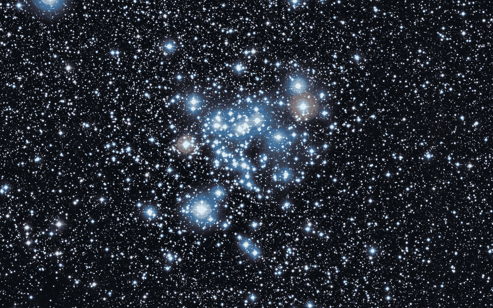

# 聚类算法

> 原文：<https://medium.datadriveninvestor.com/clustering-algorithms-e8b527972fd9?source=collection_archive---------9----------------------->

Star Clusters

顾名思义，集群是形成群体的别名。现在，这些组包含可能彼此相似的元素，这就是它们被称为组或簇的原因。我举个例子来灌输这个漂亮的机器学习算法的灵感。

想想大学的第一天，你遇到了对你来说完全陌生的人。你开始与少数人随意交谈，或者由于特定的情况，但很快你就会探索每个人的兴趣，并与那些与你志同道合的人组成一个小组或集群。这个愚蠢的小例子最终成为了奇妙的机器学习算法。

就像人的情况一样，在机器学习中，我们有数据。现在我们的任务是将相似的数据组合在一起。这是一种**无监督**机器学习技术，在没有任何类别标签的情况下，我们根据其特征将相似的数据分组在一起。最初，数据可能会随机分组，但当我们的算法终止时，我们会将相似的数据分组在一起。

聚类可以大致分为两种类型→

*   等级聚类
*   分割聚类

虽然层次聚类包括将较小的聚类合并成较大的聚类或将较小的聚类组合成较大的聚类的过程，但是分区聚类包括在开始时将分区划分成给定数量的聚类。

## 怎么做集群？

[https://cdn-images-1.medium.com/max/1600/1*fG8u8nV7qR91wDyFDEEV-g.png](https://cdn-images-1.medium.com/max/1600/1*fG8u8nV7qR91wDyFDEEV-g.png)

有各种方法来形成从不同的数学角度进行分组的聚类。几种方式包括:

## 1)基于质心的聚类:

在这种技术中，我们基于聚类的质心来比较聚类。我们可以计算一个聚类的质心和我们的数据点之间的曼哈顿或欧几里德距离来对它们进行分组。

使用这种技术的一种算法是 **KMeans** 聚类算法。这里的“K”表示我们想要形成的簇的数量。它属于分区聚类的范畴。

## 2)基于中值的聚类:

这里，我们不使用聚类的质心，而是使用中位数来比较数据点并将它们分组在一起。

使用这种技术的一种算法是 **KMediods** 聚类算法。甚至这里的“K”也是我们想要形成的簇的数量。它也属于分区聚类的范畴。

## 3)基于密度的聚类:

在这个聚类模型中，我们在数据空间中搜索数据点密度不同的区域。它根据数据空间中存在的不同密度隔离不同的密度区域。

使用这种技术的一种算法是基于密度的噪声应用空间聚类(DBSCAN)。这属于层次聚类的范畴。

希望这有助于您了解聚类算法及其类型。如有任何评论或建议，请发邮件至 *ratikpuri1998* @gmail.com 联系我。祝您愉快！

#机器学习#互联网