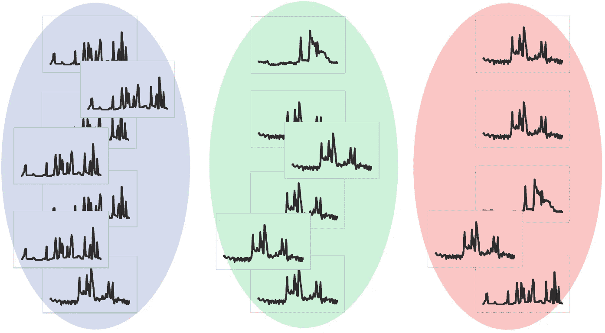
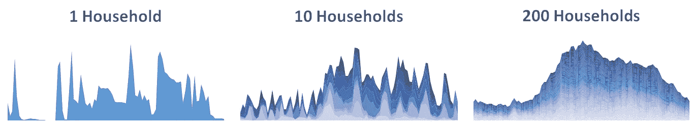
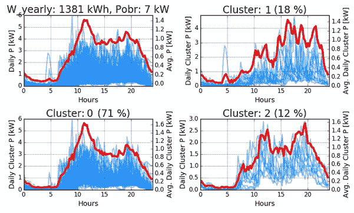
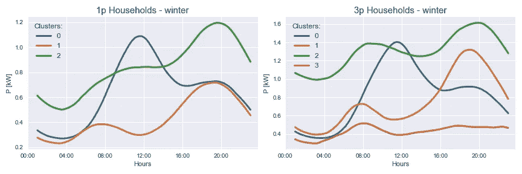
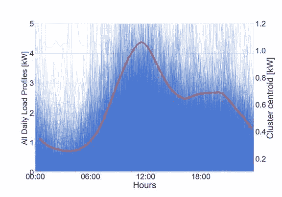
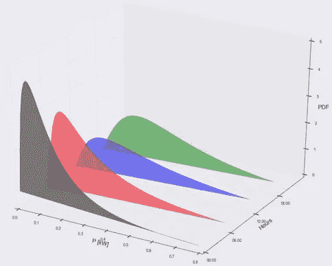

# 来自智能电表的聚类能源数据

> 原文：<https://medium.datadriveninvestor.com/clustering-energy-data-from-smart-meters-41e5b17f1480?source=collection_archive---------6----------------------->

The image represents clustering (grouping) daily load profiles in three groups.

所以你对智能电表数据分析感兴趣？你可以做的一个基本分析是利用需求时间序列聚类进行消费者细分。这可进一步用于电网规划、需求响应或能效计划中的消费者详细目标、执行概率负荷流分析等。

# 什么是集群？

聚类是一种无监督的机器学习技术，能够将相似的观察结果分组(聚类)在一起。

> 主要目标是将相似的观察结果分组在一起，以便更容易地查看数据。

# 数据准备

首先，让我们试着理解我们正在处理的数据。在进一步的分析中，我们将使用一年的智能计量数据，分辨率为 15 分钟，大约。20000 消费者。

## 家庭的日常行为是怎样的？

> 起初，似乎个别 LV 消费者的日常行为是随机的。

通过在变电站一级或网络中的某个其他更高级别分析多个用户，可以识别典型的日负荷曲线的形状。下图显示了一个家庭的日负荷曲线，随后是 10 个和 200 个家庭的日负荷曲线。我们可以看到，通过添加载荷剖面，形状变得更加平滑。

Averaging a different number of daily profiles.

因为我们想要检查单个消费者群体的习惯，所以我们只需要结合他们的负载曲线。例如，我们可能希望仅合并某一特定类型的单相住户的每日负荷概况。

## 输入数据的划分

消费者被分为两组:一期和三期家庭。由于负荷高度依赖于温度，负荷曲线进一步根据三个季节划分:冬季、跨季节和夏季。所以，最后这给我们提供了 6 个矩阵(3 季 2 类消费者)。必须对每个矩阵分别执行聚类。

## 我们如何执行聚类？

我们使用了众所周知的 k-means 算法，但是做了一个修改。在流行的机器学习库中可访问的典型 k-means 实现使用欧几里德距离作为观察值之间的距离度量。但这不适用于时间序列聚类，因此我们使用动态时间弯曲距离度量。

例如，想象一个 15 分钟分辨率的随机每日负载曲线，如上图左侧子图所示。如果我们想要将大量的每日负载分布图分组到几个组中，我们必须允许对时间间隔相近的负载分布图进行分组。这似乎是合理的，因为如果一个每日负载概要文件具有晚高峰，例如，比另一个晚 15 分钟，这仍然表示类似的行为。这就是动态时间扭曲发生的地方。关于为什么动态时间弯曲是时间序列数据的合适距离度量的一个很好的解释可在[这里](http://alexminnaar.com/time-series-classification-and-clustering-with-python.html)找到。数学解释见[这篇论文](http://www.cs.ucr.edu/~eamonn/KAIS_2004_warping.pdf)。

## 输入矩阵(特征)是什么样子的？

由于我们有 15 分钟的分辨率数据，每 15 分钟的时间间隔代表一个要素，因此有 96 个要素(因为每天有 96 次测量)。

## 在我们的例子中，观察值(行)是什么？

所有选定用户的每日负载概况。例如，对于冬季期间的一阶段家庭:如果我们有 100 个冬季日和 10，000 个一阶段家庭，这为我们提供了 1，000，000 行。因此，输入矩阵的形状为 96 x 1.000.000。

# 聚类结果

> 聚类结果为每个每日负载配置文件提供了相应聚类的标签。

下图显示了一个家庭的调查结果。左上角显示了冬季期间所选用户的所有日常负载曲线，平均负载曲线绘制在辅助 y 轴上。其他子图显示了对应于每个聚类的曲线。该消费者主要根据聚类 0(大约 70 %的情况)，因此左上角的平均冬季廓线与左下角的非常相似。

Clustering results for one consumer.

在分别计算 1 相和 3 相家庭的最终聚类质心后，我们可以绘制结果。下图显示了结果。聚类数是手动确定的。如果我们看一下图左侧的 1 阶段家庭的结果，我们会看到蓝色聚类质心可能代表老年人的行为，他们在中午吃午饭时最活跃。橙色代表的是典型的 8 小时工作制的人的行为。当他们醒来时，需求增加，然后在一天中减少，最后在下午回家时增加。最后一个用绿色标绘的可能代表学生(不工作的人)的行为，他们的活动在一天中进行。图右侧的三阶段家庭的聚类质心非常相似，但具有更多全天波动较小的轮廓，这可能是因为在某些情况下，小商业消费者或小农场被注册为三阶段家庭。

Cluster centroids for 1-phase & 3-phase households.

如果我们看一下集群 0 中的所有每日负载情况，我们会看到下图。在这里，我用细而透明的线绘制了所有的轮廓，以便看到典型行为的轮廓。

All daily load profiles in cluster 0.

## 还想看更多酷炫的剧情吗？

假设你喜欢很酷的数据可视化，看看下面另一个很棒的图表。计算集群后，可以检查每个集群的负荷概率密度函数(pdf ),以便在进一步的概率负荷流分析中使用。在这里，您可以看到冬季 1 阶段家庭的结果——聚类 0。x 轴代表以千瓦为单位的负荷，y 轴代表一天中的小时数，z 轴代表负荷概率密度。如果你看一下午夜的黑色 PDF，可以看到在零附近有更大的负载概率，因为人们在睡觉。红色 PDF 表示早上 6 点的负荷，可以看到，由于人们开始醒来，负荷变得更高。蓝色和绿色代表 12:00 和 18:00 的 pdf。

Load probability density functions for 1-phase households — cluster 0.

# 结论

使用分组(聚类)的机器学习方法，可以从大量输入数据中确定典型的日负荷分布。这允许区分不同类型的家庭和其他消费者。

对智能电表计量数据的分析有助于更好地了解消费者行为。这些结果可进一步用于各种分析。

对于执行时间序列聚类，您有什么建议或任何其他希望添加的意见吗？请在下面留下评论。

> 如果你对这个话题感兴趣，你也可以加入 LinkedIn 的一个名为智能电网中的人工智能的小组。

关于时间序列聚类的更多细节，你可以看我的两篇使用聚类的论文:

[M. Grabner 等人，斯洛文尼亚配电网空间负荷预测的改进模型，在格拉斯哥 CIRED 上发表，2017 年。](https://ieeexplore.ieee.org/stamp/stamp.jsp?arnumber=8315571)

米（meter 的缩写））Grabner 等人，“需求侧管理的统计负荷时间序列分析”(将于 2018 年在 IEEE ISGT 会议上发表)。