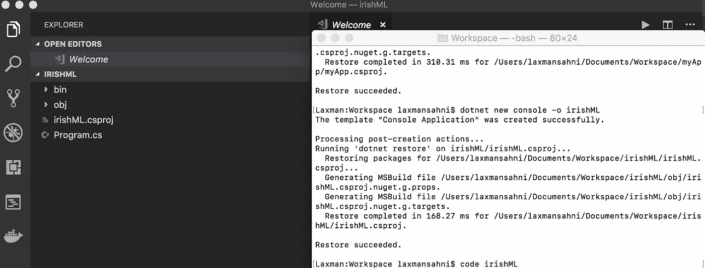
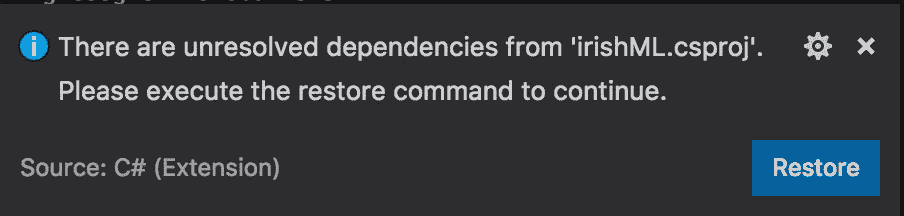
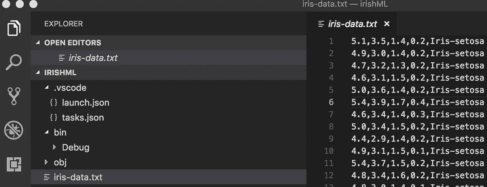
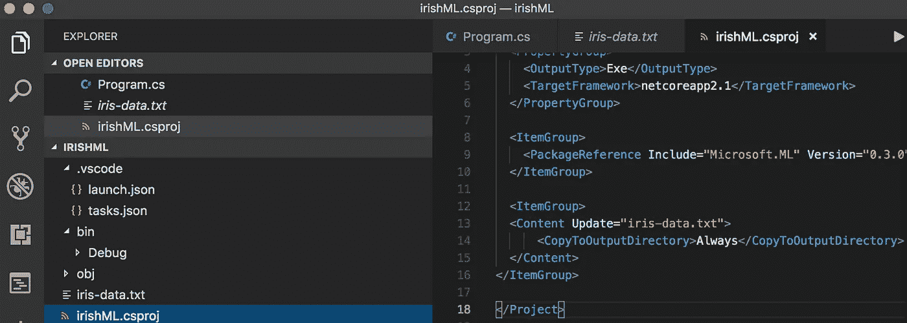
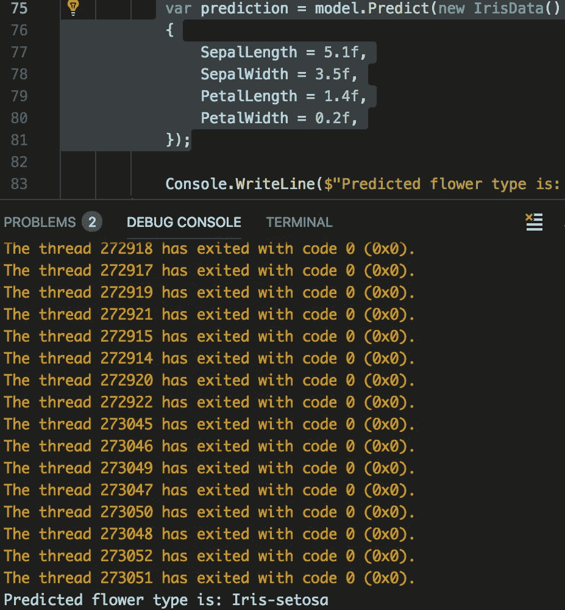

# VS 代码中用人工智能聚类鸢尾花

> 原文：<https://medium.datadriveninvestor.com/clustering-iris-flower-with-ai-in-vs-code-d1bf6d88ed6f?source=collection_archive---------3----------------------->

在本教程中，你将看到如何使用[ML.NET](https://www.microsoft.com/net/learn/apps/machine-learning-and-ai/ml-dotnet)将鸢尾花聚类成不同的组，对应不同类型的鸢尾。

# 系统需求

要安装和运行 meet，您的开发环境必须满足以下最低要求:

*   **操作系统** : macOS (64 位)
*   **磁盘空间** : 1.17 GB(不包括 IDE/tools 的磁盘空间)。

# 先决条件

## Visual Studio 代码 1.2x

从[code.visualstudio.com](https://code.visualstudio.com)安装 VS 代码

# 安装人工智能扩展

对 VS 代码的 AI 支持是由一个扩展提供的。要安装 AI 扩展，按⇧⌘X 打开扩展视图，搜索`AI`过滤结果。选择微软 [AI](https://marketplace.visualstudio.com/items?itemName=ms-toolsai.vscode-ai) 扩展。


AI extension

# 创建项目

首先，在机器上您希望项目所在的位置创建一个文件夹。我将把我的放在~/Documents/Workspace 文件夹中。

从终端运行以下命令:

```
dotnet new console -o irishML
code irishML
```

`dotnet`命令为您创建一个`console`类型的`new`应用程序。`-o`参数创建一个名为`irishML`的目录来存储您的应用程序，并用所需的文件填充它。

在 Visual Studio 代码(VS 代码)中打开`irishML`文件夹。



`irishML` *workspace in VS Code*

对于警告消息“在'`irishML`'中缺少构建和调试所需的资产”，选择是。加他们？”


Warning pop-up to add required assets to build and debug

**安装 ML.NET 包**

要使用 ML.NET，你需要安装微软。ML 包。从集成终端运行以下命令:

```
dotnet add package Microsoft.ML
```

选择恢复到警告消息“存在来自'`irishML.csproj`'的未解决的相关性”。请执行 restore 命令继续。



Warning pop-up to restore

# 下载数据集

你的机器学习应用程序将根据四个特征预测鸢尾花的类型(setosa、versicolor 或 virginica):花瓣长度、花瓣宽度、萼片长度和以厘米为单位的萼片宽度。

***Iris* flower 数据集**是英国[统计学家](https://en.wikipedia.org/wiki/Statistician)和[生物学家](https://en.wikipedia.org/wiki/Biologist) [罗纳德·费雪](https://en.wikipedia.org/wiki/Ronald_Fisher)在他 1936 年的论文*中介绍的[多元](https://en.wikipedia.org/wiki/Multivariate_statistics) [数据集](https://en.wikipedia.org/wiki/Data_set)作为[线性判别分析](https://en.wikipedia.org/wiki/Linear_discriminant_analysis)的一个例子。**数据集**包含 3 个类，每个类 50 个实例，其中每个类涉及一种类型的 **iris** 植物。一个类与另一个类是线性可分的；后者彼此不是线性可分的。*

打开 [UCI 机器学习库:虹膜数据集](https://archive.ics.uci.edu/ml/machine-learning-databases/iris/iris.data)，将数据复制粘贴到 VS 代码的新文件中，在`irishML`目录下另存为`iris-data.txt`。

当你粘贴数据时，它看起来像下面这样。每行代表一种不同的鸢尾花样品。从左到右，这些列代表:萼片长度、萼片宽度、花瓣长度、花瓣宽度和鸢尾花的类型。

```
5.1,3.5,1.4,0.2,Iris-setosa
4.9,3.0,1.4,0.2,Iris-setosa
4.7,3.2,1.3,0.2,Iris-setosa
...
```



`iris-data.txt` in the `irishML` workspace

# 配置`iris-data.txt`？

您需要将`iris-data.txt`配置为复制到输出目录。打开`irishML.csproj`并添加

```
<ItemGroup><Content Update="iris-data.txt"><CopyToOutputDirectory>Always</CopyToOutputDirectory></Content></ItemGroup>
```



`irishML.csproj`

**写点代码**

打开`Program.cs`，用以下代码替换所有代码:

```
using Microsoft.ML;using Microsoft.ML.Data;using Microsoft.ML.Runtime.Api;using Microsoft.ML.Trainers;using Microsoft.ML.Transforms;using System;namespace irishML{class Program{// STEP 1: Define your data structures// IrisData is used to provide training data, and as// input for prediction operations// - First 4 properties are inputs/features used to predict the label// - Label is what you are predicting, and is only set when trainingpublic class IrisData{[Column("0")]
public float SepalLength;[Column("1")]
public float SepalWidth;[Column("2")]
public float PetalLength;[Column("3")]
public float PetalWidth;[Column("4")]
[ColumnName("Label")]
public string Label;}// IrisPrediction is the result returned from prediction operationspublic class IrisPrediction{[ColumnName("PredictedLabel")]public string PredictedLabels;}static void Main(string[] args){// STEP 2: Create a pipeline and load your datavar pipeline = new LearningPipeline();// If working in Visual Studio, make sure the 'Copy to Output Directory'// property of iris-data.txt is set to 'Copy always'string dataPath = "iris-data.txt";pipeline.Add(new TextLoader(dataPath).CreateFrom<IrisData>(separator: ','));// STEP 3: Transform your data// Assign numeric values to text in the "Label" column, because only// numbers can be processed during model trainingpipeline.Add(new Dictionarizer("Label"));// Puts all features into a vectorpipeline.Add(new ColumnConcatenator("Features", "SepalLength", "SepalWidth", "PetalLength", "PetalWidth"));// STEP 4: Add learner// Add a learning algorithm to the pipeline.// This is a classification scenario (What type of iris is this?)pipeline.Add(new StochasticDualCoordinateAscentClassifier());// Convert the Label back into original text (after converting to number in step 3)pipeline.Add(new PredictedLabelColumnOriginalValueConverter() { PredictedLabelColumn = "PredictedLabel" });// STEP 5: Train your model based on the data setvar model = pipeline.Train<IrisData, IrisPrediction>();// STEP 6: Use your model to make a prediction// You can change these numbers to test different predictionsvar prediction = model.Predict(new IrisData(){SepalLength = 3.3f,SepalWidth = 1.6f,PetalLength = 0.2f,PetalWidth = 5.1f,});Console.WriteLine($"Predicted flower type is: {prediction.PredictedLabels}");}}}
```

**运行你的应用**

1.  按`F5`进行调试
2.  最后一行输出是鸢尾花的预测类型。您可以更改传递给`Predict`函数的值，以查看基于不同测量的预测。


Predicted flower type

我改变了传递给`Predict`函数的值，看看它是否预测鸢尾花的类型是鸢尾花。

```
var prediction = model.Predict(new IrisData(){SepalLength = 5.1f,SepalWidth = 3.5f,PetalLength = 1.4f,PetalWidth = 0.2f,});
```

按`F5`进行调试。它预测鸢尾花是鸢尾。



Predicted flower type Iris-setosa

3.恭喜你，你已经用 ML 建立了你的第一个机器学习模型。网！

按`F9`将断点放在前面

```
pipeline.Add(new Dictionarizer("Label"));
```

查看`pipeline`是否已加载数据集。点击左侧导航&中的`Debug`面板，再次按下`F5`进行调试。您应该看到数据集被加载到`LearningPipeline`类的管道实例中。


Data set in pipeline

按下`F5`继续。

# 从这里去哪里？

您可以使用本教程底部的链接下载完整的项目。

[**下载材料**](https://github.com/laxmansahni/irishML)

*一如既往，我们非常感谢您的任何反馈，因此，请在这里随意发表评论，或者在*[*Twitter*](https://twitter.com/agavatar)*上发表评论，一如既往，*

