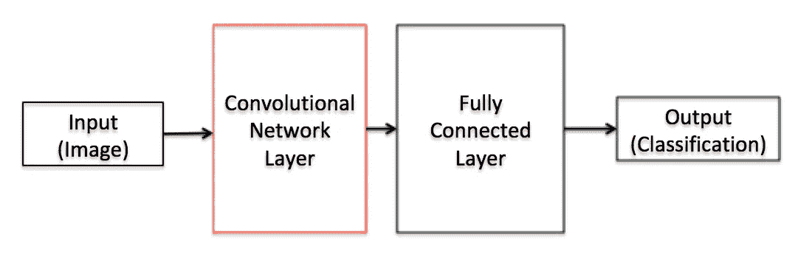
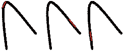
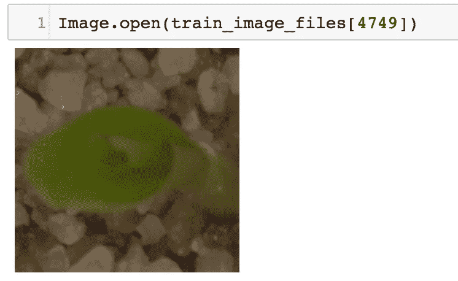
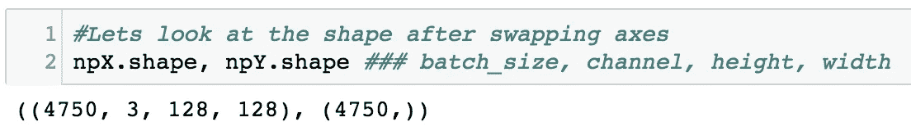

# 来自新手的新手 CNN

> 原文：<https://medium.datadriveninvestor.com/cnns-for-newbies-from-a-newbie-93457e34d536?source=collection_archive---------2----------------------->

在这篇博客中，我们将讨论什么是卷积神经网络？CNN 的历史和在 Kaggle 的[plant wells](https://www.kaggle.com/c/plant-seedlings-classification/data)数据集上的练习，以使用 CNN 识别植物物种类型。

# **卷积神经网络简介**

## **什么是卷积网络？**

> 卷积神经网络是一种使用专门的卷积层来提取特征的神经网络。众所周知，它们适用于具有空间位置的数据，如图像。

## **术语-**

**卷积** —在线[可以找到很多技术/数学定义](https://en.wikipedia.org/wiki/Convolution)。用几乎“外行”的术语来说，卷积可以解释为两个函数之间的重叠。在我们的例子中，我们将其描述为对具有较小滤波器矩阵的输入矩阵进行乘法运算，从而产生“卷积输出”,在 CNN 中，该卷积输出具有较少的参数，并且在每个卷积层之后，网络将学习新的东西。*参考* [*链接*](https://colah.github.io/posts/2014-07-Understanding-Convolutions/) *了解更多关于卷积的信息。*

**卷积神经网络(ConvNets 或 CNN)——**这是一种已知能很好地解决图像分类问题的神经网络。输入通过单个/多个卷积层，在这些卷积层中提取图像的大部分特征。然后通过完全连接的层进行分类。下一节提供了深入的解释。

**滤波器—** 一个 nxn 矩阵，我们在输入(图像)上滑动该矩阵以获得卷积输出。

**激活函数—** 这是一个在神经网络层的输出端引入的函数，用于映射 0 到 1 或-1 到 1 之间的结果值(取决于函数)。它的作用类似于阈值函数。最常用的激活函数是 ReLU。*更多信息请参考* [*链接*](https://towardsdatascience.com/activation-functions-neural-networks-1cbd9f8d91d6) *了解激活功能。*

**池化—** 通常在卷积层之间定期引入池化层。这基本上是为了减少一些参数并防止过度拟合。最常见的池类型是使用 MAX 运算的大小为(2，2)的池层。它选择感兴趣的 2×2 矩阵(滑动窗口)中的最大值，并在每次卷积后在整个图像中重复该过程。

**窗口大小—** 池中滑动窗口的大小称为窗口大小。

**跨距—** 合并后滑动窗口应该移动的单位数。

**多层感知机(MLP)——**这是深度学习的“你好世界”。它是一个具有输入层、输出层和多个隐含层的基本神经网络。在 CNN 中，卷积层的输出被发送到完全连接的层。

## **CNN 架构的历史**

*注意——将本节视为不同 CNN 架构的注意事项。我已经链接了实际的论文和有用的资源，您可以阅读它们来深入了解不同的架构。*

**1998 —** 严乐存介绍了一个新的神经网络架构家族——LeNet 家族。**[**LeNet 5**](http://yann.lecun.com/exdb/publis/pdf/lecun-98.pdf)因其广泛应用于数字识别和事实上的基线而成为流行的架构。它由 7 层组成。2 组交替卷积、汇集层和 3 个全连接层。它使用卷积(核大小为 5×5)来保持特征的空间方向、用于特征下采样的平均池以及双曲正切、s 形激活函数。**

****2012—**[**Alex net**](https://papers.nips.cc/paper/4824-imagenet-classification-with-deep-convolutional-neural-networks.pdf)赢得 ILSVRC 比赛。它有 5 个卷积网络和 3 个全连接层。它使用 11x11 内核，ReLU 激活函数，因此速度更快，因为 ReLU 的非饱和非线性行为。(目前我们广泛使用的 ReLU 函数最初是在 AlexNet 中引入的)。它是在两个 GPU 中训练的。并行化将一半的神经元放在一个 GPU 中，另一半放在另一个 GPU 中，两个 GPU 仅在一个点上相互对话。它使用重叠池。它使用步幅为 2 的 3×3 窗口，从而下采样特征并提高精度。*AlexNet 的一个穿越可以在这里* *找到* [*。*](https://medium.com/@smallfishbigsea/a-walk-through-of-alexnet-6cbd137a5637)**

****2013—**[**clari fai**](https://arxiv.org/pdf/1311.2901.pdf)赢得 ILSVRC 比赛。在第一层中，图像(224x224)与 96 个 7×7 核进行卷积。随后是 ReLU 激活，它不改变输出体积形状。下一个重叠最大池应用于 3×3 滑动窗口和步幅为 2。接下来应用对比度归一化。这产生了层 1 的输出体积。在第 2 层到第 5 层重复上述 4 个步骤。第 6 层和第 7 层是完全连接层。第 8 层是用于图像分类的输出 softmax 层。**

****2014—**[**VGGNet**](https://arxiv.org/pdf/1409.1556.pdf)**(视觉几何组网)是 ILSVRC 比赛的亚军。图像通过具有非常小内核大小(3x3)的卷积层的堆叠来发送。最大池(2x2 滑动窗口，步幅 2)是在一些卷积层之后完成的。所有卷积层和全连接层之后是 ReLU 激活函数。****

******2014—**[](https://arxiv.org/pdf/1312.4400.pdf)**[**NiN**](https://arxiv.org/abs/1312.4400)**(网络中的网络)**NUS 的架构，用微网(MLP)代替了像 VGGNets 一样叠加卷积层。这减少了网络应该学习的参数数量。它使用全局平均池(结构正则化)来避免过度拟合。这启发了许多新的建筑。**********

********2014—**[**GoogleNet**](https://www.cs.unc.edu/~wliu/papers/GoogLeNet.pdf)**赢得 ILSVRC 比赛。它是一个 22 层架构，但参数比 AlexNet 少 12 倍，性能更好。GoogleNet 的基本模块是初始模块。在昂贵的 3×3 和 5×5 卷积滤波器并行组合之前，它使用 1×1 卷积块(NiN)来减少特征数量，从而减少更深层的参数。这些较小卷积层的输出被连接并作为输出发送到下一层。这些初始模块堆叠在整个网络中。GoogleNet 的性能比 Clarifai 高 40%。********

********2015—**[**ResNet**](https://arxiv.org/pdf/1512.03385.pdf)微软赢得 ILSVRC 竞赛。它有 152 层。但为了避免消失梯度问题，ResNet 提出了“快捷连接”——跳过两层的想法，称为身份连接。在更深的网络中跳过几层不会影响性能。******

******2016—**[**Xception**](https://arxiv.org/pdf/1610.02357.pdf)by Google 分两步进行卷积。****

1.  ******深度方向卷积:**这决定了空间相关性——像素与相邻像素之间的关系。****
2.  ******逐点卷积:**这决定了跨通道相关性——不同通道上的点和特征量之间的关系。****

****将卷积分成两步减少了参数的数量，从而减少了计算时间。****

****例外是极端的开端。它使用一个 1x1 卷积来映射跨通道相关性，然后映射每个输出通道的空间相关性。它使用深度方向和点方向卷积后的 ReLU 激活函数，以及来自 ResNet 的快捷连接。****

*****这个* [*视频*](https://www.youtube.com/watch?v=Y2Tna77k1a) *深入解释了 CNN 的演进，涵盖了上面讨论的所有架构。*****

## ****它是如何工作的？****

********

****卷积神经网络(CNN)可以被认为具有两个主要组件。****

1.  ****卷积网络，其中输入经过一系列预处理步骤(过滤、激活、汇集)一次或多次——将网络的这一部分视为图像的特征提取器****
2.  ****全连接层，卷积网络的输出被发送到全连接层进行分类/回归。****

****让我们以识别图像中的动物是猫还是不是猫为例。****

********

****这是一个简单的图像分类问题。假设计算机将该图像视为 32×32×3 的像素值数组。这里的 3 代表 3 个通道(红、绿、蓝)，我们称之为图像的深度维度。****

****在 CNN 中，图像首先通过卷积层发送，在此图像被卷积。也就是说，输入特征图(图像)通过一个过滤器发送，该过滤器提取特征并产生卷积特征。滤镜通常是在图像中滑动的矩阵(从上到下和从左到右)。****

****假设我们的过滤器是一个 3x3x3 的数字矩阵。请注意，滤镜的深度与图像的深度(x3)相匹配。当滤镜从左上角滑动(一次向右移动 1 个单位)到右上角时，它会将像素值与滤镜值相乘。然后将所有乘法的结果(3x3x3 = 27) 27 个值相加，得到一个值。这个乘法和求和的过程是在整个图像上完成的(从左上角到右下角)。该步骤的输出或结果图像(30×30×1)被称为卷积输出或特征映射或激活映射。下面的 gif 可以帮助您理解滤镜如何在输入图像上移动。****

********

****[image source](https://developers.google.com/machine-learning/practica/image-classification/convolutional-neural-networks)****

****如果我们使用两个 3x3x3 过滤器，那么得到的激活图的体积将是 30×30×2。过滤器越多，就越好地保持了空间维度****

****现在我们知道了数学是如何工作的，让我们看看函数会发生什么。让我们假设第一个卷积层试图学习猫的耳朵。它必须学会不同的猫耳朵的边缘是怎样的。我们需要很多像这些/、\、|(不同角度)的边缘检测器来检测耳朵。我们使用的过滤器充当边缘检测器。****

********

****Edge detectors (filters) on ear****

****假设黑色曲线是猫的耳朵，橙色线是过滤器，恰好是边缘检测器(/，\，|..等等)找到了。当边缘检测器滤波器滑出输入时，只有在边缘与耳朵对齐的地方，才会有非零值(橙色)。我们需要一大堆边缘检测器(过滤器— /，\，|..等等)来检测耳朵。****

******去掉** —更多的过滤器有助于检测特征，更重要的是，每一层都在前一层的特征之上构建特征。****

******为什么 CNN 最适合图像分类？******

****CNN 通过尝试关联相邻像素来了解图像。彼此靠近的像素是相关的，例如组成耳朵的像素是相关的。通过发送许多猫的图像，它慢慢地学习猫的耳朵、眼睛的形状和一般结构。它学会区分眼睛和耳朵。当通过发送一张狗的图片来测试它时，它发现图片中狗的耳朵不像猫的耳朵****

******练习——播种******

****Kaggle 的植物幼苗分类数据集由属于 12 个不同物种的大约 4750 种植物的图像组成。我们的工作是建立一个网络，将测试图像映射到各自的物种。****

****这个练习的 jupyter 笔记本可以在[这里](https://github.com/ThePrecious/ml_projects/blob/master/2_Plant_Seedling_Classification/2_CNN_Plant_Seedling.ipynb)找到。****

******第一步:分析数据******

****导入所需的库，排列数据，打开几个图像文件，看看它看起来如何。****

********

****One of the image files****

****然后，我们试图通过查找图像文件的总数、物种数量、一些图像的形状来更好地了解数据。然后，我们遍历这些文件，并创建一个包含字段的数据框—文件路径、文件、物种 id(0–11)和物种。然后，我们将所有图像的大小调整为 128x128。****

****MXNet 期望输入维度按照以下顺序排列:批次大小、通道、高度、宽度。所以我们交换了轴，创建了一个只有图像的 numpy 数组 npX 和带标签的 npY。****

********

****Shape of npX , npY****

****我们使用 pickle 将这些数据保存到笔记本电脑中的一个文件中，以便将来可以从这个文件开始。****

****然后，我们使用 train_test_split 函数将数据分成训练集和验证集。****

******第二步:建立模型******

****首先，让我们构建具有 4 个卷积层的网络——分别具有 16、16、32、32 个内核大小为 3、激活函数为 ReLU、最大池窗口大小为 2、步长为 2 的过滤器。然后，我们展平最后一个卷积层的输出，并将其作为输入发送到完全连接的层。让我们从大小为 64 和 32 的两个完全连接的层开始，输出层为 12(物种数)。这是网络的样子——****

```
**Sequential(
  (0): Conv2D(None -> 16, kernel_size=(3, 3), stride=(1, 1))
  (1): MaxPool2D(size=(2, 2), stride=(2, 2), padding=(0, 0), ceil_mode=False)
  (2): Conv2D(None -> 16, kernel_size=(3, 3), stride=(1, 1))
  (3): MaxPool2D(size=(2, 2), stride=(2, 2), padding=(0, 0), ceil_mode=False)
  (4): Conv2D(None -> 32, kernel_size=(3, 3), stride=(1, 1))
  (5): MaxPool2D(size=(2, 2), stride=(2, 2), padding=(0, 0), ceil_mode=False)
  (6): Conv2D(None -> 32, kernel_size=(3, 3), stride=(1, 1))
  (7): MaxPool2D(size=(2, 2), stride=(2, 2), padding=(0, 0), ceil_mode=False)
  (8): Flatten
  (9): Dense(None -> 64, Activation(relu))
  (10): Dense(None -> 32, Activation(relu))
  (11): Dense(None -> 12, linear)
)**
```

******第三步:训练******

*****注—部分代码借用了* [*本教程*](https://github.com/aws-samples/aws-ml-vision-end2end/blob/master/Image_Classification/Image_Classification_Tutorial.ipynb) *。*****

****训练网络的四个步骤是:收集数据、通过网络发送数据(正向传递)、计算损耗和反向传播。****

****我尝试使用卷积层、全连接层、历元等的不同组合进行训练，我的测试准确率徘徊在 70%左右，这不是很好。所以，下一步要尝试的是—****

1.  ****每层有更多 CNN 过滤器****
2.  ****图像增强以创建更大的训练集****
3.  ****超参数优化****

## ****摘要****

****在这个博客中，我们了解了 CNN 是什么以及它们是如何工作的。我们在 kaggle 数据集上对植物幼苗进行分类，结果并不是很好。我们将在下一篇博客中尝试不同的方法来构建一个更好的模型。****