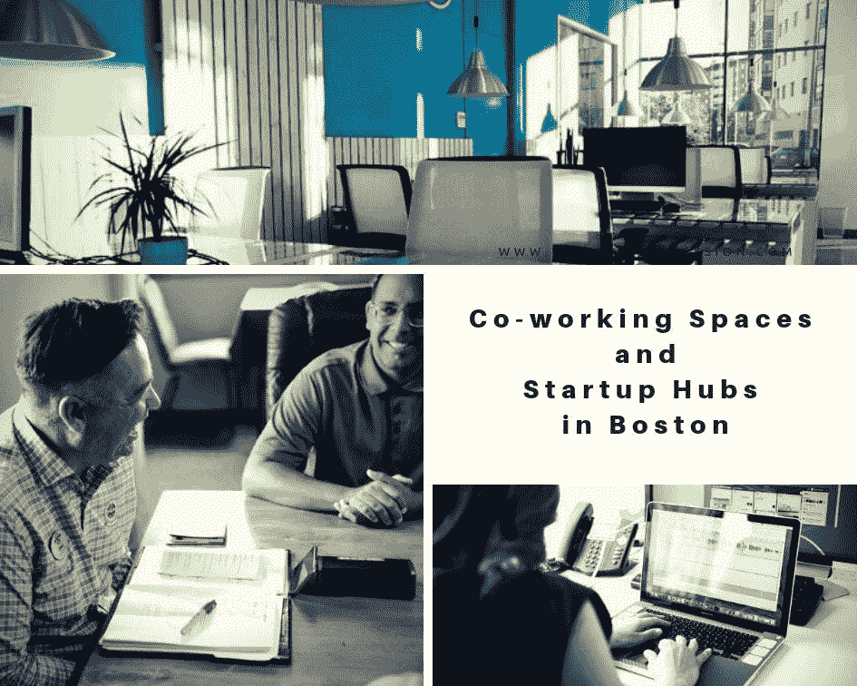

# 波士顿的合作空间和创业中心

> 原文：<https://medium.datadriveninvestor.com/co-working-spaces-and-startup-hubs-in-boston-64c1195ed1e1?source=collection_archive---------11----------------------->

一旦我克服了时差，我就开始在波士顿寻找一些舒适的共同工作空间，以及当地孵化器和加速器以不同方式培养和支持创业精神的地方。有很多不错的地方，你可以在咖啡馆或专门为远程专业人士、初创企业或自由职业者设计的合适空间工作。研究“工作的未来”领域、远程、分布式工作模式和共同工作空间是我热切关注的话题之一。

区厅是一个向企业家和公众开放的免费合作空间。你也可以接受一些专业的建议，和商业专家一起注册免费的办公时间。就在工作区旁边，你可以找到一家不错的咖啡馆/餐厅，你可以在那里买些食物来补充能量，继续工作。地区大厅是一个非营利的市民创新中心、公共工作区和活动场所，旨在激发创新、建设社区和实现您的想法。

 [## 动荡迫使暴风雨中的平静|数据驱动的投资者

### 自然界中很少有东西是直线行进的，尤其是经济。当投资者和消费者希望平静时…

www.datadriveninvestor.com](https://www.datadriveninvestor.com/2019/03/25/volatility-compels-calm-amid-the-storm/) 

另一个令人惊叹的社区是[中心](https://www.hubspot.com/startups?_ga=2.156781755.1029618777.1566070618-505672131.1565504180)。如果你想到一些商业项目并需要帮助，你可以申请他们的 HubSpot for Startups 项目。除了工作空间，你还可以注册免费课程&认证，更快地发展你的业务。

[Impact Hub Boston](https://impacthubboston.net/) 是我的最爱之一。我们在瑞士也有，我发誓，这是一个由志同道合的人组成的了不起的社区。他们为员工个人和团队提供空间。你可以与其他人合作，也可以在一个更私密的地方独自工作。Impact Hub 举办多项活动，会员资格包括会议室和访问全球中心网络。

剑桥创业咖啡馆是我一年前来波士顿参观时第一次去的地方。我从一开始就喜欢它:)他们在大波士顿地区的两个地方提供活动和会议空间——位于海港的地区大厅和位于杜德利广场的罗克斯伯里创新中心。他们将初创企业与投资者联系起来，组织推介活动和办公时间，这样你就可以在下班后顺道拜访，与其他企业家交流，或者寻求商业专家的一些建议。

联盟是一家专业的办公室和合作空间提供商。它有具有成本效益的兼职和全职办公桌可供出租，可单独用于自由职业者和团队，并与玻璃墙私人办公空间配合使用，用于闭门会议。

[CIC](https://cic.com/) (剑桥创新中心)提供高质量、灵活的办公和联合工作空间，以及库存社区厨房、无计量的会议室访问、企业级互联网服务、打印和复印、电话、高端家具、运营和技术支持、礼宾服务、津贴和健康服务等。他们也有许多社区活动、创业推介和相关的风险投资基金，这些基金乐于了解即将进入市场的新企业。

[The Wing](https://www.the-wing.com/spaces/boston/) 成立于 2016 年，在全国和全球范围内不断成长为一个女性社区，聚集在一起工作、联系和发展。这是专为女性设计的空间，所以如果你是男性，就跳过这一页，往下读；该部的使命是通过社区提高妇女的职业、公民、社会和经济地位。他们有一个珍贵的室内设计和城市中最好的位置，所以你想在世界之巅工作，有这么好的家具和许多社区活动在一周内发生。

[WeWork](https://www.wework.com/pl-PL/l/boston--MA?utm_campaign=1671322277&utm_term=63608772446&utm_content=341203112349&utm_source=ads-google&utm_medium=cpc&gclsrc=aw.ds&&gclid=CjwKCAjw7uPqBRBlEiwAYDsr14qaUSgjKqIVqS4QoIGGZ069Wc61X5FTINDtUutWTqbMTFUvvZcjmhoC2_8QAvD_BwE&gclsrc=aw.ds) 因为最近的 IPO 而非常出名:)的确，这是一个相当大的品牌，在全球各地都有办事处，然而，它们并没有太多的利润。他们主要提供工作空间，如集中办公和个性化总部。他们的优点也是惊人的室内设计和有利的位置，所以你不需要开车离家很远。

[Spaces](https://www.spacesworks.com/boston/newbury-street/?utm_source=yext_places_gmb&utm_medium=places&utm_campaign=yext_traffic&utm_content=4083) 是我在瑞士苏黎世认识的另一个品牌，我也喜欢这个社区。当我到达时，我很高兴看到他们在波士顿也有空间。后湾的位置使它们更具吸引力，价格也低于其他几个类似的空间。他们提供了一个独特的和创造性的工作环境

我之前并不认识 Oficio，但我发现这是一个非常好的提议。Oficio 位于市中心华丽的纽伯里街。会议室可以按天或按小时出租，会员资格可以包括开放的共同工作空间、专用桌子或私人办公室。有多种座位选择，咖啡，茶和小吃，还有一日票，这可以帮助学生在期中或期末考试前临时抱佛脚。每月的价格已经从 39 美元开始，这是非常方便灵活的产品。

[Make Shift Boston](https://makeshiftboston.org/) 是一个为具有社会意识的创意专业人士提供的合作空间。这个工作区是各行各业的艺术家、活动家和创意人士的家园，也是一个社区聚集区和展览空间。感兴趣的游客可以申请正式会员或轮班会员。

[Knotel](https://www.knotel.com/)-(pssst…刚刚获得 4 亿美元融资，估计达到 1B 估值，哈哈！)正在改变公司寻找、设计和建造办公空间的方式，同时提供运营灵活性，降低公司变化带来的风险。这是为个体公司设计的办公空间。他们只是找到位置，根据你的意愿布置空间，或者只是让你在现有的办公室工作。这里的客户满意度超越了通常所知的边界！

Rox Innov Center —这是一个非营利性的活动创新空间，通过鼓励和引导创新和创业来支持当地的经济发展。他们提供活动空间，旨在激发创造力，促进合作，让伟大的想法变成现实。你可以租一张桌子，一些更大的办公空间，一个商务聚会的会议区，或者只是一个大型活动的场地。

**对于那些喜欢不那么正式、更像咖啡馆风格的工作空间的人来说，以下是我的最爱:**

[Sip 咖啡馆](http://www.sipboston.com/)是公园里一家很棒的小咖啡馆，靠近邮局广场。这是一个可爱的地方，但不幸的是，周六和周日关闭。

思维杯在波士顿几乎没有分店，他们供应咖啡、有机茶和新鲜出炉的糕点。

三叉戟书店&咖啡馆 -如果你没有自己的想法，去这家咖啡馆，我相信你很快就会有灵感！咖啡馆里有一个很棒的书店，所以你可以四处走走，挑选一些有趣的读物。

[小川奈那咖啡](http://www.ogawacoffeeusa.com/)是为像我这样的抹茶迷准备的。真的是少数几个能买到质量好的地方，一杯仪式杯抹茶。

[波士顿图书馆](https://www.bostonathenaeum.org/)——如果你是个图书馆鉴赏家，这本书是给你的。波士顿图书馆就在风景优美的波士顿公共区旁边，只有会员才能进入，除非你愿意呆在一楼。我们建议支付订阅费，每月 16.67 美元加入，因为你将独家访问该国最古老和最著名的独立图书馆之一。周围的环境相当壮观，在大厅里，你会发现成千上万的珍本书籍和令人印象深刻的艺术收藏品。这里还有供在线学习的 Wi-Fi 连接，以及许多安静的角落，供你安静地工作。

波士顿公共图书馆总是个好主意。令人惊叹的建筑，完全安静，所有需要的材料触手可及。此外，有一个咖啡厅，可以在工作中吃点午餐，或者呆在那里进行更放松和非正式的工作活动。

**露天空间更多是为了阅读而不是工作:**
**:)**

查尔斯河海滨广场

克里斯托弗·哥伦布公园

波士顿公共花园

作为总结，这里为创新者和投资者收集了一些上述和更多的内容:[波士顿创新指南](https://bostoninnovationguide.com/)

最初发表于[www.InvestingInPassion.com](http://www.InvestingInPassion.com)