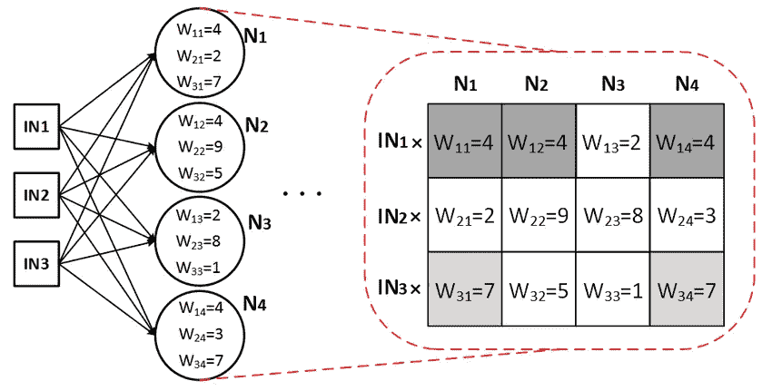
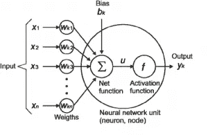
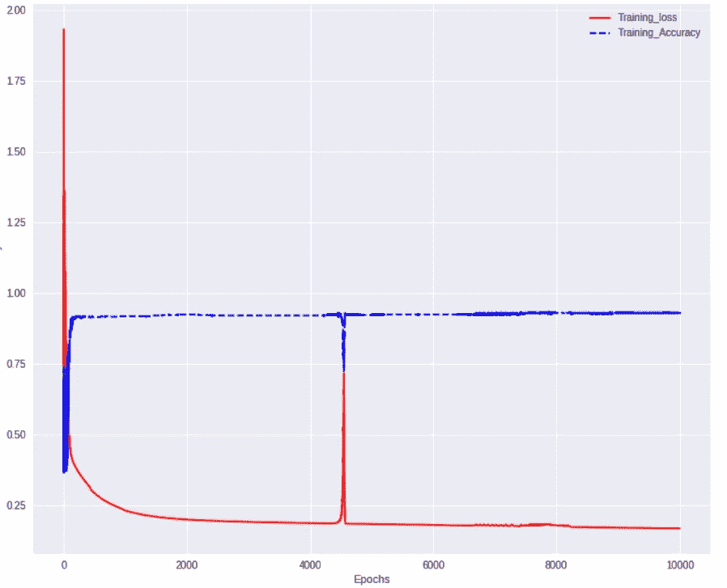
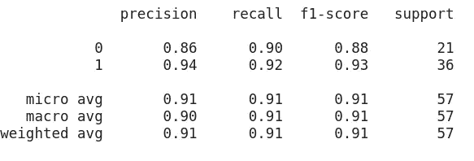

# 让我们从头开始编码一个深度神经网络！

> 原文：<https://medium.datadriveninvestor.com/code-a-deep-neural-net-from-scratch-in-python-5408680a57e0?source=collection_archive---------0----------------------->

[](http://www.track.datadriveninvestor.com/1B9E)

> 感受一下 pytorch、tensorflow 等优化框架的真正功能！这篇博文不是为了让你知道什么和为什么，而是关于**如何**！

## 动机


你看过钢铁侠吗？嗯，我还没有看完所有的漫威系列，但我在[钢铁侠的电弧反应堆](https://marvelcinematicuniverse.fandom.com/wiki/Arc_Reactor)中注意到一件事，首先他的电弧反应堆有钯核，这使他中毒…对吗？
所以他接下来做的是创造了一种新元素，这种元素没有毒害他，却让一切变得不同！

> 我只是想说，为了创造新的东西，我们应该知道如何从头开始创造。为此，我们需要知道引擎盖下发生了什么；)

深度学习是如此令人兴奋的领域。所以，我决定从头开始编写一个神经网络，并写了一篇博文，你现在正在阅读。最后，我会添加我最喜欢的关于深度学习的资源。

[](https://www.datadriveninvestor.com/2019/01/07/the-ultimate-learning-path-for-deep-learning-in-2019-more/) [## 2019 年深度学习的终极学习路径及更多...-数据驱动型投资者

### 又一个美好的一周，一些好的教育内容将会到来。我最喜欢的&最受欢迎的帖子之一…

www.datadriveninvestor.com](https://www.datadriveninvestor.com/2019/01/07/the-ultimate-learning-path-for-deep-learning-in-2019-more/) 

## 好吧，那我们开始吧

我们已经使用了使用 Keras、Pytorch、Tensorflow 等高级框架的神经网络，但是，了解事情如何在引擎盖下工作给了我们翅膀。这肯定会帮助我们理解事情是如何工作的，以便将来我们能够开发更多令人敬畏的网络/黑客。

在开始写代码之前，我会分享一些基本的东西，如果你只是想要代码，在这里[得到它](http://bit.ly/2UAz5zO)。

我会一步一步来，你不能在不牢固的基础上建造一座伟大的建筑。

我知道不是所有的人都想浏览整个博客，这就是为什么这个博客分成几个部分。想了解具体的事情吗？仅在目录中点击该部分

# 目录

*   [动机](https://medium.com/p/5408680a57e0#3b6b)
*   [初始化网络](https://medium.com/p/5408680a57e0#13cf)
*   [先决条件](https://medium.com/p/5408680a57e0#fc9c)
*   [正向传播](https://medium.com/p/5408680a57e0#2567)
*   [反向传播](https://medium.com/p/5408680a57e0#3afe)
*   [更新参数#Optimizer.step()](https://medium.com/p/5408680a57e0#7e73)


Neural Network Architecture | Source — Google

深度学习的魔力实际上是两步的妥协

*   **正向传播**
*   **反向传播**

用外行的话来说，我们首先向前传播，我们计算我们对结果有多不高兴(不高兴是损失)，然后我们向后移动，更新权重以便变得高兴！

# 初始化网络



The science behind weights | Source — Google

例如，在左边的图像中，我们在第一个隐藏层中有 4 个神经元。

在右边，我们有一个权重矩阵。它是通过将每个神经元乘以所有可用的输入(开始时的随机权重)而生成的，这就是矩阵中显示的内容。

在开始建造任何东西之前，首先，它的蓝图(架构)是准备好的。
**神经网络架构**包括以下内容:

所有层的输入维度、输出维度、激活函数。


Basic Neural Net Architecture | Source-Cs231n, Google

上面的架构有 3 点需要考虑

*   输入层、隐藏层、输出层。

这些**圆圈**在从隐藏层 1 开始的层中是堆叠在一起的神经元，你会发现它们无处不在，因为它让我们成为矢量化。

好的，在构建我们的层之前，我们需要这个架构，所以我们需要一个列表，其中有每一层的细节，例如，见下面的代码！

输入 Dim、输出 Dim、激活函数|知道这些术语吗？

是你在上面的神经网络图中看到的，你会在每个神经网络中找到所有这些术语。有很多方法可以为你的网创建结构，但我只是向你展示其中的一种。
以上要点讲的是:
**一层的输出输入到另一层，再次检查尺寸:)**

*   **输入维度:**输入向量的维度，即我们模型的输入向量的维度。
*   **输出维度**:网络最终输出层的维度，即预测类。

**激活功能**:用于引入非线性。非线性有助于我们的网络深入学习。有许多激活函数，但最常用的是 ReLU，Sigmoid，Tanh 等。

**现在我们已经有了架构，但接下来呢？让我给你看一个片段，它可能会让你想问更多的问题。**

下面是上面片段中发生的事情。嗯，我们正在为架构中的每一层初始化权重`w`和偏差`b`，并保存该值以便以后访问它们。
我们在向前传递和向后传递时将需要这些值，也用于更新参数。

但是为什么要随机加权呢？

```
# Weight Initialization
np.random.randn(output_dim, input_dim)*0.1
```

好吧，这是一笔交易

是的，我们已经初始化了随机权重，因为这打破了对称性，然后没有两个神经元执行相同的计算。这有助于我们的网络正确地学习，从而提高准确性。虽然准确性并不是每次都要考虑的问题

有许多初始化权重的方法，上面你看到的一种是**简单的方法**。为什么？
说到密集网络，如果我们像上面那样初始化了网络中的权重，我们的梯度会在反向传播时消失。于是就有了**天真！**
我只是让你思考和研究！有许多不同的方法来初始化权重，这将有助于更快更有效地学习我们的模型

*   Xavier 初始化
*   He-et-al 初始化

好了，我们已经初始化了权重，接下来是，

# 先决条件

在继续下一步之前，让我们先浏览一些基本术语。

**激活功能，非线性！**

激活函数对于神经网络学习和理解复杂模式非常重要。有许多类型的激活函数可用，目前最常用的激活函数是 ReLU。
我将把我最喜欢的关于激活函数的文章的链接添加到参考资料部分。

为了简单起见，在神经网络中，我们将使用 ReLU，最后是 sigmoid。因为我们将执行二元分类问题，所以 sigmoid 就足够了。

让我们先睹为快。

*   Sigmoid 无非是 1/(1+np.exp(-z))
*   ReLU 只是 max(0，z)

**神经元，节点！**


This is basically forward propagation

这些圆圈是**节点。**这些节点执行两种功能。让我们在一个节点内中断！



Sneak-peek Inside a node | source google

*   重量矩阵的 **w**
*   **X** 是输入向量(节点的输入)
*   **适马**正在求和
*   **f** 是激活功能

可以这样想，
我们试图在每个节点上构建的东西就像一个开关(像一个神经元……)，它根据是否应该让输入的信号通过来影响网络的最终决策而打开和关闭。

**最后，**

从上面你所学到的…

对于单层的每个节点，来自前一层的每个节点的输入与来自所有其他节点的输入重新组合。也就是说，输入根据它们的权重以不同的比例混合，这些权重不同地引入后续层的每个节点。一旦它们被求和，它们就被传递给非线性激活函数，以类似的方式，整个网络工作并给出我们的问题的结果，这在开始时是完全随机的。

上述过程一直持续到我们到达网络的末端，即输出层。

现在，这是代码

# 正向传播

*为了简单起见，我展示了一些片段，它们最终构成了我们的神经网络。* [*整个代码可以在这里找到*](https://github.com/aditya98ak/Deep-Neural-Net-Implementation-Scratch-and-PyTorch) *我们将缓存反向传播时需要的值。如果你不明白我们为什么要这么做，那就等着吧，你很快就会明白我们为什么要这么做了。*

因为前向传播在每一层都是相似的，所以有一个助手函数只执行`z = w.x + b`然后是`a = g(z) #g is activation function`
所以，有一个函数在所有层上循环，一个函数用于前向传播。注意，我们缓存的是值，稍后会用到。

这就是全部了，接下来是**损失函数！**

那么，什么是损失函数呢？我只是给你一个想法

损失函数可以让我们看到我们的模型有多好或多坏，我的模型的参数有多好或多坏。

损失函数有很多种，我们根据问题的性质选择适合我们的函数。

想了解更多损失函数及其类型？我在参考资料中添加了链接，请查看[。](https://towardsdatascience.com/common-loss-functions-in-machine-learning-46af0ffc4d23)

接下来，是**优化算法**

优化算法需要一个全新的博客帖子。查看参考资料最后，我为这个主题添加了一篇不错的博文。如果你想深入研究优化函数。这会是一个很好的复习。

我们将在我们的神经网络中使用 evergreen**Gradient Descent**，我也将从头开始更新其他算法的代码，在我的另一篇专注于优化算法的博客文章中。

我最喜欢的东西来了…

# 反向传播

让我告诉你，反向传播有点棘手，但乐趣在于理解它的过程。我从我了解到的地方添加一些资源。

**反向传播很美！**


A typical forward and backward pass | Source Google

我们举个例子，说一个与非门。只有当该门的输入为假(0)时，它才输出真(1)。因此，如果我们制作一个人工神经网络，为了实现这一功能，我们提供 0，0 作为输入，我们希望输出为 1，但假设我们的网络输出为 0(假)。我们将回溯并调整所有连接的权重，这样现在更有可能输出想要的结果。我们这样做，直到我们的损失降到最低。

因此，反向传播基本上是修改神经元之间的权重，以便下次我们获得输入时，它更有可能给出正确的结果。


Source Google

说够了，下面是反向传播代码片段

我们通过我们称之为**链规则来计算梯度。**

请注意参数，这些参数与损失函数 L.
相关，因此`dz = dL/dz; da=dL/da; dw=dL/dw; db=dL/db`您将在代码片段中找到 layer_id，它实际上是 layer_id，用于标识特定 layer_id 的参数。

这是反向传播的代码

不要消失你不喜欢它，让我让你明白你这里的每一行，我知道有很多事情正在发生。

像前向传播一样，有两个函数，一个是从背面循环所有层(因此得名反向传播),对于每个节点的参数，我们正在计算梯度，我们将使用梯度来更新参数。

实际的代码从第 17 行开始:
我们正在反向传播我们的 ANN。


This one my fav | Source Google

逐行分解

在第 20 行，我们正在计算`dL/da`，也就是说，我们正在计算相对于输出层的最终激活函数的梯度。

第 21 行:我们反向循环，因此得名**反向传播**

第 26–27 行:使用我们的缓存值，我们在正向传递中缓存这些值。
第 32 行:调用我们的反向函数

第 1–7 行:backward_activation_function，它基本上是`np.dot(da, dz)`，因此返回`dz`。
现在你需要知道一件事，`dz = da*da/dz`和`dL/dw = dw = dL/dz*dz/dw = dz*dz/dw`还有，`dz/dw = d(np.dot(w, a_prev)+b)/dw`这将返回`dw = dz*a_prev`，这是第 11 行中表示的内容。

类似地，在第 12 行，计算`db`。
我们也在寻找`da_prev`，它将成为下一次反向迭代的`da_curr`。

这样，我们非常聪明地为每一层存储了渐变。现在我们只需要更新参数！

就再来一段，我保证:)

# 更新参数#Optimizer.step()

我们已经积累了梯度，保存了参数，那么我们还在等什么呢？让我们更新参数。这是这里最简单的事情😜

注意，我们倾向于最小化损失，所以我们向梯度的相反方向移动，因此我们在梯度的相反方向上更新权重。注意更新代码中的减号。

```
def update(self, grads, learning_rate):
    for layer_id, layer in enumerate(self.architecture, 1):
      self.params['W'+str(layer_id)] -= learning_rate * grads['dw'+str(layer_id)]
      self.params['b'+str(layer_id)] -= learning_rate * grads['db'+str(layer_id)]
```

首先祝贺你的到来，到目前为止，我们已经从零开始制作了我们的神经网络，并且看到它的工作，我很快在 sklearn 的乳腺癌数据集上训练了一个分类器，尽管数据很少，但结果并不坏。虽然在这种情况下，我不会考虑准确性作为我的衡量标准！



Epochs vs Accuracy, Loss plot



Classification Report for Breast Cancer Dataset on our Numpy Model

我们的代码没有像这些深度学习框架那样优化，而且我只是在数据集上直接拟合神经网络，没有任何预处理，我们只使用梯度下降对它进行编码，我相信 Adam 或 SGD 优化算法中的次数越少，结果越好。


Source Google

同样可以用 Pytorch，Keras，Tensorflow 很容易的编码出来。我已经将 Pytorch 实现的代码包含在[同一笔记本](https://github.com/aditya98ak/Deep-Neural-Net-Implementation-Scratch-and-PyTorch/blob/master/Neural_Net_Scratch_and_PyTorch.ipynb)中。它可以在 Google Colab 上运行，玩代码，我们可以讨论什么架构会工作得很好。😏

## 资源

正如我所承诺的，这里有一些你会发现最有用的链接

*   对于反向传播，[我建议你看一下著名的 cs231n 课程](https://www.youtube.com/watch?v=i94OvYb6noo&t=739s)的视频
*   [激活功能及其类型](https://towardsdatascience.com/activation-functions-and-its-types-which-is-better-a9a5310cc8f)
*   [机器学习中的损失函数](https://towardsdatascience.com/common-loss-functions-in-machine-learning-46af0ffc4d23)
*   [优化功能的类型](https://towardsdatascience.com/types-of-optimization-algorithms-used-in-neural-networks-and-ways-to-optimize-gradient-95ae5d39529f)
*   [神经网络与深度学习书籍](http://neuralnetworksanddeeplearning.com/)

> 这个从头开始编写代码的练习花费了我大量的时间，我希望它对你也有用！我真的很高兴看到你的神经网络从零开始实现。
> 
> 感谢你读到这里，我也像你一样在学习，如果你有任何建议，请发邮件给我，或者在评论中告诉我。我会非常感激。

*在* [*Twitter 上关注我*](https://twitter.com/aditya98ak) *我发布了关于深度学习和我的实验的帖子👌*