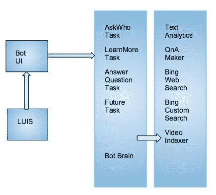

# 用 Azure 编写聊天机器人第二部分

> 原文：<https://medium.datadriveninvestor.com/coding-chatbots-in-azure-a-k-a-part-two-6e8368c0523f?source=collection_archive---------13----------------------->

在《数据驱动投资者》的前一集中，乖戾机器人的知识被分析和回应语音的关键功能的剖析所抹去。您可能已经观察到聊天机器人是在功能层中构建的，这些功能层协调对消息含义和意图的数据挖掘。你可能也注意到了你可以*“制作我自己的聊天机器人！”*拥有一个免费的[蔚蓝](https://azure.microsoft.com/en-us/free/search/?&OCID=AID719825_SEM_r7FTJy8w&lnkd=Google_Azure_Brand&gclid=CjwKCAjw5ZPcBRBkEiwA-avvk28TWksL7hO8ZzO9MRpFt5S5Z3m8wS_WU96utH0YAqhrjp2gsIDwoRoCS9IQAvD_BwE&dclid=CNuwqoOMkd0CFU3fwAodapwP6A)账号。微软提供了预建的人工智能，对话式人工智能和定制单位。

现在是用 Azure 编写聊天机器人的*大结局，也就是第二部分*或者一个比你的*更有趣的故事，“因为它涉及机器人”。*

在上一集中，确定了通过处理根对话的语言来掌握所有的语音分析。

{

" query ":"嘿，伙计"，" topScoringIntent":{

“意图”:“问候”，

【得分】:0.9886

}

该置信度得分函数由[算法](https://info.microsoft.com/rs/157-GQE-382/images/EN-US-CNTNT-eBook-AI-A-Developer%27s-Guide-to-Building-AI-Applications.pdf?mkt_tok=eyJpIjoiWW1ReE9HWXpaamN5TWpNMiIsInQiOiJRRWhSTjJseTJlTG5IemM5VG1yb3ZCdlY4WjVXN1MwS1FTU1NpRmxqSkNVVklJS1NYTHVTakZYeDhjWTA3dnZ1MlJyTHVpVHUxcWNRc2xHVVdycnFnV2IzXC82aVVockR3dWxFVUV6TFpUR09lV0pINGtOXC9FQnFqQnZPNG9lckRwZXVhajIzTUhMYk5QSk1hQ3dPNmRHZz09In0%3D)实现:

**public**Task start async(IDialogContext 上下文){

语境。wait(MessageReceivedAsync)；

**返回**任务。已完成的任务；}

**私有异步**任务 MessageReceivedAsync(IDialogContext 上下文，IAwaitable < **对象** >结果)

{

**试试**

{

**变量**活动= **等待**结果**为**活动；

**字符串**消息= WebUtility。HtmlDecode(活动。正文)；**如果** ( **串**)。IsNullOrEmpty(message)= =**true**

{ **回车**；

}

根对话置信度得分只是检索意图的第一步。第二步是在[路易斯](https://www.luis.ai/home)*系统内完成的。这个 LUIS 算法分析意图并将消息路由到相关的搜索算法。微软使用 Bing 来提取对话的许多深层含义。*

LUISResult luisResult = **等待**getentityfromlius(消息)；**字符串**意图=

意图是什么？。FirstOrDefault()？。意图？？**弦**。空的；**string**[]entities = Luis result . entities？。挑选

(e => e.entity)？。ToArray()？？**新字符串**[0】；

**如果** (intent == "greeting") {

**await**ProcessGreetingIntent(上下文，消息)；}

**else**if(intent = = " who "){

等待进程

(上下文、活动、BotTask。AskWho，message，entities)；
}

**else**if(intent = = " learn more "){

等待进程查询内容

(上下文、活动、BotTask。AskLearnMore，message，entities)；}

**其他的**

{

**等待**进程查询内容(

上下文，活动，
按钮任务。AskQuestion，message，entities)；

你应该知道 LUIS 是一个被动算法。它只有在顾客输入信息时才启用。然后，LUIS 内的上述根对话算法检查该消息的意图，并将其发送到机器人大脑。机器人大脑是使用一系列函数实现的。

Chatbot Architecture

LUIS 是一个后台算法。你仍然需要将用户界面连接到机器人大脑。随后的算法配置通道，但是您应该只需要为完全定制的聊天机器人修改它。Azure 提供了一个控制面板，只需点击几下就可以设置频道。以下设置适用于脸书信使。

**string**channelId = GetChannelId(activity)；

**if**(channelId = = " messenger "&&消息。StartsWith(活动。收件人姓名)= **真**

{
消息=
消息。子串(活动。收件人.姓名.长度)。trim()；

}

**else**if(channelId = = " messenger "&&

消息。开始于

(“@”+活动。收件人.姓名)= **真**

{
消息=
消息。子链

(活动。收件人.姓名.长度+ 1)。trim()；
}

以下代码处理机器人大脑中的查询。它独立于 LUIS 运行，并响应其意图。您可能会注意到，它是私下执行的，以排除访问该函数的无关问题。

**私有静态异步**

任务<**字符串** >进程查询内容(IDialogContext 上下文，

Activity activity，BotTask task，**字符串**查询，**字符串**【主题){

AskQuestionRequest request =**new**AskQuestionRequest(){

ConversationId =活动。对话。Id，

问题=查询，

SessionId = SessionId

话题=话题！= **null** ？话题。ToArray() : **新字符串** [0]，UserId = **字符串**。IsNullOrEmpty(activity。发件人.姓名)

== **假**？活动。来自。名称:活动。from . Id }；

AskQuestionResponse AskQuestionResponse =**等待**

HttpClientUtility。PostAsJsonAsync

(**新建**Uri(botbrainiurl+task。ToString())、RequestHeaders、request)；

(askQuestionResponse。结果？。Count() > 0 == **真**

{

IMessageActivity found msg = context。make message()；AskQuestionResult 结果= askQuestionResponse。结果[0]；**如果** ( **串**)。IsNullOrEmpty(结果。source)=**false**){ found msg。Text = **string** 。格式

(“明白了。您可能会发现这是一个有用的{0}:，结果。来源)；

}

**否则**

{
foundMsg。Text = "这是我找到的:"；
}

**等待**上下文。post async(foundMsg)；IMessageActivity cardMessage

**string**channelId = GetChannelId(activity)；**if**(channelId = = " kai zala ")

{

等待

GetKaizalaCardMessage(上下文、请求、结果)；
}

**else**if(channelId = = " directline " | | channelId = = " emulator "){

cardMessage =

GetAdaptiveCardMessage(上下文、请求、结果)；
}

**其他**

{
card message = GetHeroCardMessage(上下文，请求，结果)；

}

**等待**上下文。post async(card message)；

}

**else** if(任务！= BotTask。AskQuestion)

imessage activity not found msg = context。make message()；
notFoundMsg。“我好像找不到了。”

你能换一种方式问这个问题，然后再试一次吗？";**等待**上下文。post async(notFoundMsg)；

}

**返回**“成功”；}

您可能会注意到，这段代码使用相同的方法管理请求、流程和响应。在代码内部，ConversationID、Query、SessionID 和 UserID 操作管理用户和查询的身份。这些行为本身就是相互冲突的。需要一个额外的命令层来管理请求。函数 AskQuestionRequest 向大脑指定每个查询的细节，而 AskQuestionResponse 详细说明响应。这些都在数据契约中运行。下面演示的数据契约是机器人用户界面和机器人大脑之间的协议。它的工作是标记对话中交换的数据类型，并将其传输到正确的算法。在没有契约的情况下，每个查询都会继承一个唯一的 ID，导致混乱，就像你也不记得在和谁说话一样。

{

[数据合同]

这个契约被实现为一系列命令，这些命令被设计来检索用户特征并将细节推送到大脑。您可能会注意到细节是公开的，所有相关的功能都可以访问。所有的功能都被编码为检索 ID 并设置传输到大脑的数据。

**公共类 askquestrequest**{

*// <概要>*

*//会话标识符
//</摘要>*

[DataMember(Name = "sessionId")]

**公共字符串**session id {**get**；**设置**；} */// <汇总>*

*//会话标识符*

*//</概要>*

[数据成员(Name = "conversationId")]

**公共字符串**conversation id {**get**；**设置**；} */// <汇总>*

*//用户标识符*

*//</概要>/*

[DataMember(Name = "userId")]

**公共字符串**UserId {**get**；**设置**；} */// <概要>*

*//问题正文*

*/</概要>/*

[数据成员(Name = "question")]

**公共字符串**问题{ **获取**；**设置**；}

*// <总结>
//问题的主题*

*//</概要>*

[数据成员(Name = "topics")]

**公共字符串**【主题】{ **获取**；**设定**；} }

[数据合同]

**公共类 AskQuestionResponse**

{

*// <概要>*

*//响应的唯一 id///
*

[数据成员(Name = "id")]

**公共字符串**Id {**get**；**设定**；}

*// <汇总>*

*//响应的结果*

*//</概要>*

[数据成员(Name = "results")]

**公共** AskQuestionResult】结果{ **获取**；**设置**；} }

[数据合同]

**公共类 AskQuestionResult** {

*// <总结>
//成绩标题
//</总结>*

[数据成员(Name = "title")]

**公共字符串**标题{ **获取**；**设置**；}

*// <概要>*

*//结果的答案*

*//</概要>*

[数据成员(Name = "answer")]

**公串**答案{ **获取**；**设置**；} */// <概要>*

*//结果的图片 URL///</摘要>*

[数据成员(Name = "imageUrl")]

**公共字符串**ImageUrl {**get**；**设置**；} */// <概要>*

*//结果的来源*

*//</概要>*

[DataMember(Name = "source")]

**公共字符串**来源{ **获取**；**设置**；}

*// <概要>*

*//结果的 URL
//</摘要>*

[数据成员(Name = "url")]

**公共字符串**Url {**get**；**设置**；}

*// <概要>*

*//结果的 url 显示名称*

*//</概要>*

[data member(Name = " URL display Name ")]

**公共字符串**URL display name {**get**；**设定**；}

}

总之，这个故事比你的好，因为它涉及机器人。这也更好，因为它表明聊天机器人像人一样工作。但是机器人更胜一筹。他们的用户界面是虚拟的，可互换的。你的身体柔软，充满了血液，就像一个多肉的气球。然而，人类更好，因为他们变出了像黑魔法魔术师一样的机器人。我们柔软的大脑能够比路易斯更有效地整合语言的意图。我们也可以把机器人打得落花流水，因为我们的思维优于必应搜索，我们创造了它们，所以我们知道它们的弱点。

这也引发了重要的问题。

这个机器人是智能的还是 Bing？

添加功能好还是优化搜索功能好？

功能可以并行实现吗？