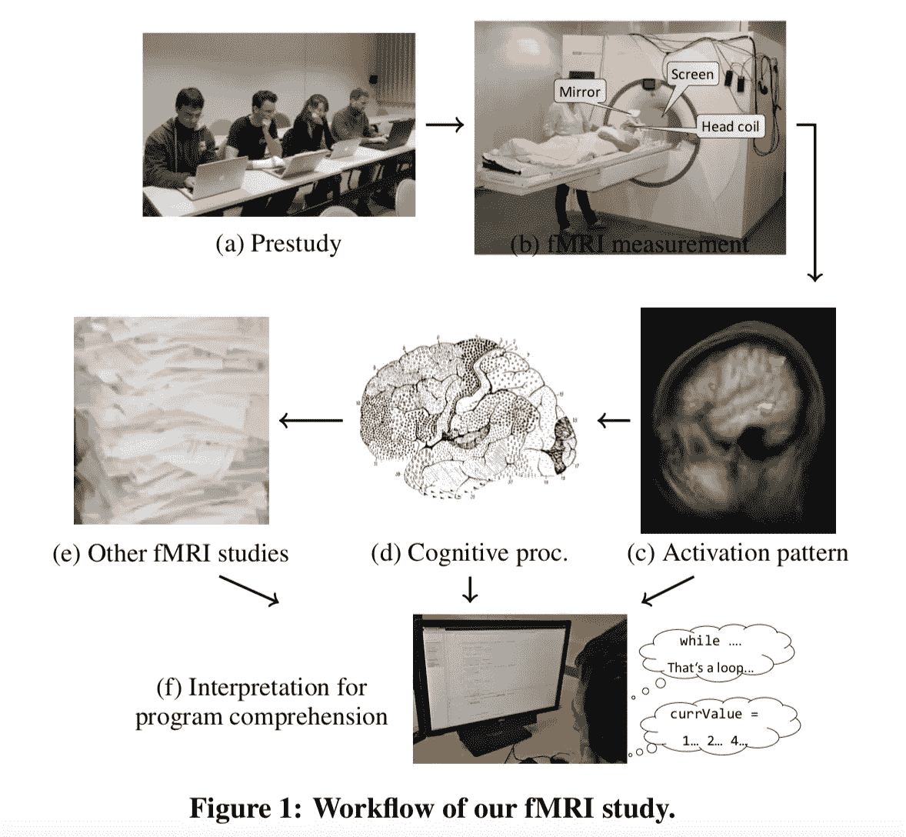

# 编码对你的大脑有益

> 原文：<https://medium.datadriveninvestor.com/coding-is-good-for-your-brain-e067063a493e?source=collection_archive---------3----------------------->

学习编码永远不会晚。听起来不可能，对吧？事实是，编码对你有好处，编程是一项你可以在任何年龄学习的技能。我有患痴呆症和阿尔茨海默氏症的家人和朋友。这里有一种可能的反击方式。而且很好玩！

让我们来看看科学。在 1991 年、1999 年、2005 年、2009 年、2012 年、2013 年和 2017 年进行的研究中，他们发现编码员平均发展了更高的认知技能，编码或其他智力刺激活动大大降低了阿尔茨海默氏症等退行性疾病的几率。

很少有认知活动比编程更需要大脑。编码可以改善你的大脑健康，防止神经退化。这非常有趣。

2014 年，科学家们想出了一个愚蠢的主意，在程序员分析代码块的同时，对他们进行 fMRI 扫描。

*这些大学进行了疯狂的研究。德国帕绍大学、美国卡内基梅隆大学、美国佐治亚理工学院、莱布尼茨研究所。德国马格德堡神经生物学，德国马格德堡大学 Metop 研究所*

这是他们基于大脑叶的发现:

*   **中额回**负责注意力、语言和记忆
*   **颞中回**为语义
*   **顶下小叶**用于记忆
*   **额下回**用于记忆
*   **额下回**负责语言和记忆
*   **大脑皮层的整个左半球**为逻辑

所以处理源代码需要用到大脑中与语言处理、记忆、注意力和逻辑相关的部分。

虽然大多数非程序员认为编码只是数学和逻辑，但它远不止于此。程序员的思维方式确实不同于其他人，但编码涉及注意力、语言、记忆、数学、逻辑和创造力。这应该足以让你的大脑保持忙碌和健康。

还是很好奇，我会推荐在 Youtube 上看程序员的 Ted 演讲。

这里有很重要的一点。使用的编程语言与编码人员的思维方式有很大关系。选择所谓的面向对象编程语言，如 Java、C++、Python 和 Swift。避免 Objective-C，旧的苹果语言。

著名的计算机科学家 Edsger Dijkstra 写道:

我们使用的工具对我们的思维习惯有着深远的影响，因此也影响着我们的思维能力

如果你有一台 Mac，最好学习的语言是 Swift。这种语言有一个“游乐场”,您可以在这里试验代码并立即看到结果。

Windows 上一个很好的学习环境是 Java 或 Javascript。

好了，回到最初的主题编码对大脑有好处。麻省理工学院进行的研究表明，编程有利于认知发展。所以从小开始是帮助你的孩子学会学习的好方法。

对于程序员来说，简化复杂问题的能力就像是对大脑的锻炼。编码的迷人之处在于，一旦你学会了一门语言，**就有可能只用你的大脑来编码。**什么？不，这是真的！程序员经常在慢跑、徒步旅行甚至骑自行车时编程。我不建议在下山、堵车或约会时这样做。

这里的要点是，当你编码，并且熟悉一种语言时；您将越来越少地需要参考编程手册或在线参考指南。这种离线编码对你的大脑非常有益。但是在你脑子里编程有什么好处呢？结果呢？

这就是记忆的来源。你离线解决严重的问题。你放松下来，变得有创造力。然后当你回到你的电脑前，你从内存中编写你的程序。这听起来有点疯狂，但是作家和其他有创造力的人理解这个概念。而且很好玩！

感觉到你的山地车在燃烧吗？重力是个婊子！好吧，开始编码，当你到达顶端时，你会忘记烧伤。你可能已经创造了下一个病毒应用。

这里有一篇关于学习编程的相当不错的中级文章。

[我想学编程](https://codeburst.io/i-want-to-learn-programming-but-i-dont-know-where-to-start-80dd2d55e1fd)

请记住，学习编码永远不会太年轻或太老。这对你的大脑有好处吗？