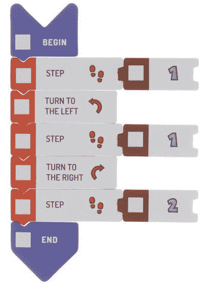
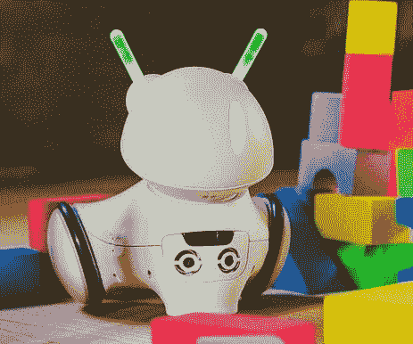
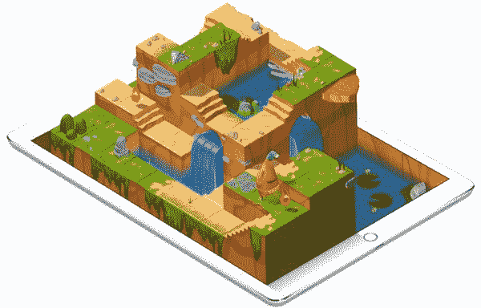

# 编码应该是你新的第二语言

> 原文：<https://medium.datadriveninvestor.com/coding-should-be-your-new-second-language-8dc381931ca?source=collection_archive---------27----------------------->

# 从 MIS 到 IT

起初，我们有“计算机”和操作它的 IT 专家。大型机是公司唯一的主要计算机，管理股票、财务、处理订单，有时还支持计划和预算。

自 20 世纪 60 年代以来，我们经历了管理信息系统，然后信息系统(80 年代和 90 年代)，我们最终到达了信息技术时代。

由于界面、个人计算机性能、各种用途的应用程序可用性、设备小型化、网络、共享资源和友好编程语言的发展，“IT”知识的全部秘密已经传递到人们手中。真正的民主。

这一进步意义重大，以至于有些人错误地将这一现象解释为 IT 专家不再承担不必要的负担。

# 独自打造你的工作空间

今天的创造力意味着系统用户在选择软件、选择模块和构建最能完成任务的解决方案时的独立性。只有实现目标才是最重要的。

即使你和技术没有太多的共同点，编程确实是一个很好的逻辑练习。如果你正在管理一个基于技术的领域，拥有基本的编程技能是绝对必要的。为什么？

当你看到一个问题时，你需要把它分解成可行的部分，然后着手处理。分解(在计算机科学中，也称为因子分解)使问题更容易构思、理解、解决和维护。分解是解决问题过程中的一个重要部分，它存在于我们生活的每个领域。

这种方法已经应用于动态规划(也称为动态优化)。一种解决复杂问题的方法，通过将复杂问题分解为一系列更简单的子问题，每个子问题只解决一次，然后存储它们的解。下一次出现同样的子问题时，不用重新计算它的解，只需查找先前计算的解。

当你开始学习编码或编程时，你加强了以一种非常结构化的格式工作的习惯。你不断地给你的大脑编程，把每个问题分解成原子，更好地理解主题。结构化的逻辑思维为更好的解决方案提供了动力。

# 21 世纪技能

技术现在已经从各个地方包围着我们，它的饱和将在不远的将来加剧。因此，我们获得的技能必须让我们为迎接未来的技术发展做好准备。

直到 21 世纪初，世界各地的教育系统都专注于培养学生积累内容和知识。技术和电信的最新发展使得信息和知识在 21 世纪无处不在且易于获取。因此，虽然识字和识数等技能仍然是相关和必要的，但它们已经不够了。为了在快速变化的数字社会中取得成功，人们需要掌握的 21 世纪技能包括信息素养、沟通与协作、分析推理和复杂问题解决。

编程课程至少教授和发展其中一些技能。因此，让孩子们获得与阅读和数数同等的技能是很重要的。有几种面向儿童的编程语言。一个有趣的命题是 Scootie Go！一个学习编码基础的神奇游戏。五颜六色的纸板块像拼图一样拼在一起。

孩子们学习以他们习惯的方式编码——而不是无形的、虚拟的计算机环境，他们通过像拼图一样排列纸色块来构建程序。更在[http://scottiego.com](http://scottiego.com/)

下一个鼓励孩子的好主意是光子机器人——一个娱乐和教学的机器人。机器人是一种儿童玩具，它教授逻辑思维、新技术、编程基础和快速决策。由心理学、游戏化和用户体验领域的专家设计。更在【http://meetphoton.com/ 

但孩子也可以为“大人”学习语言。琐碎的语言就像和一个孩子说咕咕嘎嘎的语言——一个孩子理解的比成人想象的要多。也许他们不会喜欢 Java，但苹果最近创造的语言被设计得足够平易近人，足以成为第一编程语言；斯威夫特。其最新版本 Swift Playgrounds 也可以在 iPad 上使用，承诺在友好的环境中提供大量编程乐趣。更在 https://developer.apple.com/swift/playgrounds/

# 少一点对话，多一点技巧

值得学习编程和编码。这些技能允许对情况进行适当的评估，并选择适合需求的解决方案。假设您需要 POS 系统中的一个选项来收集服务的客户评级；当客户按下笑脸或悲伤表情时。如果你没有起码的编程基础，你可能会拖着公司经历一个漫长而昂贵的选择新的 POS 系统的过程，最终失败。你真正需要的只是一个几百美元的剧本。

不了解技术基础，你就无法管理——顾问不会把你从错误的决策中拯救出来。例如，这避免了花费数百万美元购买主数据管理，而您真正需要的是一名临时签约的学生，具备基本的 SQL 知识来清理数据。