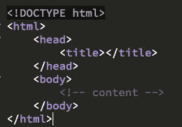
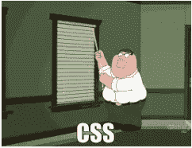
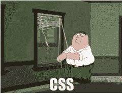

# 编码——这是怎么回事？

> 原文：<https://medium.datadriveninvestor.com/coding-whats-the-deal-with-that-6e6f295c5104?source=collection_archive---------12----------------------->

许多人到了晚年才开始编程，或者将编程作为第二(或第三，或第四)职业。但是从事编程职业是什么感觉，和其他职业相比如何？既然我已经了解了专业编码的世界，我就来分析一下成为专业编码的利与弊。

# **优点**

**学习**——离开工作的时候，知道一些你那天早上醒来时不知道的事情是很棒的。当你在月底看到你积累的所有知识在一个更大的项目中付诸行动时，那就更好了。

 [## 2019 年最值得学习的编码语言|数据驱动的投资者

### 在我读大学的那几年，我跳过了很多次夜游去学习 Java，希望有一天它能帮助我在…

www.datadriveninvestor.com](https://www.datadriveninvestor.com/2019/02/21/best-coding-languages-to-learn-in-2019/) 

**感觉你吞下了红色药丸**——一旦你发现制作它们的成分，你将永远不会再以同样的方式看待[https://www.angrybirds.com](https://www.angrybirds.com)(或任何其他网站)。这可能是一把双刃剑，尽管当你发现自己在想，“为什么他们不能添加 *XYZ 代码行*让这个网站稍微不那么烦人？”

**在火车上看起来像个天才**——人们看到这个:

他们认为你在做这个:

实际上你所做的是:

我知道这一点，因为不久前我也是这样的人之一。

# **缺点**

极度恐慌——也就是你不知道如何做某事的感觉，尽管这种感觉会被最终找到如何做这件事的喜悦所抵消。

**CSS 挫败感**——对于那些从未使用过 CSS 的人来说，这是指花了很长时间试图将一个元素调整一个像素，和/或当你最终这样做时，才意识到它已经弄乱了页面上的其他一切。斗争是真实的。甚至还有一个关于它的迷因:

互联网每天都在成长和发展，开发者们也在不断地创造新的、令人惊奇的东西供我们在网上使用。可悲的是，这些新的和令人惊讶的东西几乎从来没有得到 IE 的支持。这通常意味着你必须为一段只有 5 行代码的代码创建一个 50 行的变通方法，只是为了那些还在使用 IE 的人。为什么上帝，为什么？

# **比较起来怎么样？**

管理:管理和 web 开发的一个很大的区别是，如果你会使用 Excel，从事代码工作的人不会被打动。不过，你确实可以学到很多比 Excel 更令人兴奋的东西。

**ESL(英语作为第二语言)教学:**虽然你不会有幸见到如此广泛的来自不同背景的人，听到他们偶然(或故意)说的有趣的事情，编码比教学好的一面是，你不必总是站在人们面前，看起来很开心(除非你是一个开发者拥护者，我想)。尽管如此，你仍然消耗大致相同数量的咖啡。只是如果你能解释现在完成时，人们就不再有印象了。

**好客:**当我说‘好客’时，我指的是我在当地炸鱼薯条店工作的时间和我在学生会酒吧喝啤酒的时间。尽管时间对于 web 开发来说不那么不利于社交，但有时你确实会发现自己在凌晨四点编码(或者至少在思考)。但至少你没有与醉汉争论，或者如果你是，可能是时候将 LinkedIn 求职偏好改回“积极寻找”。也就是说，如果你能倒一品脱像样的吉尼斯黑啤酒，人们可能仍然会印象深刻(谁不是呢？).

总之，如果你喜欢不断学习和发展(和喝咖啡),并且当你不知道发生了什么时能够保持冷静，那么编码是非常棒的。这种氛围:

尽管抛开烧房不谈，编码确实提供了很多成长的机会和各种各样的工作日。所以，如果你想尝试一下，那就试试吧——这可能是一段令人惊叹的新旅程的开始。