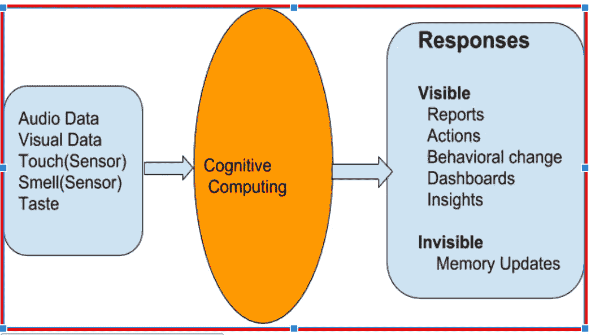

# 面向虚拟人的认知计算

> 原文：<https://medium.datadriveninvestor.com/cognitive-computing-for-dummies-f633fbbdf9e7?source=collection_archive---------13----------------------->

1.  **认知计算的定义**

认知计算是一种通过应用机器学习来解决人类问题的方法。认知计算的工作原理是 **i.** 学 **ii。**型号和**三。**生成假设

认知计算是一种解决问题的方法，它利用复杂的软件和硬件来创建自然认知过程的形式或功能。

**2。认知服务的广泛类别**

*   **计算机视觉**:检测和/或识别人脸、物体、标志、图案的应用，包括光学字符识别(OCR)。像人类一样理解图像是主要任务。对于智能视频监控，它用于查找通缉犯，检测一些模式，一些标志，一些面孔。

Facial Application offered by Amazon Rekognition Services ( Given the face image, the output is info/labels/text shown in the image). We have other companies as well to provide similar services. We can also develop it through python and deep learning framework

*   **语音**:基于深度学习识别说话人，然后将语音转换为文本，文本转换为语音的应用。音频音调分析也属于这一类。

For example : Cognitive Services can identify the speakers and extract contents, entities, intents and sentiment of each speaker JUST by using Audio Data.

*   **语言**:使用自然语言处理和理解对文本/标签/意图进行分类并提取实体以构建聊天机器人/对话的应用。语义概念提取、语言翻译、文档摘要、段落检索和排序、语气分析也属于这一类。

典型的机器学习:基于典型的机器学习应用，例如预测、分类、预测、聚类，用于增加和增强认知服务。

**3。认知服务的典型例子**

认知系统听到语音/声音并将其转换成文本，然后理解上下文、信息和极性。那么它就能以人类的方式做出反应。想象一个虚拟呼叫代理。

认知系统观察任何事物，预测/理解人和物体的存在/不存在，并识别/检测人脸。那么它可以正确地允许进入。想想智能大门和智能笔记本电脑。

认知系统消费文本并预测/说出上下文、实体、极性和意图。那么它就能正确/聪明地做出反应。例如:聊天机器人

认知系统可以感知室内和室外的温度，并相应地改变温度。然后它可以改变其他数字项目的状态。智能家居等

**接下来的文章将涵盖零售行业、供应链行业、BFSI 行业和医疗保健行业的认知计算应用**

这里也发表[。](https://www.navinmanaswi.com/2017/06/cognitive-services-what-is-it/)