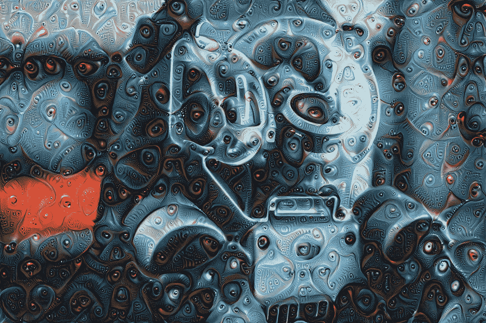
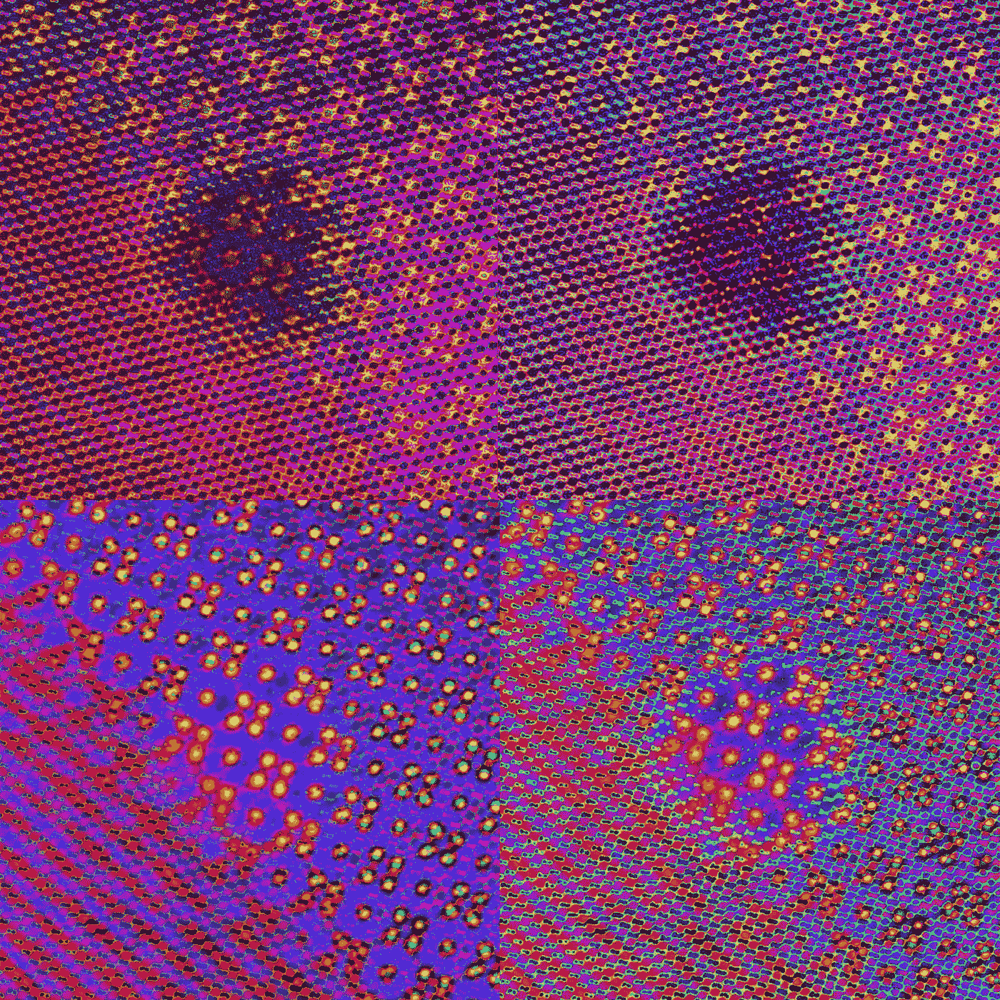
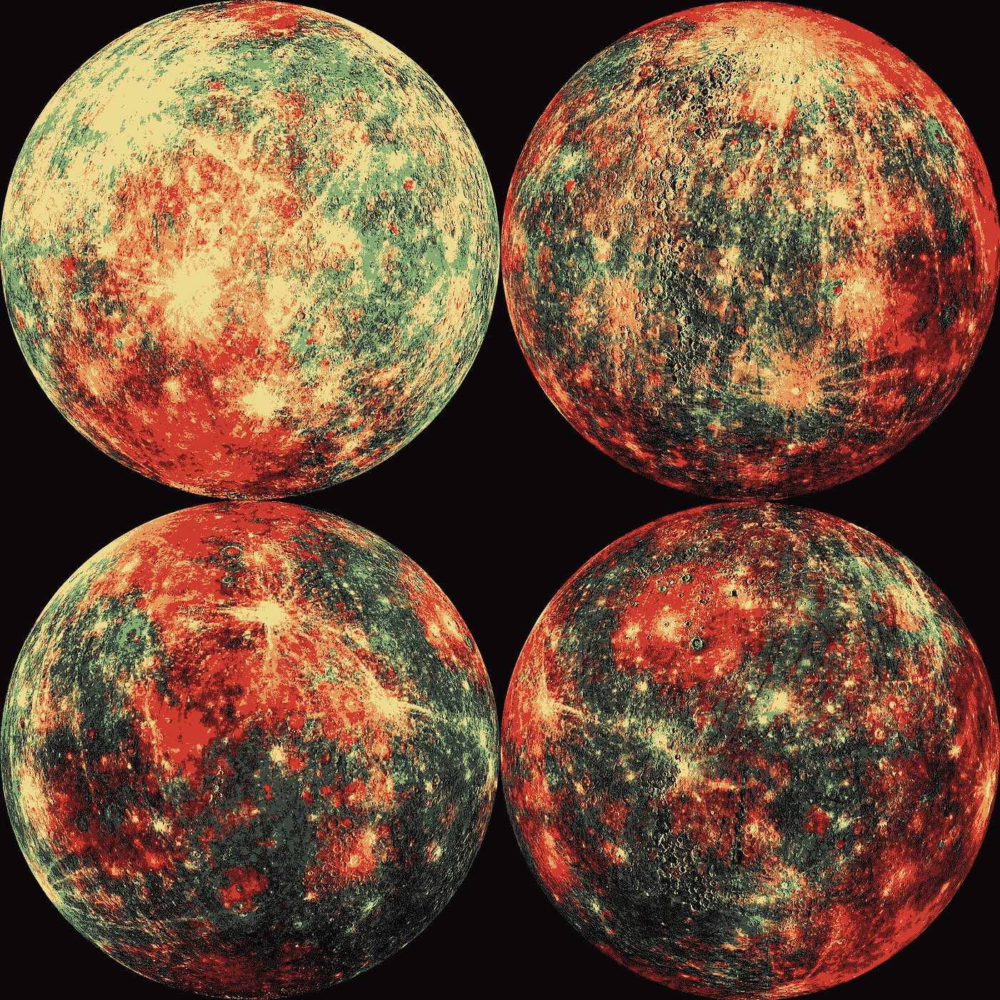
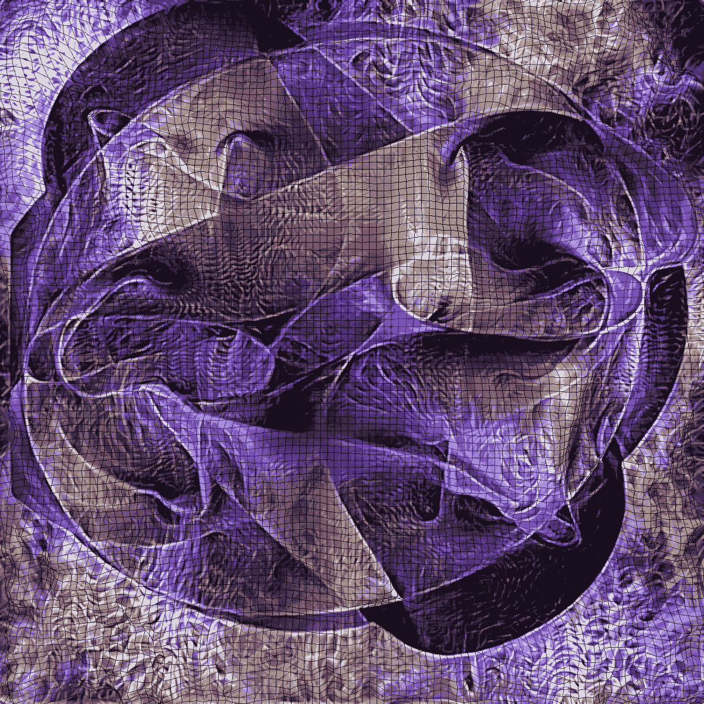
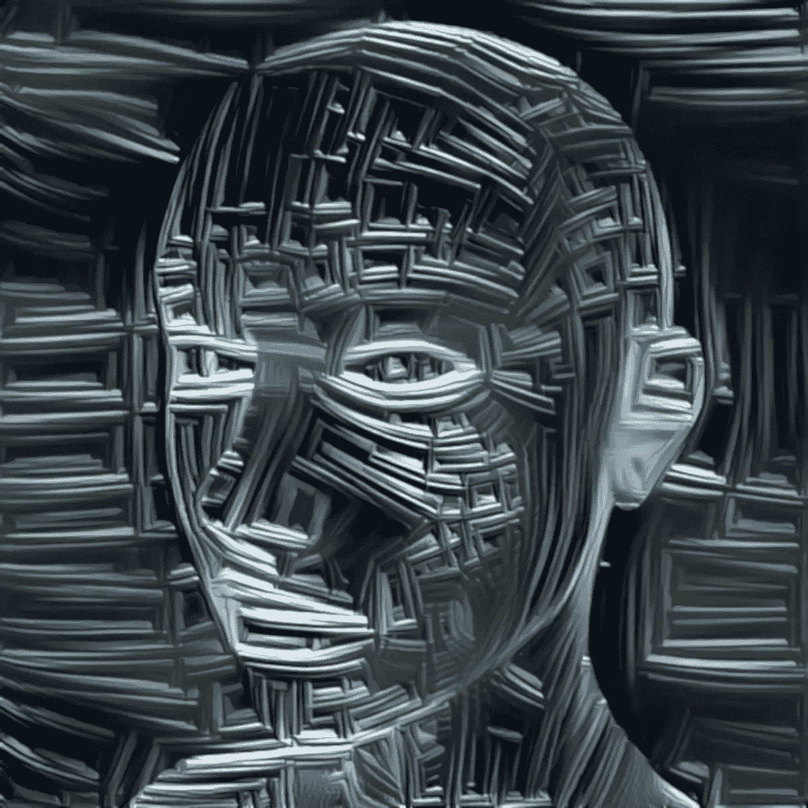
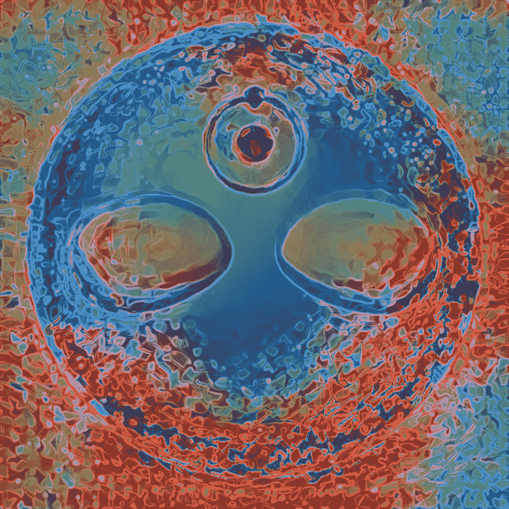
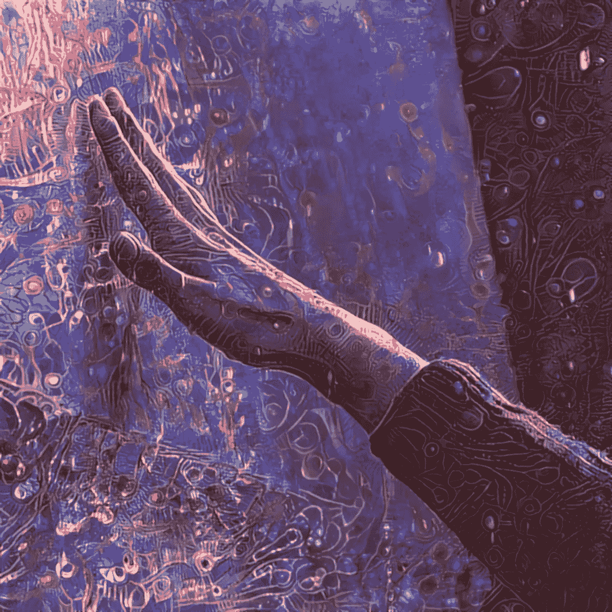
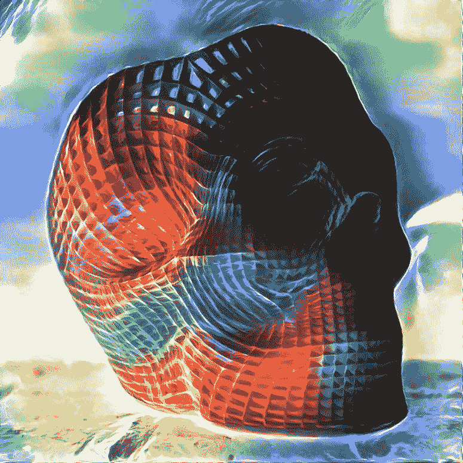

# 认知宇宙:一个人工智能支持的、跨维度启发的艺术系列

> 原文：<https://medium.datadriveninvestor.com/cogniverse-an-ai-enabled-interdimensionally-inspired-art-series-b0416eaaef61?source=collection_archive---------39----------------------->

**mvcdeep**, the Cogniverse series, all rights reserved

自 2002 年以来，我为名为 [nanotechno](https://photos.google.com/share/AF1QipMY-waGjEJgWIzIwNmNMk0GwVlcmOugZNWdwFUZ2PejSVXIULw_sPo4sOecPrak5w?key=Q1NRX0NqTTZDWnBOM3Ewc1lWWG9JZ080MXFCTmhn) 的系列制作了基于纳米技术的原创艺术品。在过去五年左右的时间里，[纳米宇宙](https://goo.gl/photos/g8kGpqrUJFbwTSX5A)系列探索了融合了纳米尺度和天文尺度的图像的交叉点。

事实上，我的早期作品之一将是不可思议的[月球方舟](http://moonarts.org)项目的一部分，这是卡耐基梅隆大学和美国宇航局之间的合作，旨在 2020 年向月球发送一艘飞船，这将是地球以外的第一次艺术展览。

**Soltara**, the nanotechno series, all rights reserved

**neumoon**, the nanocosmos series, all rights reserved

最近，我开始制作一系列利用神经网络处理的作品，并从[成长运动和对用于治疗包括 PTSD、抑郁和成瘾在内的各种疾病的“体内”化合物的研究中汲取灵感](https://www.ajc.com/news/health-med-fit-science/magic-mushrooms-for-depression-fda-makes-breakthrough-designation/fyG0FzCgOlXx5i4Q4lYC6I/)。这种迷幻文艺复兴也越来越与健康人的改善和那些寻求个人和精神成长的人的进步相关。

这种机器智能和与植物药物和古代实践相关的新觉醒的并列，在几个方面与我早期的纳米技术工作产生了共鸣。两者都在我们对物质和物理现实的理解的极限上处理新知识的领域。两人都认为，迫切需要加快发展人类的智慧和洞察力，以帮助我们从自己的本性中拯救自己，应对当前气候变化和环境退化的危险。

nanotechno 系列倾向于明亮和饱和的颜色，至少部分是因为源材料通常是由科学家在高对比度或假调色板中生成的，这些调色板揭示或说明了他们成像数据中的一些结构或见解。

我受纳米技术启发的工作还探索了自然界中模式和随机性之间的张力，特别是物质在分子尺度上的高度结构化但也是量子混沌的性质。这也赋予了它一种超凡脱俗、超凡脱俗的特质。现在，许多同样的美学力量正在进行中的“AIdelic”探索中发挥作用。

Cogniverse 对我来说也是一个新的个人旅程。在 IBM 工作了 14 年后，我在创新前沿领域工作，从 [AR/VR](https://medium.com/@jackmason/ready-player-two-16a8dfea4080) 、[模拟](https://medium.com/@jackmason/on-the-virtuality-of-simulocation-66fbac59dc3e)、[区块链](https://vimeo.com/album/4180267)以及 [IBM 与苹果的合作关系](https://vimeopro.com/ibmgbs/apptitude)，我正致力于在[人工智能、数据和广告创意](https://stanley.ai)之间的界面上进行一次新的冒险。就像生活中的这一新篇章，我很兴奋能够接触到我作为一名艺术家的发展中的一点未知领域。

> [**杰克·梅森**](https://www.linkedin.com/in/jackmason/) 毕业于布朗大学，获得符号学学位，并在哥伦比亚大学新闻研究生院学习杂志写作

**pstrings attached**, the Cogniverse series, all rights reserved

**wiremachine**, the Cogniverse Series, all rights

**Ayattan**, the Cogniverse Series, all rights reserved

**interface**, the Cogniverse Series, all rights reserved

**hivemind**, the Cogniverse series, all rights reserved