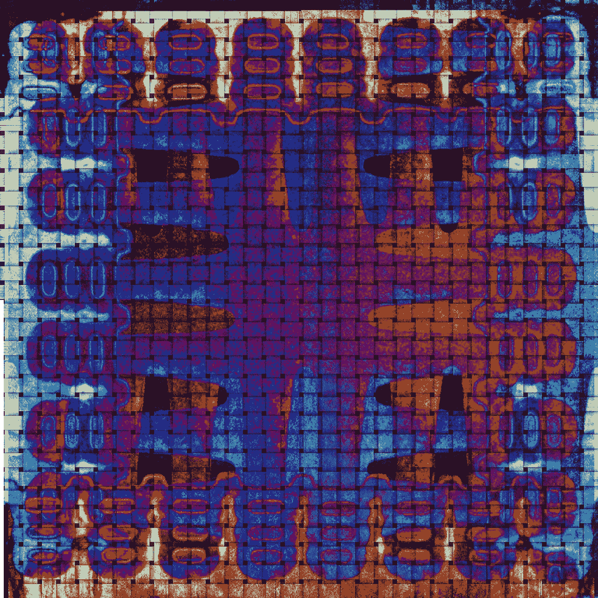
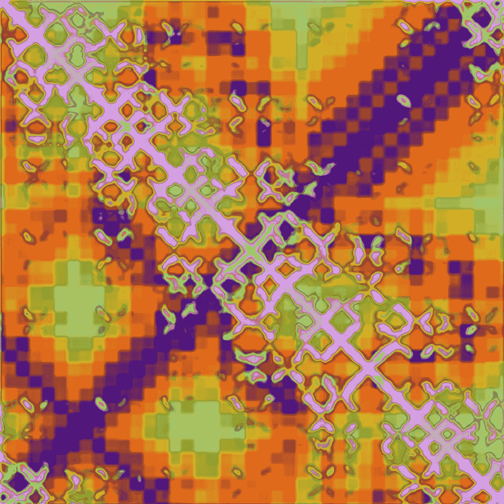
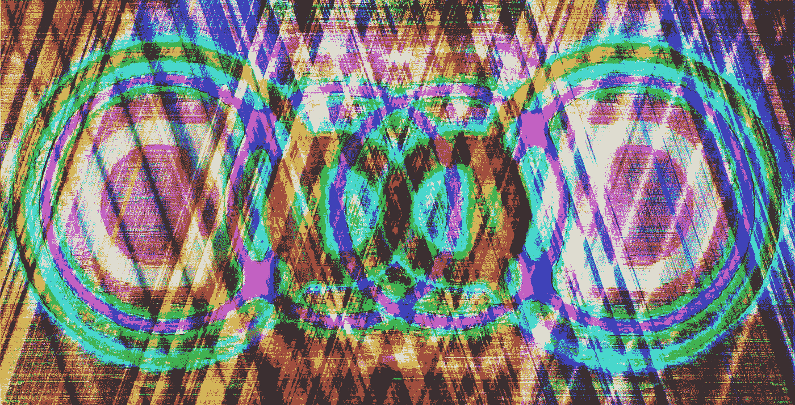
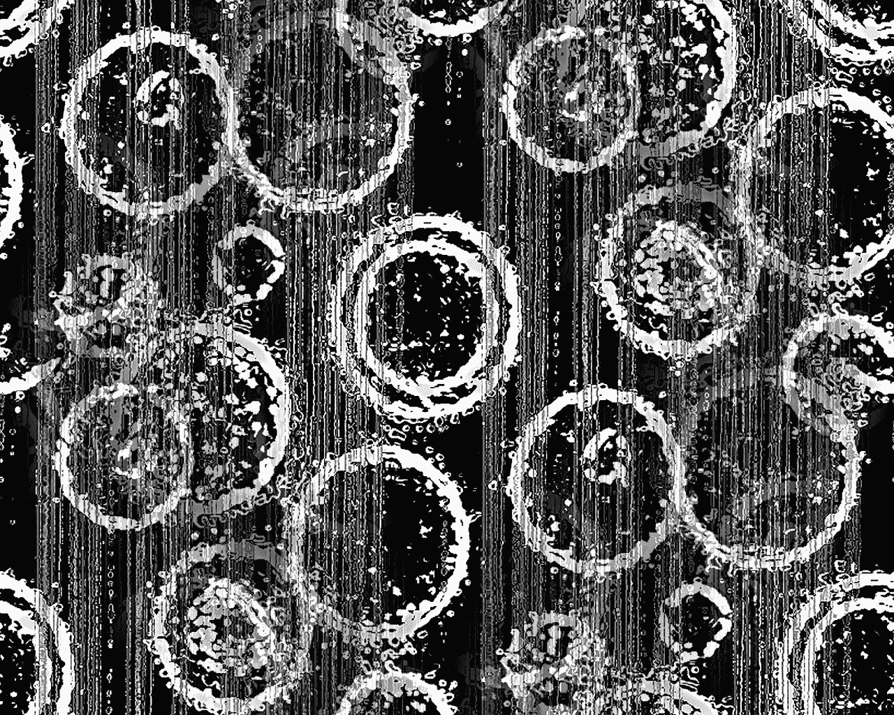
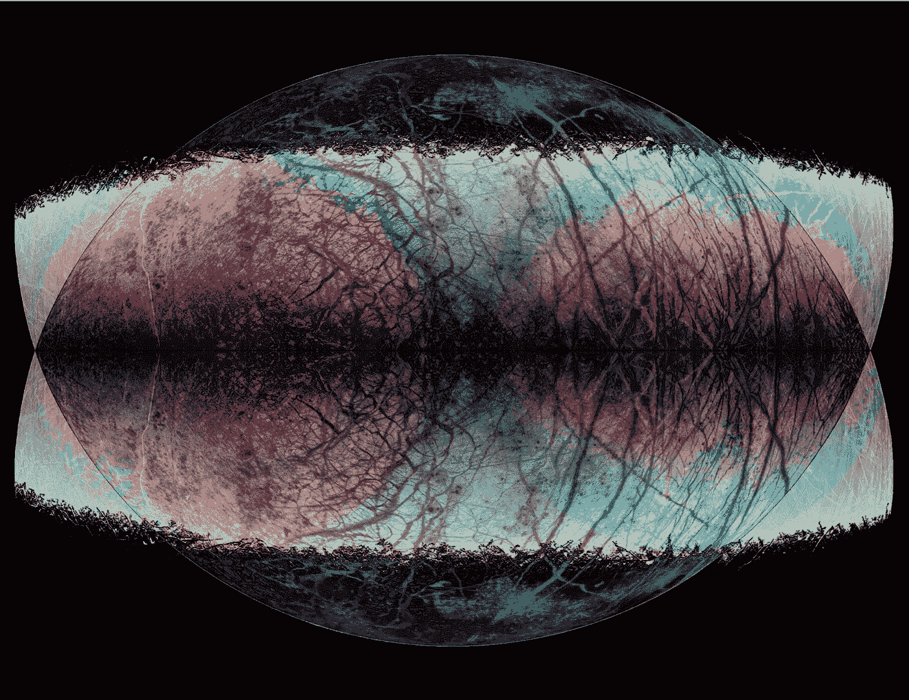

# 认知方面.艺术

> 原文：<https://medium.datadriveninvestor.com/cogniverse-art-b9856242427e?source=collection_archive---------21----------------------->

4Sheets, a [quadriptych](https://www.cogniverse.art/quads) from the from the [Nanotechno](https://www.cogniverse.art/nanotechno) collection

我的新 [Cogniverse](https://www.cogniverse.art) 艺术系列围绕最激发我想象力的主题融入了神经网络处理和人类直觉创造力:人机智能的[融合](https://medium.com/datadriveninvestor/cogniverse-an-ai-enabled-interdimensionally-inspired-art-series-b0416eaaef61)以及意识研究、认知科学和植物医学的兴起。

这种新的技术和主题已经产生了生产力的爆发，所以很高兴在这里分享一些新的作品。但更重要的是，**一个新的**[**Cogniverse . art**](https://www.cogniverse.art)**网站**不仅仅是为了这个最新的 cogni verse 系列，还有 [Nanotechno](https://www.cogniverse.art/nanotechno) (自 2001 年起)和 [Nanocosmos](https://www.cogniverse.art/nanocosmos) (自 2008 年起)系列，为它奠定了基础。

随着新网站的推出，我也在与新的供应商一起制作一些艺术家的样张，所以也在寻找即将到来的展览、画廊和顾客。

最后，鉴于我对 XR 的所有事物——VR、MR 和其他沉浸式媒体——的平行热情，我也在为 Cogniverse XR 寻找合作者，努力将这项工作扩展到视觉故事的新维度。参见 Unity Connect 社区发布的[艺术、人工智能和 XR:在认知创意十字路口创新](https://connect.unity.com/p/cogniverse-xr)。

***杰克·梅森***毕业于布朗大学(文学学士，符号学)和哥伦比亚大学新闻研究生院

ProPattern, a [quadriptych](https://www.cogniverse.art/quads) from the [Cogniverse](https://www.cogniverse.art) collection

Quantum Cassini, from the [Nanocosmos](https://www.cogniverse.art/nanocosmos) collection

All Ball Down, from the [Nanotechno](https://www.cogniverse.art/nanotechno) collection

**EuropaEuropa**, from the [Nanocosmos](https://www.cogniverse.art/nanocosmos) collection