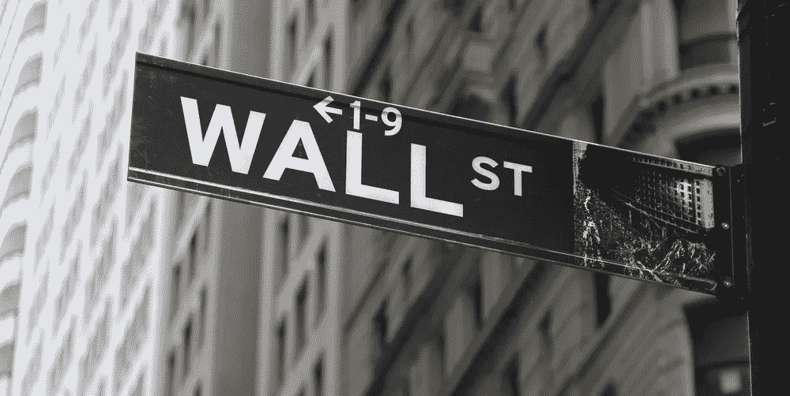

# 比特币基地吞并了竞争对手

> 原文：<https://medium.datadriveninvestor.com/coinbase-gobbling-up-the-competition-ef6906619b48?source=collection_archive---------4----------------------->

比特币的价格在 2017 年暴涨。比特币基地是世界上最大的加密货币交易所之一，它在正确的时间处于正确的位置，利用了人们兴趣的高涨。即便如此，比特币基地也没有兴趣想当然地认为自己在加密方面有所收获。为了在更大的加密货币市场保持领先地位，该公司正在将资金投入到他们的总体规划中。截至 2017 年，该公司的收入据报道为 10 亿美元，超过 1500 亿美元的资产在 2000 万客户之间交易。

总部位于旧金山的比特币基地公司是美国领先的加密货币交易平台，凭借其持续的成功，在过去两年未能上榜后，于 2018 年在美国消费者新闻与商业频道颠覆者榜单上排名第 10。

在通往成功的道路上，比特币基地想尽一切办法从纽交所、Twitter、脸书和 LinkedIn 挖走关键高管。今年，其全职工程团队的规模几乎翻了一番。

今年 4 月，Earn.com 被比特币基地以 1 亿美元的价格收购。这个平台允许用户发送和接收数字货币，同时回复大众市场电子邮件和完成微任务。目前，该公司正计划聘请前 Andreessen Horowitz 风险投资家、winks 创始人兼首席执行官担任其首位首席技术官。

按照目前的估值，在着手收购 Earn.Com 时，比特币基地对自己的估值约为 80 亿美元。这一价值远高于 2017 年夏天最后一轮风险投资融资时估计的 16 亿美元估值。

尽管比特币基地从包括 Union Square Ventures、Andreessen Horowitz 和纽交所在内的顶级风投那里获得了超过 2.25 亿美元的资金，但该公司拒绝对其估值发表评论。

为了满足机构投资者的需求，纽约证券交易所正计划启动自己的加密货币交易所。纽交所的竞争对手纳斯达克也在考虑类似的举措。

# **竞争来了**

随着竞争机构寻求从比特币基地的业务中分一杯羹，比特币基地正在寻找其他风险投资机会，试图在公司周围建立一条护城河。

野村证券即时分析师丹·多列夫(Dan Dolev)表示，Twitter 首席执行官杰克·多西运营的公司 Square 可能会蚕食比特币基地的交易所业务，因为它在 1 月份开始在其 Square Cash 应用上交易加密货币。

根据 Dolev 的估计，2017 年比特币基地的平均交易费约为 1.8%。如此高的费用可能会驱使用户转向其他更便宜的交易所。

比特币基地希望成为机构投资者的一站式商店，同时对冲其交易所业务。为了吸引白手套投资者阶层，该公司宣布了一系列新产品。这类投资者对进入波动较大的加密货币市场尤其谨慎。

比特币基地总理，比特币基地机构覆盖集团，比特币基地保管和比特币基地市场是该公司推出的产品。

比特币基地认为，有数十亿美元的机构资金可以投资于数字货币。它已经保管了 90 亿美元的客户资产。

机构投资者担心安全性，尽管他们知道比特币基地从未像其他一些全球加密货币交易所那样遭受黑客攻击。比特币基地总统和首席运营官说，去年 11 月启动比特币基地托管的动力是缺乏可信的托管人来保护他们的加密资产。

# 目前，华尔街从抨击者转变为加密货币的支持者

根据 Autonomous Next Wall Street 的最新数据，人们对加密货币的兴趣似乎正在增加。目前有 287 只加密对冲基金，而在 2016 年，只有 20 只加密货币对冲基金存在。高盛甚至开设了一个加密货币交易柜台。

比特币基地还引入了比特币基地风险投资公司，这是一家为在加密货币和区块链领域工作的早期创业公司提供的孵化基金。比特币基地风险投资公司已经积累了 150 亿美元用于进一步投资。它的第一笔投资是在一家名为 Compound 的初创公司宣布的，该公司允许人们在赚取利息的同时借入或借出加密货币。

2018 年初，该公司推出了比特币基地商务，允许商家接受主要的加密货币进行支付。另一家比特币初创公司是 BitPlay，它最近筹集了 4000 万美元的风险资金。去年，BitPlay 处理了超过 10 亿美元的比特币支付。

区块链技术的支持者认为，在未来，加密货币将能够消除对中央银行当局的需要。在这个过程中，它将降低成本，创造一个分散的财务解决方案。

# **监管安全仍然十分严格**

将准入限制在四种加密货币之内，比特币基地受到了很多批评。但在美国监管机构考虑如何监管该技术的某些用途时，他们必须小心行事。

对于像比特币基地这样的加密货币交易所，关注的问题是加密货币是否是受证券交易委员会管辖的证券。无可否认，比特币基地在增加新硬币方面进展缓慢，因为美国证券交易委员会在 3 月份宣布，它将对所有加密货币交易所适用安全法。

《华尔街日报》报道称，比特币基地会见了美国证券交易委员会官员，以注册成为一家持牌经纪和电子交易场所。在这种情况下，比特币基地将更容易支持更多的硬币，并遵守安全法规。