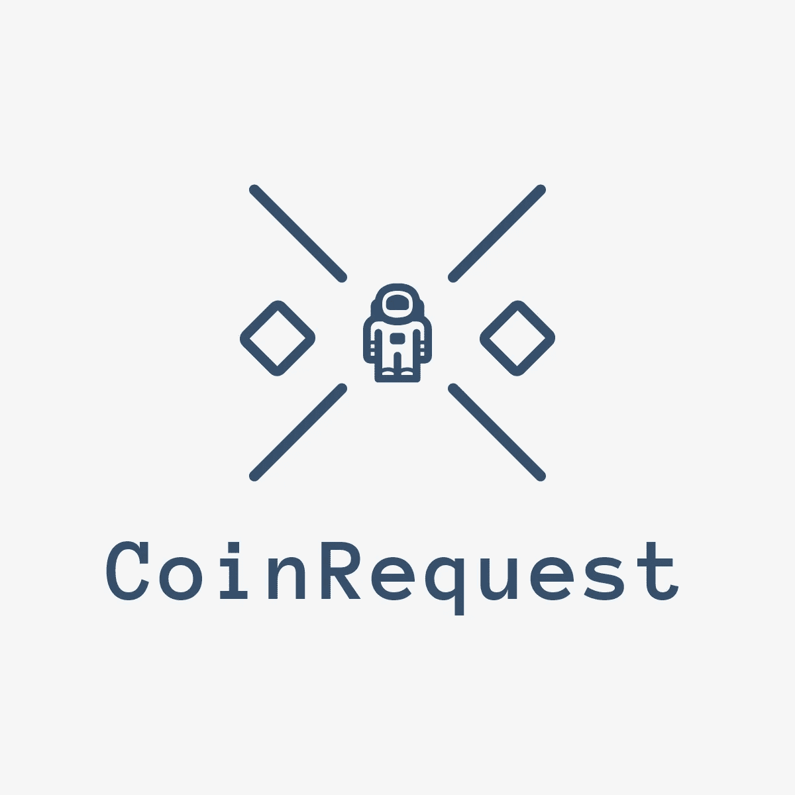
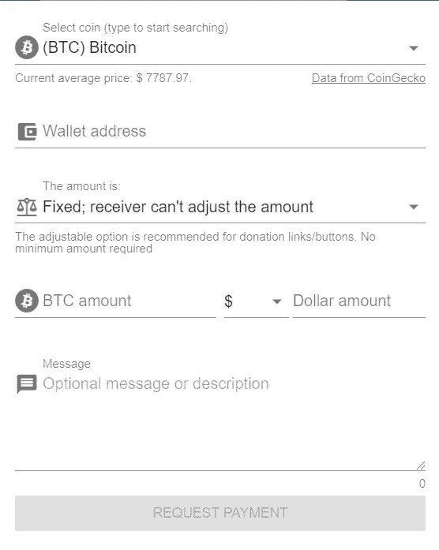
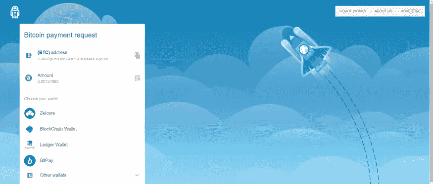

# coin request——让支付变得简单！！

> 原文：<https://medium.datadriveninvestor.com/coinrequest-making-payments-simple-a11ade77055c?source=collection_archive---------13----------------------->

你们中有多少人知道大规模采用区块链技术的三大障碍之一是“**易用性**”。

**我们来举个例子，**

就当你想送一个朋友。

 [## 如何创建自己的加密货币，让您的企业为未来做好准备|数据驱动…

### 加密货币是如何工作的？如何制作加密货币？如何推出我的加密货币？所有这些问题必须…

www.datadriveninvestor.com](https://www.datadriveninvestor.com/2019/03/25/how-to-create-your-own-cryptocurrency-and-make-your-business-ready-for-the-future/) 

为此，你必须

去 MyEtherWallet 网站/打开你存放硬币的个人钱包。

输入要将资产转移到的长串数字和字母。

输入交易的金额和最大气体限制

三次确认我要发送交易。

搞定了。！

你可能想知道这是儿戏。但当我开始我的加密之旅时，我的第一次加密传输是一场噩梦。我花了将近 30 分钟才弄明白。甚至我也犯了一些错误，寄错了钱，也转错了地址。我习惯了就容易多了。此外，要注意的是，我们对技术更友好，但世界上大多数国家不是这样。

然而在现实世界中，付款很容易。例如，PayPal 现在为其用户提供了一个链接结构的选项，用户可以定制一个自定义链接，通过两次点击发送任意金额的资金。要想大规模采用，发送加密货币需要有多简单，或者更确切地说，将会有多简单，到时候每个人都可以用它们来支付午餐或给朋友报销。

幸运的是，区块链的一家小公司提出了一个简单有效的解决方案。

[CoinRequest](https://coinrequest.io/?source=post_page---------------------------) 是一个新的区块链平台，允许用户安全快速地用加密货币结算支付。使用您的桌面或在移动设备的帮助下，用户可以创建包括加密类型、金额和可选付款通知的付款请求。该请求可以通过电子邮件发送给接收者，也可以在各种社交平台的帮助下共享。一旦收到，付款人可以使用 20 多个支持的钱包中的任何一个来完成支付。

让我们看看这是如何工作的:

1.  **选择您想要请求的硬币。如果它不在下拉列表中，开始搜索！**
2.  **填写你的钱包地址。你只需要这样做一次！在你的第一次之后，为了你的方便它被保存。**
3.  **想要一个具体的金额还是发件人可以更改？**选择您喜欢的选项。
4.  **填写金额。**这可以在资产或菲亚特中，并自动调整到另一侧。
5.  **可选:消息。**你还可以附上一条信息，说明请求的目的，提供更多信息。

当你完成上述步骤后，你可以通过多种方法分享它，接收者将获得一个类似于 [this](https://coinrequest.io/request/00St7cL5QszY0De?source=post_page---------------------------) 的 URL，并被重定向到一个类似的页面，如下图所示。

点击你的钱包，你将被重定向到钱包，在那里填写地址和要求的金额，这样你只需点击发送！

> 目前，coinrequest 支持超过 35 个钱包(Zelcore、Digibyte、Genesis network、Raven wallet、Blockchain wallet、Bitpay、Paytomat、Imtoken、Edge、Ledger wallet、Exodus、Bread、Electrum、Luno、菌丝体、Samourai、Spectrocoin、Btc.com、Dash、Burner wallet、Status、Blue wallet、Natrium、Canoe、Groestlcoin、Axe、Feathercoin、Dropbit、Bitnovo、Ownbit)，并且未来很有可能会添加更多钱包。
> 
> 您也可以在[推特](https://twitter.com/CoinRequest)上关注他们，获取最新的更新，如果您有任何建议，可以联系他们**development @ coin request . io**，