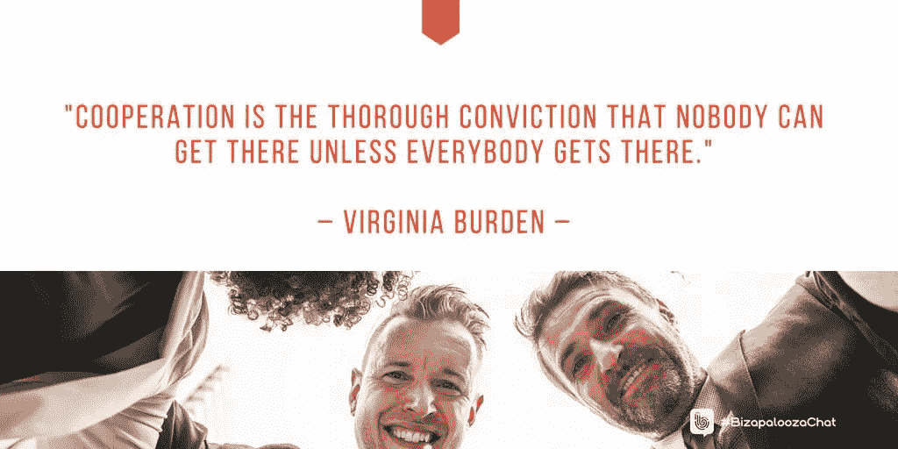

# 合作:我们将一起度过难关

> 原文：<https://medium.datadriveninvestor.com/collaboration-were-going-to-through-it-together-d630dcf6524f?source=collection_archive---------5----------------------->

## "竞争没有过时，但不惜一切代价赢得比赛才应该过时."

探索下一步，并用行动来回答，这是实现梦想和愿望的唯一可靠途径。

这是 [A.J. Borowsky](https://twitter.com/AskWhatNext) 的书《 [*下一步:积极主动走向成功*](https://www.amazon.com/What-Next-AJ-Borowsky-ebook/dp/B006GEPQZI/ref=tmm_kin_title_sr?_encoding=UTF8&qid=1508239982&sr=8-1) 》的前提作为一名财务生活教练和作家，他说“不努力就没有成功的秘诀和步骤。

“没有运动就没有进步，”博罗夫斯基写道。“如果你从来不问这个问题——下一步是什么——答案将永远是一样的——什么也没有。”

一路走来，成功的企业家相互协作，这让他有机会与 Ivana Taylor 和 Iva Ignjatovic 谈论竞争市场中的协作。

 [## 推动员工渴望的人际关系

### 未来的工作都是关于协作的

medium.datadriveninvestor.com](/drive-the-relationships-workers-crave-56083c8f5af) 

泰勒拥有 DIYMarketers，这是一家“致力于帮助小企业主避免被压垮”的公司。Ignjatovic 是一名营销、战略、领导力和商业顾问。

竞争是活生生的，除非你想给每个人都参与的奖杯。

“竞争没有过时，但不惜一切代价赢得胜利已经过时——或者应该过时，”博罗夫斯基说。“竞争有助于我们提高水平，但这并不意味着我们需要踩在别人身上才能达到更高的水平。”

泰勒审视了竞争的利弊。

“我认为在某些情况下它已经过时了，但不是所有的情况，”她说。“人类天生就有竞争的欲望。然而，它也会阻碍进步。”

# 竞争激烈

Ignjatovic 更坚定地认为竞争会减少，但不会消失。

“在社交方面，人们喜欢竞争，”她说。“我认为竞争是不可能的——永远不可能。”

事实上，竞争是取得进步的一种方式。

“有时候我需要那种推动来让我坚持下去，”博罗夫斯基说。

即使在团队内部，你也可以在友好竞争的同时进行合作。它打破了单调。

 [## 协作:一起走，一起走

### 合作为其他企业家扫清了道路

medium.datadriveninvestor.com](/collaboration-go-together-and-go-far-584caae57282) 

“例如，与一个电视台，你可以竞争创造一个更好的产品，”泰勒说。

“当目标是创新时，合作和协作是理想的策略，”她说。"但是当涉及到正在进行的业务时，竞争推动改进."

最好的解决方案可能是两者结合。

博罗夫斯基说:“我更喜欢一种混合的竞争方式，在这种方式中，你合作，但互相推动，变得越来越好。”

了解这两种策略会给业务带来灵活性。

“这不是哪个更好的问题，”Ignjatovic 说。“这是关于知道什么时候去竞争，什么时候去合作。”

# 文化事务

人类对合作与竞争的态度取决于他们的文化。大多数——如果不是所有的文化——都玩竞技游戏。说到工作，他们的文化可能更具协作性。

“我认为人类天生利己，”博罗夫斯基说。“如果在某种情况下合作更好，那么他们就会这么做。如果竞争变得更好，他们就会这么做。”

泰勒勇敢地提出了恐惧因素。

“人类天生合作，”她说。"当恐惧发生时，竞争往往会压倒逻辑。"

合作与竞争的答案在于内部或外部。在内部，更多地合作以达成目标——这可能意味着在外部击败你的竞争对手。

“我不认为一个比另一个更重要，”泰勒说。“凡事都有时间和地点。”

行为和关系在合作-竞争互动中扮演重要角色。

 [## 数字营销人员是否已经到达了人间天堂？

### 合作使他们与大公司平起平坐

medium.datadriveninvestor.com](/have-digital-marketers-reached-heaven-on-earth-1fd805b078ee) 

“成功、重要的进步、合作和竞争只是达到目的的手段，”博罗夫斯基说。“关键是，要么合作，要么竞争，同时要文明。

“我喜欢把这个问题作为潜在雇员的面试问题:‘胜利对你意味着什么？’真正让他们思考，”他说。

合作和竞争并不相互排斥。

“他们都很重要，”Ignjatovic 说。“人不能只是这样或那样。我们谈论人性中不变的二元性。”

# 一起还是分开

当今世界需要更多的合作还是竞争？

“此时此刻，可能需要更多的合作，”博罗夫斯基说。“我们必须同时继续向前推进。”

这种愿望与当时的情况相冲突。

“世界是为竞争而构建的，”泰勒说。“从很多方面来说，我不认为这是有帮助的。”

 [## 当其他人都休息的时候，尽你最大的努力

### “淡季”是超越竞争对手的最佳时机

medium.datadriveninvestor.com](/make-your-best-move-when-everyone-else-rests-18e177f1a590) 

同样，一个快乐的媒介会有所帮助。

“这个世界肯定需要更多的合作，或者至少是更健康的竞争，”Ignjatovic 说。

“利用这两者来进步是人类的天性，”她说。“他们只需要知道识别上下文时使用什么。然而，当他们只使用竞争时，事情可能会变得很糟糕。”

“总体合作活动有所增加，这很好，”Ignjatovic 说。“有时我认为人们在竞争谁会合作得更多。”

泰勒偏爱术语。

“我喜欢协作这个词，”她说。“每一方都把自己的优势带到了比赛中。你可以合作，也可以竞争。”

如果协作不必要地减慢了你的速度，它就会限制你。花时间把事情做对，但不要过度。

“合作的局限是愿景，”博罗夫斯基说。“如果愿景不同，就很难合作。自负和固执也会限制合作。”

当心无休止的旋转循环。

“在某些时候，你可能会陷入合作的怪圈，永远无法启动，”泰勒说。

# 探向器

为了帮助发射，你可能需要一个全球定位系统。

“合作的一个缺点是缺乏决策者，”Ignjatovic 说。"人们往往会在协作过程中迷失方向."

竞争者之间的合作可以产生更好的产品。然而，缺乏竞争也可能导致创新动力不足、自满以及由于缺乏竞争而导致的价格上涨。

“竞争对手之间的成功合作是当双方都觉得他们得到了他们不会得到的东西，”Borowsky 说。

 [## 相互性团结并创造身份

### 这是“我们”一起探索世界和它的机会

medium.datadriveninvestor.com](/mutuality-unites-and-creates-identity-e1e834581307) 

泰勒看着外面的世界。

“我想到了太空计划，美国和俄罗斯科学家为了所有人的利益而合作，”她说。

另一个太空计划合作的例子是成立联合发射联盟的合并。他们在政府合同上垄断了市场，除了不断攀升的发射成本别无选择，直到 [SpaceX](https://twitter.com/SpaceX) 的出现搅动了局面。

Ignjatovic 说:“竞争对手之间的成功合作发生在他们联合起来将其他竞争对手挤出这个行业的时候——当他们做一些非营利性的事情的时候。”

公司共享信息可能有些棘手，但在国家安全的情况下或根据合同要求，尤其是与政府的合同要求，这是必要的。

# 分享的秘密

“共享信息和共享商业秘密或知识产权是有区别的，”Borowsky 说。“只要知道什么时候分享什么。

“通过泛泛而谈来分享，表明你想添加信息，但不会损害你的业务，”他说。

创造也产生于竞争。

“这是关于你创造的组织结构，”泰勒说。"一些公司通过内部竞争来推动发展速度."

 [## 你的一小部分可以帮助人们信任你

### 挖掘你的个人品牌来寻找客户

medium.com](https://medium.com/an-idea/a-little-piece-of-yourself-can-help-people-trust-you-99b2e8b5ac8a) 

信任是一个重要因素。

“合作就是联盟，”Ignjatovic 说。“这可简单了。根据当前任务限制信息的流动。

“通过合同灌输信任，”她说。"共享信息应该只在那种情况下或任务中使用."

当竞争对手同意他们可以联合提供比单独更好的解决方案时，合作对他们来说是有意义的。这是互补专业的合作。

“竞争对手应该合作继续增长，”Borowsky 说。"他们应该在对双方都有利的时候这样做。"

大合作会带来大回报。

“竞争对手应该合作解决大问题，”泰勒说。“没有哪两家公司是相同的。每个公司都有优势，可以利用比较优势。”

为此，Ignjatovic 表示，“当他们的合作可以改善整个行业时”，竞争对手应该合作

**关于作者**

吉姆·卡扎曼是[拉戈金融服务公司](http://largofinancialservices.com)的经理，曾在空军和联邦政府的公共事务部门工作。你可以在[推特](https://twitter.com/JKatzaman)、[脸书](https://www.facebook.com/jim.katzaman)和 [LinkedIn](https://www.linkedin.com/in/jim-katzaman-33641b21/) 上和他联系。