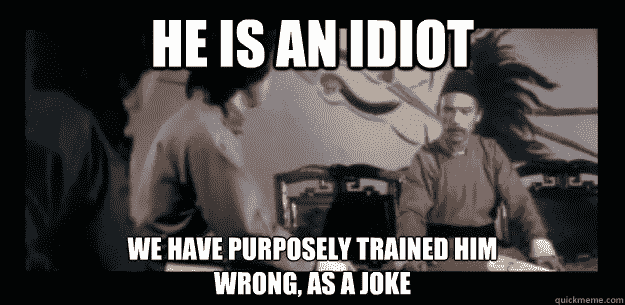
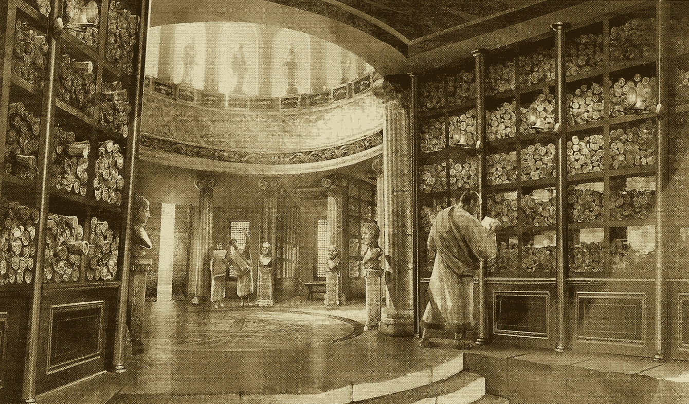
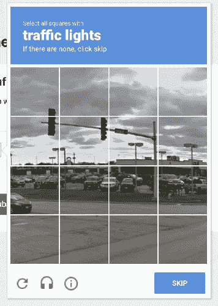
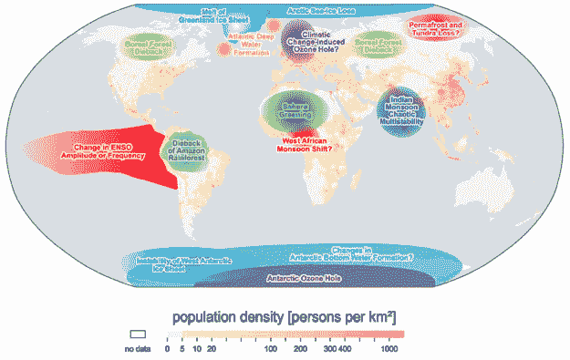

# 为人工智能、隐私和未来收集数据。

> 原文：<https://medium.datadriveninvestor.com/collecting-data-for-artificial-intelligence-privacy-and-the-future-e2e0ea9c2d51?source=collection_archive---------10----------------------->

an AI that is trained wrong just gets kicked in the face

作为一名“人工智能设计师”,我经常收到关于人工智能如何做这件事或那件事的链接，这非常令人兴奋。许多这些企业主不明白的是，你需要大量的*干净的*数据来实际训练你的人工智能。

> 你的人工智能只有在被训练的时候才聪明。如果你用不准确的数据训练它，你就是在错训他(开玩笑？)

不幸的是，对于我们营销人员来说，我们的数据通常充满了不准确性。还记得有一次你做了一个登陆页面，但是忘记把它添加到你的跟踪文档中吗？你的数据现在 99%准确。有一次，您的数据科学家遇到了一个错误，导致特定供应商的数据丢失了几天，那该怎么办？你的数据现在 98%准确，如此下去。

最终，大多数大型网站在跟踪和数据标准化方面几乎没有人为错误…即使我们都说我们做出“数据驱动的决策”,但我们通常是在不完整的数据集上做出这些决策。

这对我们人类来说没什么，但如果我们训练一个人工智能来帮助我们利用不完整或破碎的数据进行营销，我们本质上是在错误地训练它，我们不希望我们的人工智能整天被踢脸，不是吗？

我的工作是设计系统，为人工智能统一、干净地收集数据，不需要任何人工干预。

Look at all that data!

## 人类热爱数据*

从时间开始，数据收集、存储和开放就被用来激励人类变得更好。语言、阅读/写作、充满数据的图书馆……这些发明中的每一项都是人类独有的，并使我们降低了死亡率，增加了粮食产量，减少了无家可归和谋杀。

你可以把装满了关于沟渠、历史、管道和现代医学知识的古代图书馆想象成大型数据集。这些相同的数据集保存了皇帝的胜利和丑闻的历史。贵族的虚伪和教会的罪恶。甚至在那个时候，一些人对侵犯隐私并不太高兴；教会希望印刷的圣经成为世界上主要的数据来源…十字军东征时间到了！

快进几年，很多图书馆被烧毁(我要删除我的账户)，我们进入了中世纪。隐私和饥饿的美好时光。世界这一地区的人类倒退到了比几千年前更糟糕的环境中。翻译圣经会被处以死刑，这有效地压制了分享知识多年。

我们发明了古腾堡印刷机，远远超过了 taken⁴的历史。突然间，知识和权力不再局限于上层精英。教育普及了，人类发现你实际上不必像农民一样生老病死，君主制不是人们生活的唯一方式，短短几年后，我们冲进了工业革命。

随着数据在人类之间自由流动，人类的状况再次得到改善，从那时起，我们从未经历过如此大规模的饥荒和瘟疫。

how do we become an AI training master?

## 我们如何为人工智能使用数据

如今，海量的图书馆已经被存储在云中的数据所取代。就像过去一样，科学家研究过去的数据来创造未来的发明。但是这些数据在今天的人工智能世界中是如何使用的呢？两个例子:

假设一个企业主想知道他在 facebook 上投放的广告是否真的导致了店内销售。一个聪明的人工智能设计师可能会创建一个超级方便的功能，如标记你的朋友或面部登录。当你愉快地标记和登录时，公司正在慢慢地建立你的脸在人群中的样子，戴着帽子，刚洗完澡…一切！标签建议在 facebook 上很有用，对吧？

恐怖…无论如何，一旦我们有了它，我们需要做的就是当你走进商店时认出你的脸。我们买了一些高档相机，当你进店时，在你脸上贴上标签。突然间，在没有你或任何人输入任何数据的情况下，我们已经将你特别点击的 facebook 广告*与你在商店中的个人访问*联系起来。嘭，你有了一个“facebook 广告追踪到零售店 ai”。**

其次，让我们想象一下，我正在试图训练我的自动驾驶汽车驾驶……我需要*大量*数据来训练我的驾驶人工智能如何识别街道标志、公共汽车和汽车。最近注意到这些小帽子了吗？他们好像问了很多关于驾驶的问题…

hmmmmmmmmmmm

在这两个例子中，我们使用人类自动给我们提供信息(标记朋友的脸或给我们看红绿灯)，同时也给用户提供使用我们服务的便利。我们正在为人工智能收集数据，对您的隐私稍有侵犯。

## AI 无处不在，你爱它。

现在，你的隐私似乎被彻底侵犯了，让我来解释一下这些数据对你个人是如何有用的。有没有因为谷歌地图提醒你交通状况而避免去机场迟到的经历？这是因为其他谷歌地图用户将他们在路上的位置发送给谷歌…如果你的移动速度比预期的慢，谷歌知道有交通堵塞。

spotify 最近风靡一时的那些“为你而唱的音乐”播放列表呢？问亚马逊 echo 点你最喜欢的东西？指纹登录？这些工具对用户和公司都有益。它给了像我这样的人制造造福人类的产品所需的数据，也给了你更多的便利和时间去关注对你来说重要的事情。

how we all die

## 为什么这很重要？我宁愿拔掉电源，过自己的生活。

“老实说，这听起来很可怕克里斯，我不喜欢它，我宁愿只是坐着等这种侵犯隐私的行为结束，谢谢。”

确实是。问题是，我们根本没有时间等待社会意识到隐私在很多年前就已经消亡了。上面我们看到了全球性的“引爆点”，事件一旦发生，会导致地球上死亡的连锁反应。⁵

TL:DR，除非我们在未来 20-30 年内对我们人类的行为做出*大规模*和*大范围*的改变，否则我们的孩子将没有一个固有的世界。我们只是没有时间再被关在笼子里谈论我们的恶劣行为或假装的秘密。我们能做出这些改变的唯一方法是通过大规模的知识共享…数据。

## 如果我们要死，不如做我们喜欢的事而死。

很明显我有偏见，我相信人工智能可以带来效率，减少浪费，发现新的回收方法。如果我们在自己的人工智能研究项目中取得成功，我们将能够全面降低广告成本，从而提高资本支出效率，减少大型广告网络的利润，增加全球非营利组织的资金。

所以，我会继续设计我的人工智能。继续要你的数据。继续玩我的玩具。未来是*疯狂的酷，*我很兴奋能和你们一起建设它。

爱情，

克莉丝

我最喜欢的用简单的术语解释人工智能的视频之一是由 CPG grey 制作的，看看这里:[https://www.youtube.com/watch?v=R9OHn5ZF4Uo](https://www.youtube.com/watch?v=R9OHn5ZF4Uo)

人们说人工智能/数据开发中不存在“创意人”的角色，但这就是我做的事情。人工智能设计师在高层次上定义系统特性，然后将“细节”委托给他们的工程团队。在制作过程中，你将不断地审查和批准‘进行中’的内容，回答问题，解决冲突和解决问题；所有这些意味着很多时间只是…聊天。这是一份全职的管理工作，你可能从来没有真正接触过引擎，或者自己为系统贡献过一点资产或一行代码。

[econ lib . org/library/Enc/standardsoflivingnandmoderneconomicgrowth](https://www.econlib.org/library/Enc/StandardsofLivingandModernEconomicGrowth.html)

https://www.youtube.com/watch?v=0ojyCDRc8uc⁴

pnas.org/content/pnas/105/6/1786.full.pdf⁵