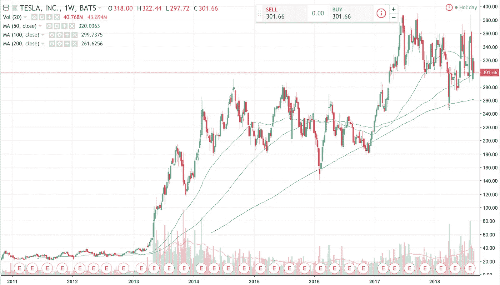

# 评论:为什么我现在不买特斯拉的股票

> 原文：<https://medium.datadriveninvestor.com/comment-why-i-would-not-buy-tesla-stocks-right-now-6d011f05070c?source=collection_archive---------8----------------------->

当然，埃隆·马斯克是同类人中的一员，他已经取得了伟大的成就。我永远不会否认这一点。彼得·泰尔曾经说过,“我永远不会赌埃隆·马斯克输”。然而，特斯拉是市场上最被做空的股票之一，在全球范围内都有争议。

在我们进入细节和讨论相当谨慎的方法的原因之前，让我们看一下图表。

在过去的 6 个月里，由于积极或消极的消息，特斯拉股票经历了大幅波动，即马斯克在 2018 年 6 月的财报电话会议上的恶劣行为，或者最近宣布以 420 美元的价格私有化。然而，自 2017 年初价格飙升以来，我们可以看到的是，股价在 390 美元左右见顶，此后建立了一个下降通道，高点和低点越来越低，但公平地说，在 280 美元左右是一个相当强的支撑线。一个警告标志？

TA 可以更好地了解市场情绪，但让我们看看特斯拉的现状，以及我现在远离该公司的理由是什么。有两个问题属于管理层和公司本身的当前发展。

*管理*

正如我已经提到的，埃隆·马斯克是一个有远见的人，是特斯拉的心脏和灵魂。他将公司发展成今天的样子，并确保长期目标和战略到位，并且即将实现。不过，在运营管理方面，缺陷还是可以发现的。一个 CEO 真的应该使用 Twitter 来宣布与财务相关的话题吗？特斯拉现在正面临美国证券交易委员会的调查，因为马斯克最近发表的“私有化”推特。这条推文导致该股上涨 11%，因为投资者希望以 420 美元的价格收购。马斯克表示，他已经厌倦了金融市场以及公众投资者给他带来的压力。看起来他没有完全控制自己的情绪。另一个例子是提到的收益电话会议，马斯克只是弱化了分析师的问题。
特斯拉并不是马斯克运营的唯一一家公司(SpaceX + Hyperloop One)，所以他面临着很大的压力。但作为一名首席执行官，你需要能够评估自己是否能够忍受这一切。在我看来，这是一个问号。

*发展*

这家公司仍然没有盈利。这令人担忧。当然，制造汽车是一项成本密集型业务。但是，第一次宣布在未来 6 个月内盈利已经是两年前的事了。自那以后，特斯拉不顾一切地增加产量。事实上，在过去的几年里，收入一直在增长，但运营费用也在增长。彭博今年早些时候表示，这家汽车制造商的现金消耗率为每年 3.48 亿美元，或者更高，每分钟 6.500 美元。他们的债务越积越多，特别是由于 Model 3 制造业的基础设施需求。Model 3 销售的利润是否能够补偿最初投入的资金值得怀疑。

然而，特斯拉最终达到了每周生产 5000 辆 Model 3 的目标。他们在 Q2 收益更新信中把它定为里程碑，这的确是一线希望。我们将会看到它是如何工作的。

*结论*

购买特斯拉的权利伴随着巨大的不确定性和相当冒险的决定。风险应该伴随着潜力。在我看来，由于围绕马斯克的炒作，特斯拉已经被高估了。把这些和股票图表显示的图片放在一起，我宁愿后退一点，等待一个更安全的进场(万一我会考虑买入)。我并不是说公司不会成功。我觉得有可能。尽管如此，我们需要理性地保护我们的血汗钱。让我们给马斯克和特斯拉一点时间来确定方向。我想在这里补充的是，他们的竞争对手没有睡觉。我们看到伟大的中国解决方案正慢慢为西方市场做准备。甚至(缓慢的)德国制造商也有一些很棒的汽车在生产中。特斯拉可能已经失去了一些先发优势。

请在下面的评论区让我知道你对特斯拉的看法。听听你的意见会很有趣。

声明:这不是财务建议。作者不拥有被点名的公司的股票。

让我们保持联系！

在推特上关注我:【https://twitter.com/philipppetzka 

领英:【https://www.linkedin.com/in/philipp-petzka-817510105/ 

Philipp Petzka 是 Mintfort 的创始人兼首席执行官，mint fort 是一家为加密货币和法定货币提供数字银行解决方案的公司。

**网址:**[**https://mintfort.com/**](https://mintfort.com/) **推特:**[**https://twitter.com/mintfort**](https://twitter.com/mintfort) **领英:**[**https://www.linkedin.com/company/mintfort/**](https://www.linkedin.com/company/mintfort/) **脸书:**[**https://www.facebook.com/mintfortbank/**](https://www.facebook.com/mintfortbank/)