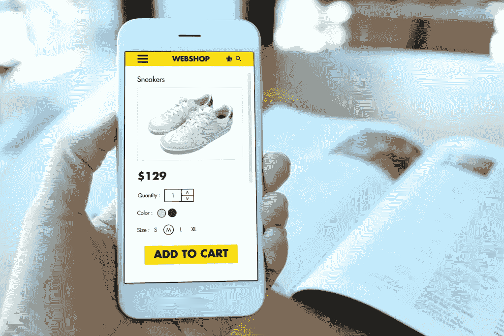

# 2019-20 年你应该关注的商业设计趋势

> 原文：<https://medium.datadriveninvestor.com/commerce-design-trends-you-should-take-an-eye-at-in-2019-20-670521746d87?source=collection_archive---------16----------------------->

网站的设计方式在不断发展，以适应最新的市场趋势。甚至一度被认为过时的设计也能获得新生，开始吸引顾客。如果你想让你的顾客享受最好的购物体验，你必须不断地监控和更新你的设计。你可以使用下面列出的一些电子商务设计趋势来创建你的客户会喜欢的尖端网站。

# 1.移动设备的主导地位

如今，消费者使用智能手机和平板电脑购物的次数超过了台式电脑，设计师们不得不创建面向移动设备、适合大屏幕的网站。这与过去公司专注于创建一个响应迅速、适应性强的桌面网站完全相反，桌面网站也可以在移动设备上访问，但不太舒适和方便。如果你仍然喜欢在桌面上购物，你可以期待在网站上看到移动友好的功能，如长滚动页面和卡片样的布局。然而，考虑到手机正在取代互联网的事实，拥有一个适合你独特需求的手机友好型网站是至关重要的。

 [## 2019 年值得关注的 20 种数字营销趋势和技术|数据驱动的投资者

### Faisal 在加拿大工作，拥有金融/经济和计算机方面的背景。他一直积极从事外汇交易…

www.datadriveninvestor.com](https://www.datadriveninvestor.com/2019/02/04/20-digital-marketing-trends-techniques-to-watch-out-for-in-2019/) 

# 2.与顾客更多的互动

公司不遗余力地与客户互动，因为这可以建立持久的关系，并为客户提供量身定制的体验。许多公司在他们的网站上使用动画和电影胶片来帮助访问者通过滑动或点击来更快更容易地导航。如果您遇到加载时间长的问题，可以考虑在进度条或图标旋转中添加动画来帮助转移用户的注意力，让他们不要去想网站加载时间太长的事实。

电影胶片是带有小的迭代动画的图片。它们经常以 GIF 格式用在主页上。你通常会看到它们以横幅或背景图片的形式出现，给原本平淡无奇的网站注入活力。这一趋势始于 2016 年，我们可以期待看到这一趋势在未来变得流行。

# 3.引人注目的颜色

企业在网站上使用颜色的方式是趋势不断演变的一个很好的例子。就在去年，一切都是关于极简主义和只用黑白颜色。突然之间，公司改变了策略，开始在设计中使用更大胆的颜色。每个人都在试图创造一个脱颖而出的[零售软件解决方案](https://skywell.software/retail/)，颜色被用作与客户联系的一种方式，也是出于美观的原因。如果你用正确的方式使用颜色，你可以向你的顾客传递潜在的信息，并为他们提供更愉快的购物体验。因此，期待看到更吸引人和更丰富多彩的主页。就纹理而言，你可以期待醒目的颜色与中性背景一起使用，以及更多创新的导航工具。

# 4.聊天机器人

由于个性化在电子商务中非常重要，聊天机器人将非常有助于找到创造性的方法来更好地帮助你最忠诚和最有价值的客户。虽然聊天机器人的主要目的是回答问题，但它们也可以用来帮助购物者做出购买决定，为他们提供折扣代码，并发送通知。许多电子商务网站，如 Shopify，正在使用聊天机器人来推动那些犹豫不决的客户购买产品，并为客户提供更定制的体验。

# 5.使用原创摄影

虽然很多公司更喜欢在网站上使用库存照片，但现在的流行趋势是开始使用原始图片。企业正在雇佣专业摄影师来讲述只有真实图像才能提供的故事。这些图片被用在描述所有待售产品的主页和其他网页上。公司用照片来讲述一个产品的故事，这比简单地描述产品特征更有助于销售。

# 6.讲故事

说到讲故事，这可以有效地用来给一个没有生气的品牌注入新的活力。原因是它建立了与客户的情感联系，也建立了你的信誉。更重要的是，有一个独特的故事可以讲述可能正是你在拥挤的市场中脱颖而出所需要的。当你写你的故事时，一定要提到这一切是如何开始的，即你为什么开始创业和卑微的开始，展示你对产品/服务的热情，并为客户正在处理的问题提供解决方案。

# 7.强大的安全性

似乎每一天，我们都读到黑客攻击一些公司并窃取客户的个人信息。如果你想让人们在你的网站上购物，你必须消除这些恐惧。许多公司都在使用 HTTP 加密，并在浏览器的 URL 旁边突出显示这些安全信息。顾客越有安全感，他们就越有可能不仅进行一次购买，而且会继续回来。

这些只是电子商务网站吸引新业务的一些方式。网络商务设计趋势一直在发展；因此，了解目前的需求是很重要的，这样你就可以把它变成你的优势。消费者对购物体验的要求越来越高，尤其是考虑到电子商务网站的数量。因此，尝试实施列出的趋势，以提高客户满意度和总体业务。

*最初发布于*[*https://sky well . software*](https://skywell.software/blog/commerce-design-trends-in-2019-20/)*。*