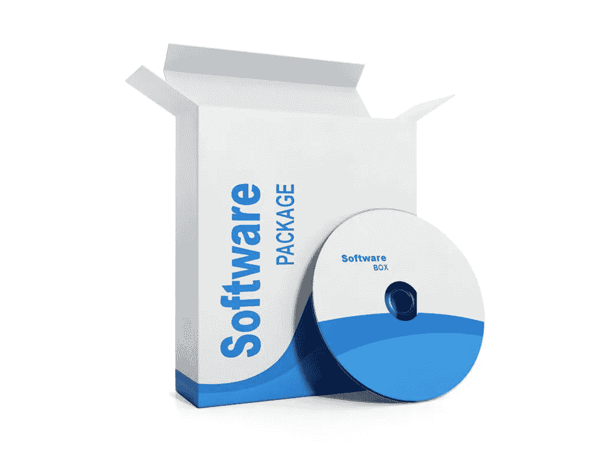

# 商用现成软件与定制软件—哪一种对您的企业更有利

> 原文：<https://medium.datadriveninvestor.com/commercial-off-the-shelf-vs-custom-software-what-is-better-for-your-business-947ac9320786?source=collection_archive---------4----------------------->

如今，几乎每个公司都使用软件来满足业务需求。有如此多的软件产品可供选择，企业家必须尽可能为他们的客户提供最好的软件。在决定如何部署软件时，您有两种选择:定制软件和现成软件。如果我们看看像 CRM 或企业资源管理解决方案这样的产品，这些产品有许多内置功能，但只有满足公司的业务需求，它们才会有效。

让我们来看看这两个，这样你就可以做出明智的决定，什么时候选择哪一个。

 [## 数据科学和软件工程哪个更有前途？-数据驱动型投资者

### 大约一个月前，当我坐在咖啡馆里为一个客户开发网站时，我发现了这个女人…

www.datadriveninvestor.com](https://www.datadriveninvestor.com/2019/01/23/which-is-more-promising-data-science-or-software-engineering/) 

# 现成软件与定制软件

在我们开始比较和对比这两个部署选项之前，让我们来定义它们。定制软件，也称为定制软件，将被创建来满足您的特定需求。你给开发公司你的需求，他们会分析这些需求，并提出一个定制的方法来创建这样一个产品。定制软件编程的一些特征包括:

*   完全可定制；
*   仅包含您需要的功能；
*   持续支持；
*   灵活定价。

商业现货(COTS)软件是你可以立即购买和使用的东西。制造此类产品的公司通常采用一刀切的方法，向所有客户销售相同的服务，只进行少量定制。虽然这些产品将基于一般的最佳实践，但它们可能不适合您的个人需求。开箱即用软件的特征包括:

*   固定价格；
*   内置开箱即用的功能；
*   不是根据您的独特要求量身定制的；
*   基于一般市场策略推动业绩。

现在，我们对这两种部署选项有了大致的了解，我们可以开始比较和对比，以确定哪一种最适合您。

# 通用软件产品和定制软件开发的区别

定制软件和 COTS 软件之间有五个主要区别:

# 1.功能

您将能够享受定制软件开发带来的更多功能，因为它是根据您的独特需求构建的，可以针对任何任务进行定制。在这方面，COTS 软件将非常有限。你很少能要求软件开发公司提供额外的模块或者删除你不需要的东西。

# 2.履行

借助定制软件，您将能够在不运行当前流程或丢失核心数据的情况下安装新应用。此外，随着公司的发展，扩展这种类型的软件和改变功能将会更加容易。集成 COTS 软件有点复杂。因为它不是根据您的需求量身定制的，所以您有损坏重要数据或产生额外费用的风险。

# 3.支持和维护

只要您使用该产品，定制软件解决方案就会提供持续支持。您将不必处理 bug、系统故障或过时的工具，因为您将始终有一个专门的团队随时准备帮助您。COTS 软件通常也有可靠的支持，前提是他们有很多客户在使用他们的产品，他们需要让客户高兴来维护他们的声誉。然而，他们可能会很晚才发布定期更新，甚至会收取额外的费用。

# 4.时间

创建适合您个人需求的软件需要更多的时间，因此 COTS 软件可能会在这方面胜出。软件开发公司试图通过使用敏捷方法和 MVP 演示来加快速度，这可以用来检查基本功能。然而，最终产品的部署至少需要几个月的时间。

# 5.费用

在考虑所有费用时，将总拥有成本考虑在内是至关重要的。虽然定制软件的初始成本可能较高，但运营成本会较低。因此，您可能会为开发支付更高的价格，但是您将从您的开发人员和工程师的肩上卸下许多负担，他们不必浪费时间来处理 bug 或扩展。另一方面，COTS 软件的前期成本较低，但服务费用较高。他们通常按用户或许可证收费，这意味着你必须每月付费。如果您想要升级、额外定制或支持，也需要额外付费。

# 做决定

在做出这样的决定时，考虑您的业务需求和您团队的需求是至关重要的。每一个软件都需要单独评估。如果你需要可以马上插入并使用的东西，那么你应该选择 COTS 软件。但是，如果您发现您的需求如此独特，以至于改造现有产品的成本和时间都太高，那么您应该选择 Skywell Software company 的[定制软件开发？不要让成本阻止你。虽然购买订阅或许可证并立即开始使用该解决方案可能很诱人，但最终您可能会因为不得不添加或删除功能或任何额外的定制而付出过高的代价。因此，明智地选择。一旦你决定购买一种产品，换成其他产品的成本可能会很高。](https://skywell.software/)

*最初发布于*[*https://sky well . software*](https://skywell.software/blog/commercial-off-the-shelf-vs-custom-software/)*。*