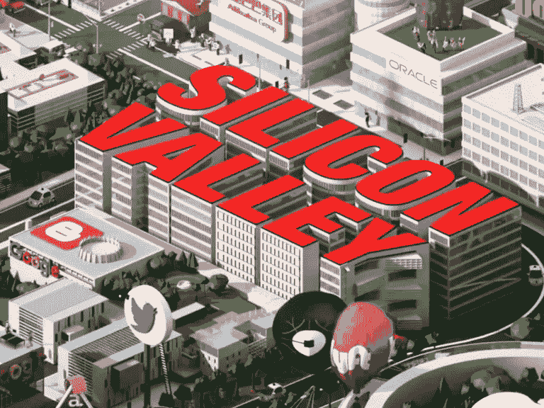

# 商业化硅谷真正的大秘密。

> 原文：<https://medium.datadriveninvestor.com/commercialization-silicon-valleys-real-big-secret-2be03858b56c?source=collection_archive---------4----------------------->

## 科技可以令人兴奋，也可以令人眼花缭乱。没有用途的技术是无用的。这就是硅谷做对的事情。

我最近在 AIM 启动会议上发言，我们有一个关于沙特经济转型的小组。

其中一个出现的关键问题是如何处理技术。这听起来可能有违直觉，尤其是在我们所处的强大的技术驱动时代。

秘密在于商业化过程和支持它的生态系统。这正是硅谷。

技术是达到最终目的的手段，最终目的是创造价值。这是像穆罕默德·本·萨勒曼学院和阿卜杜拉国王科技大学这样的沙特机构正在努力的地方。

随着最近的转型运动，企业家、投资者、政策制定者和学者正变得比以往任何时候都更加一致。

拥有一个强大的创业生态系统的底线是商业化过程。该流程由几个主要类型的参与者和中介组成，他们扮演着润滑车轮的角色——直接帮助创业公司实现交付的服务提供商是那些参与专业服务的人，这些服务帮助创业公司实现增长和规模扩大。

在更成熟的创业生态系统中，你会发现那些在商业化中发挥重要作用的人是已经退出几家公司的企业家。

我看到许多新兴的创业生态系统过度关注技术，而忽略了商业化过程。

