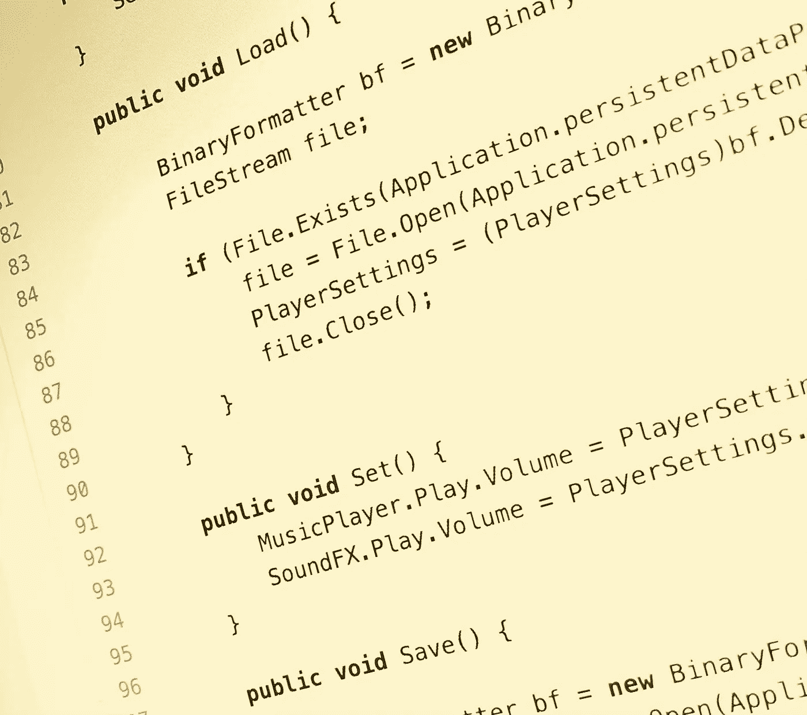

# 常见的开发人员陷阱，即使是老年人也难以摆脱

> 原文：<https://medium.datadriveninvestor.com/common-developer-pitfalls-that-even-seniors-struggle-with-6103785e4935?source=collection_archive---------0----------------------->

几十年来，我一直在建立网站、软件和服务。我和几十个全栈开发人员一起工作、管理和指导过。在我的职业生涯中，我和许多有类似问题的人一起工作过。我也是这些开发者陷阱的受害者。以下是如何克服最常见问题的建议。

# 如果你早餐想吃鸡蛋，就不要建农场。

我经常看到这种情况——许多开发人员会过度设计一个简单的项目，因为有一天他们可能需要添加计划中没有的额外功能。这使得代码更加复杂，需要更长的时间来编写，推迟了最后期限，并且需要大量的测试。相反，试着把注意力集中在手头的任务上，而不是项目在未来可能的样子。当你的用户开始使用你的产品时，你可能不得不重写那些额外的特性，因为用户是可靠的，他们不会按照你期望的方式行事。

# 选择你需要的工具并坚持使用它们

当你从零开始时，关键是只使用完整的、经过验证的、满足你当前项目需求的工具。使用这些工具的当前版本，您的项目应该能够完成并完成您所期望的一切。如果你发现自己在想"*哦，这个框架将在我完成的时候退出测试版*"或者"*这个功能可能会在两个月后推出*"那么这些都是该工具不能满足你需求的迹象。此外，当查看开源项目时，查看它们更新的频率，存在多少未解决的问题，以及有多少活跃的贡献者。一个陈旧的项目或只有原作者作为贡献者的项目是你应该去别处看看的信号。

大多数编程语言都有指定和锁定工具版本的方法。您可能希望最多在一个主要版本中锁定它们。例如，你可以说:“*对于这个特定的工具，我只想要版本 2。** “或者更好” *2.4。** ”。你不想花时间不断升级你的工具包，而不是做实际工作。

# 学会使用你的工具

如果你正在使用一个框架，那么对于你试图克服的问题，可能有大量的内置解决方案。也许是一些数据库查询或数组/对象操作的特殊助手。我看到许多定制代码可以被框架已经提供的更简单的解决方案所取代。开始新任务之前，请阅读文档。不要害怕钻研框架的代码——这不仅会帮助你理解一个特定的功能是如何工作的，而且看一看专业编写的代码会帮助你进一步发展你的技能。

确保您使用的是好的编辑器或 IDE。了解它的键盘快捷键和代码片段。制作您自己的代码片段以加快常见任务的速度。最重要的是，学会调试。打印出你变量的内容或者单词" *here* ，看看你是否把它做成一个 *if 语句*是不是正确调试。如果只是快速调试，那么输出变量的内容就可以了。然而，如果要花一分多钟来解决问题，请使用调试器。它将向您显示所有活动变量的所有值，并引导您通过代码路径。有价值的信息和巨大的时间节省。

# 糟糕的评论比没有评论要糟糕得多

什么是差评？这是一个显而易见的评论。这是一个没有解释代码块实际上做什么的注释。例如，一个名为*的函数 FetchExtractProcessData* 带有一个注释，写着“*这个函数负责获取、提取和处理数据。那个评论没有给你任何解释。其他不好的注释包括过时的语句、不再维护的代码或者糟糕的和误导的语法。你也不需要陈述显而易见的东西或者解释框架如何工作的注释。*

# 一个注释盲能读懂你的代码吗？

这是一个有趣的任务。将代码库中的所有注释全部删除。还能有人毫无困难地读懂你的代码吗？上面的 *FetchExtractProcessData* 例子是一个糟糕的命名例子。它没有解释这个函数实际上在做什么，多个动词表明它做得太多了。

更重要的是，函数、类和变量要有正确的名称和明确的定义。不要缩写任何一个。使用自然语言，但是尽量保持变量名和函数名简短，最多三到五个单词。使用代码棉绒和格式保持东西整洁，易于阅读。确保你遵循的是你的编程语言已经存在的标准，而不是建立你自己的标准。

# 面向用户的前端比后端更重要

这可能看起来有争议，但毫无疑问，你的前端比后端更重要。除非你的项目不是面向人的，或者意味着被其他应用或服务消费，那么你的前端应该是你的主要关注点。

您可以以后再担心扩展、缓存和优化——毕竟，您不会神奇地从一百万用户开始。如果你这样做了，那么这是一个很好的问题，并认为自己很幸运。想想你使用的所有网站和应用程序。您使用它们是因为它们运行最新、最棒的技术堆栈吗？不，你使用他们是因为他们以一种你觉得容易消费的方式呈现他们的内容，并且他们的体验不会令人沮丧。

这不是对后端代码或开发人员的打击，没有一个适当的基础，整个项目将崩溃。然而，不要花费大量的时间在那些只有你或极少数人会看到或使用的东西上，或者那些对你的项目的成功并不重要的东西上。永远要考虑大局。

# 你在为一个真实的人建造，而不是一个工程师

了解你的受众并围绕他们设计体验是很重要的。你不会想要一种只有工程师才懂的语言。“*中止*”、“*系统故障*”、“*危急问题*”会把你的用户吓跑。使用简单、自然的语言，让他们能够理解并感到舒服。不要从数据库中读取并按原样发布。如果您使用“ *destroy* ”来表示一条记录从数据库中被删除，这很好，但是不要告诉别人。“*您的评论已被成功删除*”比“*成功:记录被销毁*”友好多了。

# 最后的想法

在努力追求完美的同时，你很容易陷入日常生活中。偶尔退一步，看看更大的图景。是你正在做的事情导致了进步，还是你在一个并不重要的方面花了太多时间。保持事情的干净和简单，记住你的听众。最重要的是，玩得开心。编码不应该感觉像是一件苦差事。更多建议，请在 twitter 上关注我(@tkaravou)