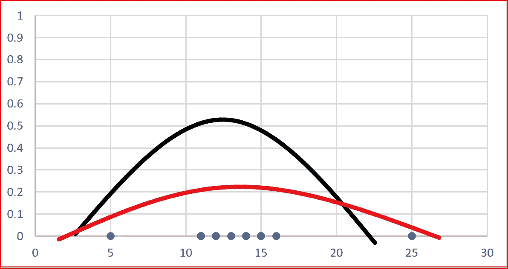
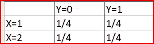
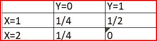
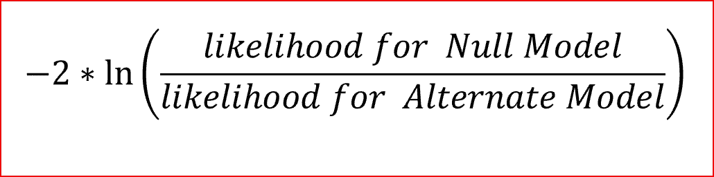
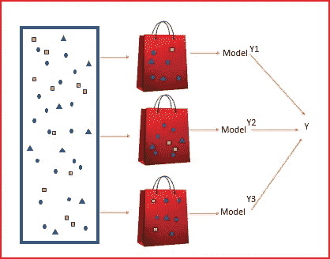
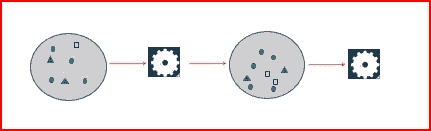

# 常见机器学习术语及其解释

> 原文：<https://medium.datadriveninvestor.com/common-machine-learning-terms-and-their-explanation-part-1-41e66708547?source=collection_archive---------1----------------------->

*在本帖中，我们将尝试理解机器学习中使用的一些常用术语，如最大似然、联合概率、似然比、判别和生成模型、打包和提升*

# 最大似然估计

我们打算找到模型的参数，使模型产生观察值的可能性最大化。

如果我们有 9 个数据点，如下图所示。我们需要决定哪条曲线最有可能生成观察到的数据。

对于上面的图，我们可以使用高斯(正态)分布。高斯分布有两个参数均值和标准差。不同的平均值和标准差会产生不同的曲线。

在我们的例子中，最大似然法将找到给出描述数据的最佳曲线的平均值和标准偏差值。

# **联合概率**

如果我们有 4 个数据点(1，1)，(1，0)，(2，1)，(2，0)，那么联合概率如下所示

Joint probability of (1,1), (1,0), (2,1), (2,0)

假设我们有另一组 4 个值(1，1)，(1，0)，(1，1)，(2，0)，那么联合概率将是

Joint probability of (1,1), (1,0), (1,1), (2,0)

# 概率比

我们创建了两个模型来预测癌症的存在。模型 1 包括人的年龄、癌症家族史等特征。模型 2 包括诸如人是否吸烟、人的年龄、癌症家族史、压力水平等特征。

两个模型都被最小化并给出目标函数值。我们如何决定哪种模式更好？

最佳模型是最大化似然函数的模型。将产生大部分观察值的模型。

**似然比使用对数似然函数比较两个模型的拟合程度。**

模型 1 是我们的零模型，模型 2 是我们的替代模型。在我们的例子中，零假设表示一个较小的模型，即模型 1 给出了最佳拟合

Log Likelihood Ratio

当上述比率较大时，我们拒绝零假设中的模型和备选模型是最佳拟合

当比率较小时，我们接受零假设中建议的模型，并且该模型是最适合的

# 生成量词和区别量词

## 生成模型

*   生成模型学习输入数据 x 和输出数据 y 的联合概率 *P(x，y)* ，基于 p(x|y)进行预测。给定输出标签 y，它们重建输入 x
*   给定数据，它识别潜在特征表示。
*   如果一个人患有癌症，那么有哪些特征可以帮助识别癌症的存在。创成式模型有助于重建输入数据。
*   生成模型了解各个类的分布
*   在异常值上运行良好
*   创成式建模可以从样本数据生成新的数据点
*   例子:朴素贝叶斯、受限玻尔兹曼机、深度信念网

## 判别模型

*   判别算法对条件概率 p(y|x)进行建模。他们这样做时没有对输入分布做任何假设。
*   鉴别分类器明确地学习类别之间的边界。给定数据，判别模型预测特定数据所属的类别。
*   给出一组特征，如年龄、家族史、体重、这个人是否吸烟。判别模型可以预测该人是否会患癌症。
*   判别模型在异常值上表现不佳
*   示例:决策树、SVM 是判别算法。

如果有一个有效的算法可以解决一个问题，那么这个问题就叫做易处理的。

如果没有有效的算法来解决一个问题，那么这个问题就叫做棘手。

# 装袋和增压

*   打包和提升是**集成技术**，其中我们**组合一组弱学习者来创建强学习者以做出更好的预测**。
*   打包和提升通过替换随机采样从训练集中生成附加数据。

***什么是合奏技法？***

*让我们通过一个例子来理解这一点，在这个例子中，我们希望了解两种或两种以上的产品是相同的。*

*我们可以比较产品名称或品牌或尺寸。我们还可以对比一下产品的内容*。

*每个单独的学习者都无法帮助我们准确预测产品是相同还是不同，但是如果我们将上述所有学习者——产品名称、品牌、尺寸、产品内容——结合起来，我们就可以很有把握地预测产品是相同还是不同。*

这是合奏技巧。

在集成技术中，我们**组合一组基本学习器或使用多种学习算法来改进预测**。在典型的机器学习算法中，我们试图学习一个假设。在集成技术中，我们构造一组假设，然后组合它们。

对于分类，每个基础学习者可以投票，投票最多的类将是预测。这种方法称为**最大投票**

对于回归，我们可以给每个学习者分配不同的权重，然后取一个**加权平均值**。

集成机器学习算法的例子是随机森林，它使用多个决策树来进行更好的预测。

*让我们也了解一下什么是有替换的抽样和无替换的抽样*

我们一个袋子里有 4 颗红色、蓝色、绿色和黄色的弹珠，需要随机挑选两颗。首先，我们挑选红色的大理石。

如果**随机抽样并更换**，我们会将弹珠放回袋子中。当我们选择第二次时，我们可以选择红色的弹珠或不同颜色的弹珠。

如果**随机取样而不更换**，我们不能再将红色大理石放入袋中。这意味着我们不能再次选择相同的大理石。

现在，我们已经了解了集合技术、置换取样和非置换取样以及装袋和增压之间的相似性。让我们深入了解装袋和增压的区别

## 制袋材料

Bagging

*   装袋是 **B** 鞋带 **Agg** regat **ing**
*   并行运行
*   Bagging 独立地运行每一个模型，然后在最后汇总输出，而不偏向任何模型。
*   Bagging 生成多个版本的预测值，然后聚合这些单独的预测值以获得最终的预测值
*   最终预测值基于各个预测值的投票
*   帮助减少差异

## 助推

*   串联运行
*   每一个运行的模型，决定了下一个模型将关注什么特性。助推全靠“团队合作”。
*   使用加权平均将弱学习者变成强学习者
*   当 boosting 运行每个模型时，它会跟踪哪些数据样本最成功，哪些不成功。具有最多错误分类输出的数据集被赋予更重的权重。这些被认为是更复杂的数据，需要更多的迭代来正确训练模型。
*   在 boosting 中，模型的错误率被跟踪，因为更好的模型被赋予更好的权重。
*   在提振过程中，结果更好的模型对最终产出的拉动更大。

**希望这有助于你理解一些机器学习术语。**

像我一样，如果你也有理解一些机器学习术语的困难，那么请回复这篇文章，也许我可以帮助你。

# 如果你喜欢这篇文章，请分享并鼓掌！