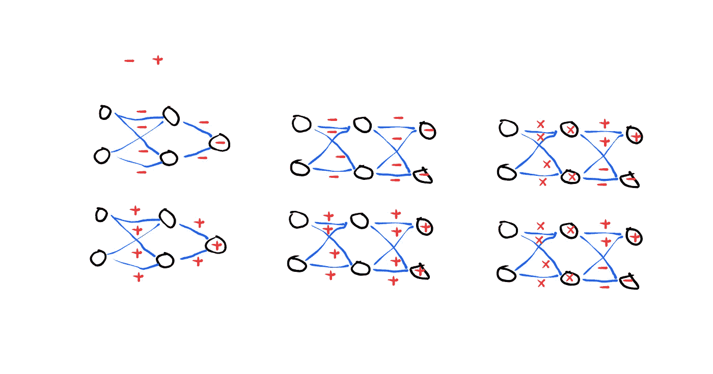

# 介绍性反向传播的常见陷阱

> 原文：<https://medium.datadriveninvestor.com/common-pitfalls-of-introductory-backpropagation-dc6e1e87f4f4?source=collection_archive---------12----------------------->

TL；DR；一些常见的“人工智能入门”课程不会教人工智能爱好者如何处理深度学习(神经网络)中经常遇到的几个陷阱。这篇文章解释了如何处理一个最常见/最臭名昭著的问题。

使用反向传播(BP)、sigmoidal 激活函数(SIG)和均方误差成本函数(MSE)解决简单的 XOR 问题时，可能会出现许多问题。也就是说，网络不太可能收敛于“理想”权重。

当在神经网络上操作时，能够有效地更新网络的权重是很重要的。除非网络在最初的猜测中偏差很大，否则调整权重的过程应该看起来像一个来回的过程(想想钟摆)。然而，在 BP-SIG-MSE 网络中，能够“摆动”(+/-)权重的唯一因素是权重本身“w”和输出神经元的误差“e”。假设“w”的范围是(0，∞)，唯一的“摆动”因子是“e”。

 [## 用 7 个步骤解释深度学习——数据驱动投资者

### 在深度学习的帮助下，自动驾驶汽车、Alexa、医学成像-小工具正在我们周围变得超级智能…

www.datadriveninvestor.com](https://www.datadriveninvestor.com/2019/01/23/deep-learning-explained-in-7-steps/) 

如下图最左侧的两个网络所示，当“e”是网络中唯一的“摆动”因子时，所有权重将对称更新，从而收敛到同一个数字。使用这些技术，处于此范围内的网络将永远不会收敛于理想拓扑。

然而，如果将“w”的范围增加到(-∞，∞)，那么网络就有可能收敛到一个理想的解决方案…但即使如此，这也是“抽签的运气”——如果权重没有用正确的符号(+/-)完全随机加权，网络就无法收敛。人们可以用进化技术解决这个问题——或者，如果人们可以在特定连接水平上理论上分割输出神经元传播误差的符号(+/-)，网络可以收敛(例如，最左边的两个网络将具有交替的+/-符号)。

为了在网络中引入足够的“熵”使其收敛于某个问题，需要为每个可分类的值增加一个输出神经元；在“异或”的情况下，这将是“真”和“假”；在图像分类器的情况下，可以做“狗”、“猫”、“鸟”、“蛇”和“鱼”——需要 5 个输出神经元。

理论上，可以使用最左边的两个网络来创建一个 XOR 网络。但是许多普通的技术——今天教授的——不会让这成为可能。

一种潜在的更强大的算法是神经进化算法，它可以对连接权重进行操作，而不是网络拓扑；或者，将“类似多路复用器”的工具/功能引入神经元将有助于收敛于理想权重分布的过程。