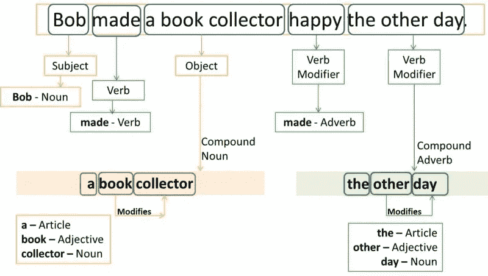
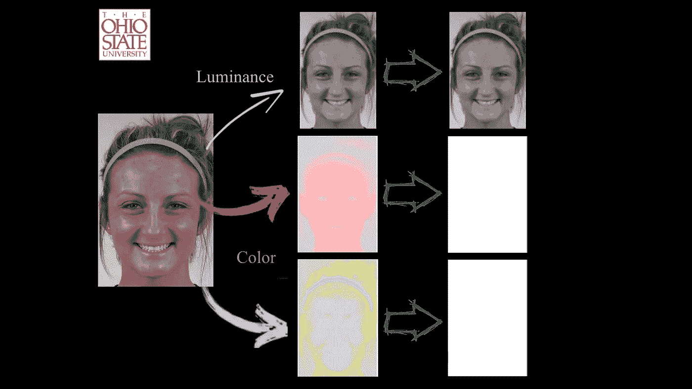

# 与计算机的通信

> 原文：<https://medium.datadriveninvestor.com/communication-with-computers-64ed7fb4478d?source=collection_archive---------3----------------------->

“对不起，你能重复一下吗？”

“原谅我？”

当然，还有我最喜欢的:“什么？?"

 [## 模式和机器人:一个复杂的现实数据驱动的投资者

### 哈耶克的名著《复杂现象理论》(哈耶克，1964)深入探讨了复杂性的话题，并断言…

www.datadriveninvestor.com](https://www.datadriveninvestor.com/2019/03/04/patterns-and-robotics-a-complex-reality/) 

仅仅通过阅读这些短语，你就可能想到它们是对你说的，或者是由你说的。你可能会想到当有人不理解你时是多么令人讨厌，或者当你问了别人三次，你仍然不知道他们说了什么，所以你只是说“是”或尴尬地点头时是多么令人沮丧。不要再点头了！继续阅读，了解一些令人惊叹的人工智能技术，这些技术可能会改变我们思考沟通的方式！

When someone has asked you 3 times to say it again

## 自然语言处理

自然语言处理是人工智能的一个分支，它帮助计算机理解、解释和操纵人类语言。它的主要目标是在计算机和人类之间架起沟通的桥梁。由于各种不同类型的数据和应用程序，没有一种最好的方法可以做到这一点，但一般来说，NLP 将语言分解成更短的基本部分。这有助于它理解各部分之间的关系，以及它们如何组合起来形成一个意义。

NLPs 的一些基本任务包括:

*   记号化:获取一个文本并把它分解成单个的单词(记号)
*   词汇化/词干化:提取单个单词并找到词根
*   词性标注:将单词标注为名词、动词、形容词等。
*   语义标注:给单词贴上标签，如代理人、病人、目标等。

Breaking down a sentence

一旦 NLPs 可以完成这些任务，它们就可以用来理解文本或生成自己的文本。第一个想法，理解文本，被称为自然语言理解(NLU ),用于让计算机理解你在说什么。第二个想法，生成文本，被称为自然语言生成(NLG)，用于让计算机创建自然语言的句子和短语。

NLP 的一些挑战包括:

*   词汇歧义:当一个词在一个句子中可能有不同的意思。《出埃及记》“我看到一只蝙蝠。”“球棒”可能是一种会飞的生物，也可能是一根棒球棒。
*   句法歧义:一个句子可能有不同的意思。《出埃及记》"雅各布用一只眼睛看着那只狗。"这个句子可能意味着这只狗有一只眼睛，或者雅各布用一只眼睛看。

## 情感识别

> “到 2022 年，你的个人设备会比你自己的家人更了解你”。-高德纳研究副总裁安妮特·齐默曼

你可能认为这种说法很疯狂，但就在这种说法发表两个月后，俄亥俄大学做出了一种比人类更擅长识别情绪的算法。该小组使用了 184 个人的 18 种不同面部表情的图像。这些人是不同性别、种族和肤色的混合体，每个表情都有多张照片。

他们发现，一个人脸上的色调比他们实际的表情更能决定他们的感受，因此该团队将表情的色调融入到中性的脸上，并要求参与者猜测这个人的感受。然后他们给电脑看同样的图片来猜测。结果，计算机能够比人类更准确地猜测出 20%的快乐，15%的愤怒，同样准确地猜测出悲伤，并且还检测出参与者甚至没有意识到的恐惧！

Finding the hues in someone’s face

他们的算法启发了其他人开始思考情感检测的新方法，这种方法可能会更加准确。另一个识别情绪的例子是 [Affectiva](https://www.affectiva.com/emotion-ai-overview/) 。他们的想法是一个两步过程，从面部表情和言语中检测情绪。为了从面部识别情绪，它使用计算机视觉算法来标记关键特征，如嘴角或眼睛的边缘。然后，这些区域被像素化，并由深度学习算法进行分析，以对表情进行分类。然后，这些表情被组合起来，映射到情感上。为了从语音中识别情绪，他们的软件分析单词是如何在音调、响度、速度、副语言和语音质量等特征中说出的。然后把人脸识别和语音识别结合起来，真正识别你的情绪。

我意识到这只是计算机理解你感受的一小步，但这是朝着正确方向迈出的一步。

## 为什么重要？

好吧，所以电脑越来越了解你了。谁在乎呢。这跟人生有什么关系？让我展示给你看:

是的，你的私人助理无论是 Alexa、Google Home 还是其他任何设备都使用自然语言处理来理解你。每次你对它说话，它都会在几秒钟内完成所有的处理，为你提供最好的服务。这些类型的设备是最明显的用途，但还有哪些我们可能没有意识到的更综合的用途呢？嗯，你用过像*这样的文字检查软件吗？像 *Wordreference 这样的语言翻译器怎么样？*像*的确*这样的求职网站呢？这些程序都使用 NLP 来阅读和理解你的文本，然后纠正它，翻译它，或者匹配它。我们不一定会想到的 NLP 的一个例子是针对盲人或聋人的。有一些软件使用 NLP 为盲人大声朗读文本或为聋人翻译语音。*

酷，我们发现了自然语言处理的用途，但是情感识别呢？计算机如何知道你在感受什么帮助？一个更突出的原因是医疗保健。如果人工智能算法可以看到你的感觉，这将极大地改善心理健康应用程序。通过说出你的感受，它可以给出更好、更直观的建议，也更有同情心。情绪识别的另一个用途是定向广告。如果你在浏览 Instagram、玩游戏、阅读文章甚至看电视时开着相机，这些公司可以使用情绪识别软件来找到你最适合回应的广告，并将这些广告对准你。情绪识别对自闭症患者也非常有用。有些不是用我们理解的方式来表达自己的情绪，但是有了这个软件，我们可以试着去联系和理解更多。

## 关键要点

*   人工智能正在改变我们的交流方式
*   自然语言处理(NLP)是人工智能的一个分支，帮助计算机理解和操纵人类语言
*   自然语言处理的挑战包括词汇和句法歧义
*   人工智能现在可以根据你的肤色来判断你的感觉
*   Affectiva 通过面部和语音识别来确定情绪
*   自然语言处理和情感识别都会改变我们生活的方方面面

感谢您阅读我关于与计算机交流的文章，希望您喜欢！请在下面留下评论，让我知道你喜欢什么，我可以改进什么！

如果你想看我的其他文章，可以看看现代时尚背后的科学；人工智能。