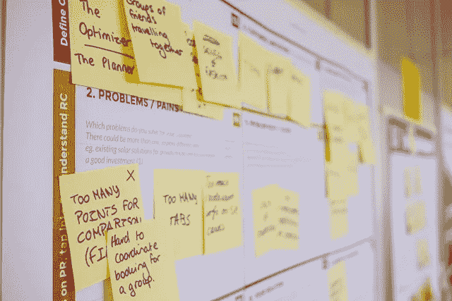

# 通信审计——一个无聊的标题，但却是一个强有力的工具

> 原文：<https://medium.datadriveninvestor.com/communications-audit-a-boring-title-but-powerful-tool-cac660dced6?source=collection_archive---------22----------------------->

=

如果你和我一样，审计这个词会让你翻白眼，叹气。别担心，这是一种常见的反应，尤其是在交流者中。好吧，先别管审计这个词。把[沟通审计](https://howtocommunications.com/downloads/how-to-conduct-a-communications-audit/)想象成截取你组织当前沟通系统和流程的截图。

这都是为了按下暂停键。它环顾四周，评估沟通流程和交付成果，评估哪些有效，哪些无效，哪些需要停止。这种评估可以包括网站内容、平面广告、小册子、社交媒体帖子、信件、新闻稿以及贵组织与其各种受众互动和互动的任何其他方式。

在我们忙碌的生活中，我们经常从一个项目赶到另一个项目。我们很少花时间去分析一个项目的成功。如果你没有衡量你的沟通努力的影响和有效性，你怎么知道你在正确的轨道上？

很少有组织会这样做——这可能会耗费数千美元的员工时间和错误的沟通资金。

## 暂停并评估

一个[沟通审计](https://howtocommunications.com/downloads/how-to-conduct-a-communications-audit/)不需要成为一个令人不知所措或耗时的过程。相反，它可以扩展以满足您的组织和可用资源的需求。

无论您在一家拥有 10 名员工还是 10，000 名员工的公司工作，沟通审计都遵循相同的基本流程。唯一的区别是审计的规模和分配的资源。

## 六步过程

1.  **你在审计什么？**您是否正在评估一项特定的活动(年度冬季促销或流感疫苗活动)？或者更大的范围(您的组织如何在设定的时间范围内与媒体或特定部门的沟通过程打交道)？
2.  **取得一致意见。**不要一个人跑了，去做审计，去做报告——结果发现管理层认为你的重点领域不需要评估，另一个领域需要更紧急的关注。我热衷于举办研讨会，以明确正在审计的内容(尽可能具体地深入)，谁将参与审计，审计将如何进行以及报告流程。
3.  **了解你的组织。它的愿景、使命和价值观是什么？战略重点？企业身份？品牌声音？将这些放在你面前，这样你就可以确定它们是否反映在沟通材料中(或者它们是否追溯到 20 世纪 80 年代)。**
4.  **确立衡量标准。**您是如何监控绩效和衡量沟通的？看看流感疫苗接种活动——与往年相比，今年有多少人接种了疫苗。每个地点的人数，就业群体，内部网帖子点击。你需要弄清楚哪些可以用硬数据来衡量，哪些可以通过故事来衡量(人们的感受，参与度)。
5.  **选择你的工具**。有许多方法可以收集信息。这些包括焦点小组、调查、采访、品牌评论(将一堆宣传材料放在桌子上，看看是否有共同的外观和感觉)等等。您不必使用所有的工具，只需选择最适合您的工具。
6.  **报告完毕**。总结沟通对组织的重要性。确定优势领域(从积极的方面开始)、增长领域和不奏效的领域。对审计建议进行优先排序，确定如何最好地利用这些信息来加强沟通过程。

如果您觉得这一切有点令人不知所措，请查看我的[如何进行沟通审计](https://howtocommunications.com/downloads/how-to-conduct-a-communications-audit/)包，其中包括逐步说明、培训视频以及样本访谈、焦点小组和调查问题(在沟通审计中经过尝试和测试)，以帮助您完成这一过程。

那么，是什么阻止你花时间去评估沟通过程和交付物在你的组织中的影响和有效性呢？你如何利用学到的知识来节省时间和金钱或重新分配现有资源？

如果你有任何问题，[给我发邮件](https://howtocommunications.com/contact/)。我很乐意帮你弄清楚通信审计如何成为你的新朋友。

这篇文章也作为博客文章出现在[如何沟通](https://howtocommunications.com/communications-audit-a-boring-title-but-powerful-tool/)上。