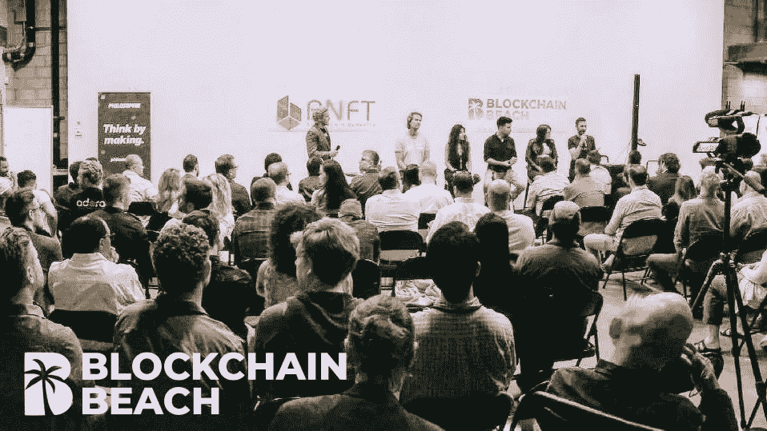
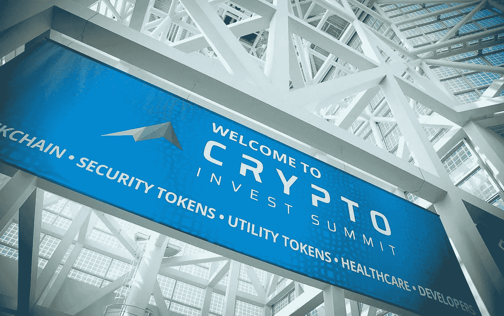
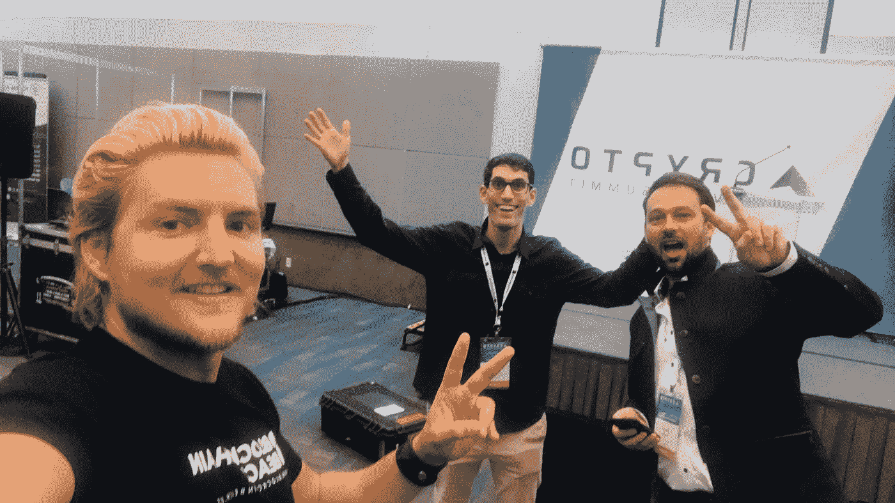
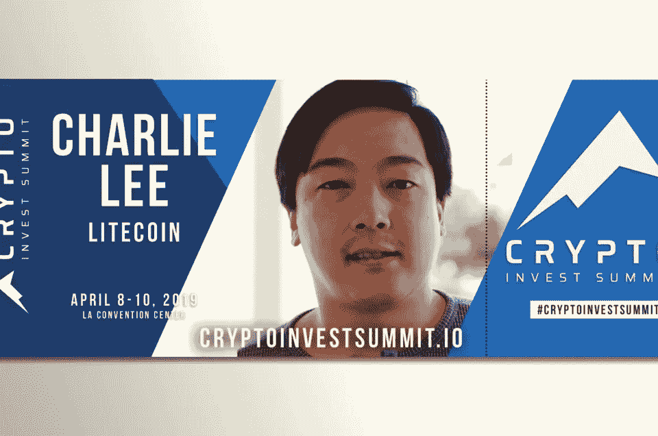

# 更多的社区有最好的食材…更少的盐。

> 原文：<https://medium.datadriveninvestor.com/communities-with-the-best-ingredients-less-salt-d267b16aea04?source=collection_archive---------12----------------------->

Blockchain Beach June 2018: Blockchain Entrepreneurs Strategy and Community Education meetup

自第一笔比特币交易发送给哈尔·芬尼(Hal Finney)以来的过去十年里，[区块链技术](https://everipedia.org/wiki/lang_zh-hans/blockchain-2/)和[数字资产](https://everipedia.org/wiki/lang_en/Digital_asset/)创造了一个丰富的“Web 3”可能性景观。

无论你最初收到的是[比特币白皮书](https://bitcoin.org/bitcoin.pdf)，用过的是[丝绸之路](https://everipedia.org/wiki/lang_en/Silk_Road_%28marketplace%29/)，读过的是 [Mt. Gox](https://everipedia.org/wiki/lang_en/Mt._Gox/) ，迷恋的是[以太坊](https://everipedia.org/wiki/lang_en/Ethereum/)，还是去年才买的[莱特币](https://everipedia.org/wiki/lang_en/Litecoin/)…在分布式账本技术世界中导航，并对新的复杂信息形成有组织的理解，对我们大多数人来说都是一个问题。

解决方案，就像技术一样，在社区里。

> **“领导者不会创造追随者，他们会创造更多的领导者。”—汤姆·彼得斯**

2019 年是社区作为领导者走到一起相互支持的一年，同时教会新人如何在[去中心化](https://everipedia.org/wiki/lang_en/Decentralization/)的新时代发展。

 [## 经济就是要包括人-数据驱动的投资者

### 建模，数据，最重要的是，人 Tayo Oyedeji 博士在他的食谱中混合了所有这些成分，为一个…

www.datadriveninvestor.com](https://www.datadriveninvestor.com/2019/03/06/economy-is-all-about-including-people/) 

Crypto Invest Summit: The United States’ largest cryptocurrency and blockchain conference (Los Angeles Convention Center)

加密投资峰会，CIS，是美国最大的会议，也是社区网络和教育的领导者。每年两次，该峰会连续三天聚集了开发商、企业家、初创公司、天使投资人、风险资本投资人、零售投资人、家族理财室、房地产投资人、发行人、交易所、经纪自营商、服务提供商和媒体成员。

“阿龙和约瑟夫是我们有幸与之共事的最真诚的会议创始人，真正的绅士，”区块链海滩的联合创始人奥斯汀·戴维斯说。“无论外部世界的现实如何，CIS 的参与者都充满活力，参与牛市的凶猛活动……这是我们每个季度最喜欢的体验之一。”

Crypto Investment Summit Oct. 2018: Austin Davis, Alon Goren, Josef Holm (left to right)

区块链海滩是世界上最大的区块链社区之一，每年都与 CIS 合作。该社区将支持 2019 年 4 月的会议，以提供丰富的教育内容，并帮助每个与会者建立积极的关系网。

# Litecoin 基金会和 Crypto Invest 峰会合作伙伴，旨在教育加密货币和区块链投资者、建设者和开发者

Crypto Invest Summit Announcement: Charlie Lee and Litecoin Foundation partnership for April 2019 conference

“我非常期待 Crypto Invest 峰会。教育是关键，”Litecoin 的创始人兼 Litecoin 基金会董事总经理查理·李说。“我们很高兴能与 Crypto Invest Summit 合作，计划举办多场会议，专门教育开发人员如何构建比特币、莱特币和闪电网络。”

在一份联合声明中， [Crypto Invest Summit](https://cryptoinvestsummit.io/) 和早期投资基金 GHV 的创始人 Alon Goren 和 Josef Holm 表示，“每条赛道都致力于帮助我们完成将区块链技术带给大众的使命。作为该空间的长期建设者和倡导者，查理·李(以及他创建的 Litecoin 基金会)是帮助我们为数千名参与者创建教育内容的完美合作伙伴。”

我也期待着四月份的下一次 CIS

最重要的是，我很高兴在 2019 年建立更多的社区，提供良好的教育和相互支持。

区块链海滩自 2015 年以来一直在技术教育、新闻、博客、媒体和活动制作方面开展业务。区块链海滩举办活动和工作坊；创建与区块链技术相关的内容和时事通讯；为对区块链技术感兴趣的人进行实践培训；提供建立联系的机会；领导团队建设活动；协助应用程序开发；在区块链空间提供教育；新闻和媒体发布、社交媒体，以及为区块链技术相关人员建立社区。

了解更多关于我们: [www。BlockchainBeach.us](https://www.blockchainbeach.us/)