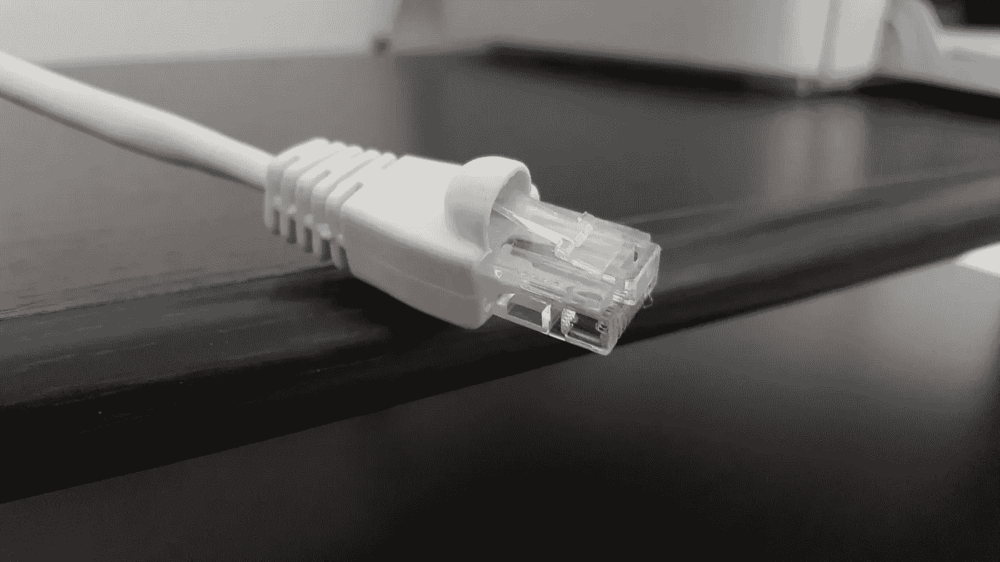

# 社区宽带让我成为了一名真正的脐带切割者

> 原文：<https://medium.datadriveninvestor.com/community-broadband-has-made-me-a-true-cord-cutter-ec2f7fdccc63?source=collection_archive---------10----------------------->

我现在可以说我是一个真正的脐带切割者。我不再直接或间接地为有线电视或卫星电视付费。我再也不用担心我付给 ISP 的钱会被用来损害我的利益。我不再需要担心我为互联网接入支付的钱被用来补贴体育网络(只有上帝知道我有多鄙视 ESPN)。

几天前，我的妻子发现了一个非常有能力的天线，用于无线高清电视。有了这个新天线，我们可以清晰地接收到 61 个频道，大部分是本地的，还有一些是全国性的网络。我再也不会因为支付了订阅费而被迫观看充斥着商业广告的电视节目。如果我想了解当地的天气，我可以。我的孩子可以观看当地 PBS 电视台的儿童电视节目。那根天线是我切断脊髓的最后一块拼图。

 [## 物联网危险剪断-数据驱动的投资者

### 物联网危险剪断-数据驱动的投资者

物联网危险剪断——数据驱动的 Investorwww.datadriveninvestor.com](https://www.datadriveninvestor.com/2018/09/26/infographic-dangers-of-the-internet-of-things/iot-dangers-snip/) 

从传统意义上来说，作为一个不再订阅有线电视或卫星电视的人，我已经做了很多年的脐带切割工。但直到我能够注册我们当地的社区宽带服务，我才能够完全断开与 CenturyLink 的连接，避开犹他州的康卡斯特。

我已经计划这个时间很多年了。我多年来一直倡导。我一直在写信、打电话和写文章来支持我们当地的社区宽带服务，乌托邦光纤。去年早些时候，我从一家私人互联网服务提供商实现了向社区宽带的飞跃。就在那时，我加入了乌托邦光纤，最后一次告别了康卡斯特和 CenturyLink。

在长达十年的时间里，我不得不经常与 CenturyLink 和 Comcast 保持联系，这取决于我住在哪里以及可以获得哪些服务。十年前，当我买下我以前的房子时，我发现自己在一个只有 5 Mbs 互联网接入的家里漂泊。每次我运行微波炉时，调制解调器都会失败，当微波炉停止时，调制解调器就会恢复。CenturyLink 只能保证 80%的广告速率，所以我得到了大约 4 兆字节，而不是 5 兆字节。一年半以来，我试图获得更好的速度，但没有成功。

我打电话给乌托邦，因为他们应该在我的城市，西谷市提供服务。受到犹他州立法机构的阻碍，现任互联网服务提供商提起的诉讼，以及普遍认为乌托邦对市政当局来说是一个巨大的风险，乌托邦缓慢前行，但他们的建筑停在离我家一个半街区的地方，没有任何迹象表明他们有任何进展。

直到我在一次家庭展览中偶然发现康卡斯特的广告，我才开始寻找更快的速度。女售货员咄咄逼人，我利用了这一点。在我住的那条街上，西边有康卡斯特，而我住的东边没有。"你想注册康卡斯特吗？"
“当然。但前提是你能帮我牵线。”

我告诉她，自从我搬进那栋房子后，每隔几个月，我就会打电话给康卡斯特，看看他们的服务是否可用。“你不在我们的数据库里”，每次我都会得到这样的回答。这个女人知道我在说什么。她一定知道怎样才能让我上钩，因为两周后，我告别了 CenturyLink，向康卡斯特问好。

我知道康卡斯特上人人都爱恨。但我不得不说，我从 CenturyLink 转到 Comcast 是一个巨大的解脱。我得到了 50 兆字节，并支付了 25 兆字节。我有可靠的服务。我几乎不需要和他们说话。嗯，一年一次，我不得不与他们的“客户保持计划”交谈，以便在年度利率上涨后谈判一个较低的利率。我觉得很奇怪，康卡斯特需要一个客户保留部门，而这个市场在 5 Mbs 以上几乎完全没有竞争。在我不得不搬家之前，生活是美好的。

我不得不搬家，因为我街对面的房子，多年来吸引着警察和消防队的活动，决定升起邦联旗帜。后来，房子里发生了一场打斗，一个邻居报了警，房主因持有和制造毒品而被捕。然后他们从邦联旗变成了骷髅旗。我有个孩子。我又生了一个。我想出了一个移动的方法。我确实动了。

回到世纪链接的怀抱。但是这一次，他们提供了更好的速度，而不是更好的服务。这次我有了一个更可靠的连接，但在这个地方，我的第二个家，他们对提高价格更加积极。因此，我更加积极地推动社区宽带成为我所在城市每个人的选择。我参加了市政厅会议。我写了更多的文章。我和我在城里的销售代表沟通过。我让他们知道我对 CenturyLink 的不满。

由于债务、诉讼和许多人对 Utopia 为其服务的社区所做的贡献一无所知的不友好态度，Utopia 的人们一直在出售订阅和连接。他们继续进行由当地负责人发起的诉讼，这一次他们赢了，一笔 1000 万美元的和解金给了他们所需的现金，让他们实现收支平衡，并加快了他们的建设。但是我仍然不得不等待更好的服务。

然后前年有一天，我听说乌托邦要来我所在的小区。终于，我可以从我必须与 CenturyLink 进行的年度对话中看到自由。终于，我从一家公司那里获得了自由，这家公司显然明目张胆地用他们的钱在我的州购买了一个轻松的垄断企业，并对我的州和当地政府施加了腐败的影响。

我的社区在我们的私人脸书群组页面上议论纷纷。我们分享经验，我们召集销售代表。我们给我家附近参与乌托邦计划的人写了电子邮件。然后他们开始在我们的门把手上挂广告，宣传他们的服务。然后他们在工作的任何地方挖掘，拉纤维，放锥形物。直到所有的基础设施都准备好。

我记得给他们打电话的嗡嗡声，安排对房子进行安装前检查。我告诉他们我希望光纤如何进入我的物业，他们按照我的指示做了。在安装的那天，就在我准备在接近完工的地下室的天花板上挂石膏板的时候，他们来了。时机是完美的。

我记得当他们测试连接时我笑了，给我看 275 向上和 256 向下。我本来打算以每月 52 美元的价格租下那辆 T1。这使得宽带备份变得切实可行。我不再需要担心流媒体电视会挤掉其他流量。我的妻子是美国越南人社区的配音员，她花了一分钟上传她完成作品的音频文件，而不是像以前那样花 20-30 分钟。她已经喜欢上了这项新服务。与 CenturyLink 相比，Utopia 的上传速度非常快。

从那以后，我做的每一次速度测试都是一样的。测试速度从未低于广告速度。永远不会。

更好的是，有了 Utopia，我不必像在 CenturyLink 和 Comcast 那样，每年都要进行“客户保留”的谈话。他们的账单也更简单。报名的时候问了定价的问题。他们说这都是固定费用。我会得到两张发票，每张都有一个项目。有了康卡斯特和 CenturyLink，他们的发票上就多了费用和税收。但乌托邦和我选择的 ISP x mission 就不一样了。在这里，计费简单而透明。

从各方面来看，Utopia 和犹他州历史最悠久的 ISP x mission 的公私合作都比 Comcast 和 CenturyLink 有效和透明得多。通过我的社区宽带服务，乌托邦拥有并出售了物理连接，一个真正的公共运营商。Xmission 提供了对基础设施的访问并对其进行管理。

我正在开发的另一个功能是直接从 Utopia 购买我的连接。购买费用为 2750 美元，但大多数人要么租用线路，要么分期付款。我打算分期付款并加速还款，这样当本金还清时，我的总成本最终会每月下降 30 美元。然后，一个月 50 美元，我就能得到一份工作。我想不出任何其他本地 ISP 提供这种价格，但我愿意打赌，乌托邦是保持其他人诚实。

我在犹他州的社区并不是唯一这样做的。根据[社区宽带网络](https://muninetworks.org/communitymap)的数据，超过 800 个社区已经通过公共和合作的互联网接入提供商实现了自助。这些社区出售债券，创建公私合营的服务或创建合作社，只是为了摆脱康卡斯特、时代华纳、ATT 和威瑞森等大型低效私人互联网服务提供商的控制。同样是这些社区要求更好的服务，却被忽视了。

在多大程度上，社区宽带占据主导地位，就是“市场”在多大程度上未能响应客户对更好服务的需求。每一项社区宽带服务都在创造一大批真正的断线员，这些人不再需要向日以继夜违背他们应该服务的社区利益的 ISP 付费。

继续写。