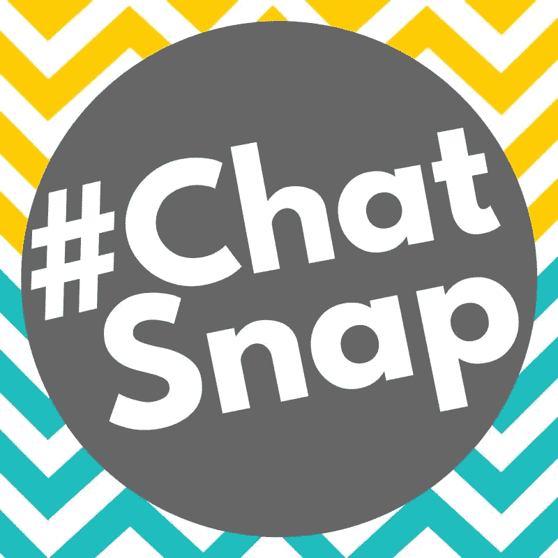

# 社区建设不是一蹴而就的…但很接近了

> 原文：<https://medium.datadriveninvestor.com/community-building-isnt-a-snap-but-close-2eef41bc802b?source=collection_archive---------3----------------------->

所有社交媒体渠道上都有大量的社区。如果你活跃在几个地方，参加许多团体，他们可能会是少数。 [Kristy Gillentine](https://twitter.com/KrisGillentine) 非常了解在各种各样的团体中导航以及建立社区的来龙去脉。

她是 [Drive West Communications](http://www.drivewest.com/) 的公共参与副总裁，也是 [#ChatSnap](https://www.facebook.com/hashtag/chatsnap?source=feed_text) 的创始人和主持人，这是第一个也是唯一一个关于 Snapchat 社区的 Twitter 聊天。

 [## 计划者让社交媒体保持正轨——数据驱动的投资者

### 如果想达到并保持最高效率，忙碌的人会坚持使用系统。这是 Tweepsmap 和…背后的前提

www.datadriveninvestor.com](https://www.datadriveninvestor.com/2019/03/11/schedulers-keep-social-media-on-track/) 

“我有我的推特聊天，我非常热衷于此，但是我邻居的脸书小组是一个很好的社区例子，”吉伦廷说。“那是我住的地方，对我来说很重要，因为这是一个很好的地方，可以更多地了解现实生活中的邻居以及我所在的小镇正在发生的事情。”

要有客户群，你需要建立一个社区。这是一个社交团体，粉丝可以通过它传播你的品牌。

“社区建设是留住观众的绝佳方法，”吉伦汀说。“这是关系建设更进了一步。当一个品牌能够与人联系起来，那就太好了。但当他们能够将这些人相互联系起来时，忠诚度就会提高，令人敬畏的事情就会发生。”

只要人们想社交，企业家想做生意，社区建设就很重要。你在朋友的帮助下度过了难关。

“建设社区的重要性只会继续增长，”吉伦廷说。“社交媒体上有太多断断续续的噪音。当你建立了一个强大的社区，你就直接穿过了噪音。你有一群关心你、关心彼此、关心你要说的话的人。”

# **活动组**

在她的行业和专业领域，她看到许多社区运行良好。

吉伦廷说:“在社交媒体、公共关系和新闻领域，社区比比皆是，它们将对这些话题有共同兴趣的人团结在一起——无论是个人还是交叉。”。每个人都试图保持领先。社区帮助我们每个人做到这一点。

“在 Drive West Communications，我们鼓励客户专注于建设和参与社区，我们指导他们这样做，”她说。“社区让我们能够以前所未有的方式帮助客户锁定他们的沟通目标。”

通过对朋友和家人的群体类型进行分类，脸书似乎拥有最强的社区联系。对于商业、新闻和在以前的陌生人之间建立社会联系，Twitter 鸡尾酒会规则。

“建立社交媒体社区的最佳地点是你所在的平台，”吉伦汀说。“一个伟大的目标:跨平台社区，或跨多个平台的团体。例如，Snap、Twitter 和脸书上的 [#ChatSnap](https://twitter.com/search?q=%23ChatSnap) 社区。

“跨平台的联系确保我们的关系可以比他们所在的平台更长久，”她说。“它们也有助于建立更深层次的联系。不同的网络会展现我们不同的一面。在多个平台上参与只是帮助人们更好地了解彼此。不过，如果我现在不得不选择*的一个*平台，我会选择脸书集团。脸书正在发生*重大*转变[。”](http://www.drivewest.com/single-post/2018/01/22/The-Future-of-Facebook-is-Groups)

# **交叉社区**

吉伦特的核心社交媒体群是彼此的混合体，她的 Snapchat 社区会议是在 Twitter 聊天中进行的。

她说:“大约两年前，我发起了关于 Snapchat 的 Twitter 聊天，我非常喜欢它。“这个社区非常棒，非常支持我们，我们从彼此身上学到了很多东西。它还在成长和进化。令人兴奋的新事物今年即将到来。”

她的 Snapchat 聊天发生在东部时间周三下午 2 点。该社区还在其[脸书小组](https://www.facebook.com/groups/letschatsnap/about/)中进行互动。

“在 Snapchat 上与社区成员联系和互动真的很棒，”吉伦汀说。

对于那些着手建立社交媒体社区的人来说，记住要积极参与。你将建立一个基于你真诚程度的社区。吉伦汀说，这是如何实质性地了解你的现有受众和目标受众:

*   像在任何关系中一样，利用社交媒体投入进来，真诚地努力去更好地了解他人。
*   确定并分享你的故事。
*   不要介意搞砸。不完美和脆弱会导致信任的增长。

“还有，要有耐心，”她说。“社区让我们前所未有地有针对性地进行沟通，但这需要时间、努力和耐心。给自己一些时间来培育和发展你的社区。成功不会一蹴而就。

“问问题，”吉伦汀说。“研究你所在的社区或者你崇拜的社区。向社区领导寻求建议，并询问那些社区的人们他们喜欢什么和不喜欢什么。没有对错之分。你只需要找到适合你的方法。

**关于作者**

吉姆·卡扎曼是[拉戈金融服务公司](http://largofinancialservices.com)的经理，曾在空军和联邦政府的公共事务部门工作。你可以在[推特](https://twitter.com/JKatzaman)、[脸书](https://www.facebook.com/jim.katzaman)和 [LinkedIn](https://www.linkedin.com/in/jim-katzaman-33641b21/) 上和他联系。