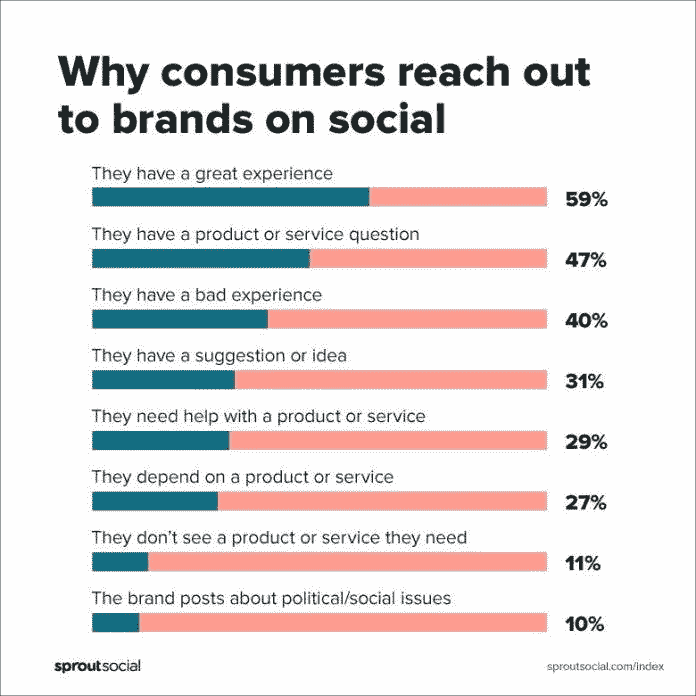

# 公司从客户服务中获得回报

> 原文：<https://medium.datadriveninvestor.com/companies-reap-rewards-from-customer-service-19bdfb6f3332?source=collection_archive---------15----------------------->

## 在危机中出手相救，赢得大胜利

Photo by Blake Wisz on Unsplash

运输公司的成功归功于客户服务。这包括企业对客户和企业对企业的交易。

“作为一名社交媒体客户服务顾问，这是一个非常贴近我内心的话题，”T2 的 Lindo Myeni 说。这位获奖的影响者和战略家是在线就业中心[趋势工作](https://twitter.com/trending_jobs)的首席布道者。在一次[非洲推特聊天](https://twitter.com/AfricaTweetChat)中，他谈到了客户服务，并分享了作为客户服务顾问有效处理危机的方法。

在压力时期，公司需要近乎完美的社交媒体客户服务。

 [## 在暴风雨中，保持冷静，倾听

### 最佳媒体实践拯救混乱中的企业

medium.com](https://medium.com/datadriveninvestor/caught-in-a-storm-stay-calm-and-listen-2e088e6998aa) 

“当使用社交媒体进行客户服务时，在你的回应中表现出同理心大有帮助，”Myeni 说。“这种体验会对品牌忠诚度、销售额、客户流失率、消费者权益和客户保留率产生影响。他们为公司的底线做出了贡献。

“我总是想知道为什么社交媒体客户服务经常被忽视，”他说。“这是你社交媒体战略的重要组成部分。你必须倾听客户的询问，在此过程中调整你的计划，解决他们的问题。"

一个潜在的痛点是社交媒体经理如何处理客户的负面反馈。

“负面评论提供了一个机会，展示你的品牌致力于以透明和换位思考的方式解决任何问题，”Myeni 说。“尽快确认客户的问题，以免它像雪球一样越滚越大，影响其他客户和潜在客户。你不一定需要一个即时的解决方案。

“许多人在网上发布负面评论，因为他们认为他们没有被倾听——在商店里，在电话上或通过电子邮件，”他说。“所以，他们猛烈抨击。一些人这样做只是为了警告他们的朋友不要使用他们认为是不好的产品。”

这就是咨询师通过倾听赚取报酬的地方。

“没有比通过他们自己的反馈更好的方式来了解你的客户需要什么和想要什么，”Myeni 说。“负面评论提供了一个展示你的品牌致力于以透明和换位思考的方式解决任何问题的机会。

“当你听的时候，真的要听，”他说。“你会发现大多数抱怨者都是很好的长期客户。像对待珍贵的朋友一样对待他们，像对待你爱的人一样回应他们。这适用于所有的人类关系——家庭、朋友和商业关系。”

# 所有关于为什么

记住，私人信息是进行艰难对话的好地方。

“不要试图赢得争论，”迈尔尼说。“要有礼貌，表达你的同理心。”

 [## 挖掘客户的力量

### 小型企业通过个性化客户服务获得优势

medium.com](https://medium.com/datadriveninvestor/tap-into-the-power-of-customers-876388cc8f8f) 

第一个问题是，一个品牌何时应该聘请一名社交媒体经理。

“首先解决‘为什么’，”米尼说。“要知道，让你到这里的东西不会让你到那里。此外，作为一名责任重大的企业主，写推文和在 Instagram 上发布照片并不是你的首要任务。

“当你有无人关注的消息，不一致的社交媒体存在，并努力保持创新和与受众相关时，你肯定需要有人负责这项任务，”他说。

虽然“[自动反应](https://arvrjourney.com/how-may-i-be-of-service-lets-chat-e0762e452722)”有一个不好的内涵，但 Myeni 说它们并不“都不好”，可以有所帮助。

“知道何时以及如何自动响应是关键，”他说。“在社交媒体上自动回复让你有更多的时间来创造有价值的内容，并与你的社区进行有意义的互动。

“如果你确实想让你的社交媒体活动自动化，那就花时间学习如何使用这些工具，”Myeni 说。“适当地调整它们，并注意结果。换句话说，让自动化人性化。”

每个客户情况都是定制自动响应的开端。

“如果社交媒体营销有一条黄金法则，那就是一致性，”迈尔尼说。“一个更好的方法是让你的信息或回复自动化。

“我参加了一次会议，会上一位发言者上台告诉数千名数字营销人员，自动化社交媒体发布是邪恶的，”他说。

当自动化社交媒体营销活动成为一项“设置好就忘了”的工作时，这种态度得到了加强。

“我把社交媒体自动化比作烘烤饼干，”迈尔尼说。“当饼干放进烤箱时，你的工作还没有结束。你检查进度，也许准备下一批。

“关注品牌提及，跟踪、分析和回应关于你的品牌和行业的在线对话，”他说。“这是受众研究的一个关键组成部分。如果你没有一个[社交倾听策略](https://www.datadriveninvestor.com/2019/02/26/social-media-listening-keeps-you-plugged-in/)，你就错过了。”

# 使敏感性脱机

有经验的经理会知道什么时候和客户私下聊天。

“需要账户信息的客户查询应该保密，”Myeni 说。“知道哪些社交媒体客服的帖子应该公开或私下解决。”

 [## 快乐的顾客让你的生意成功

### 卓越的服务超越期望

medium.com](https://medium.com/datadriveninvestor/happy-customers-make-your-business-a-success-3d58e34e9827) 

他给出了社交媒体客户服务回应的关键要素:

*   热情友好的开场白
*   为下一步行动提供了简明的指导

社交媒体经理在多大程度上亲自参与客户案例取决于商业规则。

“这取决于公司的社交媒体政策或社交媒体经理，”Myeni 说。"社区管理者应该在直接信息和回复中签名."

同样，品牌推动着它如何改善其社交媒体客户体验。

“这一切都从倾听开始。要积极主动，”米尼说。例如，您可以创建一个操作方法视频或一篇最佳实践博文

社交媒体客户服务的最佳工具始于决策者。

“Response 是提供卓越服务的完美工具，”Myeni 说。“利用协作功能增强团队支持。然后，更大的团队就可以更容易地在平台上协作，轻松地进行对话。”

他提到了几种有助于客户响应的工具:

*   [Buffer](https://twitter.com/buffer) 让你敏锐地监控 Twitter 账户的直接消息、提及和关键词搜索和报告。
*   [Sparkcentral](https://twitter.com/Sparkcentral) 让你可以通过脸书、推特和 Instagram 等多个社交平台与客户实时沟通。它为团队成员提供了应用内消息，因此他们可以专注于社交媒体来处理和解决问题。
*   [营销云](https://twitter.com/marketingcloud) social studio 利用社交倾听发现潜在的客户服务问题。通过整合品牌的社交媒体渠道，你可以全面了解人们对你的评价。
*   其他工具还有 [Agorapulse](https://twitter.com/Agorapulse) 、 [Brand24](https://twitter.com/brand24) 、 [Sprout Social](https://twitter.com/SproutSocial) 、 [Hootsuite](https://twitter.com/hootsuite) 、 [Salesforce](https://twitter.com/salesforce) 和 [io](https://twitter.com/SocialBeeHQ) ，这是 Myeni 的[当前选择](https://socialbee.io/?dst=partners&gspk=bGluZG9rdWhsZW15ZW5pODU3MQ%3D%3D&gsxid=6P0Apxm4gdCJ&utm_source=growsumo)。

# 知道你需要什么

“根据研究，90%的企业将很快利用社交媒体的力量来提供更好的客户服务，”Myeni 说。“在为你的品牌选择合适的社交媒体工具之前，了解你的需求。

“我们也是顾客，我们总是试着设身处地为他们着想，”他说。“开诚布公，真诚地倾听，并始终保持传递快乐的意图是帮助他人的最佳方式。”

 [## 提高你的眼界，让你的顾客兴奋

### 利用社交媒体提升客户体验

blog.markgrowth.com](https://blog.markgrowth.com/raise-your-sights-excite-your-customers-5869f0d3b9f6) 

不满的员工是负面反馈的另一个来源，需要企业和社交媒体经理之间的协调。

“这就是为什么在客户看到你被分裂之前，有一个社交媒体客户服务团队来处理团队或所有者之间的这些问题非常重要，”Myeni 说。“请记住，顾客将品牌视为一个真实的人。

“Twitter 审计是一个非常好的工具，可以了解你的账户里有多少真正的 T1 或 T2 的 T3 粉丝，”Myeni 说。“当我作为一个有影响力的人去推销一个品牌时，我每个月都会进行这些审核。我给推特上 99%的真正的 T4 粉丝打分。”

**关于作者**

吉姆·卡扎曼是拉戈金融服务公司的经理，曾在空军和联邦政府的公共事务部门工作。你可以在[推特](https://twitter.com/JKatzaman)、[脸书](https://www.facebook.com/jim.katzaman)和 [LinkedIn](https://www.linkedin.com/in/jim-katzaman-33641b21/) 上和他联系。

*原载于 2019 年 12 月 9 日*[*https://www.datadriveninvestor.com*](https://www.datadriveninvestor.com/2019/12/09/companies-reap-rewards-from-customer-service/)T22。