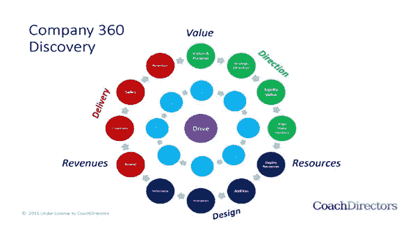

# 公司辅导

> 原文：<https://medium.datadriveninvestor.com/company-coaching-b82d5f293e21?source=collection_archive---------31----------------------->

Gerard O'Donovan 经营的教练博客，我们的目标是不断为那些寻求改善生活的人带来价值。因此，我们有一个政策，出版我们重视和欣赏的客座作者的文章和材料。今天的特邀作者是 Malcolm Nicholson，ICN 记者(英国)。

过去 20 年里，商业教练从高管办公室到高管团队、领导者和领导团队，一直在不断涌现。最近，开明的组织意识到，企业内部的教练文化实际上是有效的。从富时公司到中小企业、公共机构和第三部门组织，这种联系还在持续。辅导也有更大的协同作用(见《ICN》第 20 版加里·r·加斯韦的《高管辅导:将员工转变为领导者——进入辅导蔻驰》)和企业所需的更丰富的干预手段。

从“现场干预”到更大范围的项目，通常侧重于通过改变个人(或小团体)的行为来影响业务结果。作为 ICN 的英国记者，就教练行业而言，我总是在寻找那些“改变局势”的个人或公司。因此，我最近与马克·巴克斯特交谈，他是 [Coachdirectors](https://www.coachdirectors.co.uk/introducing-company-coaching/) 的负责人兼公司教练服务主管。Mark 和 CoachDirectors 开发了一种称为“公司辅导”的方法，这种方法采用标准的教练工具——360 度反馈——并通过内部和外部视角来应用它，以确定公司范围内的抱负和能力之间的差距。然后，重点是优化整个企业的运营模式，为整个组织创造动力和可持续价值。

马克解释说:“这是一种辅导，我们把‘公司’——即在一个企业中一起工作的一群人——视为客户。与大多数高管教练一样，我们的核心是寻求信念模式和行为的转变，让人们在工作环境中变得更有效率。但我们的重点是创造集体绩效的整体转变，以更有效、更容易地提高生产率和利润。

他接着描述了一些由创业成长起来的企业主所经历的心态问题。通常，我们发现中小企业客户将他们的大部分注意力集中在生产和向他们的客户提供他们的产品或服务，并通过他们的贸易或专业来定义自己。但从根本上说，所有企业的共同点是，他们都在寻求控制成本，创造收入，并扩大两者之间的差距，以创造利润。要做到这一点，企业主通常会把大部分注意力放在做他们从创业时就知道的事情上，通过提高销售额和生产率。

马克和蔻驰的董事们发现，这种方法往往会限制企业主，他们变得如此锁定在锅炉房的思维框架，以至于很少到甲板上或商业船只的驾驶台上活动，以专注于经营业务，而不是追逐销售。他们不太容易离开熟悉的领域，将注意力放在管理他们不认识的和/或他们缺乏相关洞察力和能力的业务方面。除了这些影响之外，市场上缺乏明确和一致的管理发展工具，这些工具是专门为中小企业设计的，而不是从公司领域借来的。同样真实的是，中小企业主对 MBA 教授的管理理论不太感兴趣，而更容易接受他们可以轻松获得并应用于实际效果的实用工具。最重要的是，中小企业主只对那些能让他们的生活变得更轻松、让企业变得更好的切实效果感兴趣。

马克更详细地解释了蔻驰董事公司的辅导方法。为了满足这一需求，我们使用一套连贯的商业指导工具来帮助企业主及其团队了解他们可以用来更有效地运营企业的全套工具，而无需诉诸“管理语言”。这些工具清晰易懂，最重要的是实用。这意味着我们可以在董事会和管理层开展工作，并在整个企业中推广应用和使用我们的辅导工具，接触大多数员工。

我们已经尝试和测试了一些干预措施，我们用这些措施来挑战个人商业领袖和他们的团队，让他们站出来，实现他们的潜力。我们从他们及其团队的技术专业知识和技能中取得领先，并在团队中培养同等水平的商业管理专业知识和技能，从而推动业务发展。通过提高团队的业务技能，他们的公司在我们对他们的干预结束后很长时间内继续从我们这里获得价值。“我们在‘全公司范围’与各种形式和规模的进步组织合作，我们要求他们‘加快步伐’去实现他们业务的全部潜力。”

总的来说，我们与客户的合作始于一个事实调查公司 360 流程，在该流程中，我们诊断关键输入，我们可以帮助客户进行修改，以创造他们希望看到的业务变化。这将产生一个指标，帮助我们解释技能差距，这种差距导致了他们的期望和他们当前的业务表现之间的相应差距。

公司教练方法，然后评估十二个关键活动领域的业务管理能力，通过三个时间范围查看需要持续关注的四个重要领域；今天、明天和未来:三个领域涉及公司关注的“什么”;方向是关于公司未来的状态。这个设计是关于为明天构建的资源。交付是指当今的市场活动。第四个领域，驱动，关注公司如何运作；管理方面。在此基础上，他们评估商业诀窍，然后将其嵌入到企业的 20 个重要领域的 5 个深度。

我们将此与进一步的基准测试结合起来，以建立管理团队在领导力的 8 个相关方面的能力水平，如下图所示。

马克举了一个最近成功干预企业的例子。我们一直在与一家家族建筑企业合作，该企业由家族成员管理已进入第二代。当我们遇到他们时，他们的营业额持平在 400 万英镑，他们持续亏损 30 万英镑，已经失去了他们的运气。“整个组织压力很大，首席执行官不愿意接受更多的业务，因为处理当前订单的压力已经让他无法承受。”

在我们参与的第一年，我们支持领导团队创建未来愿景，将企业带入第三代管理层，同时支持他们设计实现新的切实抱负的途径。过去一年里，我们对企业的领导者进行了培训，并在企业中推出了基于培训的生产力框架。

其效果是支持企业领导人重建对自己创造更美好未来能力的信心。它还使营业额从 400 万英镑增加到 600 万英镑，并将亏损转为相当于 30 万英镑的利润。“根据他们第一年的投资回报率，客户参与度很高，我们希望与他们合作，直到我们转移了足够的管理能力，使我们的服务变得多余。”

CoachDirectors 公司的教练方法现在有一系列的案例研究，突出了他们提供客户可以衡量的切实商业利益的能力，并证明了他们的教练费用的投资回报。这种方法要求客户加快步伐，实现企业内部存在的潜在价值。

我们公司的教练方法帮助我们的客户提高他们的水平，同时也提高他们的收入和利润。它还支持一系列管理能力的发展，这些能力可能是客户技能清单中所缺少的，它们阻碍了他们实现自己的商业和个人目标。

那么，这家公司是辅导中小企业的灵丹妙药吗？嗯，从我的讨论来看，如果不是万灵药的话，教练指导者有一个强有力的方法来推进教练过程。这符合在组织中扩大教练足迹的趋势，但以务实和结果导向的方式扩大对客户公司产生重大影响。

**关于马尔科姆·尼科尔森**

[Malcolm Nicholson](mailto:malcolmnicholson@aspecture.com) 是 [Aspecture](http://www.aspecture.com/) 的所有者和教练总监，15 年来与众多高级商务人士成功合作，使他们能够通过转型变革提高业务成果。要了解他如何帮助您的组织，请致电 malcolmnicholson@aspecture.com 或+44 1932 267597 与他联系。

在这里阅读更多内容，不要忘记订阅我的教练博客网站获得免费的教练报告:[https://www.coaching-blog.com/company-coaching/](https://www.coaching-blog.com/company-coaching/)

请访问我们的网站，订阅免费的教练杂志:[http://www.international-coaching-news.net/](https://vk.com/away.php?to=http://www.international-coaching-news.net/&cc_key=)