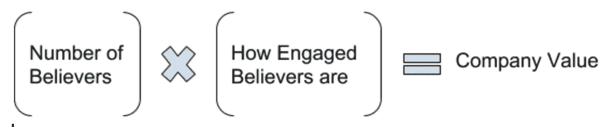

# 公司估值——加密模型只是一种进化

> 原文：<https://medium.datadriveninvestor.com/company-valuation-the-crypto-model-is-just-an-evolution-aa74a9eedf80?source=collection_archive---------3----------------------->

传统公司通常通过查看其资产、收入、利润率和潜在增长进行评估，而加密货币公司仅通过其用户基础设施进行评估。

新兴的互联网行业迫使我们更加重视公司的潜力——它在未来实际上可能成为什么，这是导致互联网泡沫的因素之一，在互联网泡沫中，公司被高估了。

Web 2.0 即社交网络为我们带来了一种模式，一些公司几乎只通过查看月活跃用户的数量来衡量潜在价值，因为这些用户一旦货币化，就可能成为巨大的收入来源。这就是 WhatsApp 这样的公司在几乎没有任何技术、收入或利润的情况下获得如此高估值的原因。

新的加密货币公司模式更进一步，因为公司估值不是通过物理基础设施、技术、收入或利润来衡量的。事实上，代币估值根本不是从衡量这些指标中得出的，而是从衡量硬币的价值中得出的，这就是为什么我们看到数十亿美元的公司几乎没有产品。

加密公司估值地址**光是社会基础设施****——一家公司拥有的社区成员和信徒数量以及他们的参与度。**

**这种模式创造了[“形成合作开发者的全球网络的激励，其互动、迭代思想的供应被编入开放代码软件行”](https://www.technologyreview.com/s/610781/in-blockchain-we-trust/)。这种基础设施非常有价值，将使巨大的颠覆性想法得以执行，因为这些信徒对公司的成功有着重大的财务激励。**

**这种激励在社交网络估值模型中并不存在，它在我们在市场中看到的高估值中发挥了作用。**

## **这就是为什么**密码公司有社区和信徒，而不是用户。****

****密码公司估值:****

****

**Crypto 用户通过项目社区(聊天、论坛、博客、会议等)展示他们的参与。)以及向新的加密项目投入大量资金，这为他们创造了促使公司成功的激励。一些加密模式(如[授权股权证明](https://hackernoon.com/explain-delegated-proof-of-stake-like-im-5-888b2a74897d))让用户参与公司决策，将权力赋予更大的硬币持有者。**

**这种估值模型的一个问题是，我们仍然缺乏准确的 KPI 来衡量“信徒的参与度”(与衡量社交网络用户参与度的 KPI 相比)。**

**加密领域存在泡沫。我们看到许多骗局，公司将他们的 ICO 资金用于其他目的，而不是制造他们筹集资金的产品，“抽水和倾倒”策略和投机性投资。**

**然而，我们不应该低估这种新的金融模式。我们必须记住，这是一个新的行业，将随着时间的推移而发展——无论是在技术上还是在概念上(比如拥有防止创始人滥用 ICO 基金的机制)。**

**未来几年跟踪这些数十亿美元的项目，并发现这种模式是否可以成为未来评估科技公司的方式，这将是一件有趣的事情。**

****