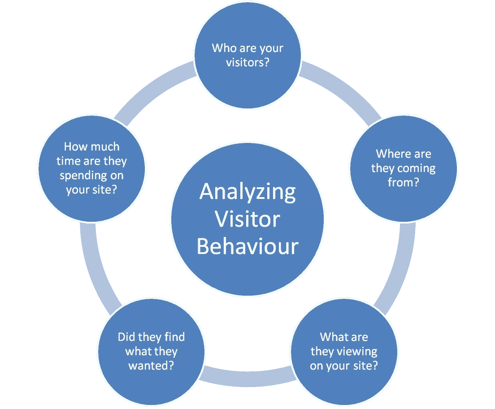

# 比较 Google Analytics、Adobe Analytics 和 IBM Coremetrics 的 Web 分析

> 原文：<https://medium.datadriveninvestor.com/comparing-google-analytics-vs-adobe-analytics-vs-ibm-coremetrics-for-web-analytics-6d97415566d8?source=collection_archive---------0----------------------->

在当今的数字世界中，网站分析(或网络分析)越来越重要，这是因为越来越多的公司采用有效的网络分析工具来实时了解其网站性能。

越来越多的在线访问者通过台式机或手机访问您的网站，这无疑有利于您的网站和整体业务，但在分析在线客户行为以及如何改善客户体验方面也会带来挑战。

随着初创公司开始与谷歌、IBM 和 Adobe 等老牌公司争夺网络分析工具市场的份额，数据分析的全球市场竞争越来越激烈。虽然谷歌分析工具以 56.5% 的份额继续统治着[市场，但与 Adobe Analytics(之前称为 **Omniture** Analytics】和 **IBM Digital Analytics** (之前称为 IBM Coremetrics)等其他网络分析工具相比，它的排名如何？](https://w3techs.com/technologies/comparison/ta-coremetrics,ta-googleanalytics,ta-omniture)

 [## 成为数据科学家所需的 8 项技能|数据驱动型投资者

### 数字吓不倒你？没有什么比一张漂亮的 excel 表更令人满意的了？你会说几种语言…

www.datadriveninvestor.com](https://www.datadriveninvestor.com/2019/02/07/8-skills-you-need-to-become-a-data-scientist/) 

以下是基于工具特性、可用性和定价等属性对以下每种 web 分析工具进行的详细比较:

*   **谷歌分析 Vs Adobe 分析**
*   **Adobe Analytics Vs IBM Coremetrics**
*   **谷歌分析 Vs IBM Coremetrics**

那么，我们开始吧。

谷歌分析 Vs Adobe 分析

在 **2018** 和 **2019** 全球采用的更受欢迎的工具中，**Google Analytics vs Adobe Analytics**是商业用户基于其网络分析需求和预算的选择。

让我们先来详细比较一下**谷歌分析工具和**Adobe 分析工具。虽然这两种工具有许多共同的功能，例如云集成、对电子商务的支持和自定义变量的使用，但以下是 Google Analytics 和 Adobe Analytics 之间的一些关键差异:

# Google Analytics 与 Adobe Analytics 的主要区别

**Google Analytics** 易于实施是使用 JavaScript 和 Google Analytics 辅助的无缝实施。 **Adobe Analytics 实施**更加困难，需要技术支持和编程知识。**谷歌分析有**直观的仪表盘，更容易定制，但更难与其他用户分享数据图表。Adobe Analytics 不如 Google Analytics 直观，但更容易与其他用户分享。在 **Google Analytics** 中，第三方集成与 R 和 Python 等数据分析语言配合良好。 **Adobe Analytics** 正在与第三方工具的集成中持续改进。**谷歌分析**没有专门的客户支持团队。 **Adobe Analytics** 拥有免费在线资源 24×7 专门的客户支持。前 1000 万次点击的免费工具，每年**谷歌分析定价**15 万美元(超过 10 亿次点击)。更贵的 **Adobe Analytics 定价**起价 10 万美元(网站点击率越高价格越高)。

此外，以下是 Google Analytics 与 Adobe Analytics 工具的功能比较:

# Google Analytics 与 Adobe Analytics —功能

**Google Analytics** 归因模型有一个强大的特性，它支持多渠道漏斗。 **Adobe Analytics** 缺乏对高级属性建模的支持。电子商务跟踪更加结构化，具有强大的报告以及电子商务功能，如产品印象和购物车数据。Adobe Analytics 中的电子商务**跟踪功能更强大，但是，它缺乏对预定义报告的结构和支持。第三方数据连接与其他谷歌工具如 AdWords 和谷歌分析**中的搜索控制台**配合良好，但缺乏对其他第三方工具的原生支持。 **Adobe Analytics** 为 Adobe 和第三方工具提供了内置数据连接器。 **Google Analytics 中的路径实现不佳。**卓越的路径实现，支持 **Adobe Analytics 中的流量或点击变量。**报告由 Google Data Studio 工具实现，该工具可以连接到 **Google Analytics** 数据和其他数据源。通过用于拖放报告构建的**Adobe Analytics**Workspace 工具以及作为 MS Excel 数据插件工具的 Adobe Analytics Report Builder 实现报告。**

以下是你应该了解的 Google Analytics 与 Adobe Analytics 的主要优缺点:

**Google Analytics Pros-** 实时工作。

支持实时业务决策

结构化业务报告工具

**Adobe Analytics pros-** 整个客户生命周期的数据存储

存储饼干 15 年

访问个人访客数据

可以跟踪超过 100 个目标

**Google Analytics Cons-** 数据仅存储 24 个月

仅存储 30 天的 cookies

无法捕获个人信息

只能跟踪 4 个目标

**Adobe Analytics cons-** 延迟约 2 小时

不支持实时业务决策

缺乏结构化报告

**我们的收获**:基于 Google Analytics 与 Adobe Analytics 的**对比，[如果您正在寻找基本的 web 分析功能，Google Analytics](https://analytics.google.com/analytics/web/) 会更好，而 [Adobe Analytics](https://www.adobe.com/in/analytics/adobe-analytics.html) 是高级 web 分析的更好选择。如果您对网络分析有较高的预算， **Adobe Analytics(相对于 Google Analytics** )为您提供必要的基础设施，以实现更好的协作和客户支持。另一方面，如果你预算有限，免费的 Google Analytics(vs Adobe Analytics**)更适合你。

# Adobe Analytics 与 IBM Coremetrics

现在让我们来详细比较一下 IBM 和 Adobe 的网络分析工具。**IBM Coremetrics Web Analytics**工具也被称为 **IBM Digital Analytics，**目前由 IBM Digital Analytics 部门的子公司 **IBM TeaLeaf** 提供支持。

以下是 Adobe Analytics 和 IBM Coremetrics 之间的主要**差异对比**:

Adobe Analytics 与 IBM Coremetrics —主要区别

**Adobe Analytics** 实施的难易程度在很大程度上取决于解决方案设计和开发人员的技能。IBM Coremetrics 需要技术支持和实现指南。 **Adobe Analytics** 适合寻找企业级解决方案的大型企业。 **IBM Coremetrics** 适合寻求企业级实施的大公司。 **Adobe Analytics** 不是很用户友好，需要很高的学习曲线才能容易地学习和使用。 **IBM** 推荐零售电商。 **Adobe Analytics** 24×7 专门客户支持。 **IBM Coremetrics** 良好但不出色的客户支持。 **Adobe Analytics 定价**起价 10 万美元(网站点击率越高，起价越高)。 **IBM Coremetrics** 定价基于页面浏览量。

下面是 Adobe Analytics 与 IBM Coremetrics 的**对比，突出了每种工具的优缺点:**

# Adobe Analytics 与 IBM Coremetrics——利弊

**Adobe Analytics Pros-** 报告工具的一致性

无停机时间

良好的客户服务

来自 **Adobe 营销云**合作伙伴的定制数字营销解决方案的可用性。

**IBM Coremetrics pros-** 电子商务客户的内置指标，包括产品视图和添加的产品

用于个人用户概要的 IBM Live 概要

使用 **Coremetrics 数字营销优化套件**提供业务分析优势。

**Adobe Analytics Cons-**
在数据可视化方面受到限制

不支持实时业务决策

缺乏结构化报告

**IBM Coremetrics cons-** 用户界面不适合移动设备

缓慢且不太直观的用户界面

很难找到精通此工具的专业人士

**我们的收获**:基于 Adobe Analytics 与 IBM Coremetrics 的这一**比较， [IBM Coremetrics](https://welcome.coremetrics.com/) 是电子商务公司的推荐购买产品，也是拥有大量数据交易的公司的解决方案。另一方面，Adobe Analytics 工具允许商业企业更有效地管理他们的数据、营销活动或锁定用户。**

# 谷歌分析 Vs IBM Coremetrics

现在让我们来详细比较一下 **IBM Coremetrics Analytics 和 Google Analytics** 工具。IBM Coremetrics 工具现在被称为 **IBM Digital Analytics** ，而 Google Analytics 360 是免费的 Google Analytics 工具的付费版本。

**Google Analytics 与 IBM Coremetrics 的主要区别**

**谷歌分析 360** 如果你已经有了谷歌分析工具，很容易实现。 **IBM Coremetrics** 需要技术支持和实施指南。数据处理每月 1000 万次点击(免费谷歌分析)，上限为 10 亿次点击(谷歌分析 360)。对 **IBM Coremetrics 的无限处理。IBM Coremetrics 非常用户友好。 **IBM Coremetrics** 是易学易用。 **Google Analytics 没有专门的客户支持团队，但有免费的在线资源。 **IBM Coremetrics 的**客户支持很好，但并不特别。**谷歌分析定价**是 15 万美元的固定费用。 **IBM Coremetrics** 基于页面浏览量的定价。****

以下是 IBM **Coremetrics** **与 Google Analytics** 的对比，突出了每种工具的优缺点:

# Google Analytics 与 IBM Coremetrics——利弊

**Google Analytics 360 Pros-**数据驱动的归因建模

使用动态过滤器构建定制报告

快速处理报告

多站点实施

**IBM Coremetrics Pros-** 基准模块

营销归因报告

电子商务客户的内置指标，包括产品视图和添加的产品

用于个人用户概要的 IBM Live 概要

**Google Analytics 360 缺点-** 个人资料过滤器不太直观

有限的电子商务报告

**IBM Coremetrics Cons-** 数据挖掘或特别报告

过时的用户界面

**我们的收获**:由于 IBM Coremetrics 的高可伸缩性，它是电子商务零售商推荐购买的产品，具有良好的分析功能组合。另一方面，Google Analytics 360 是一款功能丰富的产品，提供 24×7 客户支持，如果您一直在使用免费的 Google Analytics 工具等 Google 工具，它很容易实现。

# 你应该使用哪种工具？

虽然谷歌分析工具占据了市场份额，但 IBM 和 Adobe 的其他工具拥有令人印象深刻的特性和功能。选择正确的工具将完全取决于您的组织需求和总体预算。

希望迁移到谷歌云平台？ [Countants](https://www.countants.com/?utm_medium=social&utm_source=Medium&utm_campaign=Traffic) 拥有多样化的[云工程](https://www.countants.com/services/cloud-engineering/?utm_medium=social&utm_source=Medium&utm_campaign=Traffic)专业知识，可以帮助你迁移和运营谷歌云服务。然后就是[给我们打电话](https://www.countants.com/contact-us/?utm_medium=social&utm_source=Medium&utm_campaign=Traffic)的时候了。