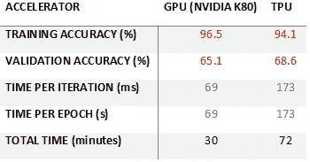
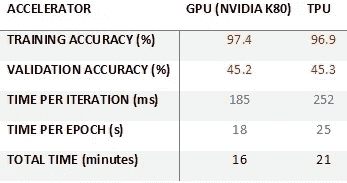
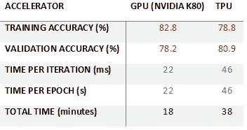
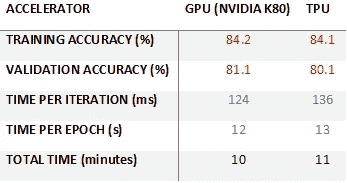

# 在 Google 联合实验室上比较 GPU 和 TPU 的训练性能

> 原文：<https://medium.datadriveninvestor.com/comparing-gpu-and-tpu-training-performance-on-google-colaboratory-c1e54e26993f?source=collection_archive---------1----------------------->

九月下旬，谷歌将他们的 TPU 作为谷歌联合实验室的加速器选项。笔记本提供的例子演示了它是如何工作的。这里是我做的一些测试，看看 TPU 加速器的训练时间比现有的 GPU (NVIDIA K80)加速器好(或差)多少。我做的用于测试的 Colab 笔记本是这里的。目前，适用于 Colab 笔记本电脑的 TPU 核心数量为 8 个。
数据集:CIFAR-10
训练样本:50000
验证样本:10000

**场景一**
模型类型:Keras Mobilenet V1(alpha 0.75)
参数:1.84 M
总时段:25
实验 a —批量:100，每个时段迭代次数:1000

Scenario Ia: Comparing GPU & TPU training performance

实验 b —批量大小:1000，每个时期的迭代次数:100

Scenario Ib: Comparing GPU & TPU training performance

**场景二**
模型类型:自定义 CNN (3 个卷积层+ 1 个密集层)
参数:197 k
总历元:50
实验 a —批量:100，每个历元迭代次数:1000

Scenario IIa: Comparing GPU & TPU training performance

实验 a —批量大小:1000，每个时期的迭代次数:100

Scenario IIb: Comparing GPU & TPU training performance

要点:从观察训练时间可以看出，当批量较小时，TPU 比 GPU 花费更多的训练时间。但是当批量增加时，TPU 性能与 GPU 相当。

还有人做过 TPU 和 GPU 的比较吗？请在评论中让我知道。