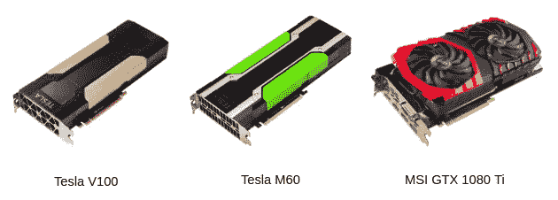
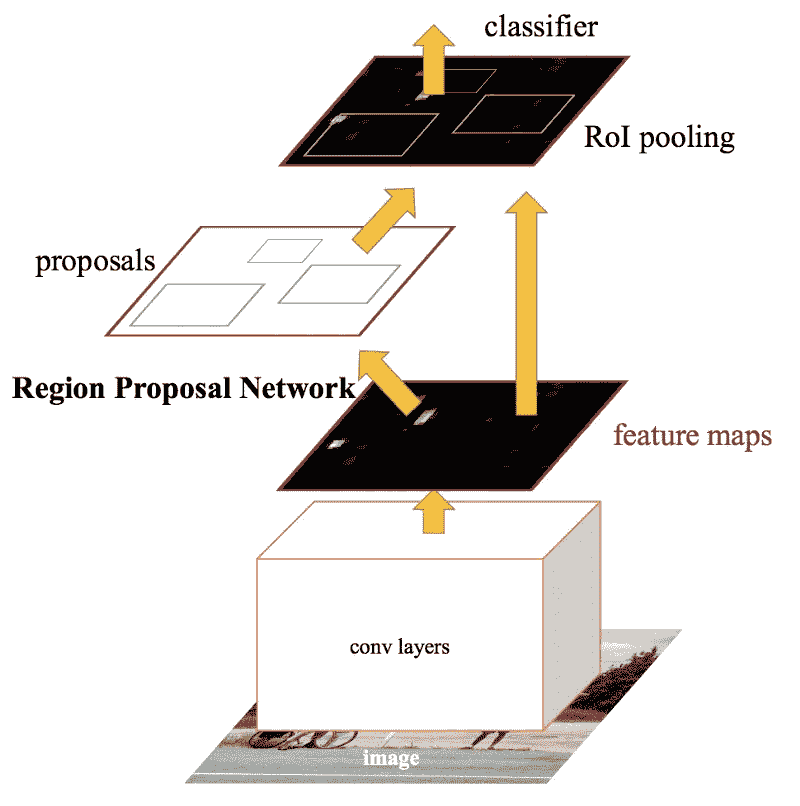
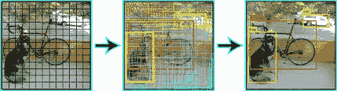
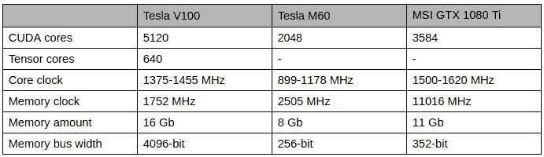
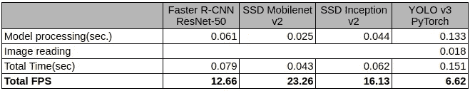
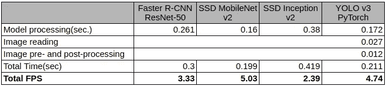
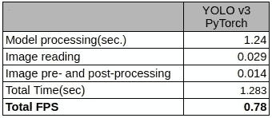

# 比较对象检测模型在不同 GPU 上的性能

> 原文：<https://medium.datadriveninvestor.com/comparing-object-detection-models-gpus-935754ae2677?source=collection_archive---------1----------------------->

近年来，深度学习方法已经发展得越来越多。DL 已经成功地应用于各种不同的任务，从识别照片上的狗到分析人类语言。久而久之，模型开始表现得越来越好，但作为一个副作用，它们也变得更大更复杂。简单地运行大多数最先进的深度学习模型需要一个非常强大的 GPU。更别说训练那些模特了。没有多少人能够负担得起购买、存储和维护一个机架的 GPU。这就是云服务发挥作用的地方。在那里，您可以根据自己的需要租用不同的 GPU 一段时间，同时支付一小部分 GPU 成本。

所以，云服务是有用的，但是选择什么类型的 GPU 来满足你的深度学习需求呢？这就是我们决定要查明的。我们有自己的 GPU，我们希望与亚马逊提供的两种不同的云 GPU 进行比较:英伟达特斯拉 V100 和英伟达特斯拉 M60。选择它们是因为它们都具有 Tesla 架构，但是 V100 实例比具有相同数量 GPU 的 M60 实例贵 2.5 倍以上(分别为 p3.8xlarge 和 g3.16xlarge EC2 实例)。

作为比较 GPU 性能的一种方式，我们选择了对象检测任务。它是计算机视觉领域的主要问题之一，其主要目标是在图像或视频中发现不同的对象并对其进行分类。在这个领域已经进行了大量的研究，我们今天拥有的最好的方法都是基于深度神经网络的。我们将比较三种主要现代架构的性能:SSD、更快的 R-CNN 和 YOLOv3。

# 关于模型的一些信息

首先，让我们简要了解一下每种模型，它们在体系结构上有何不同，以及它们在速度上有何不同。正如我们已经提到的，测试了 3 个架构，而不是 3 个模型。在测试中，我们采用了两种固态硬盘:固态硬盘 Mobilenet V2 和固态硬盘 Inception V2。但是我们稍后会谈到它们，首先，让我们看看这里最古老的架构——更快的 R-CNN。

## 更快的 R-CNN

Faster R-CNN

这种架构与这里列出的任何其他架构都不同，因为检测分两步进行:

*   区域建议——在这一步中，神经网络寻找它认为物体可能存在的地方，并为这些区域分配概率；
*   分类——在这里，它浏览建议的区域，并试图实际预测对象的类别及其实际存在；

## 固态硬盘概述

SSD 代表单次检测，这意味着这种架构与我们之前讨论的架构不同，它在一个步骤中完成所有检测和分类。这使得该方法甚至更快并且总体上涉及更少的计算。这是使用一种不同的方法来完成的，这种方法基于使用“锚盒”并在特征提取的不同步骤中应用它们。如果你想了解更多关于它们的信息，请看这里的。所有的 SSD 型号几乎只是在提取特征的方式上有所不同。

## SSD Mobilenet V2

SSD 的这种实现更多的是针对移动市场，从它的名字就可以看出来。它针对手机的 GPU 和 CPU 进行了一些特定的架构优化。但一般来说，这种网络在任何个人电脑上都能运行得更快，因为它体积小。不幸的是，与大多数其他模型相比，它也不太准确。但是，嘿，拥有一个小的、快速的和极其精确的模型仍然有点不现实，你必须做出一些权衡。

如果你想了解更多关于 Mobilenet V2 的信息，我建议你看看[的原创博文](https://www.google.com/url?q=http://machinethink.net/blog/mobilenet-v2/&sa=D&ust=1545041107951000)或者[的 ArXiv 论文](https://www.google.com/url?q=https://arxiv.org/abs/1801.04381&sa=D&ust=1545041107951000)。

## 固态硬盘启始 V2

这里的特征提取是使用著名的谷歌盗梦空间 V2 模型完成的。在该模型中，他们引入了卷积因子分解。总的来说，它在大小、速度和准确性上有很好的平衡。这是最常用的模型之一。此外，如果你想了解更多关于初始架构的一般信息，以及它是如何随着时间的推移而改进的，特别是 v2，请相应地点击[此处](https://www.google.com/url?q=https://towardsdatascience.com/a-simple-guide-to-the-versions-of-the-inception-network-7fc52b863202&sa=D&ust=1545041107952000)或[此处](https://www.google.com/url?q=https://arxiv.org/abs/1512.00567&sa=D&ust=1545041107952000)。

## YOLO v3

YOLOv3

每一篇提到 YOLO 建筑的文章都必须包括狗、自行车和卡车的标志性图片。所以，这就对了

YOLOv3 和 SSD 都利用了锚的概念。《YOLO》的作者也认为软探测职业不合适，因为有些职业可能不像人和人那样互相排斥。因此，使用逻辑回归分别预测类别，然后将最可能的类别分配给检测。

还有一如既往的一些延伸阅读文章:[YOLO 官方网站](https://pjreddie.com/darknet/yolo/)，[论文](https://arxiv.org/abs/1804.02767)。

# GPU 规格比较

# 测试运行结果

MSI GTX 1080 Ti runs

Tesla V100 runs

Tesla M60 runs ( Only YOLOv3 was tested)

# 摘要

FPS comparison graph

我们对云 GPU 的性能感到非常惊讶。根据规范，这些 GPU 应该至少处于同一水平，如果不是比更便宜的游戏 GPU 更快的话。这可以用一个事实来解释，即游戏 GPU 是为了在相对较小的数据上快速进行大量计算而构建的，而云 GPU 则是为了处理更大数据的长期和更繁重的计算。因此，在千兆字节的数据上训练一些巨大的深度神经网络在像 V100 这样的云 GPU 上会快得多，但在这些 GPU 上的推理时间不会是最长的(至少从我们的经验来看)。除非您需要不断地对千兆字节的数据进行推理。

*撰稿* [*伊利亚·斯特列尼科夫*](https://www.linkedin.com/in/ilya-strelnikov/) *校对* [*切列帕诺夫*](https://www.linkedin.com/in/oleksandr-cherepanov/)

*原载于 2018 年 12 月 17 日*[*www.quantumobile.com*](https://www.quantumobile.com/comparing-object-detection-models-gpus/)*。*