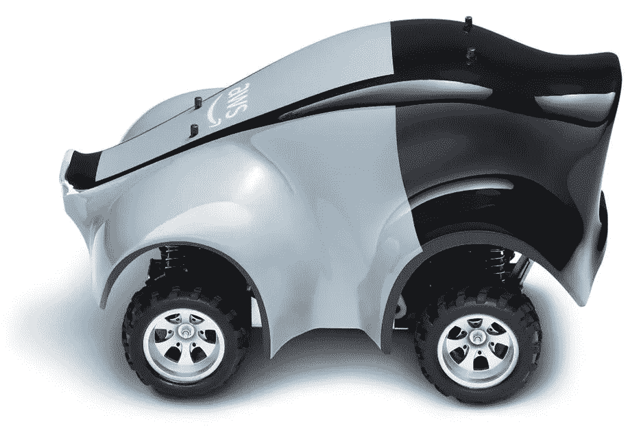
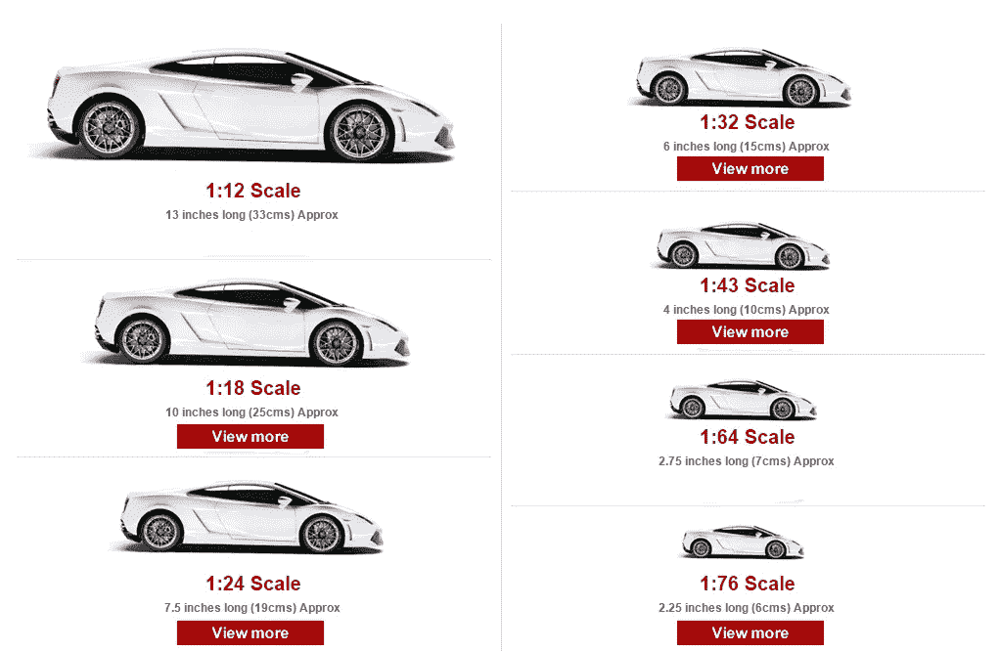
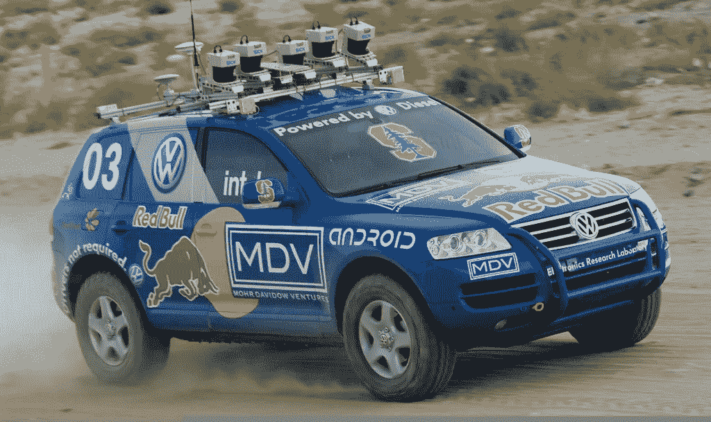
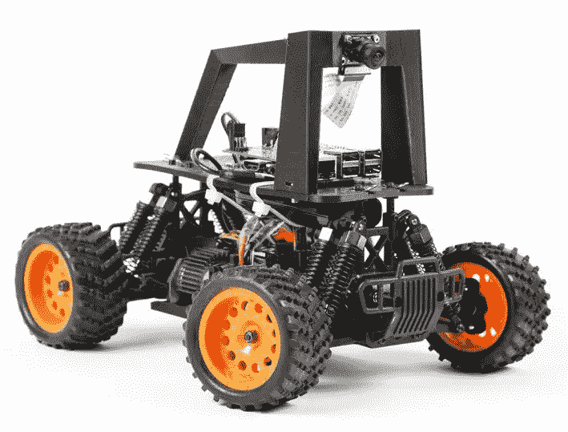
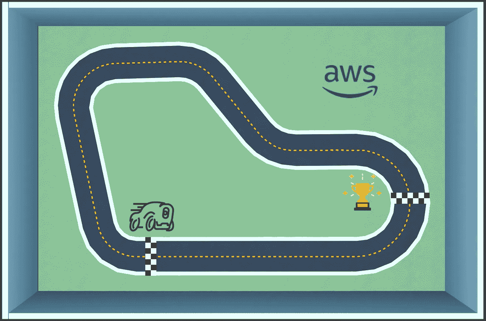
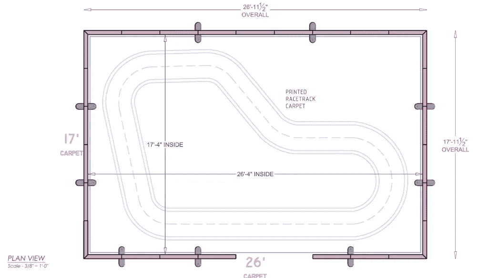
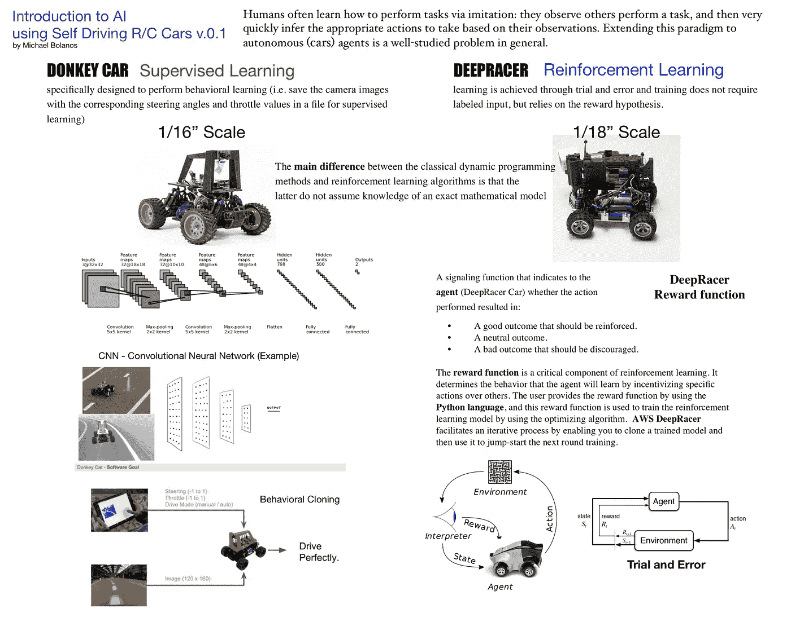
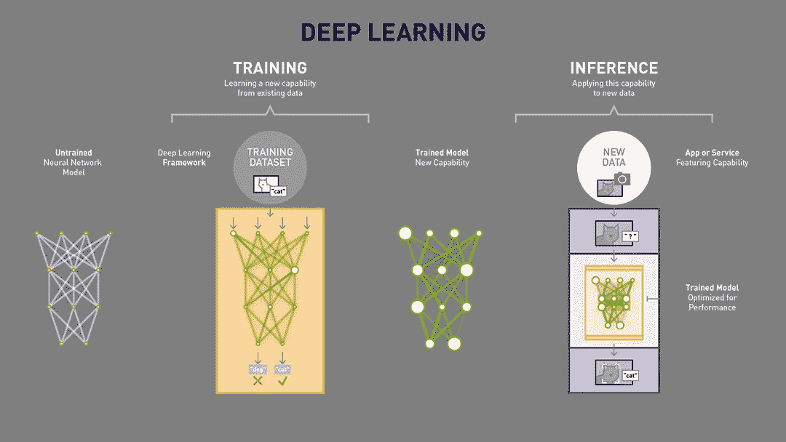

# 与人工智能赛跑

> 原文：<https://medium.datadriveninvestor.com/comparing-the-amazon-deepracer-donkey-car-approach-to-artificial-intelligence-d46f0e155974?source=collection_archive---------2----------------------->

亚马逊发布了一款玩具汽车大小的 1/18 英寸赛车。人工智能界激动不已，我们也是。

为了透视，这里有一个来自模型车世界的模型车尺寸指南。

Credit: [Model Car World](https://www.model-car-world.co.uk/size-guide)

这些汽车的小尺寸使得人工智能研究人员可以使用廉价的相机(例如**特斯拉**)测试自动驾驶汽车技术(例如**计算机视觉**),而不必预先花费数千美元购买一辆全尺寸汽车。此外，小型汽车相当无害，可以防止在训练自动驾驶汽车时出现代价高昂的错误。

> “人类通常通过模仿来学习如何执行任务:他们观察其他人执行任务，然后根据他们的观察很快推断出要采取的适当行动。一般来说，将这种范式扩展到自主(汽车)智能体是一个研究得很好的问题。

[DARPA 城市挑战赛](http://archive.darpa.mil/grandchallenge/)
让我们回到 2007 年，在加利福尼亚州的维克多维尔发生了一场活动，这将开启自动驾驶汽车行业的开端。“这项赛事要求参赛队建造一辆能够在交通中行驶的自动驾驶汽车，执行复杂的机动动作，如并线、超车、停车和通过十字路口。”“这次活动是真正的突破，因为自动驾驶汽车首次在城市环境中与有人驾驶和无人驾驶车辆进行了互动。”

更早在 2005 年的 **DARPA Grand Challenge** 中，斯坦福大学的研究人员通过他们的汽车 [Stanley](https://en.wikipedia.org/wiki/Stanley_(vehicle)) 和由副教授**巴斯蒂安·特龙**领导的斯坦福赛车队为开源社区做出了巨大贡献，他被认为是谷歌自动驾驶汽车项目的创造者，也是提供自动驾驶汽车工程[课程的](https://www.udacity.com/course/self-driving-car-engineer-nanodegree--nd013)[http://udacity.com](http://udacity.com/)的创造者。

> [**驴车**](https://makezine.com/projects/build-autonomous-rc-car-raspberry-pi/)专为执行行为学习而设计(即将摄像头图像与相应的转向角度和油门值保存在一个文件中，以便监督学习)

然后在 2016 年 5 月， **Self Racing Cars Group** 在加州 Willows 的 Thunderhill Raceway 举办了首届全尺寸汽车自主赛道日。

[**驴车 Github 网站**](https://github.com/autorope/donkeycar)

2016 年 11 月，[**Chris Anderson**](https://en.wikipedia.org/wiki/Chris_Anderson_(writer))**，**[**Will Roscoe**](https://github.com/wroscoe)**，Adam Conway** )宣布用 1/10 比例的遥控车进行一次黑客马拉松。这些 DIY 汽车可以被教会在轨道上自主行驶。这个项目引出了开源项目“[驴车](https://makezine.com/projects/build-autonomous-rc-car-raspberry-pi/)”

> **驴车—使用监督学习**

> [**DeepRacer**](https://aws.amazon.com/deepracer/)学习是通过试错来实现的，训练不需要标注输入，而是依靠奖励假设。

现在，快进到 2018 年 11 月 29 日，亚马逊宣布了售价 399 美元的[deep racer](https://aws.amazon.com/deepracer/)([目前仅售 249 美元](https://www.amazon.com/AWS-DeepRacer-Fully-autonomous-developers/dp/B07JMHRKQG/ref=as_sl_pc_qf_sp_asin_til?tag=offthegridi00-20&linkCode=w00&linkId=75a7c6332b9d5ac9518ae4f1dc49a137&creativeASIN=B07JMHRKQG))类似的概念，但在他们的人工智能方法中使用了 1/18 比例的汽车和一些不同的技术。这给人工智能和自动驾驶汽车的这种方法带来了很大的可信度。这也是一个很好的机会来比较这一类别中迎合人工智能研究人员和爱好者的另一个条目。

[**DeepRacer Github 网站**](https://github.com/aws-samples/aws-deepracer-workshops)

> **DeepRacer —使用强化学习**

真正的**问题是**研究人员会接受像亚马逊 **DeepRacer** 、**或**这样的完整套件，去采用像 DIY **驴车**这样更灵活、可定制的方法。

**监督学习 vs 强化学习**

**DeepRacer** 使用一种被称为 [**的人工智能，强化学习**](https://docs.aws.amazon.com/deepracer/latest/developerguide/deepracer-basic-concept.html#term-rl) 和**英特尔 Atom** 处理器。需要注意的一点是，DeepRacer 是基于云的。

相比之下，**驴车**在笔记本电脑上本地使用**树莓派**和 [**监督学习**](https://dataconomy.com/2015/01/whats-the-difference-between-supervised-and-unsupervised-learning/) ，但也可以利用云。

这里有一篇关于 Hackster 的很好的文章，题为“[驴车垃圾收集器的自动驾驶 AI](https://www.hackster.io/dhq/autonomous-driving-ai-for-donkey-car-garbage-collector-846c11)**”**Dimiter Kendri 关于驴车的技术讨论。

在初始训练阶段图像被本地采集到**树莓派**存储器中

*   接下来，在训练阶段，使用笔记本电脑上的 GPU(或云作为一个选项，但没有广泛实施)来训练模型

> “这里的想法是用**行为克隆**来预测转向角度。这将允许汽车在赛道上自主导航。为此，我们必须首先从 Github 安装驴车，在训练阶段获取一些图像，然后在笔记本电脑上训练模型。最后，我们可以通过 SCP 将模型重量传输到 RPi，并在赛道上进行测试。”
> 
> *鸣谢:* [*迪米特·肯德里*](https://www.hackster.io/dhq) *发表于 2018 年 9 月 15 日* [*GPL3+*](http://opensource.org/licenses/GPL-3.0)

深度赛车联盟将是第一个全球自主赛车联盟，向所有人开放。这可能是一个向某人介绍人工智能、机器人和一些有趣的比赛的好方法。

[DeepRacer 入门指南](https://d1.awsstatic.com/deepracer/AWS-DeepRacer-Getting-Started-Guide.pdf)

以下是 DeepRacer 在 AWS re:Invent Las Vegas 2018 上的介绍视频:

**引擎盖下的 deep racer**

**汽车**18 级四轮驱动带怪物卡车底盘

**CPU** 英特尔凌动处理器

**内存** 4GB RAM

**存储** 32GB(可扩展)

**WI-FI** 802.11ac

**摄像头**带 MJPEG 的 400 万像素摄像头

**软件** Ubuntu OS 16.04.3 LTS，英特尔 OpenVINO 工具包，ROS Kinetic

**驱动电池** 7.4V/1100mAh 锂聚合物

**电脑电池** 13600mAh USB-C PD

**端口**4 个 USB-A、1 个 USB-C、1 个微型 USB、1 个 HDMI

**传感器**集成加速度计和陀螺仪

为了比较:

**引擎盖下的驴车**

**汽车**16 级 2WD 带怪物卡车底盘

**CPU** 树莓 Pi，四核 64 位 ARM Cortex A53，[博通](https://en.wikipedia.org/wiki/Broadcom) SoC BCM2837B0

**内存** 1GB RAM

**存储** 32GB(取决于 SD 卡)

无线网络 802.11n

**摄像头**带 MJPEG 的 500 万像素摄像头(或可定制)

**软件**最新的 Raspbian 操作系统，基于 Debian，驴车 Python 库

**驱动电池** 7.4V/1100mAh NiMh(典型值，但可通过 LiPo 定制)

**电脑电池**通常是 USB 电池组

**端口**Raspberry Pi 上的 4 个 USB-A、1 个 HDMI、1 个 3.5 英寸音频输出、16 通道、12 位 PWM 和 PCA9685、40 个 GPIO 引脚

**传感器**(无，可选)

Credit: Amazon (AWS DeepRacer Track)

Credit: Amazon (AWS DeepRacer Track)

Introduction to AI using Self Driving R/C Cars v.1.0
Credit: offthegridit — Michael Bolanos

[使用自动驾驶 R/C 汽车的 AI 介绍 v.0.1(。pdf)](http://offthegridit.com/images/intro-to-ai-using-self-driving-cars-deepracer-vs-donkey-car-approach-to-ai-at-diyroboto-michael-bolanos-v-1-0.pdf)

信用:[http://diyroboto.com](http://diyroboto.com)

[https://www.linkedin.com/in/michaeljbolanos/](https://www.linkedin.com/in/michaeljbolanos/)

迈克尔·博拉诺斯我[http://offthegridit.com](http://offthegridit.com)408.475 .数据我[michael@offthegridit.com](mailto:michael@offthegridit.com)

Credit: Nvidia [What’s the Difference Between Deep Learning Training and Inference?](https://blogs.nvidia.com/blog/2016/08/22/difference-deep-learning-training-inference-ai/)

学分:

[**第 14 讲|深度强化学习—斯坦福大学**](https://www.youtube.com/watch?v=lvoHnicueoE)

[**用强化学习在 Unity 模拟器中训练驴车—余峰**](https://flyyufelix.github.io/2018/09/11/donkey-rl-simulation.html)

[**感知器是什么鬼？—中/走向数据科学**](https://towardsdatascience.com/what-the-hell-is-perceptron-626217814f53)

[**马氏决策过程—百科**](https://en.wikipedia.org/wiki/Markov_decision_process)

[**强化学习—维基百科**](https://en.wikipedia.org/wiki/Reinforcement_learning)

[**强化学习—亚马逊**](https://docs.aws.amazon.com/deepracer/latest/developerguide/deepracer-basic-concept.html#term-rl)

[**驴车组件化架构——驴车项目**](http://www.donkeycar.com/updates/donkey-21-componentized-architecture)

[**关于强化学习你需要知道的 5 件事— KDnuggets**](https://www.kdnuggets.com/2018/03/5-things-reinforcement-learning.html)

[**机器学习中 CNN 和 Deep NN 的区别— Quora**](https://www.quora.com/What-is-the-difference-between-CNN-and-deep-NN-in-machine-learning)

[**卷积神经网络/ CNN —维基百科**](https://en.wikipedia.org/wiki/Convolutional_neural_network)

[**有监督和无监督学习有什么区别？—数据经济**](https://dataconomy.com/2015/01/whats-the-difference-between-supervised-and-unsupervised-learning/)

[**用 Keras 介绍 Python 深度学习**](https://machinelearningmastery.com/introduction-python-deep-learning-library-keras/)

在这场学习自动驾驶汽车的特殊比赛中，我们可能会被带到一个哲学问题，即人类自己的命运(驾驶)可能会受到他们的学习经验(训练)的影响(推断)。)难道我们作为人类自身的学习不仅仅是两者的结合(有监督的和无监督的吗？)

*原载于*【https://www.diyroboto.com/talking-robot-tech】