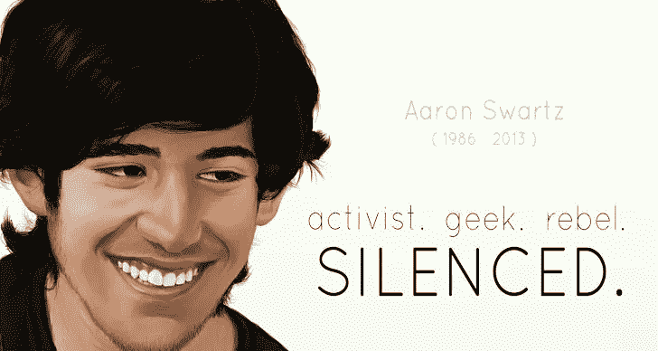

# 竞争扼杀创造力。

> 原文：<https://medium.datadriveninvestor.com/competition-kills-creativity-71fc3ba74323?source=collection_archive---------4----------------------->

## 为什么一起工作是我们应该钦佩的技能。

我承认，我从来都不是最有野心的人，也不总是讨人喜欢的人。

**Source:** [**Blogspot**](https://1.bp.blogspot.com/-NyNTwzeNIj0/UtLhWu16hDI/AAAAAAAAZxU/dddSFrQbg5Q/s728/MIT+University+website+defaced+by+Anonymous+hackers+in+honor+of+Aaron+Swartz.jpg)

我在大多数情况下都是**和相反的*。***

我的知识*有限，但我擅长的领域是我擅长的*。**

**…而说到分享工作的功劳，我通常喜欢把自己的名字 ***放在名单的最后*** 。**

**这并不是因为我不喜欢 ***的宣传*** ，我确实如此——但我知道什么时候要重视一段 ***的感情*** 超过几秒钟的*。***

> ***我宁愿培养关系和分享知识，而不是把它留给自己。***
> 
> ***我不喜欢企业保密，这是我经常受到批评的地方。***

***现在我已经从公司世界转到了写作世界，其中最吸引人的一个方面就是 ***“阅读别人的作品”。******

**它帮助我把*成长为*，它帮助我把 ***收获****更好的理解* 的其他作家 ***如何发挥*** 的作用，他们的 ***如何思考——处理* s** 的形态形状，他们如何喜欢****

***在团队工作场所，当我面对竞争过度的人时，我喜欢软化我的存在，让大家知道； ***“我就是那个傻的”。******

> **这有助于让他们放松，将我视为一个“个体”而非“竞争对手”。**

**我欣赏获得 ***经验*** 胜过获得 ***荣誉*** 。**

**这些年来，我帮助过**58**(*…和统计* ) **研究人员**发表他们的工作；而我只发表过 ***【两个】。*****

**其中只有一篇纯粹是我写的。**

**我可以有把握地说，我从第 58 期中学到的知识和经验比我工作过的第二期**和第二期**要多。**

**不是因为它的规模，而是因为我喜欢把我的工作交给其他人——让他们把我的想法发展成有成果的东西。**

**这是承认我的知识有限，因此我不能独自解决所有的问题。**

**相反，我更容易说；“嘿，我一直在想这个可以帮助运输人员的东西，它附有一个类似轮子的东西——它靠某种帮助轮子旋转的东西运行。你觉得这可能吗？”**

*****“哦……你是说，像一辆车？”*****

*****“乌..是啊。等等，已经存在了？”*****

**不完全是怎么回事，但你可能明白了。**

**我擅长描述我想创造的东西，我擅长将想法形象化；但我是 ***严格来说*** 一个 ***白痴*** 。**

**在我帮助发表的一些研究论文中，我完全没有任何背景。**

**然而，我还是想出了一些引发这个话题的想法。**

**与他人分享想法的能力是他们成功的原因。**

**而不是把它藏在一本我永远不会分享的神秘的书里。**

**这就是为什么我想花一点时间，与你们分享我对一位伟大的绅士的感激，他为实现这个目标献出了生命。**

******艾伦·施瓦茨先生，一位真正的知识自由的开拓者和斗士。******

****The Internet’s Own Boy — Aaron Swartz.****