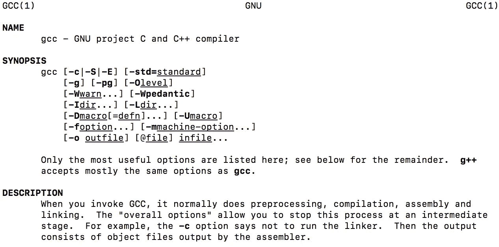

# C 程序的编译过程是如何工作的

> 原文：<https://medium.datadriveninvestor.com/compilation-process-db17c3b58e62?source=collection_archive---------0----------------------->

C 是一种编译语言。它的源代码是使用程序员选择的任何编辑器以文本文件的形式编写的，然后它必须被编译成机器代码。


c 源文件按照惯例以**命名。C 扩展名**并且我们使用命令“gcc”来编译 C 源文件。 *(GCC 代表 GNU 编译器集合，是 GNU 项目产生的一个编译器系统。)*

编译的四个步骤:预处理、编译、汇编、链接。

> ***预处理:***

预处理是第一步。预处理程序通过以下方式执行以#(称为指令)开头的命令:

*   删除注释
*   展开宏
*   扩展包含的文件

如果您包含了头文件，比如#include <stdio.h>，它将查找 stdio.h 文件并将头文件复制到源代码文件中。</stdio.h>

预处理器还生成宏代码，并用它们的值替换用#define 定义的符号常量。

> ***编译:***

编译是第二步。它接受预处理器的输出，并生成汇编语言，一种人类可读的中间语言，专用于目标处理器。

> ***组装:***

汇编是编译的第三步。汇编程序会将汇编代码转换成纯二进制代码或机器码(零和一)。这种代码也称为目标代码。

> ***链接:***

链接是编译的最后一步。链接器将多个模块中的所有目标代码合并成一个模块。如果我们使用库中的函数，链接器会将我们的代码与那个库函数代码链接起来。

在静态链接中，链接器将所有使用过的库函数复制到可执行文件中。在动态链接中，代码不会被复制，只需将库名放入二进制文件中即可。

**现在开始编译吧！对于我们的例子，我们将使用“main.c”作为我们的源文件。**

```
#include <stdio.h>int main(void)
{
      printf("Hello, World!\n");
      return (0);
}
```

在 shell 提示符下，输入命令“gcc main.c ”,然后按 enter 键。如果编译成功，将再次显示 shell 提示符。如果没有编译，它将显示错误消息。

```
vagrant@vagrant-ubuntu-trusty-64:~$ gcc main.c
vagrant@vagrant-ubuntu-trusty-64:~$ ls
a.out main.c
```

**main . c 编译完成后，输入命令“ls”列出你的目录内容，你会看到一个名为 a.out 的可执行文件**要运行这个程序，输入”。/a.out ",然后按 Enter 键。耶，我们看到正确的输出“你好，世界！”后跟一个换行符。

```
vagrant@vagrant-ubuntu-trusty-64:~$ ./a.out
Hello, World!
vagrant@vagrant-ubuntu-trusty-64:~$
```

如果不希望输出文件被命名为. out，这是默认的输出文件名，可以用-o 选项指定不同的输出文件名。

```
gcc -o <desired_output_filename> <source filename>
```

让我们看看下面的例子，我们希望输出文件被命名为 main。

```
vagrant@vagrant-ubuntu-trusty-64:~$ gcc -o main main.c
vagrant@vagrant-ubuntu-trusty-64:~$ ls
main main.c
vagrant@vagrant-ubuntu-trusty-64:~$
```

要运行主程序，我们键入"。/main "输入终端。

```
vagrant@vagrant-ubuntu-trusty-64:~$ ./main
Hello, World!
vagrant@vagrant-ubuntu-trusty-64:~$
```

> *如果您对代码进行了更改(例如，对源文件进行了任何更改)，您将需要保存并重新编译。*

## 在某些情况下，C 源文件不会成功编译。

阅读错误消息以获得如何修复的线索。

下面，我们省略了 printf 语句末尾的分号。

```
#include <stdio.h>int main(void)
{
      printf("Hello, World!\n")
      return (0);
}
```

一条错误消息显示，在返回之前应该有一个分号。

```
vagrant@vagrant-ubuntu-trusty-64:~$ gcc -o main main.c
main.c: In function 'main':
main.c:5:7: error: expected ';' before 'return'
       return (0);
       ^
vagrant@vagrant-ubuntu-trusty-64:~$
```

如果我们把分号加回去…

```
#include <stdio.h>int main(void)
{
      printf("Hello, World!\n");
      return (0);
}
```

…然后重新编译，错误信息就会消失。

```
vagrant@vagrant-ubuntu-trusty-64:~$ gcc -o main main.c
vagrant@vagrant-ubuntu-trusty-64:~$ ./main
Hello, World!
vagrant@vagrant-ubuntu-trusty-64:~$
```

## 即使源文件可以编译，也要检查输出是否正确。

下面是一个编译源文件的例子…

```
#include <stdio.h>int main(void)
{
      printf("The sum of 9+2 is: %i\n", 10);
      return (0);
}
```

…但是输出不正确。

```
vagrant@vagrant-ubuntu-trusty-64:~$ ./main2
The sum of 9+2 is: 10
vagrant@vagrant-ubuntu-trusty-64:~$
```

哎呀，我们有一个错误，由于在源代码中的打字错误。

```
printf("The sum of 9+2 is: %i\n", 10);
```

我们知道 9+2 = 11，但是编译器按照上面一行中的代码进行了编译。它将数字 10 替换为格式指定符%i。

正确的代码应该是:

```
#include <stdio.h>int main(void)
{
      printf("The sum of 9+2 is: %i\n", 11);
      return (0);
}
```

概括起来，编译的四个步骤是:**预处理、编译、汇编、链接。**

有关更多信息，请阅读 gcc 手册页。编码快乐！



top of man page for gcc