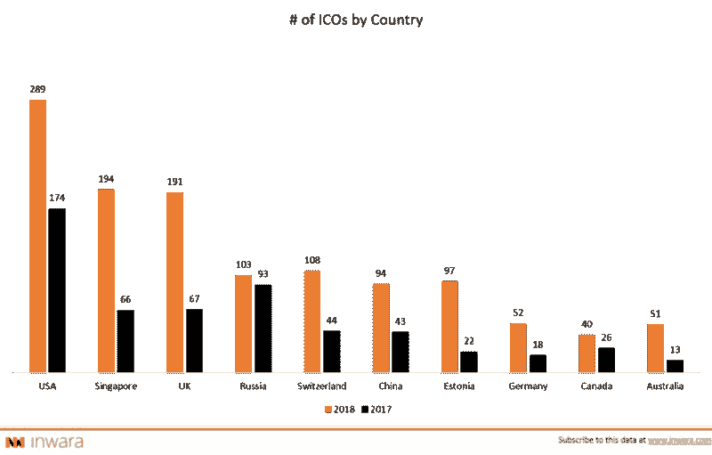
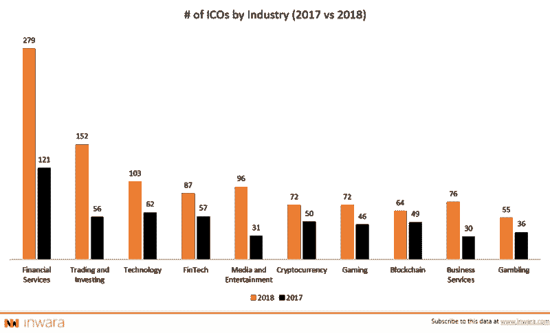
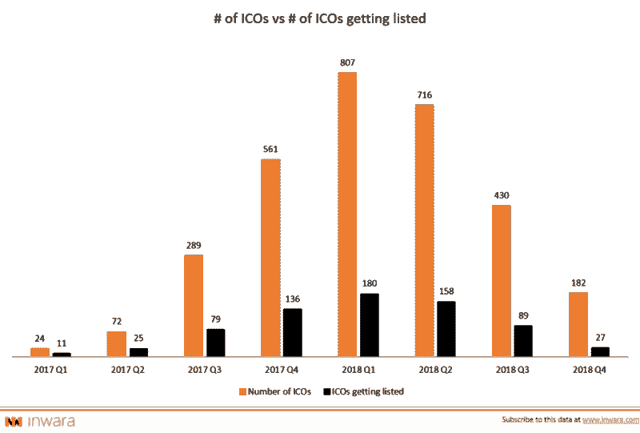
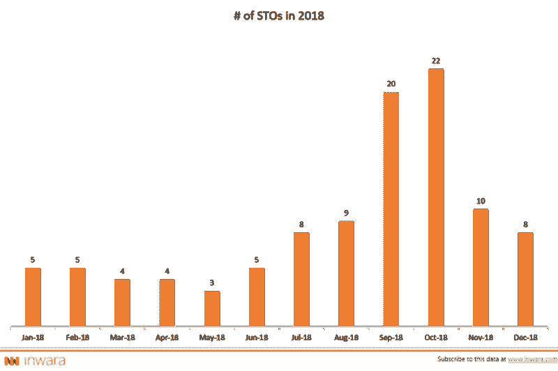
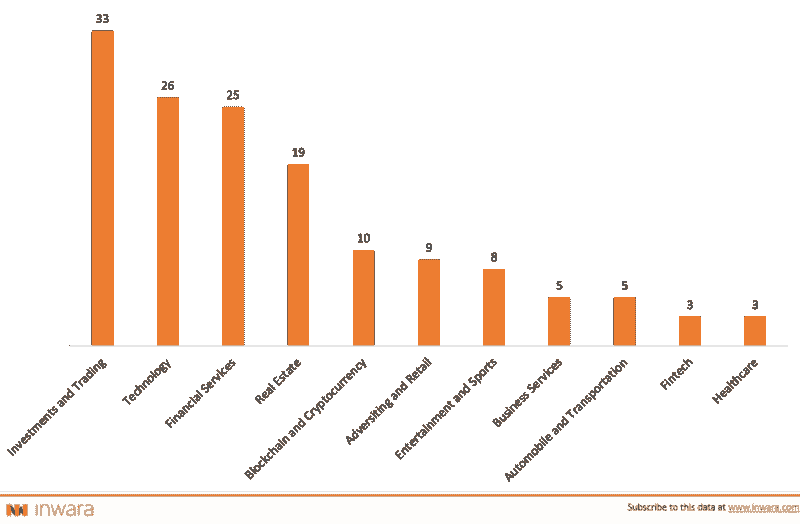
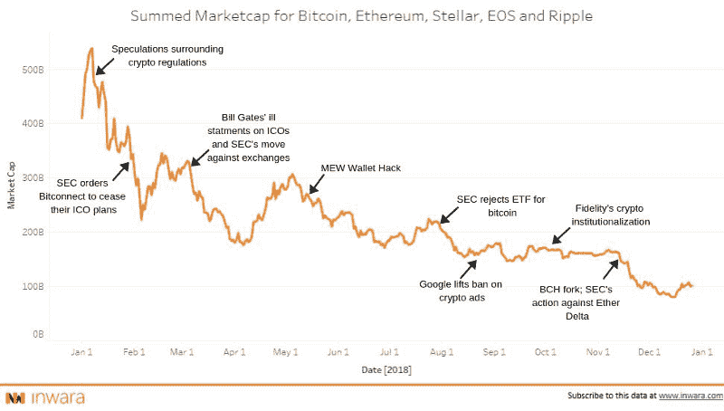
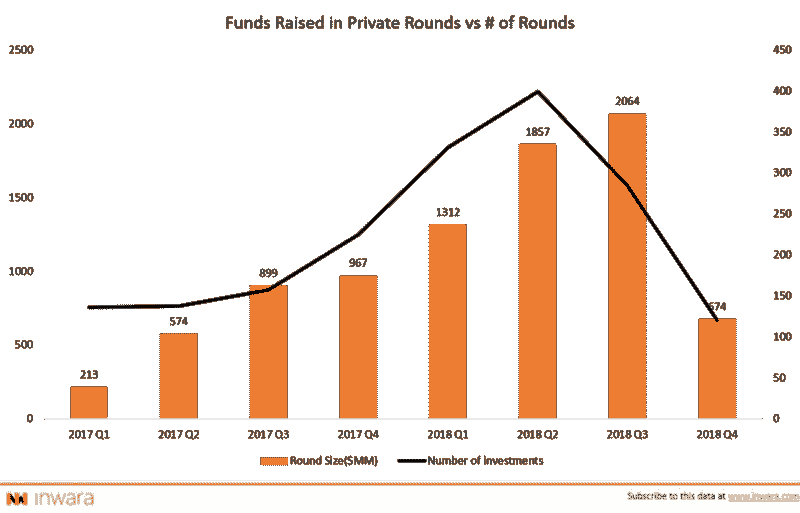
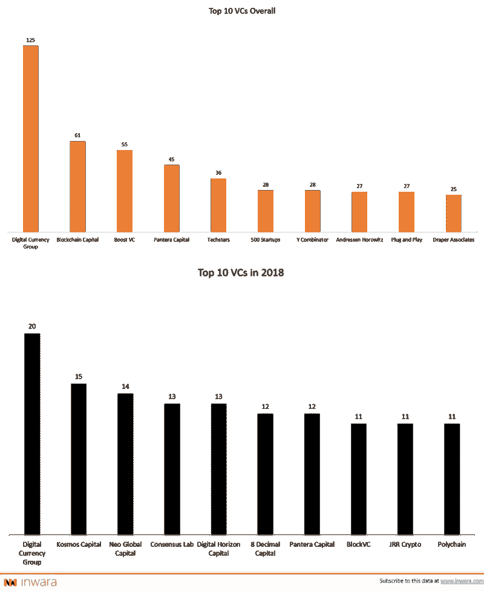
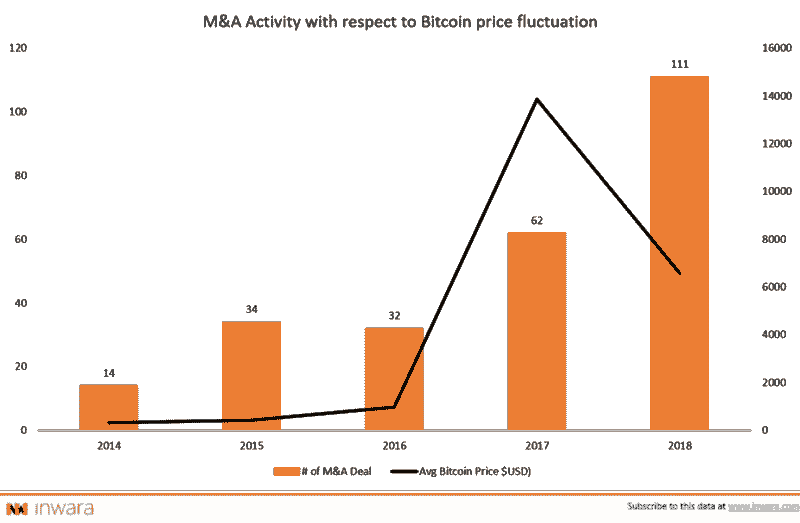

# 2018 年的加密货币格局

> 原文：<https://medium.datadriveninvestor.com/complete-analysis-of-ico-market-in-2018-funding-trends-and-analysis-top-icos-and-stos-of-2018-3bdb336f2041?source=collection_archive---------14----------------------->

## 2018 年度报告| ICOs+STOs 景观|市场趋势|私募基金活动|并购

[*免责声明*](https://www.inwara.com/disclaimer) *:这不是理财建议。*

> [下载完整的 40 页年报](https://www.inwara.com/report/annual-report-2018?utm_source=annualddi&utm_medium=annualddi&utm_campaign=annualddi)

加密市场在 2017 年有一个活跃的开端，多头开始休息，仅在 1 月份就损失了 60%以上的总市值。此外，2018 年被证明是悲观的，加密市场趋势下行。从光明的一面来看，加密市场正在走向成熟，同时缓慢地走过 FOMO 和 FUD 阶段。

InWara 的研究涵盖了 ICO 和 STO 景观的所有重要趋势。这项研究进一步提出了对加密市场的数据驱动的见解，据专家称，该市场将在明年取得一些重大进展。

*使用 InWara 的市场智能平台，从机构级 ICO/VC 数据中获得有洞察力的分析，以清晰地评估加密货币领域的当前趋势和发展&。*

这项研究涵盖

*   ICO 景观 2018
*   STO 景观 2018
*   2018 年密码市场趋势分析
*   ico 和区块链公司的私人融资活动
*   ico 和区块链公司的并购

# ICO 景观 2018

## 美国处于加密领域的最前沿

[Source: InWara’s Annual Report](https://www.inwara.com/report/annual-report-2018?utm_source=annualddi&utm_medium=annualddi&utm_campaign=annualddi)

美国以 60%的 ICO 数量增长(同比)保持了第一的位置。令人惊讶的是，英国和新加坡的 ico 数量同比增长超过 180%。随着新加坡位居第二，中国在 2018 年的增长率超过 100%，亚洲市场为加密技术展示了光明的未来。

## 金融服务继续主导 ICO 领域

[Source: InWara’s Annual Report](https://www.inwara.com/report/annual-report-2018?utm_source=annualddi&utm_medium=annualddi&utm_campaign=annualddi)

2018 年，金融服务仍然是 ico 数量最多的行业，ico 数量比 2017 年增长了 130%以上。媒体和娱乐行业增长显著，2018 年涌现的加密基金交易和投资也是如此。

## 2018 年 ICO 上市量下降

[Source: InWara’s Annual Report](https://www.inwara.com/report/annual-report-2018?utm_source=annualddi&utm_medium=annualddi&utm_campaign=annualddi)

在交易所上市的 ico 数量在 2018 年大幅下降，不到 20%的 ico 上市公开交易令牌。2018 年第四季度，只有 15%的 ico 在交易所上市，这给投资者带来了严重的流动性问题。

> [下载完整的 40 页年报](https://www.inwara.com/report/annual-report-2018?utm_source=annualddi&utm_medium=annualddi&utm_campaign=annualddi)

# 斯托斯景观 2018

## 安全令牌产品(sto)从 ico 停止的地方开始

[Source: InWara’s Annual Report](https://www.inwara.com/report/annual-report-2018?utm_source=annualddi&utm_medium=annualddi&utm_campaign=annualddi)

安全令牌(sto)是受联邦法规和法规约束的基本可交易资产。总的来说，投资者希望 s to 能够带来更好的投资回报，同时由于其潜在的资产支持和监管安全性，长期来看风险更小。

考虑到美国的 [SEC](https://www.sec.gov/) 和南韩的 [FSC](http://meng.fsc.go.kr/) 等监管机构提出的合规性问题，安全令牌获得了发展势头。SEC 严厉打击欺诈活动(例如 Paragon 和 Airfox ),这打击了通过数字代币筹集资金的热情。这种投资者信心的丧失促使股市飙升。

## 按行业划分的 sto 数量

[Source: InWara’s Annual Report](https://www.inwara.com/report/annual-report-2018?utm_source=annualddi&utm_medium=annualddi&utm_campaign=annualddi)

投资和交易是证券代币发行的主要部分，占总 sto 的 20%以上。金融服务业曾是 ICOs 行业的领头羊，现在排在科技之后，位居第三。

> [下载 40 页完整年报](https://www.inwara.com/report/annual-report-2018?utm_source=annualddi&utm_medium=annualddi&utm_campaign=annualddi)

# 2018 年加密货币市场趋势分析

[Source: InWara’s Annual Report](https://www.inwara.com/report/annual-report-2018?utm_source=annualddi&utm_medium=annualddi&utm_campaign=annualddi)

每一个事件的详细分析都包含在这份长达 40 页的报告中。

# ico 和区块链公司的私人融资活动

## 加密衰退也锁定了私人投资

[Source: InWara’s Annual Report](https://www.inwara.com/report/annual-report-2018?utm_source=annualddi&utm_medium=annualddi&utm_campaign=annualddi)

2018 年第四季度，当市场暴跌时，筹集的资金下降了 65%以上，风投和机构投资者停止了投资。然而，整体而言，私人融资在 2018 年大幅增长，融资总额比 2017 年翻了一番。

## 随着恐惧的到来，现有的玩家都搬出去了！

[Source: InWara’s Annual Report](https://www.inwara.com/report/annual-report-2018?utm_source=annualddi&utm_medium=annualddi&utm_campaign=annualddi)

[尽管 2018 年市场低迷，但数字货币集团](https://dcg.co/)与投资保持一致，而其他人则稍事休息。然而，2018 年出现了新的进入者，如 [Kosmos Capital](https://kosmos.capital/) 、 [Neo Global Capital](https://ngc.fund/) 和更多的人加入了投资 cryptos 的人群。

有趣的是，几乎所有的参与者都在 2018 年筹集了专注于加密的资金，并吸引了金融科技领域最优秀的人才。

> [下载完整的 40 页年报](https://www.inwara.com/report/annual-report-2018?utm_source=annualddi&utm_medium=annualddi&utm_campaign=annualddi)

# 并购活动激增

[Source: InWara’s Annual Report](https://www.inwara.com/report/annual-report-2018?utm_source=annualddi&utm_medium=annualddi&utm_campaign=annualddi)

2018 年，与区块链行业相关的并购数量激增 90%以上。这种大幅上涨可能与比特币( [BTC](http://cointelegraph.com/bitcoin-price-index) )价格暴跌有关，这让风投、机构投资者和资金雄厚的实体有机会押注未来技术。

## 年度百视达 M&A 交易

[Circle](https://www.circle.com/) 以让比特币更容易获得为愿景，于 2018 年 2 月以 4 亿美元收购了最大的交易所之一 [Poloniex](https://poloniex.com/) 。

通过收购 Poloniex，Circle 有望解决与可靠性相关的问题并增强可扩展性，从而提高平台的健壮性。

本执行摘要仅提供了完整年度报告分析的一瞥。点击此处获取完整的年度报告。

> [下载完整的 40 页年报](https://www.inwara.com/report/annual-report-2018?utm_source=annualddi&utm_medium=annualddi&utm_campaign=annualddi)

